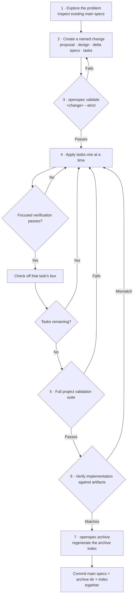

# OpenSpec workflow

New features and architecture changes start with an OpenSpec proposal before implementation.

**The loop at step 4 is the point of this process.** The checkbox isn't a "planning to do this" list — it's a record that "this item is implemented and has passed focused verification." Checking it before doing the work invalidates the evidence for the whole chain.

1. Explore the problem and inspect existing main specifications.
2. Create a named change with proposal, design, delta specs, and tasks.
3. Run strict change validation.
4. Apply tasks, marking each checkbox only after its implementation and focused verification.
5. Run the complete project validation suite.
6. Verify implementation against the artifacts.
7. Archive the change, regenerate the archive index, and commit specs, archive, and index together.

Main specifications under `openspec/specs` are the behavior source of truth. Archived Markdown artifacts remain online in Git; compressed archives are not substitutes.

Use `openspec/changes/archive/archive-index.json` to locate historical changes before opening individual artifacts.
