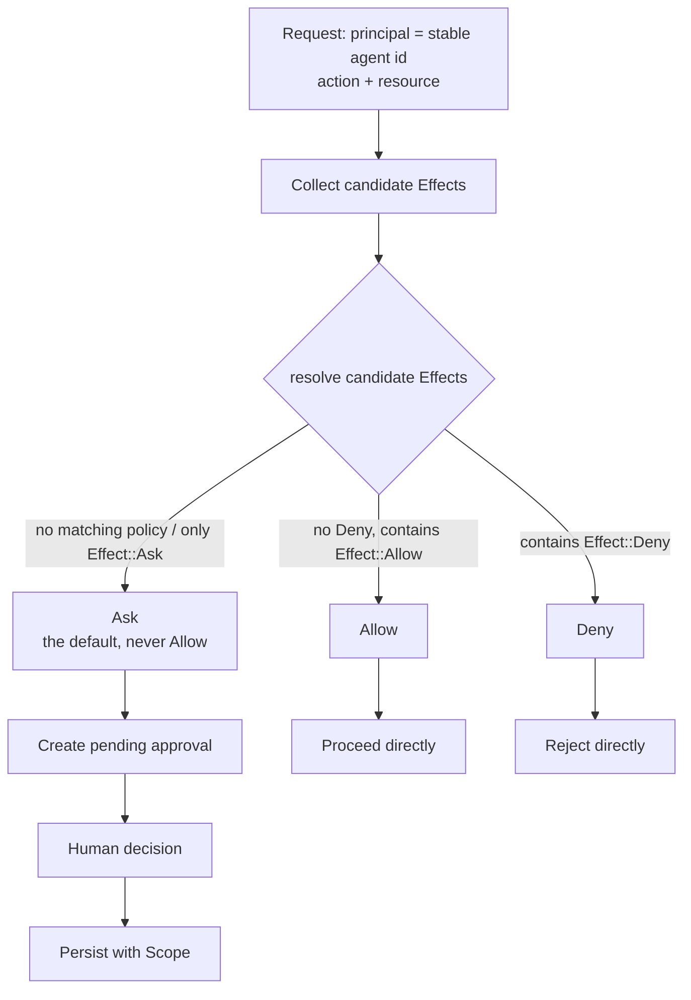
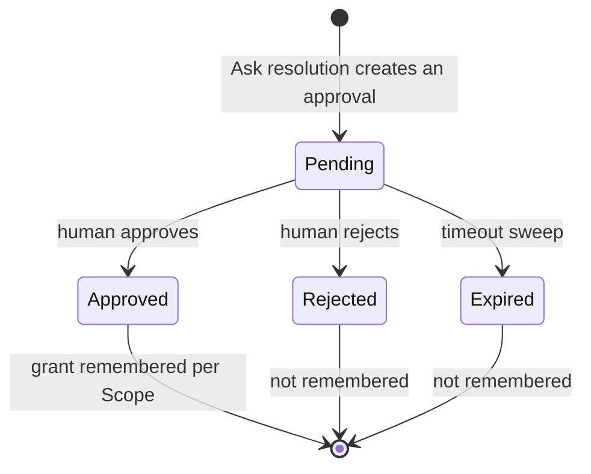

# Permission model

Every gated action — whether requested by a native API Agent's tool-use loop or forwarded through the Claude Code permission-hook bridge — is evaluated through a single decision point. There is no separate decision engine for CLI-originated calls.

## Unified decision model

Evaluation resolves a `(principal, action, resource)` triple to exactly one of `Allow`, `Deny`, or `Ask`. A principal is identified by a **stable agent id alone** — one durable principal per Agent, persisting across every session that Agent participates in. Session id and generation id are per-evaluation context, not part of the principal's identity. So an Agent participates in a new session using the same principal and policy assignment as its other sessions, not a session-scoped one.

Unmatched actions (no policy matches the principal/action/resource) resolve to `Ask`, never `Allow`.

## Resolution order: explicit-Deny-first

Conflicting policy matches resolve with explicit `Deny` priority over explicit `Allow`, and explicit `Allow` priority over the default `Ask`.

## Approval broker

Pending approval requests are held in the native runtime as the single source of truth, independent of whether any frontend event about them was received. A missed frontend event cannot leave a generation silently waiting: the frontend pushes new pending approvals via events **and** reconciles by pulling the full pending list on mount/reconnect. A pending approval is resolved with both an approve/deny decision and a memory scope of `Once`, `Session`, `Project`, or `Global`.

## CLI launch-flag projection

For `gemini-cli`, `codex-cli`, and `opencode`, an Agent principal's assigned policy template (`readonly`, `standard`, `trusted`, or `yolo`) is projected into that tool's own native approval/sandbox launch parameters whenever its Agent Terminal starts interactively. Only catalog-legal, non-bypass parameter values are used — no raw bypass flag (e.g. one whose name contains "dangerously") is introduced to reach a template's behavior. `trusted` and `yolo` project to the same launch parameters.

## Claude Code permission-hook bridge

`PreToolUse` requests from the hook wrapper are translated to an `Action`/`Resource` pair and resolved through the same `evaluate()`/`ApprovalBroker` pipeline as native API Agents. The hook matches only `Bash`, `Edit`, `Write`, `Read`, `Glob`, `Grep`, and MCP tool names (`mcp__*`), mapping them to `shell.exec`/`file.write`/`file.read`/`mcp.tool`; any other tool (e.g. `WebFetch`) is not intercepted and Claude Code's native behavior is unaffected. An `Ask` resolution creates a pending approval in the existing `ApprovalCard` UI and holds the HTTP response until a human decision or the timeout sweep.

## Decision flow and states

The unified decision point narrows a gated action to exactly one of `Allow`, `Deny`, or `Ask`. The diagram below shows the trunk path from request to final resolution.

### Resolution order

The candidate `Effect` set converges by a fixed priority whose order cannot be swapped. The rule comes from `resolve()` in `permissions/domain/effect.rs`.

1. **Explicit `Deny` wins** — if the candidate set contains `Effect::Deny`, the whole set resolves to `Deny` no matter how many `Effect::Allow` values are present.
2. **Explicit `Allow` comes next** — with no `Deny` present and at least one `Effect::Allow`, the set resolves to `Allow`.
3. **Default `Ask` catches the rest** — an empty candidate set (no policy matched that principal/action/resource) or one containing only `Effect::Ask` resolves to `Ask`, never to a silent pass.

### Approval state machine

Pending approvals are the single source of truth in the native runtime. The frontend both receives new approvals by event and reconciles against the full list on mount or reconnect, so a missed frontend event cannot hang a generation indefinitely. An approval is resolved together with a memory `Scope` that decides how long the decision is remembered.

The memory semantics of `Scope` come from `is_remembered()` in `permissions/domain/scope.rs`.

- **`Once`** — valid for this call only. No grant is persisted, and the next identical request is resolved again from scratch.
- **`Session`** — the grant is reused within the current session and lapses when the session ends.
- **`Project`** — the grant is persisted at project scope and reused across sessions.
- **`Global`** — the grant is persisted globally and reused across projects and sessions.

Only `Session`, `Project`, and `Global` persist a grant. `Once` never does.

### CLI launch-flag projection

For `gemini-cli`, `codex-cli`, and `opencode`, the policy template assigned to the Agent principal (`readonly`, `standard`, `trusted`, `yolo`) is projected into that CLI's own native approval and sandbox launch parameters when the Agent Terminal starts interactively.

- **Each template maps to a set of catalog-legal, non-bypass native parameters** rather than matching behavior by display name.
- **`trusted` and `yolo` project to identical parameters** — the two produce no differentiated launch parameters in this baseline.
- **No bypass flag is ever introduced** — no flag whose name contains something like `dangerously` is used to reach a template's behavior.

### Claude Code hook bridge

Claude Code's `PreToolUse` hook requests are translated into an `(Action, Resource)` pair and run through exactly the same `evaluate()` and `ApprovalBroker` pipeline as a native API Agent. There is no parallel decision engine.

- **Only matched tools are intercepted** — `Bash`, `Edit`, `Write`, `Read`, `Glob`, `Grep`, and MCP tool names (`mcp__*`).
- **Tool mapping** — `Bash` → `shell.exec`; `Edit` and `Write` → `file.write`; `Read`, `Glob`, and `Grep` → `file.read`; `mcp__*` → `mcp.tool`.
- **Unmatched tools are untouched** — tools not on the list, such as `WebFetch`, are not intercepted and Claude Code's native behavior is unaffected.
- **An `Ask` resolution** creates a pending approval in the existing `ApprovalCard` UI and holds the HTTP response until a human decision or the timeout sweep.

## Key types and constants

The tables and lists below collect the permission domain's core types, signatures, and constants for quick reference during implementation. The authoritative semantics remain the prose above and the specs.

### Effect and resolution

The `Effect` enum, from `permissions/domain/effect.rs`, defines the three decision values:

- `Effect::Allow` — an explicit pass
- `Effect::Deny` — an explicit refusal
- `Effect::Ask` — the default fallback, escalating to human approval

The resolution function `resolve(candidates: &[Effect]) -> Effect` converges the candidate set by fixed priority, in an order that cannot be swapped:

1. The candidate set contains `Effect::Deny` → returns `Deny`
2. The set contains no `Deny` but at least one `Effect::Allow` → returns `Allow`
3. The set is empty or contains only `Effect::Ask` → returns `Ask`

An unmatched `(principal, action, resource)` triple — an empty candidate set — always resolves to `Ask` and never to a silent `Allow`.

### Scope and memory semantics

The `Scope` enum, from `permissions/domain/scope.rs`, defines a grant's persistence scope, and `is_remembered()` decides whether the decision reaches storage:

| Variant | `is_remembered()` | Behavior |
| --- | --- | --- |
| `Scope::Once` | `false` | Not persisted; the next identical request is resolved again |
| `Scope::Session` | `true` | Reused within the current session, lapsing when it ends |
| `Scope::Project` | `true` | Persisted at project scope and reused across sessions |
| `Scope::Global` | `true` | Persisted globally and reused across projects and sessions |

### Principal identity

A principal equals the **stable agent id** and stays constant across every session that Agent participates in. Session id and generation id are per-evaluation context and are not part of the principal's identity, which is why a new session inherits the Agent's existing policy assignment rather than a session-scoped one.

### ApprovalRequest

`ApprovalRequest` carries a correlation id that ties a pending approval back to the suspended pending-call accounting in the tool-use loop. That correlation id is opaque to the permission domain — the domain does not parse its internal structure and uses it only to route the human decision back to the caller.

### Policy templates

`PolicyTemplateName`, from `permissions/domain/template.rs`, defines four templates:

- `Readonly` — read only
- `Standard` — standard
- `Trusted` — trusted
- `Yolo` — no approval

`Trusted` and `Yolo` project to the **same** native launch parameters in this baseline and produce no differentiated projection.

### Hook tool mapping table

The Claude Code `PreToolUse` hook intercepts only the tool names below. Every other tool, such as `WebFetch`, passes through untouched and Claude Code's native behavior is unaffected:

| Claude Code tool | Mapped action |
| --- | --- |
| `Bash` | `shell.exec` |
| `Edit`, `Write` | `file.write` |
| `Read`, `Glob`, `Grep` | `file.read` |
| `mcp__*` | `mcp.tool` |

## Where the design lives

This chapter orients contributors. The authoritative requirements live in the specs.

- [openspec/specs/permissions-core](../../../openspec/specs/permissions-core/spec.md) — the unified decision model and resolution order.
- [openspec/specs/permissions-approval](../../../openspec/specs/permissions-approval/spec.md) — the approval broker, pending state, and memory scopes.
- [openspec/specs/cli-agent-permission-launch-flags](../../../openspec/specs/cli-agent-permission-launch-flags/spec.md) — CLI launch-flag projection.
- [openspec/specs/claude-code-permission-hook](../../../openspec/specs/claude-code-permission-hook/spec.md) — the Claude Code `PreToolUse` bridge.

Permission evaluation lives in the `agent_runtime` bounded context; see [Native bounded contexts](native-contexts.md).
