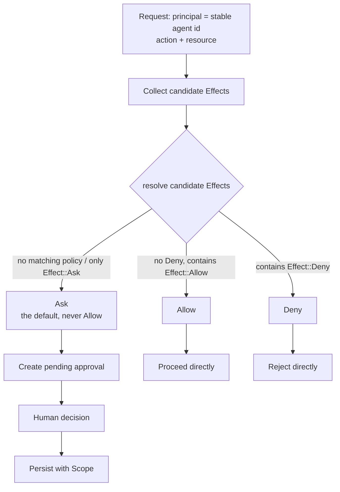
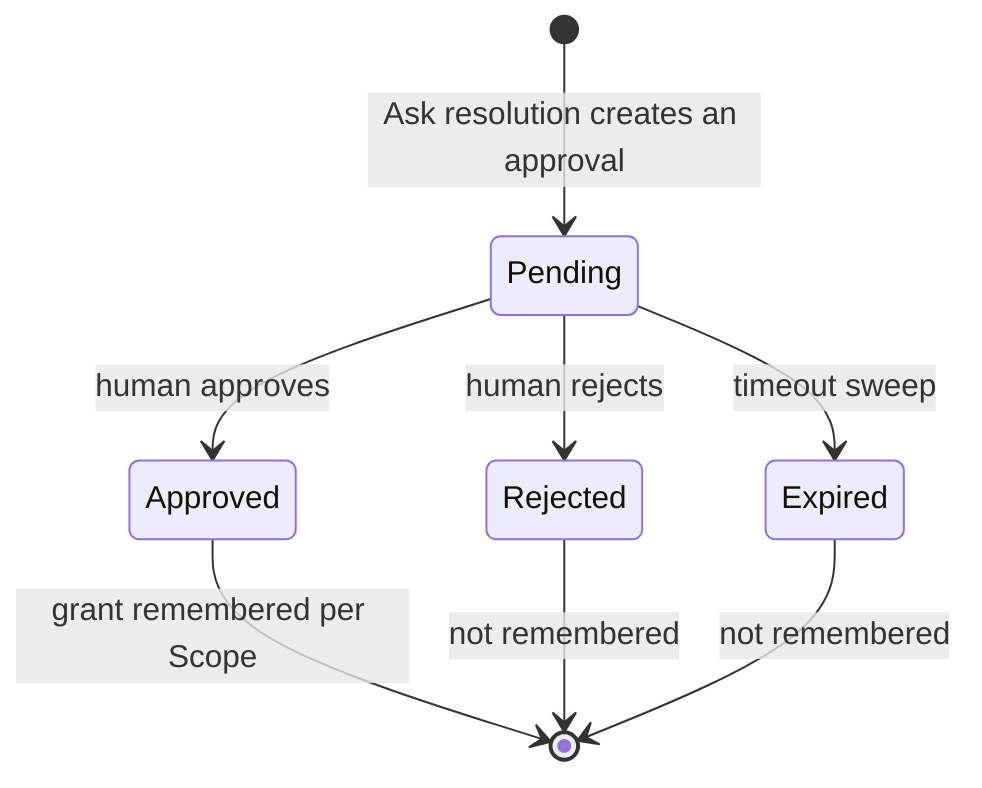

# Permission model

Every gated action — whether requested by a native API Agent's tool-use loop or forwarded through the Claude Code permission-hook bridge — is evaluated through a single decision point. There is no separate decision engine for CLI-originated calls.

## Unified decision model

Evaluation resolves a `(principal, action, resource)` triple to exactly one of `Allow`, `Deny`, or `Ask`. A principal is identified by a **stable agent id alone** — one durable principal per Agent, persisting across every session that Agent participates in. Session id and generation id are per-evaluation context, not part of the principal's identity. So an Agent participates in a new session using the same principal and policy assignment as its other sessions, not a session-scoped one.

Unmatched actions (no policy matches the principal/action/resource) resolve to `Ask`, never `Allow`.

## Resolution order: explicit-Deny-first

Conflicting policy matches resolve with explicit `Deny` priority over explicit `Allow`, and explicit `Allow` priority over the default `Ask`.

## Remembered grants: canonical identity and precedence

A remembered decision is a **value of a canonical key**, not a row appended to a list. The key is `principal + action + resource + scope + the scope's owner`, where the owner is the session id, the project key, or the global sentinel. Remembering the same decision again is an update: the effect is replaced and the revision advances. Three scope-specific partial unique indexes make that physical, so a future writer cannot reintroduce a second row for one key.

Selection is decided by the database in one ranked query, not by the caller:

| Rank | Match |
| --- | --- |
| 3 | Session row whose session equals the evaluation session |
| 2 | Project row whose project equals the evaluation project |
| 1 | Global row |

A more specific scope deliberately overrides a broader one, **including a broader `Deny`** — the narrower row is the later, more informed statement about a narrower situation. Specificity is evaluated before effect; folding "deny always wins" into the ranking is how order-dependence would return.

`Once` and `Ask` are unrepresentable as remembered grants rather than checked for: `RememberedScope::parse` refuses the first and `PersistedEffect::parse` the second, so a new persistence path cannot forget the rule. There is no wildcard, prefix, or path-normalisation matching.

## Approval broker

Pending approval requests are held in the native runtime as the single source of truth, independent of whether any frontend event about them was received. A missed frontend event cannot leave a generation silently waiting: the frontend pushes new pending approvals via events **and** reconciles by pulling the full pending list on mount/reconnect. A pending approval is resolved with both an approve/deny decision and a memory scope of `Once`, `Session`, `Project`, or `Global`.

Each pending entry carries a phase — `Pending`, `Resolving`, or `Committed`. Claiming is atomic and single-winner, so two callers submitting opposite decisions at the same moment cannot both proceed: one gets the request, the other gets the winner's resolution id and reports that result. A claim can be reverted only by its holder, and only before anything durable was written. After commit it is never returned to `Pending`, because offering the request again would invite a second decision for one that already has an answer.

## Commit before effect

The decision and its effect happen in two different places — a row in SQLite, and a native Agent or an HTTP waiter being released — and those cannot be made atomic with each other. So the ordering is stated instead:

```text
claim → reserve → commit → deliver → acknowledge → activate
```

Each step is chosen for what it makes impossible:

- **reserve** proves the originating waiter and generation are still current *without* resuming them, so a stale generation is discovered before anything durable exists. `agent_runtime` publishes one boolean for this; it never hands out a generation handle.
- **commit** is one transaction writing the immutable resolution, its decision audit, and any remembered-grant intent together. `Allow` therefore cannot reach anyone before its evidence exists.
- **acknowledge** is what activates the remembered grant. A grant written by the commit is `pending_delivery` and invisible to evaluation until the waiter confirms it applied the decision — so an approval that never actually arrived cannot authorize the *next* attempt.

A retry carries the same immutable `resolution_id`, and the receiving waiter applies a resolution at most once. Delivery outcomes are typed rather than boolean: `delivered`, `stale`, `delivery_failed`, `resolving`, `already_resolved`, `not_found`. Only the first means the tool ran; `delivery_failed` means the decision is durable and reached nobody, and the UI must not offer a second decision for it.

The timeout sweep reports which requests expired and feeds those ids back through the same use case a human decision uses. It has no delivery shortcut of its own, so a timeout arriving while somebody is clicking loses the claim rather than writing a competing resolution.

## Restart and storage-failure semantics

At startup, every resolution still in `committed` or `delivery_failed` had a waiter in a process that no longer exists. It is marked `aborted_by_restart` and becomes durable evidence and nothing else: no pending request is recreated, no effect is delivered to a new generation, and its grant stays inactive. A crash after the waiter applied the effect but before the acknowledgement was recorded lands here too — least privilege is chosen over guessing that delivery happened.

Evaluation continues to fail closed, and now leaves attributed evidence: a storage failure is audited under an `evaluation_error` decider with a stable reason code. If the audit store is unavailable too, one redacted line goes through unified logging carrying only the action token, the reason code, and the session and generation ids. The resource, the tool input, and the underlying error text are all deliberately absent — the first two are user content and the last can quote a query.

## CLI launch-flag projection

A policy template (`readonly`, `standard`, `trusted`, `yolo`) is a **host-side** statement: it decides the effect of `shell.exec` and `file.write` in the unified decision model above (`readonly` → Deny, `standard` → Ask, `trusted` and `yolo` → Allow; `file.read` and `memory.write` are always Allow). What a CLI process is *launched with* is a separate projection of that template, and the projection differs by transport. The governed set is the twelve ids in `POLICY_TEMPLATE_GOVERNED_AGENT_IDS` (`agent_runtime/infrastructure/providers/invocation.rs`); the per-agent table is in [CLI launch-flag projection by transport](#cli-launch-flag-projection-by-transport) below, and the generated [agent capability matrix](../../reference/agents/capability-matrix.md) carries the same rows.

- **Headless / terminal CLIs** (`claude-code`, `codex-cli`, `gemini-cli`, `opencode`, `antigravity-cli`) project the template through **catalog `policy-governed` parameters** (`policy_override_selections`). These parameters are never user-editable.
- **The seven expanded providers** (the six ACP agents `qwen-code`, `kimi-cli`, `qoder-cli`, `codebuddy-code`, `copilot-cli`, `cursor-agent-cli`, plus legacy `iflow-cli`) project the template through **runtime-rendered flags** (`direct_policy_arguments`) because the right flag depends on the transport. On a PTY the flag is the only policy the host can apply, so every template is projected. Under ACP the agent asks the host per call via `session/request_permission`, so only the restrictive read-only posture is passed and `standard`/`trusted`/`yolo` carry **no** launch flag at all — a permissive flag would let the agent skip the question.
- **Claude Code** stacks two layers: the launch flag only sets `permissionMode`; the action-level boundary is the `PreToolUse` hook bridge below.
- **Only catalog-legal, non-bypass values** are used; catalog validation rejects any flag containing `dangerously`.
- **`trusted` and `yolo` differ only at assignment time** (`yolo` requires a confirmation to assign). At the host they produce identical Allow rules; at launch the effective policy is reduced to Readonly/Ask/Allow before projection, and Allow maps to the `trusted` projection — so on most CLIs the two are identical on the command line. Qwen Code, Kimi Code CLI, and iFlow CLI are the exception: their terminals receive a distinct flag for `yolo`.
- **Enforceability is typed, not assumed.** `terminal_policy_enforceability` returns `HostProjected`, `ProviderDelegated`, or `NotEnforceable { reason_code }`. A `NotEnforceable` interactive launch is refused with `PolicyDenied { action: "terminal-launch:<reason_code>" }` rather than started with a weaker posture. Known cases: Qoder CLI has no plan/read-only mode, so `readonly` on its terminal is `terminal-readonly-unsupported`; GitHub Copilot CLI and Cursor Agent CLI on `standard` pass no flag and rely on the CLI's own ask-first default (`ProviderDelegated` — VaneHub passed no restriction and verified none). The UI labels these as provider-delegated or unverified, never as host-enforced, and ACP support is never presented as an OS sandbox.
- **Plan mode** and `readonly` both reduce the effective policy to Readonly regardless of template, and a failed template lookup fails the launch instead of guessing a default.

## Claude Code permission-hook bridge

`PreToolUse` requests from the hook wrapper are translated to an `Action`/`Resource` pair and resolved through the same `evaluate()`/`ApprovalBroker` pipeline as native API Agents. The hook matches only `Bash`, `Edit`, `Write`, `Read`, `Glob`, `Grep`, and MCP tool names (`mcp__*`), mapping them to `shell.exec`/`file.write`/`file.read`/`mcp.tool`; any other tool (e.g. `WebFetch`) is not intercepted and Claude Code's native behavior is unaffected. An `Ask` resolution creates a pending approval in the existing `ApprovalCard` UI and holds the HTTP response until a human decision or the timeout sweep.

## Decision flow and states

The unified decision point narrows a gated action to exactly one of `Allow`, `Deny`, or `Ask`. The diagram below shows the trunk path from request to final resolution.



### Resolution order

The candidate `Effect` set converges by a fixed priority whose order cannot be swapped. The rule comes from `resolve()` in `permissions/domain/effect.rs`.

1. **Explicit `Deny` wins** — if the candidate set contains `Effect::Deny`, the whole set resolves to `Deny` no matter how many `Effect::Allow` values are present.
2. **Explicit `Allow` comes next** — with no `Deny` present and at least one `Effect::Allow`, the set resolves to `Allow`.
3. **Default `Ask` catches the rest** — an empty candidate set (no policy matched that principal/action/resource) or one containing only `Effect::Ask` resolves to `Ask`, never to a silent pass.

### Approval state machine

Pending approvals are the single source of truth in the native runtime. The frontend both receives new approvals by event and reconciles against the full list on mount or reconnect, so a missed frontend event cannot hang a generation indefinitely. An approval is resolved together with a memory `Scope` that decides how long the decision is remembered.



The memory semantics of `Scope` come from `is_remembered()` in `permissions/domain/scope.rs`.

- **`Once`** — valid for this call only. No grant is persisted, and the next identical request is resolved again from scratch.
- **`Session`** — the grant is reused within the current session and lapses when the session ends.
- **`Project`** — the grant is persisted at project scope and reused across sessions.
- **`Global`** — the grant is persisted globally and reused across projects and sessions.

Only `Session`, `Project`, and `Global` persist a grant. `Once` never does.

### CLI launch-flag projection by transport

Flags below are what the template becomes on the command line (`invocation.rs`; catalog slots from `cli_parameters/catalog/catalog.v2.json`). `Trusted` and `Yolo` share a column where they project identically. "ACP" is the managed conversation transport for the six ACP agents; "PTY" is the Agent Terminal.

| Agent | Transport | Readonly | Standard | Trusted | Yolo | Enforceability notes |
| --- | --- | --- | --- | --- | --- | --- |
| Claude Code | headless / PTY + hook | `--permission-mode plan` | CLI default (inherit) | `--permission-mode acceptEdits` | same as Trusted | Host-projected; `PreToolUse` hook is the action boundary |
| Codex CLI | headless / PTY | `--sandbox read-only --ask-for-approval never` | `--sandbox workspace-write --ask-for-approval on-request` | `--sandbox workspace-write --ask-for-approval never` | same | Host-projected |
| Gemini CLI | headless / PTY | `--approval-mode plan` | `--approval-mode default` (emitted explicitly) | `--approval-mode yolo` | same | Host-projected |
| OpenCode | headless / PTY | `--agent plan` | env `OPENCODE_PERMISSION={"edit":"ask","bash":"ask"}` | `--auto` | same | Host-projected |
| Antigravity CLI | headless / PTY | `--mode plan --sandbox` | CLI default (`request-review`) | `--mode accept-edits` | same | Host-projected; never `--dangerously-skip-permissions` |
| Qwen Code | ACP / PTY | `--approval-mode plan` | PTY: `--approval-mode default`; ACP: no flag | PTY: `--approval-mode auto-edit`; ACP: no flag | PTY: `--approval-mode yolo`; ACP: no flag | Host-projected; ACP asks per call |
| Kimi Code CLI | ACP / PTY | `--plan` | PTY: CLI ask default; ACP: no flag | PTY: `--yolo`; ACP: no flag | PTY: `--auto`; ACP: no flag | Host-projected; ACP asks per call |
| Qoder CLI | ACP / PTY | **none** — PTY launch refused (`terminal-readonly-unsupported`) | PTY: `--permission-mode default`; ACP: no flag | PTY: `--permission-mode accept_edits`; ACP: no flag | same as Trusted | No plan mode upstream |
| CodeBuddy Code | ACP / PTY | `--permission-mode plan` | PTY: `--permission-mode default`; ACP: no flag | PTY: `--permission-mode acceptEdits`; ACP: no flag | same | Host-projected; ACP asks per call |
| GitHub Copilot CLI | ACP / PTY | `--mode plan` | PTY: no flag (CLI ask default) — **provider-delegated**; ACP: no flag | PTY: `--allow-all-tools`; ACP: no flag | same | Standard relies on the CLI's own prompt |
| Cursor Agent CLI | ACP / PTY | `--mode plan` | PTY: no flag (CLI ask default) — **provider-delegated**; ACP: no flag | PTY: `--force`; ACP: no flag | same | Standard relies on the CLI's own prompt |
| iFlow CLI (legacy) | PTY only | `--plan` | `--default` | `--autoEdit` | `--yolo` | Host-projected; no managed conversation |

Under ACP, every tool call the agent wants to make is mapped to a host action (`read`/`search`/`think` → `file.read`; `edit`/`delete`/`move` → `file.write`; `execute`/`fetch`/unknown → `shell.exec`) and evaluated by the same decision point; `Ask` defers to the approval UI in an interactive session and is **rejected** when unattended, recorded as needs-intervention. Cancellation, dismissal, and deadlines never approve.

### Claude Code hook bridge

Claude Code's `PreToolUse` hook requests are translated into an `(Action, Resource)` pair and run through exactly the same `evaluate()` and `ApprovalBroker` pipeline as a native API Agent. There is no parallel decision engine.

- **Only matched tools are intercepted** — `Bash`, `Edit`, `Write`, `Read`, `Glob`, `Grep`, and MCP tool names (`mcp__*`).
- **Tool mapping** — `Bash` → `shell.exec`; `Edit` and `Write` → `file.write`; `Read`, `Glob`, and `Grep` → `file.read`; `mcp__*` → `mcp.tool`.
- **Unmatched tools are untouched** — tools not on the list, such as `WebFetch`, are not intercepted and Claude Code's native behavior is unaffected.
- **An `Ask` resolution** creates a pending approval in the existing `ApprovalCard` UI and holds the HTTP response until a human decision or the timeout sweep.

## Key types and constants

The tables and lists below collect the permission domain's core types, signatures, and constants for quick reference during implementation. The authoritative semantics remain the prose above and the specs.

### Effect and resolution

The `Effect` enum, from `permissions/domain/effect.rs`, defines the three decision values:

- `Effect::Allow` — an explicit pass
- `Effect::Deny` — an explicit refusal
- `Effect::Ask` — the default fallback, escalating to human approval

The resolution function `resolve(candidates: &[Effect]) -> Effect` converges the candidate set by fixed priority, in an order that cannot be swapped:

1. The candidate set contains `Effect::Deny` → returns `Deny`
2. The set contains no `Deny` but at least one `Effect::Allow` → returns `Allow`
3. The set is empty or contains only `Effect::Ask` → returns `Ask`

An unmatched `(principal, action, resource)` triple — an empty candidate set — always resolves to `Ask` and never to a silent `Allow`.

### Scope and memory semantics

The `Scope` enum, from `permissions/domain/scope.rs`, defines a grant's persistence scope, and `is_remembered()` decides whether the decision reaches storage:

| Variant | `is_remembered()` | Behavior |
| --- | --- | --- |
| `Scope::Once` | `false` | Not persisted; the next identical request is resolved again |
| `Scope::Session` | `true` | Reused within the current session, lapsing when it ends |
| `Scope::Project` | `true` | Persisted at project scope and reused across sessions |
| `Scope::Global` | `true` | Persisted globally and reused across projects and sessions |

### Principal identity

A principal equals the **stable agent id** and stays constant across every session that Agent participates in. Session id and generation id are per-evaluation context and are not part of the principal's identity, which is why a new session inherits the Agent's existing policy assignment rather than a session-scoped one.

### ApprovalRequest

`ApprovalRequest` carries a correlation id that ties a pending approval back to the suspended pending-call accounting in the tool-use loop. That correlation id is opaque to the permission domain — the domain does not parse its internal structure and uses it only to route the human decision back to the caller.

### Policy templates

`PolicyTemplateName`, from `permissions/domain/template.rs`, defines four templates:

- `Readonly` — read only
- `Standard` — standard
- `Trusted` — trusted
- `Yolo` — no approval

`Trusted` and `Yolo` yield the same host-side rules; `Yolo` additionally requires confirmation to assign. Their launch projection is identical on every CLI except Qwen Code, Kimi Code CLI, and iFlow CLI terminals (see the table above).

### Hook tool mapping table

The Claude Code `PreToolUse` hook intercepts only the tool names below. Every other tool, such as `WebFetch`, passes through untouched and Claude Code's native behavior is unaffected:

| Claude Code tool | Mapped action |
| --- | --- |
| `Bash` | `shell.exec` |
| `Edit`, `Write` | `file.write` |
| `Read`, `Glob`, `Grep` | `file.read` |
| `mcp__*` | `mcp.tool` |

## Where the design lives

This chapter orients contributors. The authoritative requirements live in the specs.

- [openspec/specs/permissions-core](../../../openspec/specs/permissions-core/spec.md) — the unified decision model and resolution order.
- [openspec/specs/permissions-approval](../../../openspec/specs/permissions-approval/spec.md) — the approval broker, pending state, and memory scopes.
- [openspec/specs/cli-agent-permission-launch-flags](../../../openspec/specs/cli-agent-permission-launch-flags/spec.md) — CLI launch-flag projection.
- [openspec/specs/claude-code-permission-hook](../../../openspec/specs/claude-code-permission-hook/spec.md) — the Claude Code `PreToolUse` bridge.

Permission evaluation lives in the `agent_runtime` bounded context; see [Native bounded contexts](native-contexts.md).
