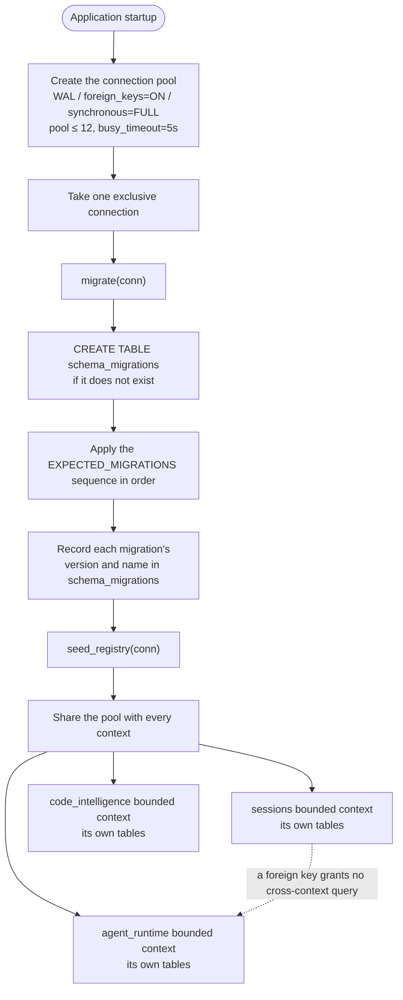
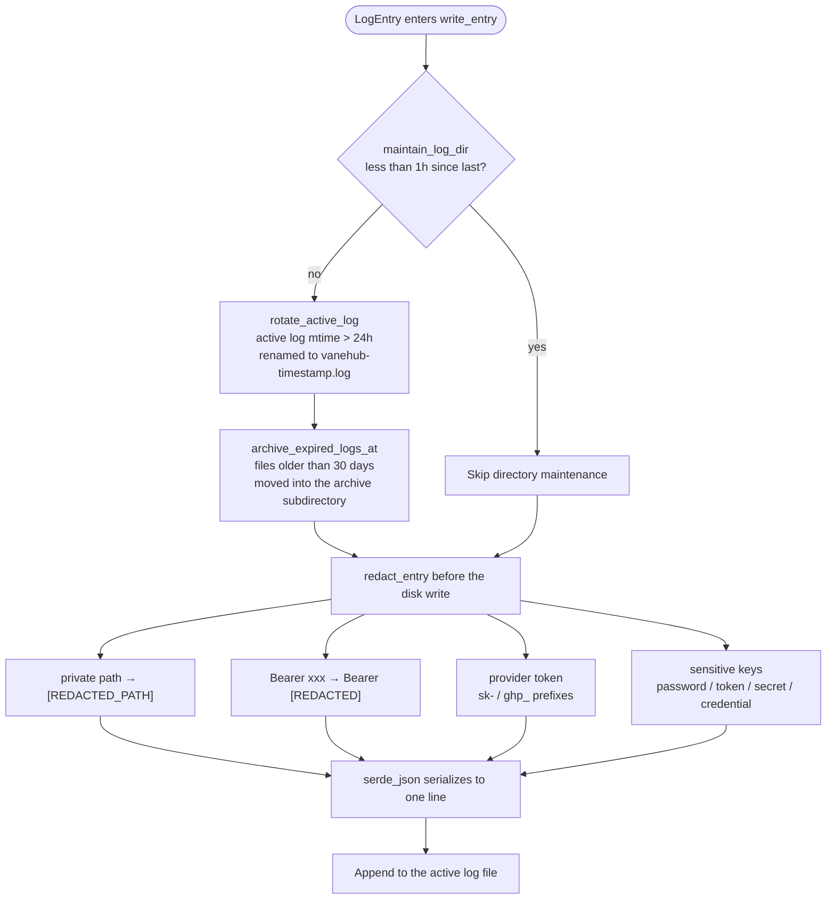

# Persistence and unified logging

## SQLite ownership

SQLite is accessed only from Rust infrastructure. Migrations have a global order, but each schema and repository belongs to a bounded context. A foreign-key reference does not grant one context permission to query another context's tables directly.

Migration changes require:

- a versioned migration;
- clean-database and upgrade-path coverage;
- explicit row-to-domain mapping;
- compatibility with current fixtures;
- no `unwrap()` or `expect()` across production command boundaries.

## Logging

Native diagnostics and operation output flow through the unified logging service. Feature-specific log files are prohibited.

Persisted events must:

- carry `error`, `warn`, `info`, or `debug` semantics;
- redact credentials, tokens, user content, paths, and command-sensitive values before disk writes;
- correlate long-running operations without putting raw prompts or Agent output in diagnostic channels;
- preserve page-visible operation output in its owning result store.

React cannot write local log files. Persisted frontend errors cross the service boundary to the native logging command. Web/mock behavior may expose page-visible simulated logs but cannot claim native persistence.

Execution observability correlation rules are governed by `openspec/specs/agent-execution-observability/spec.md` and `openspec/specs/unified-log-management/spec.md`; the semantic/log-store split is recorded as ADR-002 in `src-tauri/ARCHITECTURE.md`.

## SQLite ownership and migrations

The database is one application-owned SQLite file. Connections, migration orchestration, and seed registration are centralized in `src-tauri/src/platform/database/mod.rs`, and no context may bypass the pool with its own connection or manage its own schema.

- **One database file**, `vanehub.sqlite`, with `journal_mode=WAL` (many readers, one writer), `foreign_keys=ON`, and `synchronous=FULL`, which syncs the WAL at every recovery-critical commit point.
- **A connection pool** capped at `MAX_POOL_SIZE = 12`, with `busy_timeout = 5s` and `CONNECTION_TIMEOUT = 5s`. The pool size tracks the number of Tauri command worker threads, and WAL keeps readers from being blocked by a writer.
- **Sequential migrations** run once on a single exclusive connection before the pool is shared, with the `schema_migrations` table accounting for each migration by version number and name.
- **`EXPECTED_MIGRATIONS` is the source of truth for the sequence.** The post-migration density check and the `migration_sequence_matches_expected` test both compare against it. A new migration must be appended at the end of the sequence — inserting or reordering is prohibited, because version numbers are assigned across branches and a renumbering breaks every checkout that already applied the old number.
- **Seed registration** runs `seed_registry` once on the same exclusive connection after migrations complete.
- **Bounded-context partitioning** gives each context its own tables, partitioned by which migration writes them. A foreign-key reference does not grant one context permission to query another context's tables directly.

## Unified logging architecture

Native diagnostics and operation output all flow through the unified write pipeline in `src-tauri/src/platform/logging.rs`. A `LogEntry` entering `write_entry` first triggers directory maintenance (rate-limited to once an hour), then redaction, and only then reaches disk. Logging and the execution-observability trace are separated by responsibility — raw prompts and Agent output never enter the diagnostic channel — but run, trace, and span ids are written into the log entry's `context` map as correlation fields, injected by `AgentRuntimeLoggingAdapter::record` and persisted through `UnifiedLoggingAdapter`.

Redaction and isolation, in detail:

- **Private paths** are replaced with `[REDACTED_PATH]` before the disk write, so a user's private absolute path never leaves the machine.
- **Bearer tokens** in the shape `Authorization: Bearer xxx` are normalized to `Bearer [REDACTED]`, keeping only the scheme.
- **Provider tokens** are recognized by prefixes such as `sk-` and `ghp_` and erased whole.
- **Sensitive keys** matching names like `password`, `token`, `secret`, and `credential` have their values cleared.
- **Trace correlation** — execution observability's run, trace, and span ids are written into the log entry's `context` field by `AgentRuntimeLoggingAdapter::record` and persisted by `UnifiedLoggingAdapter`. Logs keep only safe metadata: server and language identifiers, lifecycle transitions, method categories, durations, counts, restart attempts, timeout and cancellation categories, exit codes, and safe workspace identifiers. Raw protocol payloads, source code, hover content, diagnostic messages, stderr, environment variables, executable arguments, credentials, and private absolute paths are never persisted.
- **Rate limiting and rotation** — directory maintenance runs at most once an hour; an active log older than 24 hours is renamed and archived; a file in the archive directory older than 30 days moves into the `archive` subdirectory for cold retention.
- **React writes no local logs** — a frontend error that needs persisting crosses the service boundary to the native logging command. Web/mock behavior may expose page-visible simulated logs but cannot claim native persistence.

## Key constants and redaction rules

### Database constants

| Constant | Value | Meaning |
| --- | --- | --- |
| `DATABASE_FILE_NAME` | `"vanehub.sqlite"` | The single database file |
| `MAX_POOL_SIZE` | `12` | Connection pool ceiling, tracking the Tauri command worker thread count |
| `busy_timeout` | `5s` | How long a reader waits while a writer holds the lock |
| `CONNECTION_TIMEOUT` | `5s` | Timeout for acquiring a connection |
| `journal_mode` | `WAL` | Many readers, one writer |
| `foreign_keys` | `ON` | Foreign key constraints enforced |
| `synchronous` | `FULL` | WAL synced at every recovery-critical commit point |

### Migrations

`EXPECTED_MIGRATIONS` in `src-tauri/src/platform/database/migrations/mod.rs` is the source of truth for the migration sequence, and both the post-migration density check and the `migration_sequence_matches_expected` test compare against it. A new migration must be appended at the end; inserting or reordering is prohibited. The `schema_migrations(version, name, applied_at)` table accounts for each applied migration, and `seed_registry` runs once on the same exclusive connection after migrations complete.

This chapter deliberately does not state how many migrations exist. Version numbers are allocated across concurrent branches, so any count written here is stale by the time a second branch merges.

### Logging constants

| Constant | Value | Meaning |
| --- | --- | --- |
| `LOG_FILE_NAME` | `"vanehub.log"` | The active log file name |
| `ARCHIVE_DIR_NAME` | `"archive"` | The cold-retention subdirectory name |
| `RETENTION_DAYS` | `30` | Files older than this move into the `archive` subdirectory |
| `ROTATION_AGE_HOURS` | `24` | An active log with an mtime older than this is renamed and archived |
| `MAINTENANCE_INTERVAL_HOURS` | `1` | Directory maintenance runs at most this often |

### Logging types

The `LogLevel` enum carries four values: `Error`, `Warn`, `Info`, and `Debug`. A `LogEntry` has the fields `timestamp`, `level`, `category`, `message`, and `context`. `ClientLogEvent` carries events reported by the frontend across the service boundary, such as `ErrorBoundary` and `CriticalOperationFailure`.

### Redaction

`redact_text` and `redact_entry` redact once before the disk write and once before JSON serialization, covering four classes:

- **Private paths** → `[REDACTED_PATH]`, matching absolute-path prefixes such as `C:\`, `/home/`, `/Users/`, and `file:///`.
- **Bearer** → `Bearer [REDACTED]`, keeping only the scheme.
- **Provider tokens** recognized by prefixes such as `sk-`, `ghp_`, `github_pat_`, and `ssh-connection`, erased whole.
- **Sensitive keys** matching names such as `password`, `token`, `secret`, `credential`, `authorization`, `key_path`, and `private_key`, with their values cleared.

### Trace correlation

Execution observability is carried by `contexts/operations/domain/operation.rs`: every operation has a `trace_id`, and `correlate_execution(run_id, trace_id)` ties a run to a trace. Run, trace, and span ids are written into the log file's `context` field by `AgentRuntimeLoggingAdapter::record`, while raw prompts and Agent output stay out of the diagnostic channel.

The source of truth for the unified logging specification is `openspec/specs/unified-log-management/spec.md`; execution observability correlation rules live in `openspec/specs/agent-execution-observability/spec.md`.
