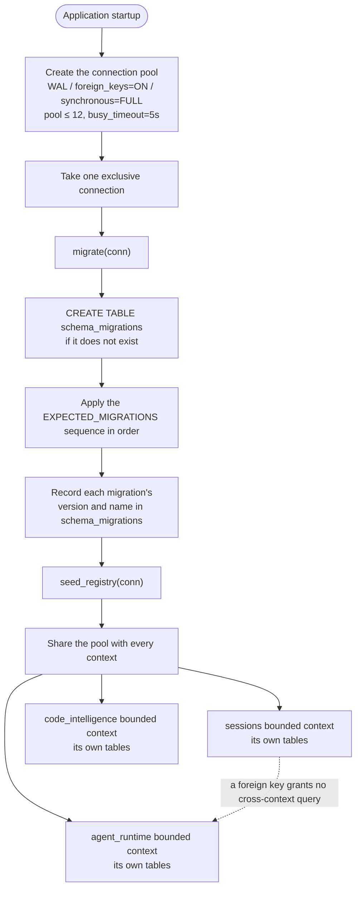

# Persistence ownership

Which context owns which table, how migrations are numbered and applied, and the key constants of the database layer.

Writing logs, redaction, and trace correlation are in [Unified logging](unified-logging.md).

## SQLite ownership

SQLite is accessed only from Rust infrastructure. Migrations have a global order, but each schema and repository belongs to a bounded context. A foreign-key reference does not grant one context permission to query another context's tables directly.

Migration changes require:

- a versioned migration;
- clean-database and upgrade-path coverage;
- explicit row-to-domain mapping;
- compatibility with current fixtures;
- no `unwrap()` or `expect()` across production command boundaries.

## SQLite ownership and migrations

The database is one application-owned SQLite file. Connections, migration orchestration, and seed registration are centralized in `src-tauri/src/platform/database/mod.rs`, and no context may bypass the pool with its own connection or manage its own schema.

- **One database file**, `vanehub.sqlite`, with `journal_mode=WAL` (many readers, one writer), `foreign_keys=ON`, and `synchronous=FULL`, which syncs the WAL at every recovery-critical commit point.
- **A connection pool** capped at `MAX_POOL_SIZE = 12`, with `busy_timeout = 5s` and `CONNECTION_TIMEOUT = 5s`. The pool size tracks the number of Tauri command worker threads, and WAL keeps readers from being blocked by a writer.
- **Sequential migrations** run once on a single exclusive connection before the pool is shared, with the `schema_migrations` table accounting for each migration by version number and name.
- **`EXPECTED_MIGRATIONS` is the source of truth for the sequence.** The post-migration density check and the `migration_sequence_matches_expected` test both compare against it. A new migration must be appended at the end of the sequence — inserting or reordering is prohibited, because version numbers are assigned across branches and a renumbering breaks every checkout that already applied the old number.
- **Seed registration** runs `seed_registry` once on the same exclusive connection after migrations complete.
- **Bounded-context partitioning** gives each context its own tables, partitioned by which migration writes them. A foreign-key reference does not grant one context permission to query another context's tables directly.

## Database constants and migrations

### Database constants

| Constant | Value | Meaning |
| --- | --- | --- |
| `DATABASE_FILE_NAME` | `"vanehub.sqlite"` | The single database file |
| `MAX_POOL_SIZE` | `12` | Connection pool ceiling, tracking the Tauri command worker thread count |
| `busy_timeout` | `5s` | How long a reader waits while a writer holds the lock |
| `CONNECTION_TIMEOUT` | `5s` | Timeout for acquiring a connection |
| `journal_mode` | `WAL` | Many readers, one writer |
| `foreign_keys` | `ON` | Foreign key constraints enforced |
| `synchronous` | `FULL` | WAL synced at every recovery-critical commit point |

### Migrations

`EXPECTED_MIGRATIONS` in `src-tauri/src/platform/database/migrations/mod.rs` is the source of truth for the migration sequence, and both the post-migration density check and the `migration_sequence_matches_expected` test compare against it. A new migration must be appended at the end; inserting or reordering is prohibited. The `schema_migrations(version, name, applied_at)` table accounts for each applied migration, and `seed_registry` runs once on the same exclusive connection after migrations complete.

This chapter deliberately does not state how many migrations exist. Version numbers are allocated across concurrent branches, so any count written here is stale by the time a second branch merges.

## Session deletion journal and managed worktrees

Deleting a session is the one use case that touches Git and SQLite together, and the two do not share a transaction. Its state therefore lives in dedicated journal tables rather than being inferred from log text.

| Table | Owning context | Purpose |
| --- | --- | --- |
| `managed_worktrees` | `workspaces` | Worktrees this application created: origin (`ordinary_session`/`loop`/`subagent`/`external`), provenance (`provisioning`/`verified`/`legacy_verified`/`legacy_unverified`/`external`), the Git identity (canonical root, git dir, common dir, branch, HEAD, filesystem identity), status and revision. Intent is written before `git worktree add`; the identity is filled in after Git succeeds |
| `managed_worktree_sessions` | `workspaces` | The binding between a worktree and its sessions. **No foreign key to `sessions`**: the resource record must outlive the sessions that pointed at it |
| `workspace_use_gates` | `workspaces` | The exclusive gate a cleanup holds over a directory, recording the owning instance and operation. Whether that instance is alive is proven by the OS file lock in `platform::instance_lease`, never guessed from a TTL |
| `session_deletion_operations` / `session_deletion_groups` | `sessions` | The journal of every deletion request: a unique `request_id` bound to a canonical request hash (idempotency), groups keyed by real worktree identity, and per group the `worktree_effect` (`not_requested`/`retained`/`remove_started`/`removed`/`removal_unknown`), the `db_effect`, the authorization snapshot, the execution snapshot and the receipt |
| `session_deletion_claims` | `sessions` | The exclusive claim a deletion holds on a session. The `sessions` service checks it before sending, generating, changing seats and archiving or restoring; `workspaces` checks it through the bootstrap-injected `WorkspaceExecutionAdmissionPort` before opening a Shell. Again **no foreign key to `sessions`** |

Invariants:

- Journal before stopping anything; `remove_started` and the identity snapshot before the one permitted non-forced `git worktree remove`; an observation that the directory and its registration are gone before the single transaction that deletes the group's sessions, their cascades, and the active selection when it names one of them.
- A Git success followed by a failed session transaction is recorded as `finalize_pending` with the claims held; `reconcile_pending_deletions` on startup only observes and finishes the database step and **never replays the Git removal**. A directory that is neither intact nor confirmed gone becomes `needs_attention`, with no prune and no recursive delete.
- The legacy `delete_session` command runs the same coordinator's keep path, waits for the real result, and respects claims.
