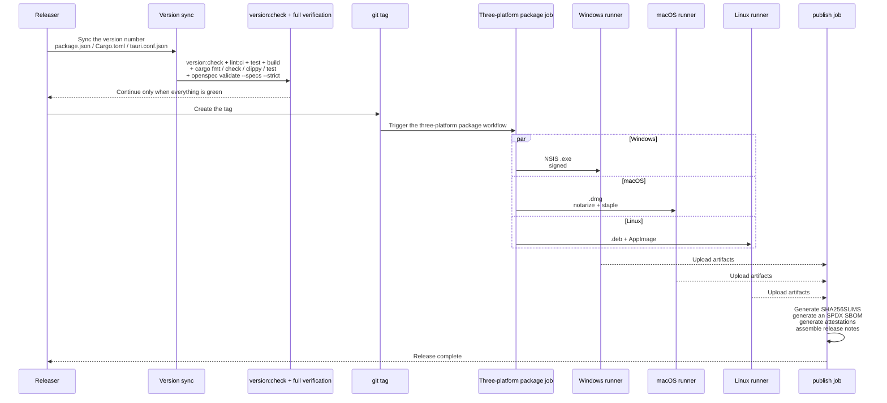

# Release

Packaging targets, signing credentials, version synchronization, and updater artifacts.

Test tiers are in [Testing](testing.md).

## The release process

A release is one synchronized packaging and signing pass across three platforms. The version number must agree in `package.json`, `src-tauri/Cargo.toml`, and `src-tauri/tauri.conf.json`, guarded by `version:check`.

What matters in a release:

- **Version synchronization** — the version must agree across `package.json`, `src-tauri/Cargo.toml`, and `src-tauri/tauri.conf.json`. `scripts/check-version-sync.mjs` cross-checks them, and `version:unit:test` is its unit test.
- **Full verification comes first** — every verification command at the end of `AGENTS.md` must pass before the tag, plus `version:check`.
- **Three platform artifacts** — Windows produces a signed NSIS `.exe`; macOS produces a `.dmg` that is notarized and stapled; Linux produces a `.deb` and an AppImage.
- **The publish artifact list** — `SHA256SUMS` (a per-file sha256, verified to contain no duplicate hashes), an SPDX SBOM, attestations, and release notes.
- **Updater signing** — the auto-updater signs with `TAURI_SIGNING_PRIVATE_KEY` and its password. The signing key belongs to the protected release environment and never appears in repository configuration or screenshots. An empty key takes the rehearsal-only path and produces no distributable update signature.
- **Signing credential isolation** — signing credentials are injected only in the CI protected environment. A normal local packaging command carries neither the `desktop-e2e` feature nor the signing key.

Packaging and signing details live in `src-tauri/ARCHITECTURE.md` and the [release signing guide](../reference/release-signing.md); CI orchestration lives in `.github/workflows/ci.yml` and `.github/workflows/package.yml`.

## Release scripts

- **Packaging targets** — `package.json` defines six: `package:windows:{x64,arm64}`, `package:macos:{x64,arm64}`, and `package:linux:{x64,arm64}`, each preceded by `sidecar:prepare -- --release --target=...`.
- **Version synchronization** — `scripts/check-version-sync.mjs` requires the three version declarations to agree, with `version:unit:test` as its unit test.
- **Signing credentials** — the protected `release` environment holds the credentials (`APPLE_CERTIFICATE`, `APPLE_SIGNING_IDENTITY`, `TAURI_SIGNING_PRIVATE_KEY`, `WINDOWS_CERTIFICATE`, and others). The environment is chosen by `github.ref_type == 'tag' ? 'release' : 'build-preview'`, and the updater uses `TAURI_SIGNING_PRIVATE_KEY` to produce `createUpdaterArtifacts`, with the public key embedded in `tauri.conf.json`.
