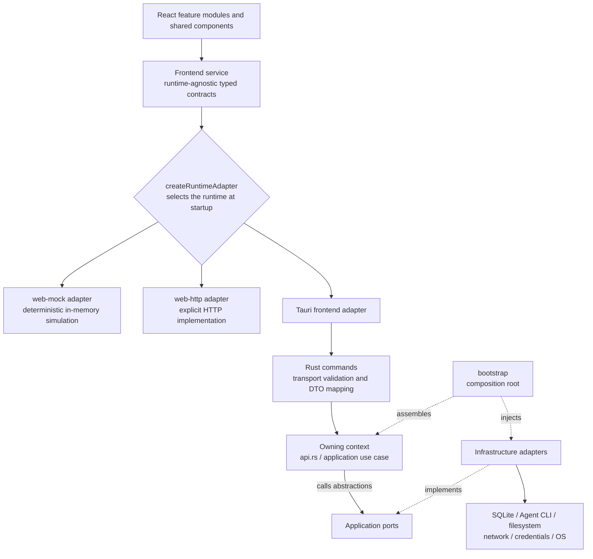
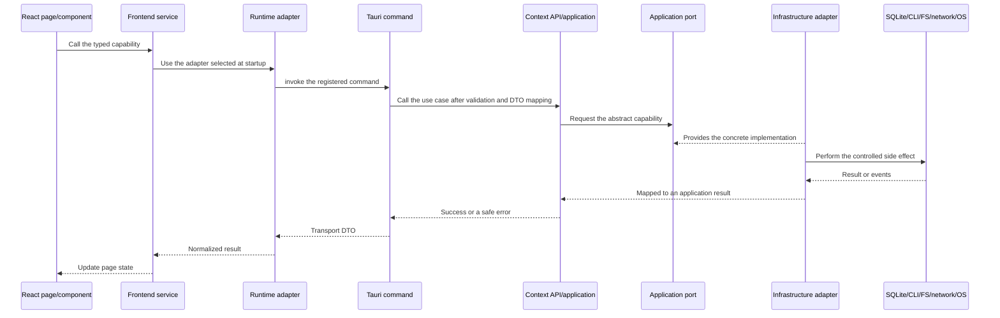

# Repository orientation

VaneHub AI is a desktop-first AI coding Agent workbench. It serves one React UI through multiple frontend runtimes, with Tauri 2 + Rust providing local processes, SQLite, filesystem, network, and desktop lifecycle capabilities.

This chapter answers only three questions:

1. Where to look first when entering the repository;
2. Which directory and boundary a given change belongs to;
3. How to trace from a React page all the way to Rust, SQLite, an Agent CLI, or other external capabilities.

The complete runtime selection rules live in [Runtime and service boundaries](runtime-boundaries.md), and complete native context ownership in [Native bounded contexts](native-contexts.md). This chapter deliberately does not maintain drift-prone context counts, command lists, or built-in item counts.

## Authoritative sources and reading order

Different documents in the repository carry different responsibilities. When they conflict, use this table to decide which one wins.

| Question to answer | Authoritative source |
| --- | --- |
| Contribution rules, prohibitions, pre-commit verification commands | [`AGENTS.md`](../../../AGENTS.md) |
| Mandatory architecture rules, complete bounded context list | [`openspec/project.md`](../../../openspec/project.md) |
| Implemented native module inventory, migration status, and ADRs | [`src-tauri/ARCHITECTURE.md`](../../reference/native-architecture.md) |
| Confirmed product behavior | `openspec/specs/` |
| In-flight change designs and task evidence | `openspec/changes/<change-name>/` |
| Explanatory material that helps contributors understand the code | This developer guide |
| Final implementation detail | Source code, tests, and the generated [Native API reference](native-api-reference.md) |

When contributing for the first time, read in this order:

1. This chapter: establish repository coordinates first;
2. [Runtime and service boundaries](runtime-boundaries.md): understand `tauri`, `web-http`, and `web-mock`;
3. [Native bounded contexts](native-contexts.md): confirm business ownership;
4. [Persistence ownership](persistence-ownership.md) when data is involved;
5. [OpenSpec workflow](openspec-workflow.md) and the root `AGENTS.md` before starting implementation.

## The overall architecture in one minute



Four boundaries to remember first:

- React components may depend on other components, hooks, types, and utilities, but any access to runtime side effects must go through a frontend service; they must not call Tauri `invoke()` directly.
- The frontend runtime is selected on the startup path by `createRuntimeAdapter`; `web-mock` must never pretend that a local process, SQLite write, or OS action actually happened.
- A Tauri command is an inbound transport adapter, not a business service; business rules belong to the bounded context that owns the capability.
- Cross-context calls go only through the other context's published `api.rs` facade, immutable contracts, or explicit events — never by importing its repository or infrastructure.

## Repository root

```text
vanehub-ai/
├─ src/                              # React frontend
├─ src-tauri/                        # Main Tauri app and Rust native runtime
├─ crates/vanehub-permission-hook/   # Claude Code PreToolUse hook sidecar
├─ openspec/                         # Main specs, change packages, archive evidence
├─ docs/                             # User guide, developer guide, technical reference
├─ tests/                            # Cross-layer E2E, desktop, docs, fixtures
├─ scripts/                          # Build, generation, validation, test, release scripts
├─ public/                           # Frontend static assets
├─ .github/                          # CI, release, and repository automation
├─ AGENTS.md                         # Unified contribution entry, verification-command source of truth
├─ package.json                      # Node, frontend, docs, and test script entry points
└─ Cargo.toml                        # Rust workspace root configuration
```

| Path | Main responsibility | When you usually go there |
| --- | --- | --- |
| `src/` | React pages, feature modules, shared UI, frontend services, and runtime adapters | Pages, interaction, frontend contracts, or adapters change |
| `src-tauri/` | Main Tauri app, Rust modular monolith, Tauri configuration, desktop resources | SQLite, CLI, files, network, system integration, or native business logic changes |
| `crates/vanehub-permission-hook/` | Standalone Rust binary bridging Claude Code `PreToolUse` permission requests | Changing the Claude Code hook I/O protocol or the sidecar packaging chain |
| `openspec/specs/` | The single source of truth for confirmed behavior | Looking up behavior that must currently hold |
| `openspec/changes/` | Proposals, designs, delta specs, tasks, and the archive | New features, architecture adjustments, or behavior changes |
| `docs/` | Documentation for users, contributors, and Agent Infra learners | Behavior, procedures, or architecture explanations change |
| `tests/` | Tests that need cross-module or real-runtime verification | Web E2E, desktop E2E, docs, and specialized scenarios |
| `scripts/` | Generators, architecture checks, desktop test orchestration, docs build, release helpers | Do not duplicate existing engineering workflows in business code |
| `.github/` | CI, platform matrix, release, and security automation | Local and CI behavior diverge, or the release process changes |

Root directories such as `.claude/`, `.codex/skills/`, and `.superpowers/` serve repository-level AI coding workflows; they are not part of the VaneHub AI product runtime.

## Frontend code map

### Startup entry and page organization

| Path | Responsibility |
| --- | --- |
| `src/main.tsx` | React startup entry; selects the main window, floating assistant, or region-capture surface, and reports startup failures |
| `src/App.tsx` | Top-level providers, routing, and the main app shell |
| `src/main-layout/` | Main window layout, navigation, and workspace routing |
| `src/session-workspace/` | The session workspace and its main interaction surfaces |
| `src/settings/` | Settings shell and the individual settings pages |
| `src/loop-center/`, `src/goal-center/`, `src/work-board/` | Loop, goal, and work-board feature slices |
| `src/evaluation-center/`, `src/mission-control/`, `src/system-activity/` | Evaluation, mission control, and system activity feature slices |
| `src/floating-assistant/`, `src/region-capture/` | Standalone desktop surfaces |
| `src/notifications/` | Notification state, bridging, and presentation |

Feature directories are organized by user capability and are not the same thing as native bounded contexts. A single settings page may call several native contexts such as `desktop`, `tooling`, and `permissions`; code ownership cannot be inferred from the page name alone.

### Shared layers and the runtime boundary

| Path | Responsibility |
| --- | --- |
| `src/components/` | Reusable UI and general presentation components |
| `src/hooks/` | Shared React hooks |
| `src/theme/`, `src/styles.css` | Theme, semantic style tokens, and global styles |
| `src/i18n/` | Language registration, resource loading, and translation consistency |
| `src/types/`, `src/contracts/` | Cross-feature TypeScript types and stable contracts |
| `src/services/` | Frontend service contracts, service factories, and most Tauri/Web runtime clients |
| `src/adapters/` | Dedicated frontend adapters split out of services; currently mainly the Skill Curator implementations |
| `src/generated/` | Generated frontend artifacts; locate the generator or authoritative input before editing |
| `src/test/`, `src/testing/` | Frontend test support and shared fixtures |

`src/services/` is the boundary components use to reach runtime capabilities, not the only directory components may import. Components may still depend on shared components, hooks, types, and pure functions; what is forbidden is bypassing the service boundary to trigger host side effects directly.

### How to trace a frontend call

Search in the following order; it usually pins down the full chain quickly:

1. Find the page and event handler starting from `src/App.tsx`, the routing, or the specific feature directory;
2. Look at the `*Service`, `runtime-*-client`, or service factory the component imports;
3. Confirm runtime selection in `src/services/runtime-adapter.ts`;
4. Check that the `tauri`, `web-http`, and `web-mock` implementations keep the same contract;
5. On the Tauri path, search for the command name inside the adapter;
6. On the Web path, confirm whether it is a real HTTP call or an explicit deterministic simulation;
7. Check the co-located unit tests and the adapter conformance/parity tests.

## Native code map

The main VaneHub AI Tauri runtime is a Rust modular monolith split by domain. The root `Cargo.toml` organizes the main app and the permission hook sidecar into one Cargo workspace.

```text
src-tauri/src/
├─ main.rs               # Very thin binary entry
├─ lib.rs                # Module exposure, delegating to bootstrap::run()
├─ bootstrap/            # The only composition root: selects and injects concrete implementations
├─ commands/             # Tauri inbound adapters and the command registry
├─ contexts/             # Bounded contexts: domain, application, and owned infrastructure
├─ platform/             # Reusable outer-layer technical adapters
├─ test_support/         # Native test support
└─ *_tests.rs            # Cross-module contract, migration, and lifecycle tests
```

| Path | What it may do | What it must not do |
| --- | --- | --- |
| `main.rs`, `lib.rs` | Startup delegation and module exposure | Hold business rules, SQL, process construction, or use-case orchestration |
| `bootstrap/` | Create repositories, gateways, services; wire dependencies in explicit order | Act as a business service or be depended on by domain/application |
| `commands/` | Validate transport input, map DTOs, call assembled APIs, map safe errors, emit interface-level events | Write SQL, spawn processes, decide domain policy |
| `contexts/<context>/domain/` | Entities, value objects, invariants, domain errors, domain events | Depend on Tauri, SQLite, filesystem, network, or another context's private implementation |
| `contexts/<context>/application/` | Use-case orchestration, input/output models, consumer-side ports | Depend on concrete I/O adapters or Tauri state |
| `contexts/<context>/infrastructure/` | Implement application ports for SQLite, processes, files, network, credentials | Define business invariants |
| `contexts/<context>/api.rs` | Publish a narrow, stable in-process facade | Expose repositories, database rows, or infrastructure implementations |
| `platform/` | Shared technical capabilities: database connection and migration orchestration, process safety, filesystem, network, credentials, clock, IDs, log persistence | Take domain ownership of any business context |

A typical context is shaped as follows, but empty layers are not created early just for formal completeness:

```text
contexts/<context>/
├─ domain/
├─ application/
│  └─ ports/
├─ infrastructure/
└─ api.rs
```

The complete context list and responsibilities are maintained only in [Native bounded contexts](native-contexts.md) and `openspec/project.md`. This chapter deliberately does not copy the list, so that adding a context cannot leave a second, stale map behind.

## Tauri configuration and non-source directories

| Path | Responsibility |
| --- | --- |
| `src-tauri/capabilities/` | Tauri capabilities and permission boundaries |
| `src-tauri/resources/` | Resources shipped with the desktop app and sidecar-related artifacts |
| `src-tauri/evaluation-fixtures/` | Native evaluation fixtures |
| `src-tauri/gen/schemas/` | Tauri-generated schemas |
| `src-tauri/tests/` | Standalone native integration tests |
| `src-tauri/tauri.conf.json` | Regular desktop build configuration |
| `src-tauri/tauri.sidecar.conf.json` | Development and packaging configuration including the sidecar |
| `src-tauri/tauri.desktop-e2e.conf.json` | Test configuration used only for real desktop E2E |

When changing these directories, also check the packaging scripts, the platform matrix, and the corresponding tests; verifying only the current operating system is not enough.

## Specs, docs, tests, and engineering automation

### OpenSpec

```text
openspec/
├─ project.md                         # Project-level mandatory rules
├─ specs/                             # Confirmed main specs
└─ changes/
   ├─ <active-change>/                # Active change packages
   └─ archive/                        # Completed, immutable historical evidence
```

New features and architecture adjustments should first confirm the existing main specs, then create or update a change package. The full process is in [OpenSpec workflow](openspec-workflow.md).

### Documentation

| Path | Audience |
| --- | --- |
| `docs/user-guide/` | Product users |
| `docs/developer-guide/` | Contributors and maintainers |
| `docs/agent-infrastructure/` | Agent Infra learning and reference |
| `docs/provider-sdk/` | Provider SDK integrators |

Explanatory docs should not copy volatile command counts, context counts, built-in Skill counts, or test layer counts. When a complete list is needed, link to the authoritative file verified by source code or CI.

### Tests

Tests are both co-located with the source and kept in the root `tests/`:

| Location | Main coverage |
| --- | --- |
| `src/**/*.test.ts(x)` | TypeScript contracts, pure logic, components, and adapter consistency |
| `src-tauri/src/**/*tests*.rs` | Domain, application, infrastructure, command, architecture, and migration |
| `tests/e2e/` | Playwright Web/mock user paths |
| `tests/desktop/` | The real Tauri desktop runtime |
| `tests/e2e-local-media/` | Dedicated local-media E2E |
| `tests/docs/` | Docs build and page behavior |
| `tests/fixtures/` | Fixtures shared across tests |

Test layers, applicability, and platform evidence rules are in [Testing](testing.md). Do not copy the verification commands into this chapter; the root `AGENTS.md` is always the source of truth.

### Scripts and CI

`scripts/` contains architecture checks, code generation, OpenSpec indexing, docs build, desktop test orchestration, coverage, migration checks, and release helpers; `.github/workflows/` composes these entry points in CI.

When something "passes locally but fails in CI", first compare `package.json`, the root `Cargo.toml`, `AGENTS.md`, and the corresponding workflow, rather than adding another bypass script.

## Where a change belongs

| Kind of change | Primary location | Also check |
| --- | --- | --- |
| Only page presentation or interaction changes | The matching `src/<feature>/` | `src/components/`, `src/i18n/`, co-located tests, Playwright |
| A new frontend runtime capability | A typed contract in `src/services/` | Tauri, Web/mock, and where applicable the Web/HTTP adapter and conformance tests |
| A new native business rule | `contexts/<context>/domain` or `application` of the owning context | `api.rs`, command DTOs, tests, OpenSpec |
| A new Tauri command | `src-tauri/src/commands/<context>/` | Command registry, frontend Tauri adapter, DTO mapping tests |
| A new SQLite table or column | The owning context's infrastructure/migration | Global migration order, upgrade fixtures, transaction boundaries, persistence ownership docs |
| Calling processes, network, files, or credentials | Application port + infrastructure adapter | Whether `platform/` already has a reusable safe implementation; timeouts, cancellation, redacted logging |
| Cross-context collaboration | Consume the other context's published `api.rs`, immutable contracts, or events | Never import the other context's repository/infrastructure; wire in bootstrap |
| A long-running operation | The owning context's application + the `operations` contract | Stable operation id, progress, terminal states, cancellation, log correlation, and Web/mock async semantics |
| A new bounded context | `openspec/project.md` and `src-tauri/src/contexts/` | `native-contexts.md`, architecture checks, bootstrap, commands, persistence ownership |
| Changing the Claude Code permission hook | The `permissions` context and `crates/vanehub-permission-hook/` | Sidecar build, Tauri resources, hook protocol tests, packaging |
| Changing documentation | The matching `docs/` section | Links, screenshots, generated references, docs tests |

## A practical path from page to native

Taking an action that needs real local capability as the example, trace in this order:



Concrete debugging steps:

1. Find the service method called in the page's event handler;
2. Confirm the current runtime adapter in the service factory;
3. On the Tauri path, search for the command string and confirm registration in `commands/registry.rs`;
4. Open the command file and confirm it only validates, maps, and delegates;
5. Enter the application use case through the context's `api.rs`;
6. Look at the ports the use case depends on, then find the concrete infrastructure implementation from `bootstrap/`;
7. For persistence, confirm the tables and migrations belong to the owning context;
8. For long-running execution, confirm operation, logging, cancellation, and terminal-state evidence;
9. Back in the frontend, check that Web/mock and Web/HTTP keep the contract or explicitly fail closed;
10. Finally pick the smallest test that proves the boundary per [Testing](testing.md), then run the full verification in `AGENTS.md`.

## Common wrong directions

- Importing `@tauri-apps/api/core` in a React component and calling `invoke()` directly;
- Writing SQL, process spawning, or permission decisions inside a Tauri command;
- Letting application code depend on a concrete repository, Tauri state, or a platform implementation;
- Importing another context's `infrastructure`, repository, or private aggregates;
- Letting Web/mock return fake successes such as "CLI executed" or "database written";
- Breaking frontend service contract consistency to avoid changing one adapter;
- Copying the complete context, command, built-in, or test-layer lists into this chapter, creating a second drift source;
- Running only current-platform tests and extrapolating the result to Windows, macOS, and Linux.

## Read next

| What to understand next | Chapter |
| --- | --- |
| How the three frontend runtimes are selected and how adapters stay consistent | [Runtime and service boundaries](runtime-boundaries.md) |
| What each native context owns and how to call across contexts | [Native bounded contexts](native-contexts.md) |
| SQLite, migrations, connection pooling, and table ownership | [Persistence ownership](persistence-ownership.md) |
| Agent, provider, and generation lifecycles | [Agent lifecycle and provider runtime](agent-lifecycle.md) |
| Test layers, desktop evidence, and platform applicability | [Testing](testing.md) |
| Proposals, designs, delta specs, tasks, and archiving | [OpenSpec workflow](openspec-workflow.md) |
| The complete native facade and module reference | [Native API reference](native-api-reference.md) |
