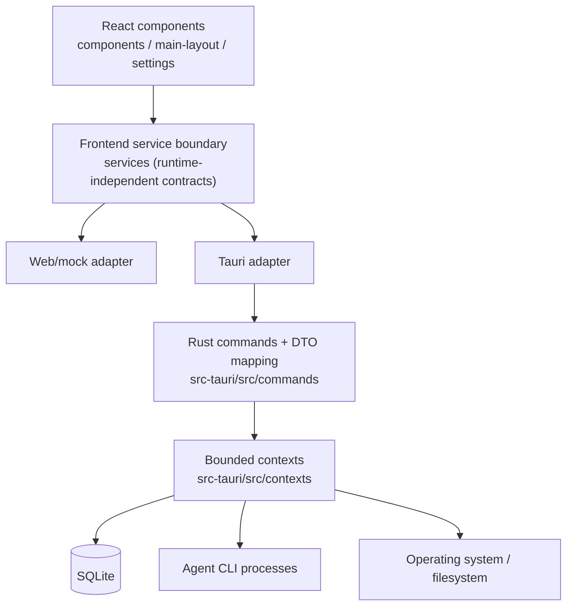
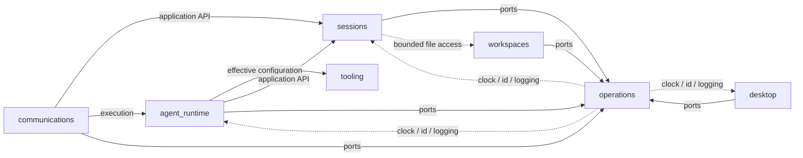
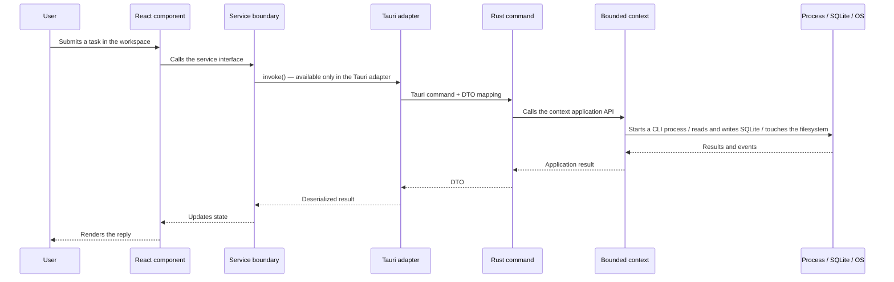

# Repository orientation

VaneHub AI is one React application running behind two runtime adapters — the Tauri desktop client and the Web/mock browser preview. The frontend is decoupled from native code by a service boundary, and the native side is divided into bounded contexts. This chapter covers the repository layout, what each module owns, and how a call travels between them.

## Overall layering

**The constraint that holds this together**: React components depend only on the service interfaces in `src/services/`, and **must never call Tauri `invoke()` directly**. Tauri-specific calls appear only in the frontend Tauri adapter. SQLite, CLI processes, filesystem access, and desktop lifecycle behavior all live on the Rust side.

## Important roots

| Path | Responsibility |
| --- | --- |
| `src/components`, `src/main-layout`, `src/settings` | React presentation and interaction |
| `src/services` | Frontend runtime-independent contracts and adapters — the only layer components may depend on |
| `src/hooks` | Custom React hooks |
| `src/types`, `src/contracts` | Transport-independent TypeScript contracts |
| `src/i18n` | Interface locale resources and their loading |
| `src-tauri/src/commands` | Thin Tauri command and DTO mapping boundary, grouped by functional area |
| `src-tauri/src/contexts` | Native domain, application, and infrastructure ownership (bounded contexts) |
| `src-tauri/src/platform` | Shared platform adapters: database, process, logging, clock, id |
| `src-tauri/src/bootstrap` | Composition root: Tauri builder, app-data resolution, context assembly order |
| `openspec/specs` | Confirmed behavior requirements (the single source of truth for specifications) |
| `openspec/changes` | Active and archived change evidence |
| `tests/e2e` | Playwright user-visible regression paths |

> Start with `AGENTS.md` and `openspec/project.md`. They are normative contributor rules and take precedence over the explanatory examples in this guide.

## Native bounded contexts

The native side is divided into bounded contexts. The diagram below shows the seven core ones; `retrieval` is a core context as well (see [Native bounded contexts](native-contexts.md)). The repository also contains later extension contexts — `code_intelligence`, `permissions`, `execution_observability`, `artifacts`, `goals`, `work_board`, `ssh_connections`, `browser_automation`, `cli_delegation`, `code_execution`, `web_research`, `local_media`, `personalization`, and `skill_evolution_evidence` — with the full list in `src-tauri/src/contexts/mod.rs` and [`src-tauri/ARCHITECTURE.md`](../../reference/native-architecture.md).

**Cross-context calls go through synchronous application APIs by default.** An explicit event is used only when a completed action needs an independent downstream reaction. **No context may reach directly into another context's storage or infrastructure.**

Solid arrows are dependency directions between contexts. Dashed arrows mark `operations` providing the shared clock, id, and unified logging capabilities every context uses.

| Context | Published responsibility | Upstream dependencies | Downstream consumers |
| --- | --- | --- | --- |
| `agent_runtime` | Agent catalog, workflow selection, readiness, provider invocation, generation lifecycle | Effective CLI and prompt configuration from `tooling`, `sessions` application API, `operations` ports | Tauri commands, `communications` inbound execution |
| `sessions` | Session, message, category, and configuration lifecycle; export; maintenance; usage read models | `operations` ports, bounded `workspaces` file access | Tauri commands, `agent_runtime`, `communications` |
| `workspaces` | Projects, remote workspaces, worktrees, file and Git inspection, PTY shells | `operations` ports | Tauri commands, bounded `sessions` file reads |
| `tooling` | CLI, MCP, SDK, extension, plugin, Skill, and Prompt Hook subdomains | `operations` ports and platform adapters | Tauri commands, configuration APIs published to `agent_runtime` |
| `communications` | IM configuration, credentials, transports, routing, authorization, delivery | APIs published by `sessions` and `agent_runtime`, `operations` ports | Tauri commands and connector transports |
| `desktop` | Settings, paths, startup, network proxy preference, window / tray / floating assistant lifecycle | `operations` ports and platform adapters | Tauri bootstrap and commands |
| `operations` | Observable tasks, unified diagnostic and operation logging contracts | Platform clock and id, unified logging implementation | Every context |

### agent_runtime

**The Agent runtime** — the most central native context. It owns the Agent catalog and availability, workflow selection and session readiness, provider invocation, and generation lifecycle management.

- `domain`: Agent identity and catalog, launch metadata, interaction modes, availability evaluation, workflow selection / readiness / lifecycle, generation transition invariants
- `application`: Agent registration, query, selection, readiness, session detail, launch, message, and stop use cases
- `infrastructure`: SQLite row mapping for agents, modes, capabilities, and workflows; the stable registry seed; SDK and executable availability facts; provider command construction and output event parsing; per-session generation reservation and child-process ownership monitoring
- `api.rs`: The published application facade — Agent queries, workflows, readiness, launch, message, stop — called by the command layer and by `communications`. **It exposes no repository and no infrastructure.**

### sessions

**The session context.** It manages the lifecycle of sessions, messages, categories, and configuration, plus export, maintenance, and usage read models.

- `domain`: Session, message, and category identity and aggregates; ownership and activation; lifecycle, pinning, and archival rules; bounded file references; chat configuration invariants
- `application`: Session creation and management, query and search, category and configuration, message and file reference, export, maintenance, and usage use cases
- `infrastructure`: SQLite row mapping for sessions, messages, categories, configuration, and usage; multi-table transaction coordination; CLI configuration defaults
- `api.rs`: The facade for session creation; current, archived, search, and activation queries; switching, renaming, pinning, archiving, deleting; categories; chat configuration; message persistence and composition; export; usage; maintenance

### workspaces

**The workspace context.** It decides which files an Agent can see and where commands execute.

- `domain`: Project, remote, worktree, and path rules; bounded terminal dimensions; platform-safe workspace reset commands
- `application`: Project, history, and worktree use cases; bounded queries; shell lifecycle
- `infrastructure`: SQLite projections over existing tables; bounded filesystem, Git, and log queries; portable-PTY lifecycle; Tauri dialogs and events
- `api.rs`: The workspace facade used by the command layer, by production session and chat file reads, and by session cleanup

### tooling

**The tooling context**, which carries the most subdomains — CLI, MCP, SDK, extensions, plugins, Skills, and Prompt Hooks:

- `cli_parameters`: CLI parameter catalog, validation, persistence API, and launch-parameter projection consumed by `sessions` and `agent_runtime`
- `mcp/`: MCP identity, configuration invariants, connection semantics, management and connection-test use cases, rmcp process and network connections
- `sdk/`: SDK identity, catalog, status / version / update rules, lifecycle plans
- `extensions/`: The allow-listed extension catalog, host compatibility, installation drift, health reconciliation, enable / disable / removal
- `plugin_integrations/`: Built-in identity and catalog, readiness plans, lifecycle states, authenticated / missing / error classification
- `skills/`: Scoped identity, validated metadata and provenance, the six built-ins, bounded mount paths, binding and enablement plans, drift classification
- `prompt_hooks/`: Hook identity and manifest, stable category / phase / provenance values, deterministic ordering, managed CLI binding, pure template interpolation, the seven built-ins

### communications

**The IM communication context.** It manages IM configuration, credentials, transports, routing, authorization, and delivery.

- `domain`: Connector identity and configuration, lifecycle states, routing / binding / deduplication / checkpoint identity, QR authorization states, inbound and final delivery policy
- `application`: Connector query, mutation, and runtime use cases; inbound claim and routing orchestration
- `infrastructure`: Additive SQLite migrations, credential adapters over the platform keychain, five transport adapters (Feishu, DingTalk, Telegram, WeCom, WeChat), runtime management and lifecycle events
- `api.rs`: The facade for connector management, runtime, routing, binding, deduplication, and WeChat authorization

### desktop

**The desktop context.** It owns settings, paths, startup, network proxy preference, and the window, tray, and floating assistant lifecycle.

- `domain`: Strongly typed settings, floating assistant platform enablement, anchor validation, monitor placement, interface transitions, close-visibility rules
- `application`: Settings and environment, floating assistant, tray initialization, and graceful shutdown use cases
- `infrastructure`: SQLite settings and floating repositories; Tauri window, tray, and lifecycle adapters; network proxy; log directory; launch at login
- `api.rs`: The settings and environment, floating assistant, and lifecycle facades, callable only from the command layer, bootstrap, and lifecycle boundaries

### operations

**The operations context** — shared infrastructure for every other context. It provides observable tasks and the unified diagnostic and operation logging contracts, depends on the platform clock and id and the unified logging implementation, and **is consumed by every context**.

## How a request crosses the layers

The full path of one user submission, from the interface to native code:

The Web/mock adapter substitutes deterministic fixture data for the native call behind the same service interface — **it starts no process, writes no database, and touches no filesystem**.

## The detailed native module inventory

The complete native module inventory is maintained in [`src-tauri/ARCHITECTURE.md`](../../reference/native-architecture.md) and in the repository source. The assembled guide copies that checked-in Markdown as a reference so it cannot diverge from the repository file.
