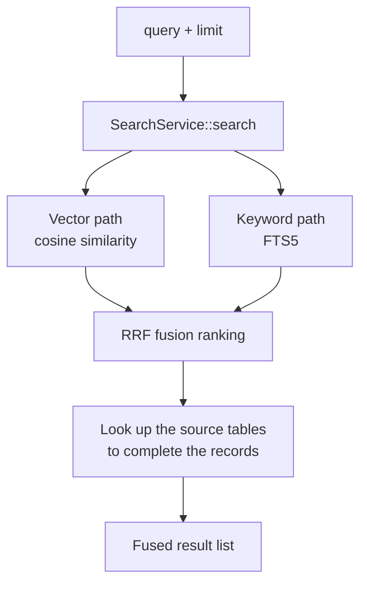
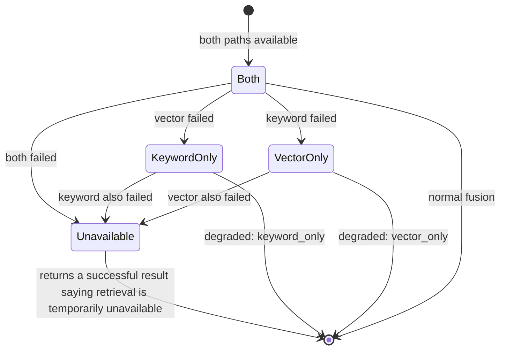

# Retrieval and vector search

The `retrieval` bounded context owns two distinct searches: a host-level cross-session **memory** pool (vector + FTS), and a per-workspace **code index** (Tree-sitter + FTS + vectors). Both degrade gracefully and never fail a generation because of a search error.

## Shared host-level memory pool

Retrieval searches the same host-level memory pool that recency-based memory injection draws from (`agent-memory-shared-pool`). Recall is **not** restricted by agent id or workspace folder. Agent id and workspace folder are recorded on an index row as provenance only and are not exposed as recall tool input:

- A memory saved under a different agent is recallable from any agent's session.
- Recall never returns a strict subset of what memory injection already placed in the system prompt.
- The recall tool input schema exposes exactly `query` and `limit` — no agent id, folder, or scope parameter, because the shared pool has no slice for the model to name.

## Graceful degradation

Retrieval failure never fails a generation. The tool returns a successful result describing unavailability:

- Embedding provider unreachable during search → keyword-only results marked `degraded: keyword_only`.
- FTS5 query fails → vector-only results marked `degraded: vector_only`.
- Both paths execute and neither returns a hit → an empty result list, not an error.

## Workspace code index

The persistent code index is workspace-scoped: workspace identity, file manifests, chunks, symbols, vectors, and bounded local audit records. The native worker performs metadata-first reconciliation and reads or parses only new or changed files. Tree-sitter grammars, chunking queries, and redaction policy share a version marker. Workspace-code embedding is gated by an explicit confirmation tied to workspace id, generation, provider profile, and model. FTS remains workspace-scoped and available before confirmation; vectors from another workspace or model are never candidates.

## The retrieval flow and degradation

`SearchService::search` is the single entry point for recall. It runs two independent retrieval paths in parallel — a vector path on cosine similarity and a keyword path on FTS5 — fuses their results into one ordering with Reciprocal Rank Fusion (RRF), and finally looks the records back up in the source tables to complete them. The two paths do not depend on each other, so a failure in one does not affect the other.

Degradation is decided by which path failed. The state diagram below enumerates every combination and its effect on the tool result. The case worth noticing is both paths failing: it still returns a **successful** tool result whose content is "retrieval is temporarily unavailable", rather than handing the generation a tool error.

A few implementation constraints that are easy to misread:

- **Difference reconciliation rather than dual writes on save** — the two paths maintain no "write one, synchronously write the other" contract. Instead they reconcile the difference at retrieval time, filling in whichever side is missing an entry, rather than forcing a dual write during save. That keeps a strong consistency coupling off the write path.
- **Only the same model is comparable** — vector similarity is meaningful only under one embedding model. Once a workspace or the global setting changes embedding model, the old vectors are requeued and regenerated under the new model rather than being ranked alongside the old ones.
- **The background worker's cadence** — the embedding background task processes in batches of `EMBEDDING_BATCH_SIZE = 32`, retries an individual item at most `MAX_EMBEDDING_ATTEMPTS = 5` times, and polls the pending-embedding queue roughly every 300 seconds. These parameters affect only how fast entries land in the background, not the availability of the retrieval path itself.

## Key types and constants

### The SearchService::search flow

`SearchService::search` is the single entry point for recall, in four fixed steps: `truncate_for_embedding` truncates the query to an 8000-character ceiling, so the excess never reaches the embedding → the vector path `vector_ranking` orders by cosine similarity → the keyword path runs FTS5 → `fuse_with_rrf` merges the two with Reciprocal Rank Fusion (`smoothing = 60`) → the source tables are looked up to complete the records.

### Degradation

The `Degradation` enum covers three states: `None`, `KeywordOnly`, and `VectorOnly`. When both paths fail, the service returns `Err(Unavailable)`, and the tool result is not an error but a successful result whose content is "retrieval is temporarily unavailable".

### Indexing and deduplication

`reconcile` fills in whichever side is missing at retrieval time rather than forcing a dual write during save. `content_hash` deduplicates entries with identical content. Entries that remain in the index after their source row is gone are removed by orphan cleanup.

### Constants

| Constant | Value | Meaning |
| --- | --- | --- |
| `EMBEDDING_BATCH_SIZE` | `32` | Background embedding batch size |
| `MAX_EMBEDDING_ATTEMPTS` | `5` | Maximum retries for a single item |
| `RETRY_BACKOFF_SECONDS` | `[1, 4, 15, 60, 300]` | Retry backoff intervals, one per attempt |
| `RECONCILE_POLL_INTERVAL_SECONDS` | `300` | How often the worker polls the pending-embedding queue |

### Model consistency

Vector similarity is meaningful only under one embedding model. The vector store records its model identity, and once a workspace or the global setting changes embedding model, `requeue_stale_model` requeues the old vectors for regeneration under the new model and never ranks them alongside the old ones.

### Tool separation

The `recall` tool searches the memory pool only, and the `search_code` tool searches the current workspace code index only. `CodeSearchService` skips the vector path in local mode and does **not** mark the result `degraded`, because having no embedding configuration locally is the expected state rather than a degradation. With no embedding configuration, the `recall` tool does not enter the tool catalog at all, so the model never sees it.

## Where the design lives

This chapter orients contributors. The authoritative requirements live in the specs.

- [openspec/specs/retrieval-vector-search](../../../openspec/specs/retrieval-vector-search/spec.md) — shared memory pool, recall tool, degradation.
- [openspec/specs/workspace-code-indexing](../../../openspec/specs/workspace-code-indexing/spec.md) — workspace code index, reconciliation, embedding confirmation.

The `retrieval` bounded context is described in [Native bounded contexts](native-contexts.md).
