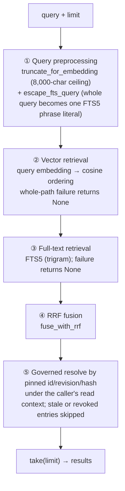

# Retrieval and vector search

The `retrieval` bounded context owns **two independent search chains**: cross-session memory recall (the `recall` tool) and workspace code search (the `search_code` tool). They share the fusion algorithm and the degradation philosophy, but their data sources, scoping, availability conditions, and privacy boundaries differ, so this chapter describes them separately. The shared iron rule: **a retrieval failure never fails a generation** — the tool layer turns unavailability into a successful soft result.

## The two chains side by side

| | Memory recall (`recall`) | Code search (`search_code`) |
| --- | --- | --- |
| Data source | The `personalization` compatibility view (active + global + all-Agents memories) | The per-workspace code index (Tree-sitter chunks — see [Tree-sitter code indexing](tree-sitter-code-indexing.md)) |
| Index | Vector + FTS5, one host-level pool | FTS5 always; vectors only in semantic mode after confirmation |
| Scope | Host-level; narrowed memories are absent from the pool entirely (see [Cross-session memory](cross-session-memory.md)) | The current session's workspace, determined implicitly by the trusted runtime |
| Availability | Vector embedding configured (otherwise the tool never enters the catalog) | The workspace's index enabled and its phase not `Unavailable` |
| Privacy boundary | Deleted memories are dropped at source lookup, never leaked | Index and results are redacted text throughout |
| Degradation | `keyword_only` / `vector_only` / a soft "temporarily unavailable" | Same; local mode has no vectors and is **not** a degradation |

## The memory recall chain

### The query flow: five stages, run sequentially

`SearchService::search` (`retrieval/application/search_service.rs`) is the single recall entry point. **The two retrieval paths are called sequentially, not in parallel** — vector first, then keyword; a failure in either does not affect the other, but they run one after the other on the same thread:

- **① Preprocessing** — the 8,000-character truncation applies to **both paths**: the truncated text goes to the embedding and to FTS alike (the FTS side is two characters longer because the whole string is wrapped in quotes). The query is model-authored; without truncation an over-long query would break the embedding call outright. FTS escaping literalizes `OR`/`NEAR`/`*` and the rest of the query syntax so the meaning cannot drift and the statement cannot error.
- **②③** — each path over-fetches to `limit × 4`. `None` means "this whole path is unavailable"; an empty `Vec` means "available, no hits" — different semantics.
- **④** — Reciprocal Rank Fusion merges the two orderings.
- **⑤ Governed resolve** — only the fused candidate ids are handed to the caller-supplied `AuthorizedHitResolverPort`, which reads each authoritative record at the revision and hash the authorization relation pinned (never a full-table snapshot — a test pins this), and **a hit whose record is gone, moved, re-scoped or revoked is dropped**, which is what stops a deleted or narrowed memory leaking from a surviving index row. `take(limit)` runs **after** the dropping, so deleted entries never waste a slot. **The final count can still be under `limit`**: too few candidates, or several candidates' sources are gone.

### Degradation and the error boundary

| Situation | Typed layer | Agent tool layer |
| --- | --- | --- |
| Vector path fails (embedding unreachable, …) | `degraded = KeywordOnly`, keyword results carry on | Success + `degraded: keyword_only` |
| Keyword path fails | `degraded = VectorOnly` | Success + `degraded: vector_only` |
| Both available, neither hits | `Ok`, empty list, no degradation | Success, empty `results` |
| Both paths fail | `Err(RetrievalError::Unavailable)` | A **successful** result: "Memory search is temporarily unavailable. Continue without it." |
| Embedding not configured | `Err(NotConfigured)` | Unreachable — the tool is not in the catalog |

The lower layers use typed errors to keep "cannot search" apart from "nothing found"; the tool layer (`execute_recall`) softens everything except an empty query into a successful result — the model must never read "search failed" as "no such memory exists".

### Tool contract and availability

- `recall`'s input is exactly `query` + `limit` (default 5, clamped 1–20); no agent, folder, or scope parameter — the read domain is the `MemoryReadContext` the generation snapshot froze (see the read-boundary section of the cross-session memory chapter), and any scope field the model adds is ignored.
- **Two gates**: the catalog omits `recall` for a session that may not read; execution (`execute_recall`) returns the existing "temporarily unavailable" success result when no usable read context is present, without a query embedding or any pool access.
- **Authorization before ranking**: `RetrievalApi::search_authorized(query, limit, authority, resolver)` is the only entry point; there is no context-free variant. `authority` is the complete eligible-metadata relation personalization enumerated (an incomplete relation is refused, never searched), the repository materializes it as a query-local temp table, and vector rows are filtered before loading/scoring and FTS rows before rank/LIMIT, so an excluded record can never take a slot from a valid hit. `resolver` is bound to the same context and re-reads each fused candidate at its pinned revision/hash; deleted, edited, or revoked entries are absent.
- **With no embedding configured, `recall` is not registered into the tool catalog** (`resolve_tool_catalog` injects it only when `is_configured()`), so the model never sees it; **memory index injection and relevance-selected bodies do not depend on retrieval configuration and keep working**.
- **Index coverage is not egress authorization**: the background source enumerates every valid active record (workspace-scoped and audience-restricted included) into the local FTS index; records without egress authorization stay in the `keyword_only` state, never enter the embedding queue, and the worker re-checks each queued body against the authoritative record through `EmbeddingEgressGuardPort` right before dispatch. The status page reports `keywordOnly` separately from `pending`.
- Each hit handed to the model carries only `content`, `created_at`, and `matched_via` (vector/keyword/both); `source_id`, scores and the pinned memory identity are internal — no decision value to the model, raw hallucination material if included. The model also never learns the existence, titles or count of excluded records.

### Index maintenance: background reconciliation, never on the query path

**"The query repairs both indexes as it runs" is wrong.** Saving a memory does not dual-write the retrieval index (avoiding the silent "enqueue failed → never searchable" hole); a background worker reconciles the retrieval index against the authoritative source (`IndexingService::reconcile`: take the authoritative snapshot, fill the missing side of the difference, remove orphan rows whose source is gone). A new memory is searchable after at most one cycle, and historical memories are backfilled for free.

The worker's cadence is **event-driven first**: saving configuration, rebuilds, and similar operations wake it immediately through `notify()`; `RECONCILE_POLL_INTERVAL_SECONDS = 300` is only the **fallback wait when no wakeup arrives** (`recv_timeout(300s)`), not a "regular 300-second poll" as the primary mechanism. Backoff waits also listen for wakeups.

- `content_hash` exists for **per-entry change detection**: on upsert, an unchanged hash keeps the `indexed` state and avoids a pointless re-embed. It is **not** global cross-source deduplication.
- Embedding batches of `EMBEDDING_BATCH_SIZE = 32`; at most `MAX_EMBEDDING_ATTEMPTS = 5` per item with backoff `[1, 4, 15, 60, 300]` seconds.
- **Only the same model is comparable**: the vector store records its embedding-model identity, and a model change makes `requeue_stale_model` requeue old vectors for regeneration — never ranked alongside the new ones.
- When the authoritative source is unreadable, the index source reports storage unavailability rather than an empty snapshot — reconciliation would treat an empty snapshot as "everything was deleted" and silently wipe the index.

### The logging boundary

The recall query path **currently emits no unified-log records at all** — raw queries and recalled bodies naturally never land on disk, and there are no hash/duration query metrics either. The worker's batch and reconcile logs carry only counts, durations, and error **categories** (error payloads may quote storage-layer text; the design allows only the category on disk). If query-path logging is ever added, the boundary is: query hash, length, duration, result count, and degradation state — never the text.

## The workspace code search chain

`CodeSearchService` searches the current workspace's code index with the same two-path RRF fusion and by-id source lookup; the differences:

- **Scope** — per workspace; the workspace comes implicitly from the session via the trusted runtime, never from the model.
- **Local mode** — FTS only, **skipping the vector path without marking `degraded`**: no local embedding configuration is the expected state, not a degradation.
- **Semantic mode with confirmation missing or invalidated** — the local FTS index stays available while the semantic channel sits in the frontend-derived `unconfigured`/`awaiting_confirmation` states; search degrades to `keyword_only`. A vector-path runtime failure lands on `keyword_only` as well.
- Index construction, admission, redaction, and embedding confirmation are covered in [Tree-sitter code indexing](tree-sitter-code-indexing.md).

## Where the design lives

The authoritative requirements live in the specs; this chapter describes the current implementation.

- [openspec/specs/retrieval-vector-search](../../../openspec/specs/retrieval-vector-search/spec.md) — memory recall, degradation, source-lookup dropping.
- [openspec/specs/workspace-code-indexing](../../../openspec/specs/workspace-code-indexing/spec.md) — the code index, reconciliation, embedding confirmation.

The `retrieval` bounded context is described in [Native bounded contexts](native-contexts.md); memory production, governance, and injection in [Cross-session memory](cross-session-memory.md).
