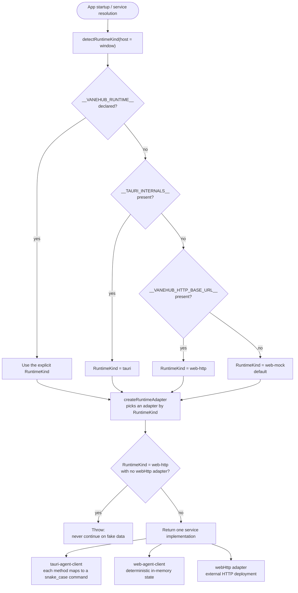

# Runtime and service boundaries

React components depend on typed frontend services. They must not import Tauri `invoke()` or open SQLite, spawn CLIs, or inspect the local filesystem directly.

## Desktop path

1. A component calls a service interface.
2. The Tauri frontend adapter maps the request to a declared command.
3. A thin Rust command validates and maps transport DTOs.
4. The owning native application service performs the use case through injected ports.
5. Infrastructure adapters perform SQLite, process, filesystem, network, or OS work.

Potentially slow work returns an operation identity before completion and exposes progress through the operations boundary.

## Web/mock path

The Web adapter implements the same frontend contract with deterministic in-memory state. It may simulate execution and timing for UI development, but it must not claim that a local process ran, SQLite changed, or an operating-system action occurred.

## Adding a capability

- Extend the runtime-independent service interface first.
- Implement both the Tauri and Web/mock adapters when the UI consumes the capability.
- Keep provider-specific launch behavior behind Agent Runtime infrastructure.
- Keep user-visible errors localized and native diagnostics in the unified redacted log pipeline.

The TypeScript model contract generation decision (`ts-rs`) is recorded as ADR-005 in `src-tauri/ARCHITECTURE.md`. The earlier single-CLI chat runtime narrative has been superseded by the multi-Agent group chat runtime (`openspec/specs/multi-agent-group-chat/`).

## Runtime selection and adapters

The frontend does not sniff its host environment at the call site. Each service picks one implementation once at startup through `createRuntimeAdapter`, and the whole call chain then goes through that chosen adapter. `detectRuntimeKind` is the single decision point for that dispatch, in a fixed order: the explicit `__VANEHUB_RUNTIME__` declaration first (for test and debug overrides), then the presence of `__TAURI_INTERNALS__` for the desktop Tauri runtime, then the presence of `__VANEHUB_HTTP_BASE_URL__` for a web-http deployment, and finally a fallback to the default web-mock.

The web-http branch requires the caller to have registered a `webHttp` adapter for that service. When one is missing, `createRuntimeAdapter` throws rather than silently falling back to web-mock — continuing with fake data on a host that has declared itself a real deployment would disguise a silent error as business success.

`AgentService` is a very large aggregate interface spanning Agent lifecycle, sessions, MCP, tools, IM, extensions, permissions, the Work Board, SDKs, SSH connections, and more. Each subdomain has a matching `runtime-*-client.ts` file that calls `createRuntimeAdapter` itself, passing a paired Tauri implementation and Web/mock implementation. The two implementations must stay interface-compatible — a new capability changes both `tauri-agent-client.ts`, where each method maps to a snake_case Tauri command, and `web-agent-client.ts`, which simulates the same semantics with deterministic in-memory state.

The constraints that matter:

- **A singleton `agentService`** is constructed once while the frontend module graph resolves. Components never `new` one themselves.
- **Components depend through hooks** — React components depend only on the hooks exposed by `src/hooks/` and the interface in `src/services/agent-service.ts`. They do not import `tauri-agent-client` or `web-agent-client` directly, and they do not call `invoke()`.
- **The desktop readiness marker is unconditional** — `main.tsx` sets `root.dataset.vanehubBootstrap="ready"` after render in every runtime (Tauri, web-mock, and web-http). The only desktop-specific conditional is `if (import.meta.env.VITE_DESKTOP_E2E === "1")`, which loads `@wdio/tauri-plugin` and registers the `vanehubFatalError` listener. There is no `desktop_ready` or `report_desktop` native command — readiness is a dataset marker, not something reported to native code.
- **web-http without an adapter must throw** — this is the gate that stops a production deployment from silently degrading to fake data. A new service with no real backend under a web-http deployment should throw on the web-http branch rather than fall back to web-mock.

## Key files and contracts

### Runtime detection

`detectRuntimeKind()` in `src/services/runtime-adapter.ts` is the single decision point for runtime dispatch, judged in a fixed order: the explicit `__VANEHUB_RUNTIME__` declaration (for test and debug overrides) → the presence of `__TAURI_INTERNALS__` for the desktop Tauri runtime → the presence of `__VANEHUB_HTTP_BASE_URL__` for a web-http deployment → falling back to the default web-mock when none matches.

### Adapters

`createRuntimeAdapter()` binds one of three adapter sets according to the selected `RuntimeKind`: `tauri`, `webHttp`, or `webMock`. The `web-http` branch requires the caller to have registered a `webHttp` adapter for that service, and throws when one is missing rather than silently landing on `web-mock`.

### The AgentService aggregate interface

`AgentService` in `src/services/agent-service.ts` is a very large aggregate interface spanning Agent lifecycle, sessions, MCP, tools, IM, extensions, permissions, the Work Board, SDKs, and SSH connections. Each subdomain has a matching `runtime-*-client.ts` file that calls `createRuntimeAdapter` itself, passing the paired implementations.

### Paired implementations

- `tauri-agent-client.ts` — each method maps to one snake_case Tauri command.
- `web-agent-client.ts` — the same semantics simulated with deterministic in-memory state.

The two must stay interface-compatible, so a new capability changes both.

### The singleton and the dependency path

The singleton `agentService` is constructed once in `runtime-agent-client.ts` while the module graph resolves; components never `new` one. React components depend only on the hooks exposed by `src/hooks/` and the interface in `src/services/agent-service.ts` — never importing `tauri-agent-client` or `web-agent-client` directly, and never calling `invoke()`.

### The desktop readiness marker

Desktop readiness is handled in `main.tsx`: after render it unconditionally sets `root.dataset.vanehubBootstrap="ready"`, in all three runtimes (Tauri, web-mock, web-http). There is no command reporting "desktop ready" to native code. The only desktop-specific conditional is `if (import.meta.env.VITE_DESKTOP_E2E === "1")`, which loads `@wdio/tauri-plugin` and registers the `vanehubFatalError` listener. That constraint is verified by `desktop-instrumentation-boundary.test.ts`.

## Child-process communication: headless commands and JSON-RPC over stdio

As a host process, the VaneHub AI desktop client spawns several **headless child processes** — no window, no UI, running in the background and communicating over stdio or HTTP. Those children fall into two communication modes, and this project chooses between them per subsystem.

### The two modes compared

| Dimension | Headless command + streaming stdout parsing | JSON-RPC over stdio |
| --- | --- | --- |
| Shape | The child runs as a headless command and the parent parses its native stdout stream | The child runs headless and parent and child exchange JSON-RPC 2.0 messages framed by a `Content-Length` header |
| Protocol | None — parsed line by line or record by record in each CLI's own output format | A protocol — standard JSON-RPC, structured as method / id / params |
| Message format | Text or JSONL defined by each CLI | `Content-Length: <len>\r\n\r\n` followed by a JSON-RPC body, the same framing as LSP |
| Use of stderr | Available for diagnostic logging | Reserved for logging; **it must not pollute the stdout protocol stream** |
| When it applies | The child is an existing CLI that implements no standard protocol | The child implements a JSON-RPC protocol (an LSP server, an MCP server) |

**Headless mode** means the child starts no GUI and runs entirely in the background, with input and output over stdio, network, or IPC rather than a UI — low resource use, programmatically drivable, and suited to local parent-child processes or server deployment.

**JSON-RPC over stdio** means the parent spawns a headless child, sends JSON-RPC requests over stdin, receives responses over stdout, and keeps stderr for logging.

**It names a transport, not a protocol.** LSP and MCP each define their own stdio binding in their own specification, and the framing rules differ: LSP declares the byte length of the JSON that follows with a `Content-Length` header separated from the body by `

` (`lsp_framing.rs`), while MCP delimits each message with a **newline** (`read_bounded_frame` in `relay_jsonrpc.rs` scans for `
`). Implementing an MCP transport the way LSP frames its messages fails outright.

The constraint both share is that **application logging must go to stderr** — printing to stdout breaks the framing.

> Earlier revisions used "ACP-stdio" as a generic label for this transport. That was wrong: ACP names the Agent Client Protocol, a different protocol. LSP is not ACP, MCP is not ACP, and this project does not implement ACP.

### What this project uses

This project **mixes the two modes by subsystem**:

| Subsystem | Mode | Implementation |
| --- | --- | --- |
| CLI Agents (claude-code and the rest) | **Headless command + streaming stdout parsing** | Each CLI starts through its **headless command contract** — non-interactive, programmatically drivable, streaming. `ProviderOutputFramer` parses stdout in each vendor's native format and normalizes it into chat events such as `started`, `token`, `thinking`, `tool_use`, `completed`, `failed`, and `cancelled`. The prompt is delivered over stdin in preference to a command-line argument |
| LSP code intelligence | **JSON-RPC over stdio (LSP binding)** | The LSP server starts as a headless child and parent and child speak standard LSP JSON-RPC. `lsp_framing.rs` frames with `Content-Length: {}\r\n\r\n`, and `json_rpc_actor.rs` handles request-response pairing and `$/cancelRequest` |
| MCP servers | **JSON-RPC over stdio (MCP binding)** | The MCP server starts as a headless child (`relay_stdio` / `bounded_stdio`) speaking JSON-RPC 2.0, with `relay_jsonrpc.rs` parsing newline-delimited `jsonrpc: "2.0"` frames. Claude Code and Codex CLI additionally go through the relay (`--vanehub-mcp-relay`), proxied by VaneHub AI |

**Why CLI Agents do not use JSON-RPC over stdio**: the coding CLIs — claude-code, codex-cli, gemini-cli, and the rest — expose no JSON-RPC interface. Each has its own native output format, so no standard JSON-RPC contract can be assumed. CLI Agents therefore use headless commands plus parsing customized per vendor through `output_parser_for(agent_id)`, respecting each CLI's existing contract rather than imposing a protocol on it.

**Why LSP and MCP do use JSON-RPC over stdio**: both have a standardized JSON-RPC protocol and each specification defines a stdio transport, though with different framing (see above). Local parent-child communication needs no port and no network stack, starts and tears down simply, and isolates processes cleanly — a good fit for a desktop Agent host.

### Common pitfalls

- **Confusing stderr and stdout** — under JSON-RPC over stdio, application logging must go to stderr. Writing to stdout breaks the framing.
- **Line endings** — protocol headers must use `\r\n`, consistently across platforms.
- **Abnormal child exit** — the parent must watch for child exit and apply a restart budget (`restart_budget`) with error reporting, through the LSP `Backoff` and `Failed` state machine and the MCP `RelayFailure` path.
- **Buffering** — stdio is line-buffered, and UTF-8 split across reads must be reassembled with `take_decodable_utf8`, as the CLI Agent terminal does.

The authoritative definition of the service boundary and runtime selection lives in `openspec/specs/frontend-runtime-architecture/spec.md` and `src-tauri/ARCHITECTURE.md`.
