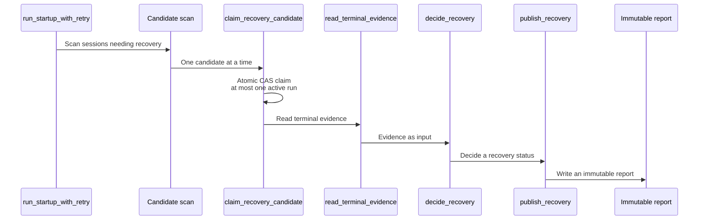
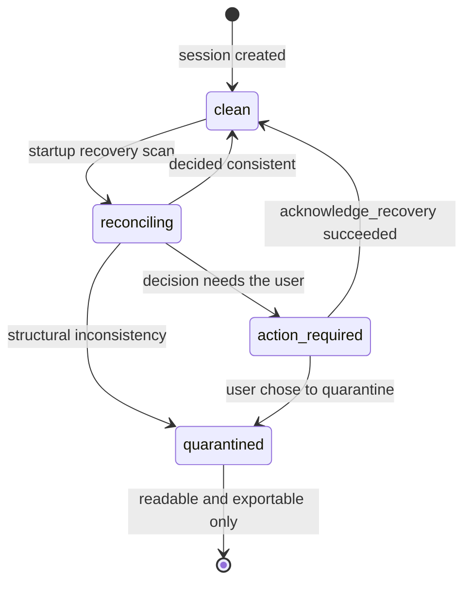
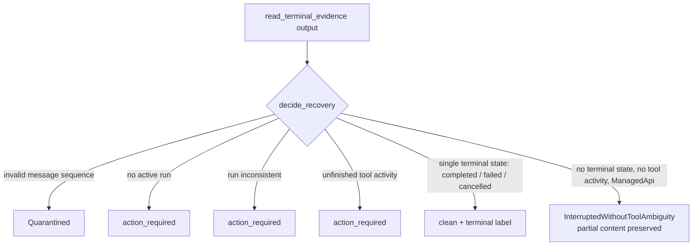

# Session recovery

Managed generations are durable: a session can be safely resumed after a crash, an interrupted tool-use loop, or a structural inconsistency, without losing evidence or double-executing work. Recovery status is tracked **independently** from the session's lifecycle state.

## Recovery status is orthogonal to lifecycle

Every durable session carries a recovery status of `clean`, `reconciling`, `action_required`, or `quarantined`:

- A `failed` session with recovery `clean` and no active run still accepts a new message.
- An `idle` session with recovery `action_required` rejects new generation work on every managed submission path until an allowed recovery action succeeds.
- A `quarantined` session — a stable structural inconsistency that cannot be reconciled without risking evidence loss — stays readable and exportable but rejects generation or mutation that depends on the inconsistent state.

## Durable execution identity and ownership

Every accepted managed generation has one stable execution run id correlated with its session and persisted messages. Before provider or CLI execution begins, the session atomically claims **at most one** active execution run. A competing claim while a run is active is rejected without starting work.

## The recovery flow

Startup recovery is driven by `run_startup_with_retry`, which scans candidate sessions, makes one atomic claim per candidate, reads terminal evidence, decides a recovery status, and finally publishes the recovery result and writes an immutable report. The whole path is decoupled from the generation path: it only clears `active_run`, sets a marker, and writes a report. **It never replays work automatically.**

Recovery status lives in its own `recovery_status` column, and the state machine below enumerates every reachable state:

The key decisions in `decide_recovery` follow. Note that a single terminal state lands on `clean` with the matching terminal label, while a `ManagedApi` case with no terminal state and no tool activity keeps its partial content and is marked `InterruptedWithoutToolAmbiguity`.

**Why recovery is orthogonal to lifecycle**: recovery status lives in its own `recovery_status` column and is never conflated with the session's `idle`, `active`, or `failed` lifecycle state. A `failed` session with `recovery_status = clean` still accepts new messages; an `idle` session with `recovery_status = action_required` is rejected on every managed submission path until a recovery action succeeds.

**Why it clears without replaying**: a recovery action at most clears `active_run`, sets a recovery marker, and writes an immutable report. **It never retries** a generation or tool call that was already dispatched. That avoids repeating side effects under an uncertain terminal state — once the evidence is insufficient to tell whether a run completed, the correct move is to hand the decision back to the user rather than guess a state and keep going.

**The user acknowledgement mechanism**: `acknowledge_recovery` requires the supplied revision to match the session's current revision, which prevents acknowledging a stale state when a new change landed after the recovery scan. The acknowledgement itself does **not** clear the uncertain recovery effect — it only advances `recovery_status` from `action_required` to `clean`, making the judgment of whether to accept the recovery's final effect explicitly the user's.

## Key types and constants

### SessionRecoveryStatus

The recovery status enum carries four values: `clean`, `reconciling`, `action_required`, and `quarantined`. It lives in its own `recovery_status` column, separate from the session lifecycle state. The accompanying columns are `recovery_revision` (the recovery-side revision, used as an optimistic concurrency check on acknowledgement), `state_revision` (the session state revision), `history_revision` (the message history revision), and `active_execution_run_id` (the currently claimed active execution run id).

### Candidate scan

`recovery_candidates_after` selects the sessions needing recovery. A candidate is not `archived`, has `recovery_status NOT IN (action_required, quarantined)`, and satisfies at least one of: `active_execution_run_id IS NOT NULL`, a lifecycle of `starting` or `running`, or `recovery_status = 'reconciling'`.

### Atomic claim

`claim_recovery_candidate` performs an optimistic concurrency claim: a conditional `UPDATE` takes a candidate, and returns `None` when the condition does not hold, which the caller treats as stale and skips. That guarantees two recovery workers never claim the same candidate at once.

### Terminal evidence

`SessionTerminalEvidence` carries the terminal evidence under two ceilings: at most 256 messages and at most 32 operations. `ExecutionEvidenceFidelity` marks how visible that evidence is, with three values: `ManagedApi` (a direct API call, high visibility), `ManagedCliOpaque` (CLI-wrapped but managed), and `InteractiveOpaque` (interactive and opaque).

### The order of decisions in decide_recovery

`decide_recovery` judges in the following order, returning on the first match:

1. Storage transiently inconsistent → `RetryLater`
2. A live handle exists → `RetryLater`
3. Invalid message sequence → `Quarantined`
4. No active run → `action_required`
5. Run inconsistent → `action_required`
6. No assistant message → `action_required`; more than one assistant message → `Quarantined`
7. Unfinished tool activity → `action_required`
8. A single terminal state → `clean` plus the terminal label (`completed`, `failed`, or `cancelled`)
9. Multiple conflicting terminal states → `action_required`
10. No terminal state, no tool activity, `ManagedApi` → `InterruptedWithoutToolAmbiguity`, preserving partial content
11. CLI opaque (`ManagedCliOpaque` or `InteractiveOpaque`) → `action_required`

### acknowledge_recovery

Acknowledgement requires the supplied `expected_recovery_revision` to match the current `recovery_revision`, and otherwise returns `RecoveryRevisionConflict` or `RecoveryActionNotAllowed`. The acknowledgement clears no uncertain recovery effect and retries no work.

### Canonical Run recovery

`reconcile_startup` performs startup recovery for canonical Runs: a Run with a live lease is skipped, because it is still running and needs no recovery; otherwise the decision results of its child sessions are aggregated.

### Idempotence

`run_until_drained` advances a cursor batch by batch. The cursor `after_session_id` is an in-memory loop variable updated after each batch, and is not persisted between batches. When storage is temporarily unavailable during a scan, that batch's candidates are marked `deferred` rather than dropped. `run_startup_with_retry` runs a first pass with `RecoveryTrigger::Startup`, and only runs a second pass with `RecoveryTrigger::ExplicitRetry` when the first reported `deferred > 0` because storage was temporarily unavailable, which keeps the whole path idempotent.

## Where the design lives

This chapter orients contributors. The authoritative requirements — recovery status, durable execution identity and ownership, and the allowed recovery actions — live in the spec.

- [openspec/specs/session-recovery](../../../openspec/specs/session-recovery/spec.md)

Session durability sits in the `sessions` bounded context; see [Native bounded contexts](native-contexts.md).
