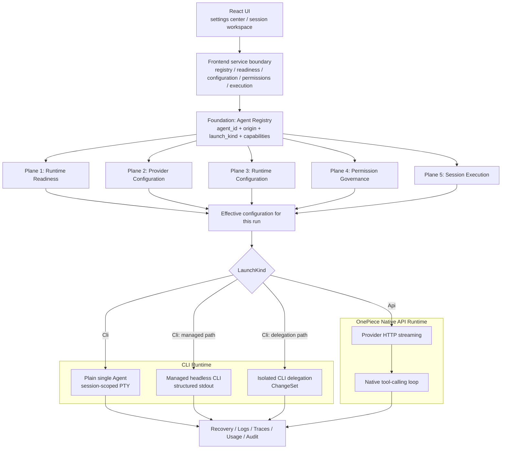

# Single-Agent governance: the five control planes

Single-Agent management in VaneHub AI is not "one launch button wrapped around five CLIs". It is a unified governance surface that puts external vendor CLIs and the built-in OnePiece Agent into one shared system of Agent identity, configuration, permissions, sessions, memory, observability, and recovery.

This chapter presents the analytical model for that governance surface: one foundation layer plus five control planes. **It is a responsibility model, not a code structure** — the five control planes map neither to five Rust bounded contexts nor to five pages; the current code is split by business ownership across `agent_runtime`, `sessions`, `tooling`, `permissions`, and other contexts (see [Native bounded contexts](native-contexts.md)).

```text
0. Agent Registry
   └── stable agent_id, LaunchKind, Capabilities, Availability

1. Runtime Readiness
   ├── CLI: installation, discovery, version, source, PATH, conflicts
   └── OnePiece: active profile, credential, endpoint, model, provider availability

2. Provider Configuration
   ├── CLI: managed global provider configuration per CLI
   └── OnePiece: in-app provider profiles and credential lifecycle

3. Runtime Configuration
   ├── CLI: typed argv, env, chat/interactive parameters
   └── OnePiece: HTTP request, context budget, retrieval, compaction, generation parameters

4. Permission Governance
   ├── CLI: launch-flag projection, environment variables, hooks, MCP relay
   └── OnePiece: native per-tool-call adjudication in-app

5. Session Execution
   ├── Plain single-Agent CLI: session-scoped PTY / Agent Terminal
   ├── Managed CLI: headless subprocess with structured output parsing
   └── OnePiece: HTTP streaming + native tool-calling loop
```

Six core conclusions to remember first:

1. **OnePiece is not "a sixth CLI"**. It is a built-in native Agent with `LaunchKind::Api`; the five external tools are `LaunchKind::Cli`. They share the upper governance contracts but not the underlying execution mechanism.
2. **The primary execution shape of a plain single-Agent CLI session is a session-scoped PTY / Agent Terminal**. Re-entering the same session prefers attaching to the retained process and replaying bounded terminal content, rather than unconditionally spawning a new headless subprocess.
3. **The headless CLI runtime, the plain PTY session, and CLI delegation are three different paths**. The headless path serves managed chat, multi-Agent, and Loop structured execution; CLI delegation serves only isolated analysis/editing and the ChangeSet pipeline, and must not be conflated with a plain single-Agent session.
4. **The five control planes are an architectural analysis model** that cuts across multiple bounded contexts and pages.
5. **Permission "unification" means unified decision semantics, not unified enforcement precision**. OnePiece can adjudicate natively before every tool call; Claude Code has both launch-flag projection and a `PreToolUse` hook; the other CLIs mainly rely on native launch parameters, environment variables, or the MCP relay, with black-box boundaries remaining inside them.
6. **Provider/model, plain runtime parameters, permission parameters, and runtime-reserved parameters must keep strict field ownership isolation**. The plain CLI parameter page must never emit sandbox, approval, session id, resume, output format, or any other policy- or runtime-managed parameter.

## Core terminology

| Term | Meaning |
| --- | --- |
| Agent | Stable identity with a persistent `agent_id`; the display name is not a runtime routing key |
| Provider Profile | The configuration object that decides endpoint, interface format, model, and credential reference |
| Runtime Configuration | The plain parameters shaping one launch or generation; never owns permissions or session ids |
| Permission Policy | Resolves an Agent's operation on a resource into `Allow`, `Deny`, or `Ask` |
| Session | Long-lived conversation container, bound to one Agent and one workspace at creation |
| ExecutionRun | One managed execution triggered by one user message; many runs belong to one session |
| AgentTerminal | The session-scoped interactive PTY used only by CLI Agents; not OnePiece's carrier and not an ExecutionRun |
| Provider Runtime Session ID | The CLI's own session/thread/conversation id; not the VaneHub session id, never valid across CLIs |

## Unified architecture overview



### What to unify, and what not to

Unify: stable Agent identity; availability and capability expression; provider/profile configuration entry points; the schema and provenance display of plain runtime parameters; permission principals and `Allow/Deny/Ask` semantics; sessions, execution runs, recovery; the governance entry points for Skills, MCP, and Memory; logs, traces, usage, audit.

Do not force-unify: CLI installation sources versus the native API runtime; PTY byte streams versus HTTP SSE/JSON streams; a CLI's own OAuth versus OnePiece API keys; native CLI sandbox/approval versus OnePiece native tool calls; each vendor's resume syntax; the observability fidelity of each runtime.

## Foundation: the Agent Registry

| Agent | Stable `agent_id` | `LaunchKind` | Execution carrier |
| --- | --- | --- | --- |
| OnePiece | `onepiece` | `Api` | In-app HTTP + tool loop |
| Claude Code | `claude-code` | `Cli` | `claude` CLI |
| Codex CLI | `codex-cli` | `Cli` | `codex` CLI |
| Gemini CLI | `gemini-cli` | `Cli` | `gemini` CLI |
| OpenCode | `opencode` | `Cli` | `opencode` CLI |
| Antigravity CLI | `antigravity-cli` | `Cli` | `agy` CLI |

The Agent Registry owns identity; the provider registry resolves the stable id into runtime behavior. Upper-layer session services must not branch on display names, nor repeat `if agent_id == "claude-code"` checks in multiple places; when no compatible provider is registered the correct outcome is `unsupported-provider`, never a silent fallback to another Agent. Callers must rely on the capability tags declared in provider metadata rather than guessing capabilities from an Agent's name.

Availability states (`Available`, `NeedsAuthentication`, `Unavailable`, `Unknown`) and capability declarations are detailed in [Agent lifecycle and provider runtime](agent-lifecycle.md).

## Plane 1: Runtime Readiness / CLI management

> This plane answers: does the carrier required to run this Agent exist, is it trusted, and is it executable?

Responsible for: CLI installation discovery, absolute executable paths, version and source, PATH hit relationships, multi-installation conflicts, install/upgrade/uninstall plans, run preconditions; for OnePiece, the active profile, credential, endpoint, and model readiness.

Not responsible for: per-run model overrides, reasoning effort, file-write permission, session creation, resume ids, the tool-calling loop.

Key invariants (see [CLI lifecycle and global configuration](cli-lifecycle.md)):

- CLI definitions are compile-time constants, not a runtime plugin registry;
- discovery never recursively scans whole disks, distinguishes the actual PATH hit from the backend-recommended installation, and launches resolve to absolute paths;
- `path_selected_installation_id` and `recommended_installation_id` may differ, and the UI must show both — otherwise "one copy got upgraded but the command still hits another" goes unnoticed;
- conflicts are structured entries whose `blocksLaunch` / `blocksMutation` come from the backend;
- installation mutations must go through a one-shot, time-limited plan bound to an environment fingerprint, with post-action re-detection of actual host state;
- the `changed-but-failed` terminal state means the command failed but the host did change — restoring an old database record must never be presented as rolling back an OS installation.

OnePiece has no PATH, package manager, or executable, so it must not sit in a CLI management card pretending to be "installed". Its readiness chain is: registry entry → active provider profile → structurally valid profile → credential present → endpoint/interface format legal → model selected → credential probe.

## Plane 2: Provider Configuration / Agent configuration

> This plane answers: which provider, endpoint, interface format, and model does this Agent connect to by default, and who holds the credential?

Two authentication paths must be kept apart:

- **Vendor subscription login**: the user completes the CLI's own OAuth/browser login in a normal terminal; the credential is stored by the CLI/vendor, and VaneHub only reads normalized availability — it never takes over subscription passwords or OAuth sessions.
- **VaneHub-managed third-party provider configuration**: pick provider/endpoint/model in settings, write the API key into the operating-system credential service, then apply only the VaneHub-owned fields to the CLI's configuration file.

Core constraints for CLI configuration writes (see [`docs/cli-agent-global-configuration.md`](../../cli-agent-global-configuration.md)): replace only VaneHub-owned fields; build and validate the complete result in memory, then atomically replace the file; backfill currently managed fields before switching profiles; refuse to overwrite on concurrent external edits and report drift; never restart a running CLI automatically after applying configuration. Unmanaged content — hooks, permissions, plugins, MCP servers, comments, unrelated providers — must be preserved verbatim.

The OnePiece provider profile lifecycle (catalog, credential probe, model discovery, atomic activation) is covered in [OnePiece native Agent](onepiece-native-agent.md). Essentials: identity and profile are separate — switching providers creates no new Agent and never changes a session's `agent_id`; at most one profile is active at a time; credentials live only in the OS credential service, never in SQLite.

## Plane 3: Runtime Configuration / CLI parameters

> This plane answers: with the provider decided, which plain behavioral parameters should this launch or generation carry?

Parameters split into three ownership classes, and only the first appears on the CLI parameters page:

| Ownership | Owner | Examples |
| --- | --- | --- |
| `user-editable` | CLI parameters page | model, effort, debug, search |
| `policy-governed` | Permission policies | sandbox, approval, permission mode |
| `runtime-reserved` | Session runtime | session id, resume, output format |

Safety principle: plain parameters may only override plain parameters; the policy layer alone produces policy-governed parameters; the runtime alone produces runtime-reserved parameters. Message-level overrides cover plain fields only (model, reasoning effort, and the like) and never produce permission or runtime-reserved parameters.

The exact meaning of `Inherit` is: **emit no token for this parameter at all**, letting the CLI use its own configuration file or built-in default — `model = Inherit` is not `--model inherit`; it is the absence of `--model`.

`interactive` (session-scoped Agent Terminal / PTY) and `chat` (managed headless CLI runtime) are two scopes; the parameter catalog can support both, but the runtime renders different parameters per scope.

The full per-CLI parameter list is generated from `catalog.v2.json` — never hand-copy it; see the generated [CLI parameter matrix](../../reference/cli/parameter-matrix.md) (regenerate with `npm run docs:matrix:generate`).

OnePiece has no argv and must not appear on the CLI parameters page; its runtime configuration consists of generation parameters, context budget, retrieval, compaction, and tool-catalog parameters (see [OnePiece native Agent](onepiece-native-agent.md) and [Context compaction](context-compaction.md)).

## Plane 4: Permission Governance

> This plane answers: what may this Agent do to which resources right now?

The unified decision model, the four templates, scope resolution, and the approval broker are specified in [the permission model](permission-model.md). This chapter highlights only the structural differences across Agents:

- Permission requests normalize into `principal + action + resource + context`, with the stable `agent_id` as the principal; outcomes are `Allow`, `Deny`, `Ask`, and both unmatched requests and internal failures fail closed to `Ask`.
- **All five CLIs participate in policy-template launch-flag projection** (`POLICY_TEMPLATE_GOVERNED_AGENT_IDS`); Claude Code additionally has the per-call `PreToolUse` hook bridge — a "launch projection + hook" two-layer implementation.
- Permission enforcement fidelity is layered; "same permission template" does not mean "same enforcement precision":

| Level | Meaning | Typical subject |
| --- | --- | --- |
| Native | Operations resolved and executed one by one inside VaneHub | OnePiece native tools |
| Proxied / Hook-Enforced | Calls forwarded through a VaneHub hook/relay | Claude Code hook, MCP relay |
| Launch-Projected | Parameters/env projected only at process start | Template projection for the five CLIs |
| Inferred | Deduced from output or behavior | Some CLI usage/steps |
| Opaque | Invisible inside the CLI | Unbridged internal CLI behavior |

- Every OnePiece tool call passes through the in-app tool loop and can enter the unified permission pipeline before execution; plan mode is a capability ceiling stacked on top of the permission template, and the two intersect (see [Loop runtime and session plan mode](loop-and-plan-runtime.md)).

## Plane 5: Session Execution

> This plane answers: with Agent, configuration, parameters, and permissions decided, how is a session created, run, recovered, cancelled, and recorded?

Four objects must be kept distinct: `Session` (long-lived container bound to `agent_id` and workspace), `ExecutionRun` (one managed execution), `AgentTerminal` (the CLI-only session-scoped PTY), and the `Provider Runtime Session ID` (the CLI's own session id, stored per Agent kind, never valid across CLIs).

- The primary shape of a plain single-Agent CLI session is the session-scoped PTY: the UI requests the Agent Terminal automatically when a session is created or selected, the registry is keyed by `session_id`, an existing retained process is attached and replayed, and otherwise the absolute path, parameters, permissions, and resume are resolved before spawning. The in-memory replay bound and the persistent terminal capture are two separate mechanisms — see [Terminal and PTY runtime](terminal-runtime.md).
- OnePiece never spawns a PTY: one generation is HTTP streaming plus a multi-round native tool-calling loop, with every `tool_use` adjudicated before execution — see [OnePiece native Agent](onepiece-native-agent.md) and [Tool registry and execution](tool-registry.md).
- Recovery status is orthogonal to the plain session lifecycle; startup recovery reads business evidence only, never replays interrupted provider, tool, or CLI work, and moves uncertain CLI-internal side effects to `action_required`. See [Session recovery](session-recovery.md).

## The three CLI execution paths must stay separate

**Path A: plain single-Agent CLI session** — session-scoped Agent Terminal, interactive CLI, PTY byte stream. Long-lived, attachable, directly visible to the user; the CLI's internal state remains fairly opaque.

**Path B: managed headless CLI runtime** — short-lived CLI subprocesses used by managed chat, multi-Agent group chat, and Loop, emitting headless/JSON/stream-JSON output normalized into events by the parsers. Each CLI's headless grammar and prompt delivery are maintained in the provider invocation layer (`src-tauri/src/contexts/agent_runtime/infrastructure/providers/invocation.rs`).

**Path C: CLI delegation** — OnePiece/an orchestrator delegates work to an external CLI inside an isolated temporary Git workspace, captures a ChangeSet, then reviews, seals, and applies it exactly once. It is not another launch option for plain sessions but a delegation subsystem with stricter safety boundaries — see [CLI delegation and the ChangeSet pipeline](cli-delegation.md).

## When configuration changes take effect

| Change | Running CLI terminal | Next CLI headless run | Current OnePiece generation | Next OnePiece generation |
| --- | --- | --- | --- | --- |
| CLI installation/version | Process not replaced automatically | Uses new detection result | No effect | No effect |
| CLI provider profile | No automatic restart | Uses newly applied configuration | No effect | No effect |
| OnePiece active profile | No effect | No effect | Keeps launch snapshot | Uses new profile |
| Plain CLI parameters | No hot change | Uses new parameters | No effect | No effect |
| OnePiece runtime config | No effect | No effect | Keeps launch snapshot | Uses new configuration |
| Permission template | Launch projection usually needs restart; hook/relay applies on later calls | Uses new template | Later tool calls re-adjudicated | Uses new template |
| Skill/MCP enablement | Depends on CLI injection/relay | Re-resolved for new execution | Re-validated before tool calls begin | New catalog snapshot |
| Workspace | Never switched silently mid-run | New execution uses new binding | Current run keeps snapshot | New run uses new binding |

Principles: provider, endpoint, model, plain parameters, and workspace freeze when a run starts; permissions, grants, and plan mode should be re-read before each tool call wherever possible; for CLIs that can only be launch-projected, tightening permissions should surface "fully effective after restart".

## Closing

The correct way for VaneHub AI to unify the five CLIs and OnePiece is: unified identity, unified governance, unified permission semantics, unified sessions and recovery, unified Skill/MCP/Memory entry points, unified observability and usage semantics — while **preserving runtime-adapter differences**. The anti-patterns: disguising OnePiece as a CLI; treating all CLIs as one protocol; merging plain PTY, headless, and delegation into one path; writing "not yet managed by VaneHub" as "unsupported upstream"; writing "same template" as "same enforcement fidelity".
