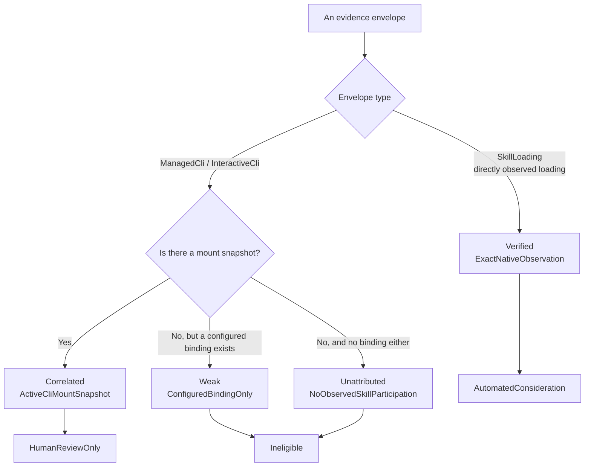

# Skill evolution evidence

The `skill_evolution_evidence` context collects evidence about how well a Skill is performing, used to judge whether it should be improved.

It's the place in the codebase with the **strictest evidence-strength declarations**, because the question it answers is naturally prone to a wrong conclusion: **when a session fails, should that be attributed to some Skill at all**.

## Why attribution is hard

A session failed. Three Skills were mounted at the time. Which one is responsible?

Most of the time **the honest answer is "unknown,"** and this context doesn't quietly turn "unknown" into "probably that one." It tags every attribution with a **rationale** and an **eligibility tier**, so downstream consumers know what the evidence can actually be used for.

### Four attribution rationales

`AttributionRationale`:

| Rationale | Observed fact |
| --- | --- |
| `ExactNativeObservation` | The runtime directly observed this Skill revision participating |
| `ActiveCliMountSnapshot` | The Skill really was mounted at the time, but wasn't observed being used |
| `ConfiguredBindingOnly` | Only known to be bound in configuration, not even a mount snapshot |
| `NoObservedSkillParticipation` | No sign of any Skill participating at all |

**The four carry decreasing information**, and the corresponding `AttributionStrength` runs from verified to correlated to weak to unattributed.

### Three eligibility tiers

`TargetingEligibility` decides how far a piece of evidence is allowed to go:

| Tier | Meaning |
| --- | --- |
| `AutomatedConsideration` | Strong enough to enter automated judgment |
| `HumanReviewOnly` | For a human to look at only, not the automated path |
| `Ineligible` | Cannot be used to target any Skill at all |

**Only evidence with directly observed participation enters the automated path.** The mapping from the four strength tiers to eligibility is one-to-one:

| Strength | Rationale | Eligibility |
| --- | --- | --- |
| `Verified` | `ExactNativeObservation` | `AutomatedConsideration` |
| `Correlated` | `ActiveCliMountSnapshot` | `HumanReviewOnly` |
| `Weak` | `ConfiguredBindingOnly` | `Ineligible` |
| `Unattributed` | `NoObservedSkillParticipation` | `Ineligible` |

**The line is drawn further forward than intuition suggests.** "Mounted" does not mean "used" — so `Correlated` is for human eyes only, never entering the automated path. And "bound in configuration" with not even a mount snapshot is **judged `Ineligible` outright**, ranked with "no Skill participation was observed at all": letting a Skill that was never invoked take the blame for someone else's failure, even by merely landing on a human-review list, wastes the reviewer's attention.

## Signal classification

Evidence is extracted into categorized signals, not free text.

`OperationClass` has five categories: `Generation`, `Tool`, `Permission`, `Provider`, `Process`.

`FailureClass` has eight categories, and **each carries a default severity**:

| Failure class | Default severity |
| --- | --- |
| `Permission`, `Limit`, `Agent` | Medium |
| `Provider`, `Process`, `Tool`, `Timeout`, `Sandbox` | High |

**Downgrading permission and limit to Medium makes sense**: being stopped by a permission policy, or hitting a quota, usually means the guardrail is working as intended, not that something is broken. Treating them the same as a sandbox escape or a process crash would bury the genuinely high-risk signals under routine interception.

The remaining categories are `VerificationClass` / `VerificationOutcome`, `UtilityOutcome`, `SignalPolarity`, and `SkillLifecycleAnomaly` — **polarity gets its own line** because evidence isn't only about failure; success is evidence too.

## Sanitization: 12 rules, applied before anything is written to disk

`EVIDENCE_SANITIZER_V1` has 12 `RedactionClass` rules, covering private-key blocks, token assignments, `Authorization` and `Cookie` headers, password assignments, credentials embedded in URLs, and more.

Two design choices worth noting:

- **The input cap `MAX_SANITIZER_INPUT_CHARS = 1000`.** An oversized input is rejected outright rather than truncated and then sanitized — **truncation could slice a secret in half and let the back half slip past the rules**.
- **The sanitizer is versioned.** The rules will evolve, and evidence written to disk records which version processed it, so tightening the rules later reveals exactly which old records need reprocessing.

The evidence purge path is owned by the `purge` module — **once the retention period is up, evidence has to actually be deletable**, not merely marked invisible.

> **Evidence carries no application-level encryption.** There was a spec-versus-implementation conflict here: `openspec/project.md` described this context's ownership as including "encrypted evidence storage", while the implementation has no corresponding encryption layer (`storage_values.rs` only maps enums to and from strings, and neither the schema nor the repository calls into any encryption). It was resolved on the implementation side — the specification now states the boundary that exists rather than asserting a protection that did not.
>
> Evidence confidentiality therefore rests on **sanitization before write** plus operating-system and disk protection, not on encryption at rest. Raising it to application-level encryption is its own piece of work, with key management, migration of existing rows, and erasure verification — not a wording change.

## Relationship to the Skill system

This context **only produces evidence; it never changes a Skill**.

- Skill resolution and what becomes effective is covered in [Effective Skill runtime](effective-skill-runtime.md).
- Governance of the customization layer is covered in [Skill overlay governance](skill-overlay-governance.md).
- Management state and bindings are covered in [Skill management](skill-management.md).

The `ObservedSkillRevision` / `MountedSkillRevision` / `CliMountSnapshot` types that appear in evidence all carry a **revision number**: once a Skill has changed, evidence about the old revision is never counted against the new one.

## Relationship to other contexts

- Evidence originates from execution, and it's a separate record from the trace in [Execution observability](execution-observability.md): the trace describes "what happened," and the evidence describes "what this means for a given Skill."
- The sanitization principle matches [Persistence and unified logging](persistence-and-logging.md) — **sanitize before writing to disk, not filtered on read**.

## Where the design lives

This chapter orients contributors; the authoritative requirements live in the corresponding main specs under `openspec/specs`.
