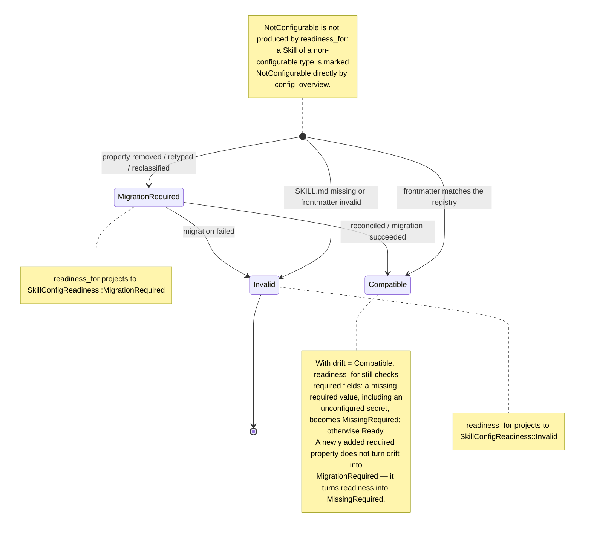

# Skill management

Skills are on-demand capability bundles attached to an Agent. The native side owns discovery, mounting, drift reconciliation, and Agent binding; the frontend never touches the filesystem directly.

## How Skills, MCP, and function calling layer

Before the details of Skill management, it helps to draw the boundary against MCP and function calling. The three do not compete — they **cooperate in layers**. Function calling is the protocol layer (how a call is made), MCP is the connection layer (what external system is called), and a Skill is the knowledge layer (when to call it and what conventions to follow).

| Dimension | Function calling | MCP | Skill |
| --- | --- | --- | --- |
| **What it is** | The underlying protocol: a model emits structured arguments that trigger a function | A standardized external connection that plugs tools and data sources into a model | Procedural knowledge that teaches a model how to do a thing correctly |
| **Analogy** | The electrical specification of a USB port | The USB-C port itself, connecting tools and data | A manual or standard operating procedure |
| **Needs a server?** | No — it is only a calling convention | Yes — an MCP server is a running program bridging an external system | No — a Skill is static instruction injected into context |
| **How it triggers** | The model calls a registered function | The model calls a connected tool | Semantic matching on `description`, loading instructions dynamically |
| **Problem it solves** | Structuring a single call | Reaching live data and performing effects (query, fetch, current state) | Teaching the model how to think and act appropriately, not which button or API to reach for |
| **State and permissions** | Stateless, arguments only | Stateful, needs authentication and connection upkeep | An instruction-only Skill is stateless; an executable Skill is governed by provenance, integrity, permissions, and a sandbox |
| **Portability** | Depends on the implementation, with small differences per vendor | An open protocol, portable across clients | Published as a standard |

### The core mechanism of a Skill

A Skill is **procedural knowledge**, not a tool and not a connection. It is a folder holding a `SKILL.md` (frontmatter plus instruction body), optionally accompanied by scripts, templates, and reference material.

- **Progressive disclosure** — an Agent sees only a Skill's `name` and `description` by default, a few dozen tokens, and pulls the full instruction body into context only when the task matches. That keeps every Skill from occupying the context window permanently. Here it is implemented for on-demand Role Skills by three fixed read-only tools: `list_skills`, `load_skill`, and `read_skill_resource`.
- **Automatic triggering** — semantic matching on `description`, with no explicit user invocation required.
- **No server** — a Skill is instructions and files. There is no server to run; it is purely knowledge injection.
- **Single responsibility** — one Skill maps to one clear class of workflow. Bundling unrelated capabilities into one Skill blurs the matching logic.
- **Knowledge is static; actions reference external capabilities** — a Skill may say "call this MCP tool" or "run this script", but the Skill itself holds no connection state and no credentials. That is the dividing line against MCP.

### Related, not competing

A quick test: if the scenario contains words like "query", "fetch", or "current state", it needs an MCP server rather than a Skill. If it is "how do I write", "what convention applies", or "what is the checklist", that is a Skill's territory.

This project stacks all three: a Skill's instructions tell the Agent that a step should use a particular MCP tool, and the MCP tool is actually triggered through function calling in OnePiece's tool-use loop. See [Tool registry and execution](tool-registry.md) and [MCP tools and clients](mcp-tools.md).

## Dual scopes

Skills are managed in two isolated scopes:

- **`global`** — stored under the fixed user-home VaneHub Skill directory.
- **`workspace`** — stored under the current workspace directory's VaneHub Skill directory.

The same Skill id may exist in both scopes; their enabled state, source path, Agent bindings, drift state, and deletion are managed independently.

## SKILL.md contract

Every Skill is defined by a `SKILL.md` file with a fixed frontmatter schema: `id`, `name`, `description`, `category`, `version`, and optional `triggers`. The `id` is immutable after creation. A registry record pointing at a directory with no `SKILL.md` (or invalid frontmatter) is reported as drift, not treated as healthy.

## Configuration drift and readiness

Each Skill's configuration drift is described by `SkillConfigDrift` and projected through `readiness_for` into `SkillConfigReadiness`, which decides whether the Skill can be mounted on an Agent. `SkillConfigReadiness` has five variants: `Ready`, `MissingRequired`, `MigrationRequired`, `Invalid`, and `NotConfigurable`. Schema drift is never silently ignored — any registry record inconsistent with the on-disk `SKILL.md` frontmatter enters one of three drift states, which `readiness_for` then projects into the corresponding readiness.

**Drift classification rules**, as decided by `classify_drift`:

- A newly added optional property → `Compatible`, since it is forward compatible.
- Removing a property, changing its type, or reclassifying it → `MigrationRequired`.
- A secret field moving out of the credential store → `MigrationRequired`, because credential migration requires explicit reconciliation.
- A missing `SKILL.md`, frontmatter that fails to parse, or an `id` that disagrees with the registry → `Invalid`.

**How the two scopes cooperate**: the global and workspace scopes each hold their own `SKILL.md` contract (frontmatter), enabled state, source path, and Agent bindings. A workspace-scope configuration overrides the global-scope entry with the same `id`. Drift detection, built-in seeding, and reconciliation all run separately per scope — global seeding never writes into a workspace directory, and workspace drift never contaminates global readiness.

## Key types and lifecycle

Skill configuration drift and readiness projection live in `tooling/skills/domain/config_state.rs`, with layer classification in `classification.rs`:

- **`SkillConfigDrift`** — decided by `classify_drift(schema, stored, stored_secret_keys)`, with three values: `Compatible` (forward compatible), `MigrationRequired` (explicit migration needed), and `Invalid`.
- **`readiness_for(schema, resolved, drift)`** — projects drift into `SkillConfigReadiness` (`Ready`, `MissingRequired`, `MigrationRequired`, `Invalid`, `NotConfigurable`). Drift is never silent: a schema change is either compatible or demands explicit migration, and an old value is never silently reused. When drift is `Compatible` but a required field is missing, readiness degrades to `MissingRequired`.
- **Drift rules** — a new optional property → `Compatible`; removing, retyping, or reclassifying a property → `MigrationRequired`; a secret field moving out of the credential store → `MigrationRequired`, refusing reuse without explicit reconciliation; a missing `SKILL.md`, unparseable frontmatter, or an `id` disagreeing with the registry → `Invalid`.
- **Scope override semantics** — configuration overrides are carried by `SkillConfigScope::{User, Project}`, two writable scopes with no System or Remote tier. A `Project` entry overrides the `User` entry with the same `id`, and clearing the higher scope's value restores the lower scope's value, because a lower-scope override is never materialized into the higher scope. This is a different concept from a Skill's own `SkillScope::{Global, Workspace}`: the former is a configuration override layer, the latter is where the Skill is stored.
- **Delegation types** in `delegation.rs` — a Skill may declare delegation types such as `ScopedEdit`, defining how far the Skill may intervene in a tool call.

## One architecture for CLI Agents and OnePiece

The Skill system is **managed uniformly**. The same Skill definitions, scopes, drift detection, and overlay governance apply equally to the built-in CLI Agents (claude-code, codex-cli, gemini-cli, opencode, antigravity-cli) and to the OnePiece native Agent. The shared parts are:

- **One canonical Skill id and `SKILL.md` contract** — independent of whether the consumer is a CLI or OnePiece. Bindings reference the canonical Skill id, never an Agent-private format.
- **One dual-scope model** — enabled state, bindings, drift, and deletion intent are managed across the global and workspace scopes, with workspace overriding the global entry of the same id.
- **One overlay governance pass** — the overlay (`SkillLayer` has four tiers, `Project`, `User`, `Registry`, and `System`, with priority project > user > registry > system) replays after the base bundle is chosen and produces the final effective view. Every consumer receives that governed snapshot.
- **One drift detection and built-in seeding path** — `classify_drift` and `readiness_for` behave the same for every Skill, and built-in seeding runs separately in each scope.

The difference is the **injection mechanism**, because the runtime shapes differ:

| Dimension | Built-in CLI Agent | OnePiece native Agent |
| --- | --- | --- |
| How a Skill takes effect | VaneHub AI controls the launch parameters and the external CLI process, so a Skill is injected after overlay governance through that CLI's own mechanism — a system-prompt fragment or a mount path. The CLI's internal tool system is not controlled by VaneHub AI | The effective view is consumed directly through `AgentSkillPort`: eager Role Skills are injected into the system prompt, and on-demand ones load through the `list_skills`, `load_skill`, and `read_skill_resource` fixed read-only tools |
| Tool exposure | The CLI's own tool system | OnePiece's native tool catalog: fixed tools plus Skill tools plus MCP tools |
| Observability | The CLI's internals are a black box, so traces stop at the boundary | Skill loading and tool calls have native fidelity and can be expanded layer by layer in a trace |

**Managing Skills statistically** behaves identically for both: `list_skills` returns bounded effective metadata without the instruction body, `read_skill_resource` reads a resource by logical URI, and drift and readiness states are reported the same way. Resources are addressed by logical identifier — for example `skill://code-review/references/checklist.md` — so the model never receives a host path. See [Effective Skill runtime](effective-skill-runtime.md) and [Skill overlay governance](skill-overlay-governance.md).

## Where the design lives

This chapter orients contributors. The authoritative requirements — dual scopes, the `SKILL.md` schema, drift, Agent binding, and the built-in seeding/reconciliation contract — live in the specs.

- [openspec/specs/skill-management](../../../openspec/specs/skill-management/spec.md)
- [openspec/specs/agent-skill-injection](../../../openspec/specs/agent-skill-injection/spec.md)

The `tooling` bounded context that owns this is described in [Native bounded contexts](native-contexts.md).
