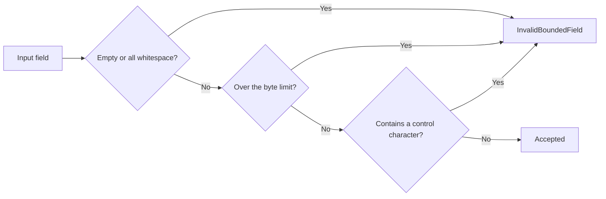

# SSH connections and the remote runtime

The `ssh_connections` context owns connection profiles, host-key trust, credential loading, and the pooled remote runtime.

Its division of labor with [Terminal and PTY runtime](terminal-runtime.md): that chapter covers **local** PTY ownership, this one covers remote. **The two are not the same mechanism** — local goes through `portable-pty`'s `openpty`, remote goes through a remote PTY requested by russh over an SSH session.

## Host-key trust

`HostKeyChallengeKind` has only two variants, but their meanings are worlds apart:

| Variant | Meaning | How to handle it |
| --- | --- | --- |
| `FirstSeen` | The first connection to this host | Have the user confirm the fingerprint and remember it |
| `Changed` | The fingerprint doesn't match what was remembered | **Stop** |

**Keeping these two apart is the single most important thing in this context.** Seeing a host for the first time is normal; a changed fingerprint could mean the server was reinstalled, **or it could mean a man in the middle**. The system never auto-accepts a change — downgrading it to just another "new host confirmation" would cancel out the entire point of having host keys at all.

`HostKeyEvidence` has only two fields, `algorithm` and `fingerprint`, and both go through `validate_bounded`.

## Bounded fields are rejected outright, never truncated



| Field | Limit |
| --- | --- |
| Hostname | **255** bytes |
| Algorithm name | **96** bytes |
| Fingerprint | **160** bytes |

Of the three checks, **the control-character one is the easiest to overlook**: the fingerprint and algorithm name get displayed to the user for approval, and letting a control character through means what's rendered on screen could diverge from what's actually remembered — the user clicks "confirm" on something other than what they actually saw.

Going over the limit returns `InvalidBoundedField(field)` naming the specific field, rather than a generic error.

## Remote channel events

`RemoteSshChannelEvent` has six variants:

| Event | Meaning |
| --- | --- |
| `Output` | Standard output |
| `ExtendedOutput { stream, content }` | Extended output with a stream number (stderr and the like) |
| `ExitStatus(u32)` | The process exited normally, with an exit code |
| `ExitSignal(String)` | The process was terminated by a signal |
| `Eof` | The remote end is done sending |
| `Closed` | The channel closed |

**`ExitStatus` and `ExitSignal` are kept separate**: exit code 0 and "killed by SIGKILL" cannot both be summed up as "succeeded" or "failed" — folding a signal into a fake exit code would throw away the information about why the process actually terminated.

**`Eof` and `Closed` are also kept separate**: the remote end being done talking and the channel being gone are two different things — an exit status may still be pending after the former.

## Four constants for the connection pool

The remote-terminal transport pool's limits are defined in `remote_terminal_limits.rs` under `workspaces`:

| Constant | Value |
| --- | --- |
| `REMOTE_TERMINAL_POOL_CAPACITY` | **8** |
| `REMOTE_TERMINAL_IDLE_TIMEOUT_SECONDS` | **300** (5 minutes) |
| `REMOTE_TERMINAL_CONNECT_TIMEOUT_SECONDS` | **15** |
| `REMOTE_TERMINAL_KEEPALIVE_SECONDS` | **30** |

The relationships between these constants are locked by tests, not each tuned in isolation:

```text
DRAIN_TIMEOUT   < IDLE_TIMEOUT
KEEPALIVE       < IDLE_TIMEOUT
POOL_CAPACITY  ∈ 1..=32
```

**Keepalive has to be smaller than the idle timeout**, or a keepalive packet could still be waiting to fire after the connection has already been reaped as idle — each constant looks reasonable on its own, but getting them wrong makes keepalive pointless. **The drain timeout has to be smaller than the idle timeout** for the same reason: if the window left for unread output outlasts the reclaim interval, that output never gets read — closing a connection gives unread output a brief window, and that's usually exactly where the error message lives.

## Credentials

Connection credentials are handed to the operating system's keychain; the context only holds a reference. This matches how CLI provider credentials are handled in [Agent configuration](../../cli-agent-global-configuration.md): **fields marked confidential are never echoed back after being saved**.

## The boundaries of what remote can do

Remote isn't a full projection of local — two limitations come from the implementation, not from an oversight:

- **Remote doesn't support Git worktrees** — it can only point at a path that already exists on the remote host. As a result, [Loop and Plan runtimes](loop-and-plan-runtime.md), which depend on worktrees, don't apply to remote workspaces either.
- **The local PTY ownership model doesn't extend to remote as-is** — a remote session takes its own runtime path.

## Relationship to other contexts

- The pooled implementation and limits for remote terminals are held by `workspaces`; see [Terminal and PTY runtime](terminal-runtime.md).
- Context ownership is covered in [Native bounded contexts](native-contexts.md).
- The user-facing configuration flow is covered in the user guide's chapter on remote and IM.

## Where the design lives

This chapter orients contributors; the authoritative requirements live in `remote-terminal-runtime` and other corresponding main specs under `openspec/specs`.
