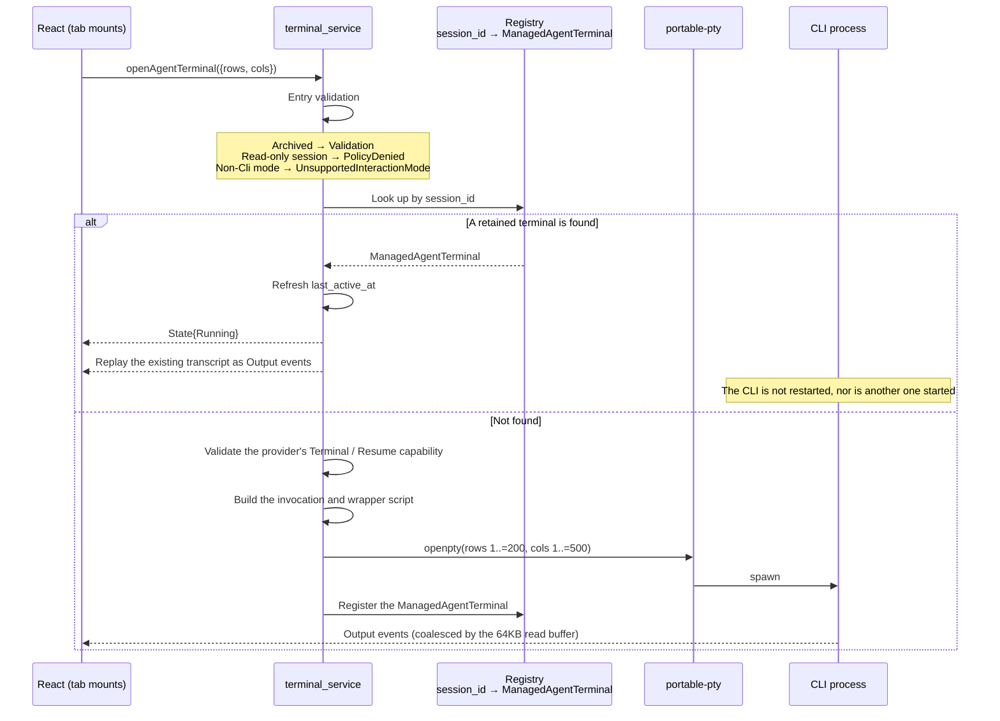

# Terminal and PTY runtime

Single-Agent CLI sessions run inside a session-scoped Agent Terminal: a PTY-backed CLI process owned by the native runtime and exposed to React through the frontend Agent service boundary. React components never call Tauri commands directly for terminal lifecycle.

## Session-scoped, single-Agent

The Agent Terminal is for non-archived single-Agent CLI sessions. A terminal start requested for an archived session is rejected without launching a CLI process and returns a concise user-displayable failure.

## Automatic start and attach

After a single-Agent session is created or selected, the UI automatically requests Agent Terminal startup for that session — no separate launch button. If the selected session already has a live retained Agent Terminal process, the UI attaches to the existing terminal stream instead of spawning a duplicate CLI process for the same session.

## Remote terminals

Remote SSH workspaces expose their own remote terminal runtime path; the local PTY ownership model does not extend to remote sessions unchanged. See the user guide for the remote-workspace workflow, and see [Native bounded contexts](native-contexts.md) for the `workspaces`/`sessions` ownership split.

## Local PTY implementation

The local Agent Terminal is built on the `portable-pty` crate. The core structure `ManagedAgentTerminal` (`agent_runtime/infrastructure/terminal_process.rs`) holds `master: Box<dyn MasterPty>`, `writer`, `child`, and a bounded transcript buffer `BoundedTextBuffer`. The registry maps **session_id as key** to `ManagedAgentTerminal` — this is the ownership model for "session-scoped, single-Agent terminal."

- **Bounded transcript buffer** `BoundedTextBuffer` — `{chunks: VecDeque, bytes, max_bytes}`; `RETAINED_TERMINAL_TRANSCRIPT_BYTES = 1MB`, trimmed from the head at **UTF-8 character boundaries** once over the limit; `snapshot()` concatenates the full text for replay on attach.
- **Read buffer** `TERMINAL_READ_BUFFER_BYTES = 64KB` — a large buffer coalesces bursty output and reduces the number of IPC events; `take_decodable_utf8` handles UTF-8 sequences split across reads.
- **Shell type** `AgentTerminalShell` (WindowsPowerShell / WindowsCmd / UnixDefault) — Windows prefers `powershell.exe`, falling back to `cmd.exe`; Unix uses `$SHELL` or `/bin/sh`.
- **Wrapper script** `generate_agent_terminal_wrapper` — generates a `.ps1`/`.cmd`/`.sh` wrapper that sets UTF-8, enters the session directory, and `exec`s the target CLI; `validate_token` rejects empty values and NUL; `redacted_command` is used for logging.
- **Terminal size** — rows clamped to `1..=200`, cols clamped to `1..=500`.

### Automatic start and attach



`open_or_attach` first checks the registry; a hit by session_id is treated as a retained terminal — `last_active_at` is refreshed, a `State{Running}` event fires, and the **existing transcript is replayed as Output events** (the CLI does not need to restart). Otherwise it goes through the fresh-start flow: validate the provider's `Terminal`/`Resume` capability, build the invocation and wrapper, `openpty`, spawn, register.

The frontend calls `openAgentTerminal({rows, cols})` as soon as the tab mounts; it reconnects automatically when `sessionActivationKey` changes with no terminalId and the state is stopped/failed.

### Archived and read-only rejection

`terminal_service.rs` rejects at the `open_or_attach` entry point: an archived session → `Validation("Archived sessions cannot start Agent terminals.")`; a read-only (verifier) session → `PolicyDenied{action:"open-terminal"}`; a non-`Cli` interaction mode → `UnsupportedInteractionMode`.

### Concurrency and deadlock prevention

Blocking I/O never runs inside the registry lock. `reap_terminal_without_holding_lock` polls with `try_wait()` every 50ms while holding the lock only briefly, avoiding a deadlock between the reader thread and `stop()`'s kill; `terminate_terminal_child` kills inside the lock and reaps after releasing it. An independent usage-polling thread ticks every 250ms at a 5s interval, and stops and joins via an `AtomicBool alive`.

### Idle reclamation

A background task calls `cleanup_idle_agent_terminals` every 60s; an Agent Terminal idle past `AGENT_TERMINAL_IDLE_TIMEOUT_SECONDS = 2 hours` is reclaimed.

## Remote terminals (SSH)

Remote terminals go through a remote PTY requested over an SSH session using the **russh** crate, entirely different from local `portable-pty` openpty: `channel_open_session` → `request_pty(true, "xterm-256color", cols, rows, 0, 0, &[])` → `request_shell(true)`. The remote shell transport pool has its own independent capacity and idle limits (`remote_terminal_limits.rs`).

## Retained Session Shells: ownership, admission, and bounded cleanup

A retained Session Shell is a different lifecycle from the Agent Terminal above: it outlives the
view that opened it, so nothing but an explicit close ends it. That makes ownership the whole
design. Everything below exists because an operating-system process cannot join a transaction.

### Generation

Every worker event, route entry, retained handle, capacity lease, close attempt, and Reaper item
carries `(shell_id, generation)`. Shell ids are UUIDs and never reused, so the generation is not
there to tell two *names* apart — it is there to tell two *lives* apart. A reader thread, a route
entry, and a Reaper attempt can each outlive the Shell they were created for, and a completion that
arrives without a generation cannot be told from one that is still current.

### Startup order

```text
reserve capacity atomically → register the Shell as `Opening` → invoke the runtime under a launch
guard → transition `Opening → Running` only if no terminal event won first
```

Registering *after* the runtime returns reads as the safer order — a failed open then leaves nothing
behind — and it is what loses the first line of an `echo && exit`: the reader publishes into a store
that has never heard of the Shell. Registering first and rolling back on failure keeps both
properties. An `Opening` Shell is addressable and deliberately not writable.

`LocalShellLaunchGuard` owns the child, the PTY handles, the writer, and the workers from the first
successful acquisition, so every `?` in the startup path unwinds through a bounded termination
rather than returning past a live process. `RemoteShellLaunchGuard` owns only the new channel: the
pooled SSH transport belongs to the pool and may be carrying other Shells.

### Admission

`ShellCapacityController` reserves the application ceiling and the per-session ceiling together, or
neither. The move-only `ShellCapacityLease` it returns lives in the store entry for the whole life
of the Shell, so a Shell that is `Closing`, `Reaping`, or `CloseFailed` still occupies its slot —
its process still exists, and releasing the slot early would recreate the overcommit.

### Close

`SessionShellRuntimePort::close` returns `ShellRuntimeCloseOutcome`, not `Result<(), _>`. Every way
a close can go wrong leaves the adapter still owning a child or a channel, so "it failed" and "it is
still mine" are the same fact — and a `Result` invites `let _ = close(..)`, which drops the last
reference to a live process.

The local sequence, under an injected monotonic `ShellCloseBudget`:

```text
stop input (drop the writer) → observe → terminate → observe → force → observe → complete workers
```

No stage waits without a ceiling. A worker is joined only once it has reported itself complete;
`ShellWorker` sets that flag from a drop guard, so a panicking worker reports completion too.

### States and dispositions

| State | Meaning |
| --- | --- |
| `Opening` | Registered, runtime has not committed. Not writable. |
| `Closing` | One bounded attempt in progress. Not terminal. |
| `Reaping` | The attempt ran out; the Reaper owns the continuation. Not terminal. |
| `CloseFailed` | Cleanup failed with a reason; handles still owned here. Not terminal. |
| `Closed` | The only state meaning every owned resource was confirmed gone. |

`ShellCloseDisposition` mirrors this at the API boundary: `ClosedConfirmed`, `Reaping`,
`CloseFailed`, `AlreadyTerminal`. Only the first and last are settled.

### Reaper

`ShellReaperQueue` is a bounded queue of work *identities*, drained a fixed number at a time by the
existing idle sweep. It holds no handles: the runtime that failed to close a Shell has not let go of
it, so a handle here would be a second owner of the same child. That is what makes a full queue safe
to refuse — nothing was moved out of an owner, so the refusal drops nothing, and the Shell stays
`CloseFailed` and retryable by hand.

### Session cleanup

Archive, delete, idle sweep, and shutdown consume `SessionShellCleanupReport`, which keeps every
Shell's identity and disposition rather than a pass/fail. `is_complete()` is the predicate before
finalizing, and it is not "no errors were returned": `Reaping` is not an error and still means a
process is alive. Shutdown records residual resources and returns; it never waits without a ceiling.

### What this does not guarantee

Cleanup is guaranteed for the child process VaneHub owns. A descendant that deliberately escapes the
process group is not covered, and this is not a normative guarantee of the design.

## Terminal output capture

The Agent Terminal keeps only an in-memory bounded transcript (1MB); persistent Terminal capture goes through the `workspaces` capture service — the two are separate.

- **Bounded capture queue** `BoundedCaptureQueue` — `TERMINAL_CAPTURE_QUEUE_CHUNKS=256`, `TERMINAL_CAPTURE_CHUNK_BYTES=32KB`, `TERMINAL_CAPTURE_BATCH_CHUNKS=32`; once full, `pop_front` runs and sets `dropped=true`.
- **Gap markers** — if anything was ever dropped, `drain_batch` first emits a gap marker with `source: Gap`, `content: "[capture gap]"`, then drains — data is never silently lost.
- **Retention and capacity** — `TERMINAL_CAPTURE_RETENTION_DAYS=30`, `TERMINAL_CAPTURE_CAPACITY_BYTES=512MB`; `enforce_capacity` deletes the oldest chunks in a loop until the total is at or under capacity.
- **Persistent table** `terminal_output_chunks` — `UNIQUE(stream_id, sequence)`, with an FTS5 trigram full-text index; `source IN ('pty','quick-command','gap')`.
- **Per-chunk cap** — `output_chunk.rs` reports `TooLarge` past `32KB` and strips ESC control characters.
- **Remote pool constants** — `REMOTE_TERMINAL_POOL_CAPACITY=8`, `REMOTE_TERMINAL_IDLE_TIMEOUT_SECONDS=300`, `CONNECT_TIMEOUT=15s`, `KEEPALIVE=30s`.

## Where the design lives

This chapter orients contributors. The authoritative requirements live in the specs.

- [openspec/specs/agent-terminal-runtime](../../../openspec/specs/agent-terminal-runtime/spec.md)
- [openspec/specs/remote-terminal-runtime](../../../openspec/specs/remote-terminal-runtime/spec.md)
- [openspec/specs/session-shell](../../../openspec/specs/session-shell/spec.md)

The PTY and shell runtime lives in the `workspaces` and `sessions` bounded contexts; see [Native bounded contexts](native-contexts.md).
