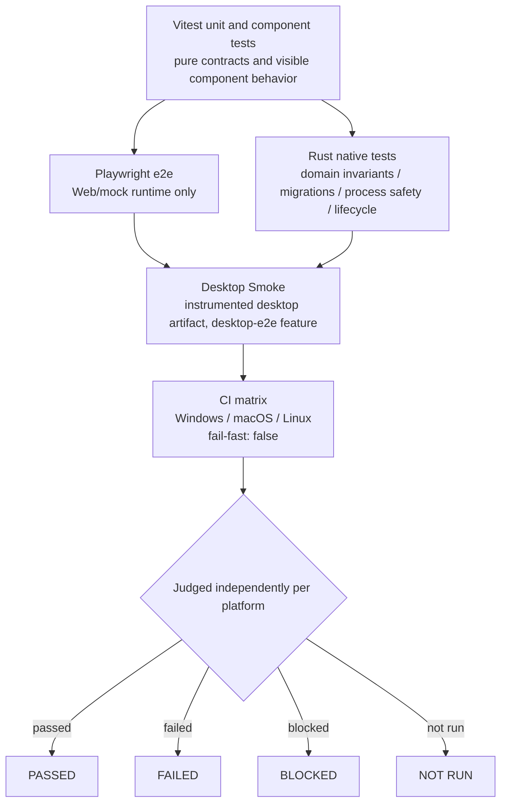

# Testing

**The single source of truth for verification commands is the "Verification commands" section of [`AGENTS.md`](../../../AGENTS.md) at the repository root.** This chapter no longer copies it: two lists drift, and the half that drifts is the half CI stops. What this chapter covers is which tier to run when, what each tier actually exercises, and how far a result generalises.

Packaging and release are in [Release](release.md).

A documentation change additionally runs these four. `docs:screenshots:check` is not in `AGENTS.md`'s core list; it applies when documentation screenshots change:

```powershell
npm run docs:check
npm run docs:test
npm run docs:screenshots:check
npm run docs:build
```


Frontend tests cover pure contracts and visible component behavior. Playwright covers the browser Web/mock runtime; passing it does not claim that the Tauri desktop runtime passed. Native tests cover domain invariants, application port orchestration, persistence/migrations, command mapping, process safety, and lifecycle behavior.

Runtime-affecting desktop changes additionally use:

```powershell
npm run desktop:unit:test
npm run test:desktop
```

`test:desktop` builds and launches an instrumented native Tauri artifact for the current operating system, waits for the real React WebView, invokes the real Rust-backed `get_settings` command, performs a stable navigation interaction, and requests a clean application shutdown. It sets an isolated temporary `VANEHUB_APP_DATA_DIR`; never point that variable at normal user data.

The instrumented artifact enables test-only WebDriver plugins and permissions through the `desktop-e2e` Cargo feature and `src-tauri/tauri.desktop-e2e.conf.json`. Normal packaging commands do not include that feature. Failure evidence is written beneath `test-results/desktop/<run-id>/` from screenshots, driver output, process state, and the existing redacted unified native logs.

Local results apply only to the current platform. CI runs `Desktop Smoke` independently on native Windows, macOS, and Linux runners with matrix fail-fast disabled. Review and report every platform separately as `PASSED`, `FAILED`, `BLOCKED`, or `NOT RUN`; never infer one platform from another. Failed or blocked jobs upload a platform-labelled evidence artifact, while successful jobs do not retain temporary application data.

Packaging targets Windows, macOS, and Linux through Tauri. Signing credentials belong in protected release environments, never in repository configuration or screenshots. See the checked-in [release signing guide](../reference/release-signing.md).

## Test tiers

The test pyramid has five tiers from the bottom up. Each covers a different risk surface, and none substitutes for another — above all, **a passing Playwright run is not a passing desktop run**.



What each tier covers:

- **Vitest** — unit and component tests over pure contracts and visible component behavior. The coverage gate is enforced by `coverage-policy.json`, with a frontend `minimumLines` of 45.2%.
- **Playwright e2e** — covers the browser Web/mock runtime only. Passing it does not claim the Tauri desktop runtime passed.
- **Rust native tests** — cover domain invariants, application port orchestration, persistence and migrations, command mapping, process safety, and lifecycle behavior. The overall gate is `minimumLines = 67%`, with three `criticalGroups` each requiring `minimumLines = 80%`:
  - `sqlite-transactions`: `sessions/infrastructure/transactions.rs`, `platform/database/mod.rs`, `platform/database/migrations/**.rs`
  - `agent-startup-and-terminal-control`: `agent_runtime/application/terminal_service.rs`
  - `mcp-routing`: `tooling/mcp/infrastructure/relay.rs`
- **Desktop Smoke** — an instrumented desktop artifact enables test-only WebDriver plugins and permissions through the `desktop-e2e` Cargo feature and `src-tauri/tauri.desktop-e2e.conf.json`, which normal packaging commands never include. It builds and launches the instrumented Tauri artifact for the current operating system, waits for the real React WebView, invokes the real Rust-backed `get_settings` command, performs a stable navigation, and requests a clean shutdown. Local results apply to the current platform only and must not be extrapolated.
- **CI matrix** — `Desktop Smoke` runs independently on native Windows, macOS, and Linux runners with matrix `fail-fast` disabled. Review and report each platform separately as `PASSED`, `FAILED`, `BLOCKED`, or `NOT RUN`; never infer one platform from another.

Supplementary scripts must run when a change lands in their area: `npm run test:coverage` (which CI uses in place of `npm run test`), `npm run coverage:policy:test`, `npm run version:unit:test`, and `npm run contracts:check`. UI behavior changes run `npx playwright test`; runtime, startup-chain, or IPC changes run `npm run desktop:unit:test` and `npm run test:desktop`.

## Test scripts and thresholds

## Key scripts and commands

The scripts and gates along the test and release path:

- **Vitest** — `package.json` defines `test: "vitest run"` and `test:coverage: "vitest run --coverage --maxWorkers=4 --testTimeout=15000"`, configured in `vite.config.ts`, which excludes `tests/docs/**` and `tests/e2e/**` and writes coverage to `./coverage/frontend`.
- **Playwright** — `playwright.config.ts` sets `testDir: "./tests/e2e"` with a single chromium project, and its `webServer` starts `npm run dev` on port 5174.
- **Desktop native tests** — `npm run test:desktop` runs `node scripts/test-desktop.mjs all`, split into `test:desktop:build` and the per-layer scripts. `test-desktop.mjs` builds the instrumented debug artifact with `--features desktop-e2e --config src-tauri/tauri.desktop-e2e.conf.json`, starts the real React WebView, invokes `get_settings`, navigates, and exits cleanly, under an isolated temporary `VANEHUB_APP_DATA_DIR`, writing failure evidence to `test-results/desktop/<run-id>/`.
- **`desktop:unit:test`** — runs the `scripts/desktop-*.node-test.mjs` automation-boundary tests.
- **The coverage gate** — `coverage-policy.json` sets frontend `minimumLines: 45.2` and native `minimumLines: 67`, with three `criticalGroups` at 80 (`sqlite-transactions`, `agent-startup-and-terminal-control`, `mcp-routing`), checked by `scripts/check-coverage-policy.mjs`.
- **CI Desktop Smoke** — `.github/workflows/ci.yml` runs the `desktop-smoke` job on a windows / macos / ubuntu matrix with `fail-fast: false`, using `xvfb-run -a npm run test:desktop` on Linux and labelling failure evidence per platform.
