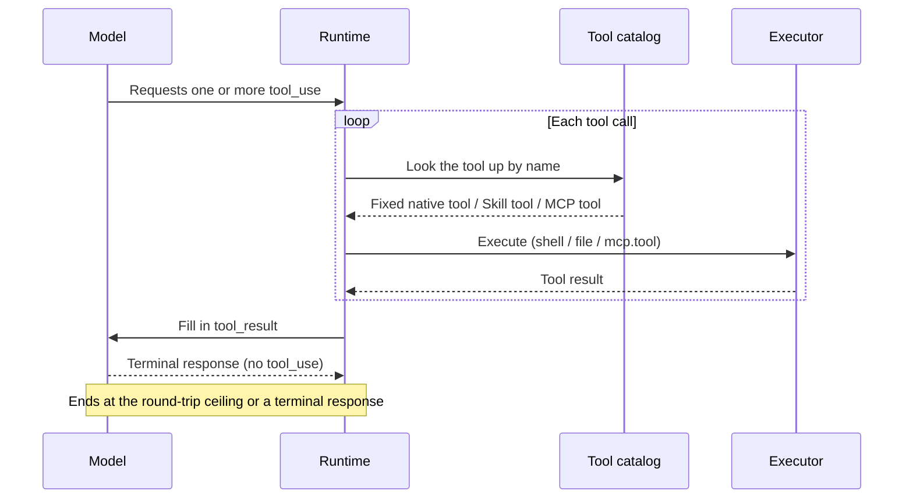

# Tool registry and execution

Native API Agents (including OnePiece) receive a fixed, provider-agnostic tool catalog, and the runtime drives a multi-turn tool-use loop until the provider returns a terminal response. MCP-sourced tools are layered on top of this fixed catalog — see [MCP tools and clients](mcp-tools.md).

## The fixed native tool catalog

Every native API generation (`launch_kind = api`) declares the same fixed tool set in its outgoing provider request:

- `shell` — command execution
- `file` — read/write
- content search
- filename search
- scoped file edit
- cross-session memory

Each tool is defined once and translated into the request shape required by the session's `interface_format`:

- `anthropic` → `{name, description, input_schema}`
- `openai-compatible` → `{type: "function", function: {name, description, parameters}}`

## Multi-turn tool-use loop

When a provider response requests one or more tool calls, the runtime executes those calls and sends their results back as a new turn, repeating until the provider returns a response with no further tool calls. A response with no tool calls is the terminal response for that user message, identical to a tool-free generation. The loop is bounded by a fixed maximum number of round trips per user message; exceeding it is handled explicitly rather than looping forever.

## Skill-supplied tools

A Skill may contribute its own tools on top of the fixed catalog, executed in a sandbox rather than in the host process. The requirements are in [openspec/specs/skill-tool-runtime](../../../openspec/specs/skill-tool-runtime/spec.md).

## The tool call loop

The model may request several tool calls per turn. The runtime resolves each tool name, executes it, fills the result back in, and hands the turn back to the model, repeating until the model returns a terminal response with no tool calls. The diagram below shows the standard sequence of one multi-turn loop.

### How the loop terminates, and its boundaries

- **Many turns until terminal** — as long as the model's response contains `tool_use`, the runtime executes those calls and returns their results as a new turn. A response with no tool calls is the terminal response for that user message, identical to a tool-free generation.
- **The round-trip ceiling** — each user message has a fixed maximum of `MAX_TOOL_ROUND_TRIPS = 25` round trips (in `contexts/agent_runtime/infrastructure/api_process_adapter/mod.rs`). Exceeding it is handled explicitly rather than looping forever.
- **The fixed catalog comes first** — the runtime looks a tool name up in the fixed native catalog first. Skill tools and MCP tools layer on top of that catalog rather than replacing it.

## Interface format translation

Each tool is defined once and translated into the request shape the provider requires, according to the session's `interface_format` field. `interface_format` is bound to the provider, and the runtime never infers it from a display name.

- **`anthropic`** — translated into `{name, description, input_schema}`.
- **`openai-compatible`** — translated into `{type: "function", function: {name, description, parameters}}`.

### Tool source and execution boundary

| Tool source | Where it executes | Notes |
| --- | --- | --- |
| Fixed native tools | Inside the host process | `shell`, `file` (read and write), content search, filename search, scoped edit, cross-session memory |
| Skill tools | A sandbox, not the host process | A Skill contributes tools on top of the fixed catalog, executed in a sandbox rather than the host process |
| MCP tools | Through the MCP client relay | Called through the MCP relay, layered on top of the fixed catalog |

## The fixed catalog and its boundaries

The tables below collect the fixed native tools' name mapping, interface-format translation, loop termination, and execution boundary for quick reference during implementation. The authoritative semantics remain the prose above and the specs.

### The fixed native tool list

Every native API generation (`launch_kind = api`) declares the same fixed tool set in its provider request:

| Tool | Notes |
| --- | --- |
| `shell` | Command execution |
| `file` | Read and write, distinguished by `operation: "read"` or `"write"` |
| `grep` | Search within file contents |
| `glob` | Search by filename |
| `edit` | Scoped file editing |
| `remember` | Cross-session memory |
| `shell_output` | Read a background shell's accumulated output |
| `shell_kill` | Terminate a background shell |
| `todo_write` | Session-level task list, replaced whole |
| `notebook` | Jupyter notebook reading and writing |

Those are the fixed native tools of `tool_catalog()`. Adding the three read-only Skill tools `list_skills`, `load_skill`, and `read_skill_resource` (see [Skill-supplied tools](#skill-supplied-tools)) gives the fixed catalog its full shape.

Several further tools exist as catalog constants but are **conditionally injected** rather than part of that unconditional set — `recall` and `search_code` (which depend on retrieval configuration), `ask_user_question`, `exit_plan_mode`, `delegate_utility_skill`, and the LSP tools such as `find_definition` and `find_references`. A tool being declared in `tool_catalog.rs` does not by itself mean the model sees it.

### interface_format translation

Each tool is defined once and translated into the provider's required request shape by the session's `interface_format`, which has two values and is bound to the provider rather than inferred from a display name:

- `anthropic` → `{name, description, input_schema}`
- `openai-compatible` → `{type: "function", function: {name, description, parameters}}`

### The multi-turn tool-use loop and its termination

As long as the model's response contains `tool_use`, the runtime executes those calls and returns their results as `tool_result` in a new turn. A response with no tool calls is the terminal response, identical to a tool-free generation.

- **The round-trip ceiling** — each user message has a fixed maximum of `MAX_TOOL_ROUND_TRIPS = 25` round trips (in `contexts/agent_runtime/infrastructure/api_process_adapter/mod.rs`). Exceeding it is handled explicitly rather than looping forever.
- **The fixed catalog comes first** — the runtime resolves a tool name against the fixed native catalog first, and Skill and MCP tools layer on top rather than replacing it.

### Tool source and execution boundary

| Tool source | Where it executes | Notes |
| --- | --- | --- |
| Fixed native tools | Inside the host process | `shell`, `file` (read and write), `grep`, `glob`, `edit`, `remember`, `shell_output`, `shell_kill`, `todo_write`, `notebook` |
| Skill tools | A sandbox, not the host process | A Skill contributes tools on top of the fixed catalog, executed in a sandbox rather than the host process (see the `skill-tool-runtime` security requirements) |
| MCP tools | Through the MCP client relay | Called through the MCP relay, layered on top of the fixed catalog |

## Where the design lives

This chapter orients contributors. The authoritative requirements live in the specs.

- [openspec/specs/agent-tool-execution](../../../openspec/specs/agent-tool-execution/spec.md) — the fixed catalog, per-format translation, and the tool-use loop.
- [openspec/specs/agent-tool-registry](../../../openspec/specs/agent-tool-registry/spec.md) — the registered Agent catalog and capability metadata.
- [openspec/specs/skill-tool-runtime](../../../openspec/specs/skill-tool-runtime/spec.md) — sandboxed execution of Skill-supplied tools.

Tool execution lives in the `agent_runtime` bounded context; see [Native bounded contexts](native-contexts.md).

### Historical decision records

These record decisions taken at a point in time and are not maintained as current narrative. They are linked here so they are reachable rather than orphaned; the specs above remain authoritative.

- [Skill Tool runtime security](skill-tool-runtime-security.md) — the dependency review, verification evidence, rollout, and rollback recorded when the sandboxed Skill Tool runtime shipped, as reviewed on 2026-08-17.
