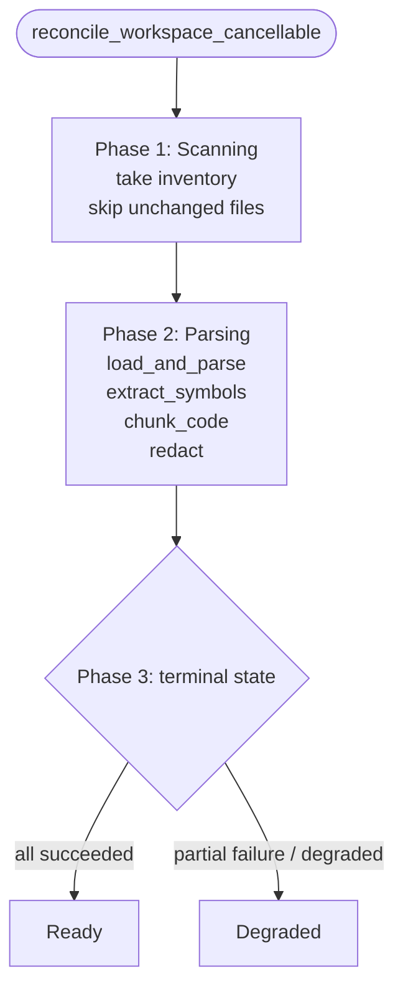
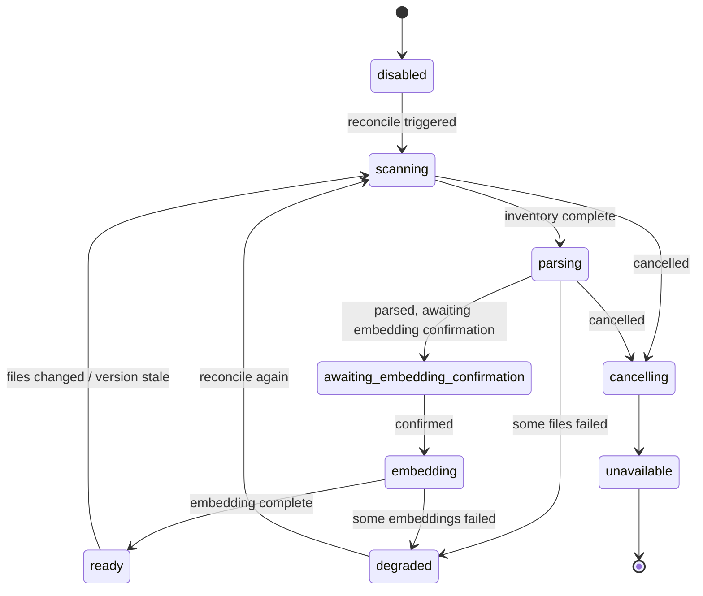

# Tree-sitter code indexing

Workspace code is parsed with Tree-sitter into bounded typed chunks and symbols. This is the local half of the `retrieval` bounded context — it runs without any external service and makes FTS available before embedding is confirmed. The shared host-level memory pool is a separate concern covered in [Retrieval and vector search](retrieval.md).

## Admitted code and error tolerance

Only admitted code is parsed, using the selected Tree-sitter grammar for each language. Parsing is tolerant: when a file contains syntax errors, the system indexes only bounded chunks derived from valid named subtrees around the errors. Erroneous subtrees are not indexed.

## Bounded typed chunks

Each chunk is persisted with: workspace id, normalized relative path, language, line range, symbol name, symbol kind, chunk key, and index version. Symbol definition metadata (e.g. a function or class definition's name, kind, and definition range) is persisted during the same file transaction, so a symbol is discoverable alongside its chunks.

## Chunk budget and splitting

A single symbol larger than the configured chunk budget is split into multiple chunks. Every resulting chunk remains attributable to its source symbol and file range.

## Redaction before persistence

The unified sensitive-information policy is applied to admitted code before any chunk text is persisted, embedded, logged, audited, or returned from `search_code`. Raw code content is not duplicated into retrieval storage. A chunk containing a sensitive value carries a redacted marker instead of the value.

## Index version and staleness

A code index version covers grammar compatibility, Tree-sitter queries, chunking, and redaction policy. A version mismatch marks affected workspace files stale and rebuilds them in bounded batches. The native worker performs metadata-first reconciliation and reads or parses only new or changed files.

## The index build pipeline

Workspace code indexing is driven by `reconcile_workspace_cancellable` across three phases. Every phase can be cancelled, after which the run transitions to `cancelling` and finally lands on `unavailable` or restarts.

What matters in each phase:

- **Scanning (taking inventory)** — reconciliation is selective and manifest-driven, reading or parsing only new or changed files and skipping unchanged ones outright. The manifest records each file's path, hash, language, and index version.
- **Parsing (`load_and_parse` + `extract_symbols` + `chunk_code` + `redact`)** — parsing uses the Tree-sitter grammar for the language and tolerates syntax errors, deriving chunks only from the valid named subtrees around an error. `.scm` queries then extract symbol definition metadata (name, kind, definition range), chunks are cut to budget, and chunk text is finally redacted.
- **Ready / Degraded** — once every file parses and persists successfully the index reaches `Ready`. If some files were skipped for syntax errors or IO failures but a usable index was still produced, it reaches `Degraded`.

The hard rules of chunking and redaction:

- **Grammar support** — grammars are built in for JS, TS, TSX, Python, Rust, Go, Java, C, and C++. A file outside that list is not parsed and produces no chunks.
- **Chunk rule** — the default budget is `DEFAULT_MAX_CHUNK_BYTES = 6KB`, and cuts land on named child-node boundaries, so every chunk that comes out is still attributable to its source symbol and file range.
- **Symbol extraction** — one set of `.scm` queries per language extracts definition metadata for functions, classes, methods, and the like, persisted together with the chunks in the same file transaction.
- **Redaction** — the unified policy replaces six classes of sensitive pattern with `[REDACTED]` by regular expression before persistence, embedding, logging, auditing, or returning from `search_code`. Raw code content never enters retrieval storage.
- **The mandatory sensitive-path denylist** — paths such as `.env*`, private key files, and `.ssh/` are rejected at admission and never reach the parsing pipeline at all.
- **Manifest-driven selective reconciliation** — unchanged files are skipped and only new or changed files are processed. `CODE_INDEX_VERSION` marks the version of the current grammar, queries, chunking, and redaction policy, and a file whose version does not match is marked stale and rebuilt.

The index phase is itself a state machine:

## Key constants and admission

### Chunking and version constants

| Constant | Value | Meaning |
| --- | --- | --- |
| `DEFAULT_MAX_FILE_BYTES` | `100 * 1024` (100KB) | Single-file admission ceiling; a larger file is not parsed |
| `DEFAULT_MAX_CHUNK_BYTES` | `6 * 1024` (6KB) | Per-chunk byte budget; beyond it the cut lands on a named child-node boundary |
| `CODE_INDEX_VERSION` | `"1"` | Version marker for grammar compatibility, Tree-sitter queries, chunk splitting, and redaction policy |

### Grammar support

Tree-sitter grammars are built in for nine languages: JS, TS, TSX, Python, Rust, Go, Java, C, and C++. A file outside that list is not parsed and produces no chunks.

### The chunking rule

Cuts land on named child-node boundaries (`named_child_cut_points` and `split_range`), and each chunk carries structural context — the symbol it belongs to and its file range — so every chunk can be traced back to its source symbol and file position.

### The six redaction classes

Before persistence, embedding, logging, auditing, or returning from `search_code`, the unified policy replaces six classes of sensitive pattern with `[REDACTED]` by regular expression:

1. Private keys, such as PEM blocks
2. Assignments in the form `api_key=`
3. Assignments in the form `token=`
4. `bearer` and `Authorization: Bearer` headers
5. Provider token prefixes such as `sk-`, `ghp_`, `github_pat_`, and `AKIA[A-Z0-9]{12,}`
6. Internal URLs

A match is replaced with `[REDACTED]` and accumulated into a `redaction_count` written to the chunk metadata. Raw code content never enters retrieval storage.

### The mandatory sensitive-path denylist

`is_mandatory_sensitive_path` rejects a set of mandatory sensitive paths at admission, and user configuration cannot override it. It covers `.env*`, `id_rsa` and private key files, `.ssh/`, `.aws/`, `.azure/`, `.kube/`, `secrets/`, `*.key`, and `*.pem`.

### The CodeIndexPhase state machine

The phase is itself a state machine, with reachable states `disabled` → `scanning` → `parsing` → `awaiting_embedding_confirmation` → `embedding` → `ready` or `degraded`. Cancellation enters `cancelling` and finally lands on `unavailable`.

### Manifest-driven selective reconciliation

The manifest records each file's path, hash, language, and index version. Unchanged files are skipped and only new or changed files are processed. `reconcile_paths` supports three change semantics — `Upsert`, `Delete`, and `Rename` — and updates the index incrementally from them.

## Where the design lives

This chapter orients contributors. The authoritative requirements live in the spec.

- [openspec/specs/workspace-code-indexing](../../../openspec/specs/workspace-code-indexing/spec.md)

The `retrieval` bounded context that owns this is described in [Native bounded contexts](native-contexts.md); the shared memory pool half is in [Retrieval and vector search](retrieval.md).
