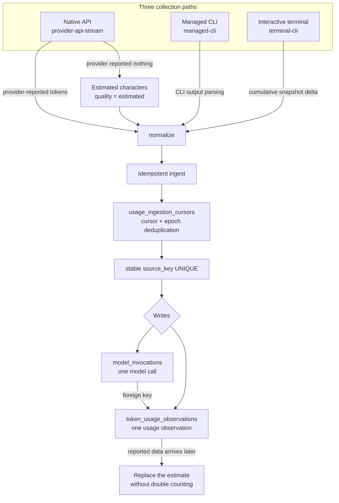

# Usage statistics

VaneHub records per-response usage for VaneHub-managed assistant responses and summarizes it in the settings center. There is no external billing integration; this is first-version local usage accounting.

## Reported tokens vs estimated characters

Two categories are kept strictly separate:

- **Reported tokens** — fresh-input, output, cache-read, cache-creation, and total, taken from provider-reported usage. Reported total equals the sum of those four categories.
- **Estimated characters** — input, output, and total, derived from character counting when provider-reported usage is unavailable. Estimated characters are never added to any reported token total.

Statistics also return reported/estimated/total counted response counts, counted sessions, daily trend points, per-Agent breakdown rows keyed by stable Agent id, and the percentage of counted responses backed by reported usage. A range with no records returns zero-valued totals and empty arrays instead of failing.

## Time ranges

Supported ranges are today, last seven days, last thirty days, and all time, computed on the active runtime's user-local calendar.

## Collection paths and accounting quality

Usage enters the system along three source paths with different levels of trust. They must stay strictly separated and must never be summed together.

- **Native API** (`provider-api-stream`) — consumes the provider's streaming response directly, preferring provider-reported tokens. When the provider reports nothing, characters are estimated from a character count and marked with `estimated` quality, never added to `reported` tokens.
- **Managed CLI** (`managed-cli`) — parses each CLI's output to extract usage, merged at message and step granularity.
- **Interactive terminal** (`terminal-cli`) — derived from deltas in the terminal's cumulative snapshot, deduplicated idempotently by a stable `source_key`.

The accounting-quality constraints:

- **Four dimensions plus an authoritative total** — the dimensions are `input`, `output`, `cached_input`, and `cache_write_input`, plus a separate `reasoning_output`. `provider_total` is the authoritative total and should equal the sum of the four. `reasoning_output` is reported separately and never folded into `output`.
- **Estimated characters are never added to tokens** — a character count with `estimated` quality always stays on its own row and never mixes into a `reported` or `reported-derived` token total. A database `CHECK` constraint enforces the consistency of `(quality IN ('reported','reported-derived') AND unit = 'tokens')`.
- **Reported data replaces an estimate** — when provider-reported data becomes available after the fact, the new `reported` observation replaces the earlier `estimated` one rather than stacking on it. Idempotence comes from `UPSERT` semantics on a stable `source_key`, which avoids double counting.
- **Cursor deduplication** — `usage_ingestion_cursors` records an ingestion cursor and `epoch` per source, so the same `source_key` from the same source is counted once and a replay across restarts does not double it.
- **Degrading to zero** — a time range with no records returns zero totals and empty arrays rather than failing. That applies to the reported, estimated, and total counted-response counts, the counted session count, daily trend points, the per-Agent breakdown rows indexed by stable Agent id, and the percentage of counted responses backed by reported usage.
- **OnePiece takes a different path** — the built-in OnePiece Agent has its own request and usage merge path, including merging sub-Agent spend into the parent turn, and does not share the generic `provider-api-stream` path.

Usage persistence lives in the `sessions` bounded context, carried by the `model_invocations` and `token_usage_observations` tables. The specification's source of truth is `openspec/specs/usage-statistics/spec.md`.

## Key types and collection details

The usage accounting domain model lives in `sessions/domain/usage_accounting.rs`, with collection and persistence in `sessions/infrastructure/usage_accounting.rs`:

- **Accounting dimensions, `TokenDimensions`** — the four dimensions `input`, `output`, `cached_input`, and `cache_write_input`, plus a separate `reasoning_output` that is not folded into `output`. `provider_total` is the authoritative total.
- **Quality grading, `MeasurementQuality`** — `reported` (genuinely reported by the CLI), `reported-derived` (a difference between cumulative snapshots), and `estimated` (a character estimate).
- **Accounting unit, `AccountingUnit`** — `tokens` or `characters`, with a database `CHECK` constraint enforcing `quality IN ('reported','reported-derived') AND unit = 'tokens'`.
- **Collection paths**:
  - Native API (`provider-api-stream`) — with `ReportedUsageTotals` present, writes `reported` plus `tokens`; otherwise writes `estimated` plus `characters` from `estimated_characters`, with `normalization_version = "api-character-count-v1"`.
  - Managed CLI (`managed-cli`) — `output_parser_for(agent_id)` in `providers/output.rs` parses each CLI's output, including cases such as Antigravity's `input_tokens`, `cache_read_tokens`, and thinking folding.
  - Interactive terminal (`terminal-cli`) — `terminal_usage_ledger.rs` achieves idempotence with a stable `terminal-cursor:{session}:{agent}` source key plus the `usage_ingestion_cursors` cursor. A cumulative decrease or a changed provider session opens a new epoch (`Reset`), and only positive differences are taken.
- **The idempotence mechanism** — `UPSERT` semantics on a stable `source_key` plus cursor epoch deduplication. Reported data arriving later **replaces** an estimate rather than stacking on it; a failure or cancellation produces no character estimate; and an empty range degrades to zero rather than erroring.
- **Query projection** — by time range (`today`, `last7Days`, `last30Days`, `all`, in local calendar semantics), broken down per Agent, provider, model, purpose, and status. `coverage()` returns the proportion backed by real data.

## Where the design lives

This chapter orients contributors. The authoritative requirements live in the spec.

- [openspec/specs/usage-statistics](../../../openspec/specs/usage-statistics/spec.md)

Usage persistence sits in the `sessions` bounded context; see [Native bounded contexts](native-contexts.md).
