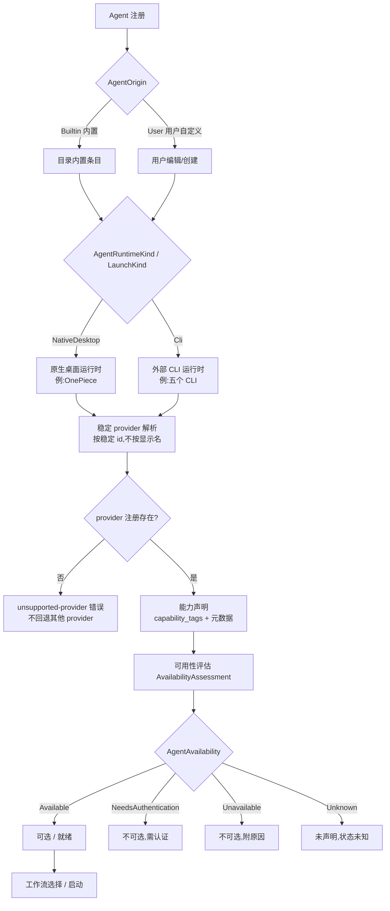

# Agent 生命周期与 provider 运行时

本章覆盖已注册 Agent(内置的 OnePiece 除外)如何被编辑,以及运行时如何在不引入应用层 provider 身份分支的前提下,将一个稳定的 Agent id 解析为具体的 provider 契约。

## 编辑已注册的 API Agent

用户创建的 API Agent 的显示名称、模型 id、Base URL 与存储的 API key 是可编辑的。该 Agent 的 `id`、`provider` 与 `interface format` 通过普通编辑操作是不可变的。编辑会像注册一样重新校验:针对 `openai-compatible` Agent 省略必需的 Base URL 会拒绝整个编辑,不会持久化其中任何一部分。轮换的 API key 会替换已存储的凭据,并在下一次生成时生效。

OnePiece 是例外:它使用由目录支持的专用 provider **Profile** 操作,保留稳定的 id `onepiece`,同时允许配置多个各自独立受保护的 provider/endpoint/model 组合,以及一个显式的活跃 Profile。OnePiece 的 provider、endpoint 类型、interface format 与 Base URL 都从所选的内置目录条目解析——从不被直接编辑。

## 稳定的 provider 解析

Agent 运行时通过一个 **provider registry** 来解析受支持的内置 CLI 运行时行为,该 registry 以 Agent registry 条目的稳定 id 为键。与 provider 无关的应用与 Session 模块不会根据 provider 身份分支来选择行为。一个没有兼容 provider 注册的 Agent id 会返回一个分类好的 `unsupported-provider` 错误,且不会回退到其他 provider。

## Provider 元数据与能力

每个注册的 provider 各自声明经过校验的元数据、就绪前提与受支持的运行时能力(interaction、resume、structured-output、terminal、usage、permission、model-selection、reasoning),独立于显示名称匹配或调用方推断。provider 未声明的能力不会被静默假设为存在。

## Agent 注册与可用性

一个已注册 Agent 从被加入注册表到被启动,要经过起源分类、运行时解析、能力声明与可用性评估若干阶段。下图展示从注册到启动的主干流程。

### 注册表与起源

- **稳定的 agent id** —— 每个 Agent 以一个持久 id 标识,在该 Agent 参与的所有会话中保持不变。id 是 provider 解析、Loop 定义(Worker/Verifier id)等所有引用的键,而非显示名。
- **`AgentOrigin`** —— 内置 Agent(`Builtin`)由目录支持,用户自定义 Agent(`User`)由用户创建并可在注册表中编辑。
- **`AgentRuntimeKind` / `LaunchKind`** —— 区分运行时形态:`NativeDesktop`(原生桌面运行时)与 `Cli`(外部 CLI 运行时),以及其他形态。

### provider 解析与能力

- **provider 解析稳定性** —— 运行时通过以 Agent registry 条目稳定 id 为键的 **provider registry** 解析受支持的内置 CLI 运行时行为,与 provider 无关的应用与 Session 模块不会按 provider 身份分支选择行为。
- **无回退** —— 一个没有兼容 provider 注册的 Agent id 返回分类好的 `unsupported-provider` 错误,且不回退到其他 provider。
- **能力声明** —— 每个注册 provider 各自声明经过校验的元数据、就绪前提与受支持的运行时能力(interaction、resume、structured-output、terminal、usage、permission、model-selection、reasoning),独立于显示名称匹配或调用方推断。provider 未声明的能力不会被静默假设为存在。

### 可用性状态与选择

`AgentAvailability` 由 `AvailabilityAssessment::assess()` 综合托管 SDK 依赖状态(`ManagedSdkStatus`)与可执行文件状态(`ExecutableStatus`)得出。

| 状态 | 含义 | 可选性 |
| --- | --- | --- |
| `Available` | 托管 SDK(若需要)已安装且可执行文件在 PATH | 可选,可进入会话 |
| `NeedsAuthentication` | 需要补充认证 | 不可选 |
| `Unavailable` | 托管 SDK 缺失/未识别或可执行文件不在 PATH,附原因 | 不可选 |
| `Unknown` | 未声明可执行文件 | 状态未知 |

`ensure_selectable()` / `ensure_session_selectable()` 在选择前做两道闸:先查 `AgentAvailability`,不可用直接拒绝并带原因;再查该 Agent 是否声明了目标 `InteractionMode`,不支持则拒绝。

### 注册表编辑与内置例外

- **用户自定义 API Agent 可编辑** —— 显示名称、模型 id、Base URL 与存储的 API key 可编辑;`id`、`provider`、`interface_format` 通过普通编辑操作不可变。编辑与注册一样重新校验,失败时整个编辑被拒绝,不部分持久化。
- **OnePiece 是内置例外** —— OnePiece 是 builtin + NativeDesktop,使用由目录支持的专用 provider **Profile** 操作,保留稳定 id `onepiece`,其 provider、endpoint 类型、interface format 与 Base URL 都从所选内置目录条目解析,从不被直接编辑。
- **五个 CLI 是内置 CLI** —— `claude-code`、`codex-cli`、`gemini-cli`、`opencode`、`antigravity-cli` 均为 builtin + Cli,由内置 provider registry 解析运行时行为。

## 关键类型与常量

下表汇总 Agent 生命周期与 provider 运行时的核心类型、常量与错误码,供实现时快速查阅。权威语义仍以本节前文与规范为准。

### 起源与运行时形态

- `AgentOrigin` 枚举 —— `Builtin`(由内置目录支持)与 `User`(用户自定义,可在注册表中编辑)。
- `AgentRuntimeKind` / `LaunchKind` —— `NativeDesktop`(原生桌面运行时,如 OnePiece)与 `Cli`(外部 CLI 运行时,如五个 CLI)。

### 稳定 agent id

每个 Agent 以一个持久 id 标识,在该 Agent 参与的所有会话中保持不变。id 是 provider 解析、Loop 定义(Worker/Verifier id)等所有引用的键,而非显示名。

### provider 解析稳定性

运行时通过以 Agent registry 条目稳定 id 为键的 **provider registry** 解析受支持的内置 CLI 运行时行为。与 provider 无关的应用与 Session 模块不会按 provider 身份分支选择行为。

- **无回退** —— 没有兼容 provider 注册的 Agent id 返回分类好的 `unsupported-provider` 错误,且不回退到其他 provider。

### 能力声明

每个注册 provider 各自声明经过校验的元数据、就绪前提与 `capability_tags`,外加受支持的运行时能力:

- `interaction`、`resume`、`structured-output`、`terminal`、`usage`、`permission`、`model-selection`、`reasoning`。

provider 未声明的能力不会被静默假设为存在。

### 可用性状态

`AgentAvailability` 由 `AvailabilityAssessment::assess()` 综合托管 SDK 依赖状态(`ManagedSdkStatus`)与可执行文件状态(`ExecutableStatus`)得出,四状态:

- `Available` —— 可选,可进入会话
- `NeedsAuthentication` —— 不可选,需补充认证
- `Unavailable` —— 不可选,附原因
- `Unknown` —— 未声明可执行文件,状态未知

### 选择闸

`ensure_selectable()` / `ensure_session_selectable()` 在选择前做两道闸:

1. 先查 `AgentAvailability`,不可用直接拒绝并带原因
2. 再查该 Agent 是否声明了目标 `InteractionMode`,不支持则拒绝

### 用户自定义 API Agent 可编辑字段

- **可编辑** —— 显示名、模型 id、Base URL、存储的 API key(轮换的 key 替换已存储凭据,下一次生成生效)
- **不可变** —— `id`、`provider`、`interface_format`
- **校验** —— 编辑与注册一样重新校验;失败时整个编辑被拒绝,不部分持久化(例如 `openai-compatible` Agent 省略必需的 Base URL 会拒绝整个编辑)

### 内置例外

- **OnePiece** —— `builtin` + `NativeDesktop`,稳定 id `onepiece`;使用由目录支持的专用 provider **Profile** 操作,允许配置多个独立受保护的 provider/endpoint/model 组合与一个显式活跃 Profile。provider、endpoint 类型、interface format 与 Base URL 都从所选内置目录条目解析,**从不被直接编辑**。
- **五个 CLI** —— `claude-code`、`codex-cli`、`gemini-cli`、`opencode`、`antigravity-cli` 均为 `builtin` + `Cli`,由内置 provider registry 解析运行时行为。

## 设计所在

本章用于为贡献者定向。权威的需求位于规范中。

- [openspec/specs/agent-lifecycle-management](../../../../openspec/specs/agent-lifecycle-management/spec.md)
- [openspec/specs/agent-provider-runtime](../../../../openspec/specs/agent-provider-runtime/spec.md)
- [openspec/specs/agent-switching](../../../../openspec/specs/agent-switching/spec.md)

native 执行路径位于 `agent_runtime` bounded context 中;见 [Native bounded context](native-contexts.md)。
