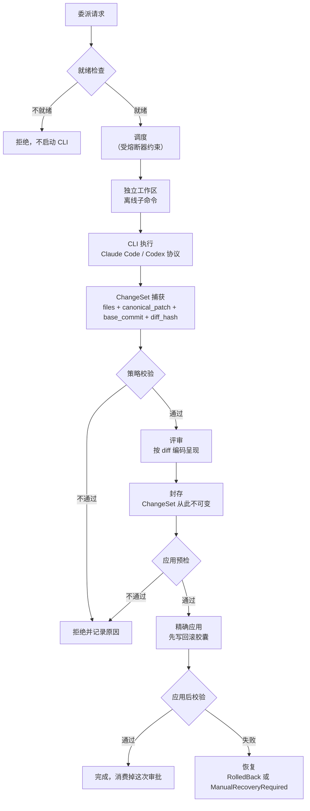

# CLI 委派与 ChangeSet 管线

`cli_delegation` 上下文做的是一件和 [Agent 生命周期](agent-lifecycle.md)不同的事：**把一段工作交给 Claude Code 或 Codex CLI 去做，但不让它直接改你的仓库**。

CLI 在一个隔离工作区里跑，产出被捕获成一个 **ChangeSet**，经过评审、封存，最后才可能被精确地应用到目标仓库上——而且只能应用一次。

## 隔离到什么程度

规范对执行环境的要求是**独立、无 remote 的 Git 环境**，具体到四条：

- **新建的临时克隆**，detach 在捕获到的那个干净提交上，拥有**独立的 Git object store**。
- **没有配置任何 remote**。子进程去查 remote 时，找不到任何能 fetch 或 push 的目标——**这一条把「改完顺手推上去」从可能性里彻底移除**，而不是靠约定或权限拦。
- **产物输入以只读方式落在 Git 工作区之外**，控制器元数据对子进程不可见。
- **子进程不在、也不写用户的目标工作区**。分析型委派里克隆对子进程只读，任何被观察到的工作区变更直接判这次尝试失败；编辑型委派里只有克隆内被准入的路径可写。

认证同样受限：控制器让每个 CLI 用**它自己的认证机制**，不复制 OAuth token、也不把 API key 注入提示词、参数、日志、SQLite、Artifact 或子进程可见的环境。子进程拿到的是**最小允许清单环境**；控制面到 provider 的连通性不等于子命令有网络。

> V1 的两条具体收窄：**Claude Code 拿不到 Bash 或任何命令执行工具**；**Windows 上的 Codex 委派保持不可用**，直到一个独立的「provider 与子进程网络隔离」探针通过。

> 这条链路上的每个阶段都由独立的发布门控控制，默认全部禁用。门控清单见 [OnePiece 内置工具](onepiece-builtin-tools.md)。

## 三个门控划出三段能力

| 门控 | 能力 | 边界 |
| --- | --- | --- |
| `VANEHUB_ONEPIECE_DELEGATION_ANALYZE_ENABLED` | 分析 | CLI 只读，不产生改动 |
| `VANEHUB_ONEPIECE_DELEGATION_EDIT_ENABLED` | 隔离编辑与 ChangeSet 封存 | 在独立工作区里改，产出封存的 ChangeSet |
| `VANEHUB_ONEPIECE_DELEGATION_APPLY_ENABLED` | 一次性精确应用 | 把已封存的 ChangeSet 落到目标仓库 |

**分级是刻意的**：开了分析不等于开了编辑，开了编辑不等于开了应用。回退某一级只需移除对应环境变量并重启，追加式迁移与已保留的证据不会被删除。

## 管线全貌

## ChangeSet 的硬上限与拒绝原因

`DelegationChangeSetPolicy::validate` 在捕获之后立即校验，硬天花板是 `DelegationChangeSetLimits::HARD_CEILING`：

| 限额 | 值 |
| --- | --- |
| 文件数 | **256** |
| 规范化 patch 字节数 | **32 MB** |
| 单条路径字节数 | **4096** |

六种拒绝原因，含义各不相同：

| `DelegationChangeSetPolicyError` | 触发条件 |
| --- | --- |
| `EmptyChangeSet` | 文件列表为空，或 `canonical_patch` 为空 |
| `LimitExceeded` | 文件数或 patch 体积超过上限 |
| `IncompleteEvidence` | `base_commit` 为空，或 `diff_hash` 不是 `sha256:` 开头的 71 字符 |
| `UnsafePath` | 路径不安全（绝对路径、父级穿越等）或超长 |
| `PathCollision` | 两条路径归一化后相同 |
| `UnsupportedFileType` | 文件模式不在支持集内 |

**路径冲突检测把 `\` 归一成 `/` 并转小写再比对**——这不是洁癖：在大小写不敏感的文件系统上，`Src/Main.rs` 和 `src/main.rs` 是同一个文件，放行会让两条 patch 互相覆盖。

**`IncompleteEvidence` 是把「证据不全」和「改动不合法」分开的那一条**。缺 `base_commit` 或哈希格式不对，说明这份捕获本身不可信，与改动内容好不好无关。

## 熔断器只对完整性失败起跳

`DelegationCircuitFailure` 有九种，但 `trips_circuit()` 只对其中四种返回真：

| 失败类别 | 触发熔断 | 为什么 |
| --- | --- | --- |
| `ProtocolIntegrity` | ✅ | 协议层坏了，重试只会继续坏 |
| `SandboxIntegrity` | ✅ | 隔离失效，继续跑有风险 |
| `ProcessTreeIntegrity` | ✅ | 进程树失控 |
| `CleanupIntegrity` | ✅ | 清理没做干净 |
| `Authentication` | ❌ | 凭据问题，换凭据即可 |
| `ProviderRefusal` | ❌ | 厂商拒绝了这次请求 |
| `TaskFailure` | ❌ | 这道题没做出来 |
| `ModelQuality` | ❌ | 结果质量不行 |
| `ProjectTestFailure` | ❌ | 项目测试没过 |

**这条区分是这个上下文最值得记住的设计**：「模型没干好」不是基础设施故障。任务失败、质量不佳、测试不过都属于正常结果，让它们跳闸会因为一次做不出的任务而封停整条委派链路。只有**完整性**类失败——协议、沙箱、进程树、清理——才说明运行时本身不可信。

状态机是 `Closed` 与 `Open { failure_count, retry_after_millis }`，由阈值、观察窗口与冷却时长参数化；兼容路径上的成功会清掉观察记录。

## 应用是一次性的

`DelegationApplyPreflightError` 的十种取值把「不能应用」的原因拆得很细：

| 错误 | 含义 |
| --- | --- |
| `InvalidRequest` | 请求本身不合法 |
| `ArtifactUnavailable` | 取不到已封存的产物 |
| `IntegrityFailure` | 产物完整性校验失败 |
| `TargetUnavailable` | 目标仓库不可达 |
| `RepositoryMismatch` | 目标不是当初捕获时那个仓库 |
| `StaleBase` | 目标已经不在 `base_commit` 上了 |
| `DirtyTarget` | 目标工作区有未提交改动 |
| `PlatformIncompatible` | 平台不兼容 |
| **`ApprovalConsumed`** | **这次审批已经用掉了** |
| `StateFailure` | 状态持久化失败 |

`ApprovalConsumed` 与独占租约一起构成「精确的一次性应用」：**一次审批只能兑现一次**，重放同一个已封存的 ChangeSet 不会再落一遍。

### 回滚胶囊与恢复

应用前先写**回滚胶囊**（`DelegationRecoveryCapsule`），并留下 pre-apply 见证。恢复只有两种结局：

- **`RolledBack`** —— 从胶囊完整还原，目标回到应用前的状态。
- **`ManualRecoveryRequired`** —— 无法确定性还原，**如实报告并留下证据供人工处理**，而不是猜一个状态然后声称成功。

`verify_pre_apply_witness` 是这两者的分界：见证对不上就不敢自动还原。

## 与其他上下文的关系

- 委派用的 CLI 与 [Agent 生命周期](agent-lifecycle.md)里注册的是同一批 CLI，但**走的不是同一条路径**：普通会话把 CLI 挂在 [终端与 PTY 运行时](terminal-runtime.md)上交互，委派则在独立工作区里非交互地跑完一轮。
- 隔离工作区与目标仓库的 Git 状态由 `workspaces` 提供，见 [Native 限界上下文](native-contexts.md)。
- 门控、依赖与回退触发条件见 [OnePiece 内置工具](onepiece-builtin-tools.md)。
- 用户侧的评审界面见用户指南的代码评审一章。

## 设计所在

本章用于为贡献者定向，权威需求位于 spec 中。委派链路的行为契约——隔离、封存、一次性应用与恢复——以 `openspec/specs` 下对应能力的主规范为准。
