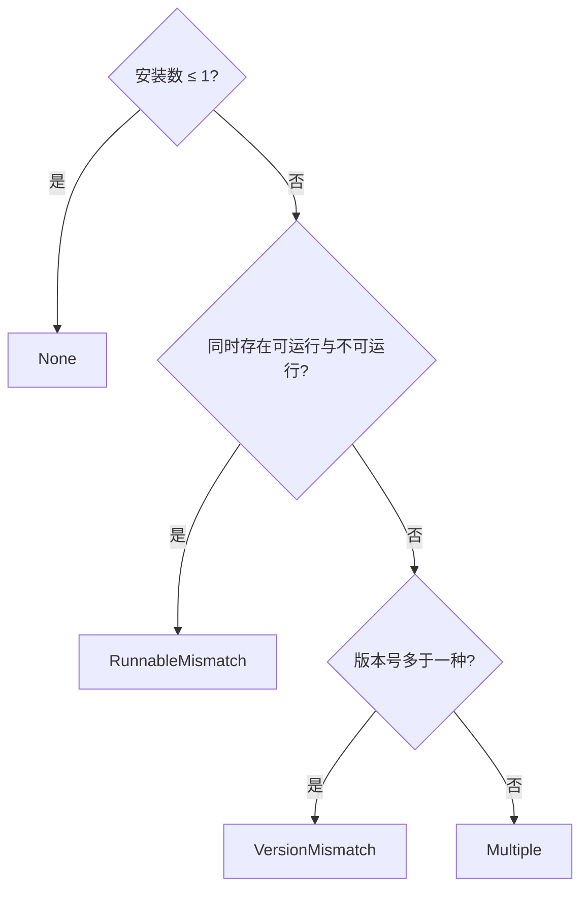

# CLI 生命周期与全局配置

`tooling` 是最大的限界上下文，它的 Skill 与 MCP 子域各有专章（[Skill 管理](skill-management.md)、[MCP 工具与客户端](mcp-tools.md)）。本章讲另一半：**CLI 本身的检测、冲突判定、安装升级，以及把 provider 配置写进各 CLI 自己的配置文件**。

## 目录是编译期常量

`CLI_TOOL_DEFINITIONS` 是一个 `[ToolDefinition; 5]` 常量数组，不是运行时可扩展的注册表：

| Agent | 可执行文件 | npm 包 | 安装脚本 |
| --- | --- | --- | --- |
| Claude Code | `claude` | `@anthropic-ai/claude-code` | shell |
| Codex CLI | `codex` | `@openai/codex` | 无 |
| Gemini CLI | `gemini` | `@google/gemini-cli` | 无 |
| OpenCode | `opencode` | `opencode-ai` | shell |
| Antigravity CLI | `agy` | **无** | shell + PowerShell |

`package_name: Option<&str>` 的文档注释解释了为什么是 `Option`：

> `None` for CLIs distributed only by installer script, which have no npm package to install, query for versions, or name in guidance.

**Antigravity 的 `None` 会连锁影响三件事**：装不了、查不了版本、连提示文案里都不该提 npm。把它写成空字符串而不是 `None`，这三处都得各自判空。

### 平台决定用哪个安装脚本

`platform_installer()` 的注释点出了为什么 URL 不能单独存在：

> Windows has no POSIX shell to run a `.sh` installer through, so a CLI that ships only a shell installer relies on its npm or winget package there.

**解释器要跟着 URL 一起走**——`ScriptInstaller::Shell` 与 `PowerShell` 是带值的枚举，而不是一个裸 URL 加一个平台判断。把 `.sh` 脚本喂给 PowerShell 会当作乱码执行。

## 冲突判定：三种冲突不是同一回事

`derive_conflict_state` 在发现多份安装时逐级判定：

**顺序有讲究**：先判「可运行性不一致」再判版本，因为一份坏掉的安装比版本不同更要紧——版本不同至少都能跑，而 `RunnableMismatch` 意味着你以为在用的那份可能根本起不来。

`InstallSource` 九种（`Npm`、`Winget`、`Desktop`、`Homebrew`、`Volta`、`Bun`、`Vendor`、`System`、`Unknown`）——**来源要分得这么细，是因为升级路径跟着来源走**。

## 升级资格：只有 npm 装的才代升

`derive_lifecycle_eligibility` 的判定：

- **未安装** → 有平台安装脚本就是 `Wget`，否则有 npm 包就是 `Npm`，都没有就是 `Manual`。
- **已安装** → 只有当**当前生效那份**同时满足「可运行」「来源是 `InstallSource::Npm`」「目录里有 npm 包名」时，才是 `Npm`（可代为升级）；否则落到 `Manual` 或 `Unavailable`。

**「当前生效那份」是关键限定**。装了三份、其中一份来自 npm，不代表能用 npm 升级——因为 `PATH` 命中的可能是 Homebrew 那份。用 npm 再装一份只会让冲突更严重，而命令行里跑的还是旧的，表现为「升级没生效」。

界面上那句提示就是这条逻辑的投影：

> 当前生效路径来自 {来源}，请使用该来源的更新方式；VaneHub 不会用 npm 新增另一份副本来冒充升级。

`VersionCheckStatus` 四态把「不支持」「没检测到」「查成功」「查失败」分开——**`NotDetected` 与 `Failed` 混为一谈会让「没装」和「装了但坏了」变成同一件事**，而这两者的处理方式完全相反。

## 全局配置：改写各 CLI 自己的文件

`cli_config` 子域是 `tooling` 里唯一**主动改写外部程序配置文件**的部分。五个 Agent 各有纳管文件，语义见 [CLI Agent 全局配置](../../../cli-agent-global-configuration.md)。

四条写入约束：

- **只替换 VaneHub 拥有的字段**。`settings.json` 里的 hooks、permissions、plugins，`config.toml` 里的 projects、MCP server、注释与无关 provider，全部原样保留。
- **先在内存里构建完整结果，再原子替换**。Codex 涉及多文件时，任一步失败会把已改的文件全部还原。
- **切换配置前先回填**。离开某份配置时，把当前生效文件里的纳管字段读回写进那份配置——否则你在文件里的手工微调会被静默丢弃。
- **漂移只报告不覆盖**。应用后给纳管片段留指纹；文件被外部改动时报告漂移，应用过程中检测到并发改写则中止写入。

凭据按 Agent/配置分账存在操作系统凭据服务里，不落 SQLite；只有显式「应用」时才把明文写进那个 CLI 要求明文的文件。

**应用成功后运行中的 CLI 进程不会自动重启**——不声称热重载。

## 与其他上下文的关系

- 检测到的 CLI 如何成为可用 Agent，见 [Agent 生命周期与 provider 运行时](agent-lifecycle.md)。
- CLI 起进程之后的交互路径见[终端与 PTY 运行时](terminal-runtime.md)；非交互的委派路径见 [CLI 委派与 ChangeSet 管线](cli-delegation.md)。
- provider 目录与 OnePiece 共用同一份，见 [OnePiece native Agent](onepiece-native-agent.md)与[内置模型提供商目录](../../../model-providers.md)。
- 用户侧流程见用户指南的安装并认证 CLI 一章。

## 设计所在

本章用于为贡献者定向，权威需求位于 `openspec/specs` 下对应能力的主规范中。
