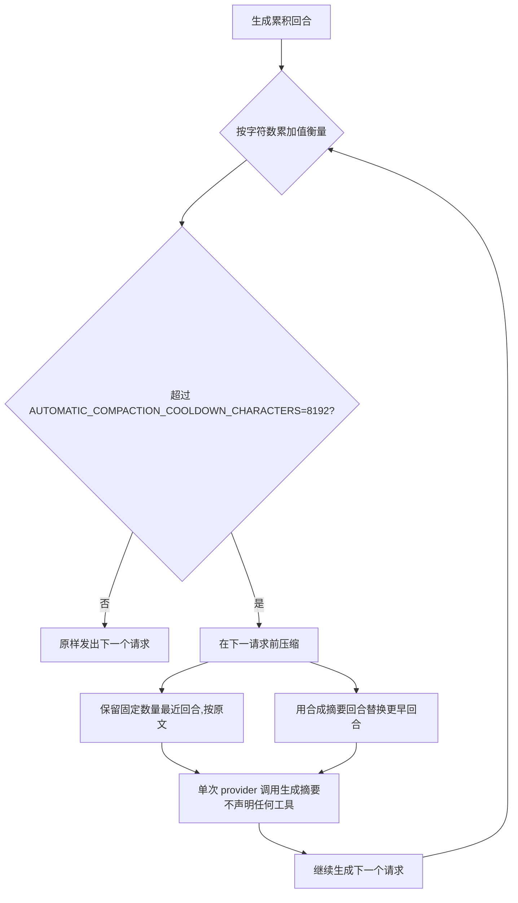

# 上下文压缩

一次生成所累积的回合以**字符数累加值**衡量,而非按 provider 上报的 token 数。当运行总数超过固定阈值时,运行时会在发送下一个请求之前进行压缩。这一设计刻意避免依赖 provider 实际上报的 token 数来决定何时压缩。

## 压缩触发时机

- 低于阈值 → 请求原样发出。
- 会话的对话历史本身就超过阈值 → 在该生成首个请求之前进行压缩。
- 工具调用循环(tool-use loop)中累积的回合(工具调用结果)把总数推过阈值 → 在该循环的下一个请求之前进行压缩。

## 摘要式压缩

当压缩触发时,运行时会按原文保留固定数量的最近回合,并用一个携带模型生成摘要的合成回合替换所有更早的回合。摘要调用是一次针对保留窗口之前回合的单次 provider 调用;该摘要调用不声明任何工具。

## 压缩机制详解

压缩决策完全基于字符数累加值，与 provider 上报的 token 数解耦。这一设计避免让"何时压缩"依赖于 provider 是否如实上报 token 用量。当累积字符数超过固定阈值时，运行时在发送下一个请求前触发摘要式压缩。

**字符数而非 provider token**：运行时主动维护 `AutomaticCompactionState`，按字符累计，不等待 provider 的 usage 上报。这保证压缩触发时机在所有 provider 上一致，即使某个 provider 不返回或不准确返回 token 计数，压缩仍可发生。

**AutomaticCompactionMode**：除默认自动压缩外，还存在 `Suppressed` 抑制模式——在该模式下，即使累积字符数超过阈值也不会触发自动压缩，由调用方负责控制上下文。抑制模式用于显式接管压缩时机的场景(例如长时 tool-use loop 中由上层决定何时裁剪)。

**触发时机细化**：

- 累积字符数低于阈值 → 请求原样发出，不做任何改动。
- 会话对话历史本身已超过阈值 → 在该生成的首请求之前压缩一次。
- 工具调用循环(tool-use loop)中累积的回合(工具调用结果)把总数推过阈值 → 在该循环的下一个请求之前压缩，避免循环中途上下文无限膨胀。

## 设计所在

本章用于为贡献者定向。权威需求——字符数触发与摘要式压缩——位于 spec 中。

- [openspec/specs/agent-context-compaction](../../../../openspec/specs/agent-context-compaction/spec.md)

压缩运行在 `agent_runtime` 限界上下文内,与 [Tool registry and execution](tool-registry.md) 中描述的工具调用循环位于同一路径。
