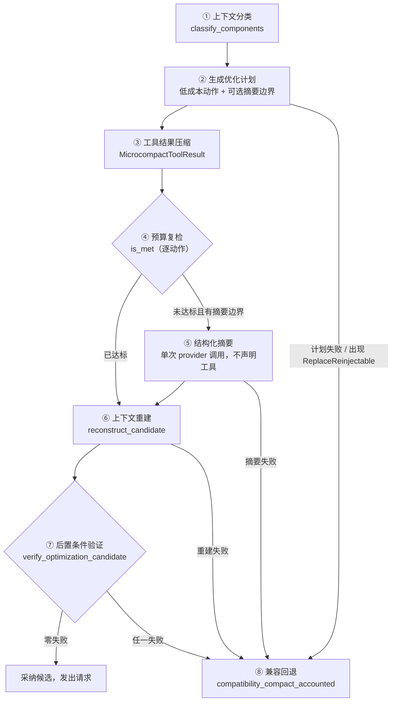

# 上下文压缩

上下文压缩只运行在 **OnePiece 原生 API 路径**上（`agent_runtime/infrastructure/api_process_adapter/`）：生成的首请求之前与工具循环的每一轮请求之前各检查一次。CLI Agent 的内部压缩由各 CLI 自己完成，VaneHub 不介入、也不计量。

压缩不是"达到阈值后保留最近几条消息、调用一次模型生成摘要并替换历史"——那只是**兼容回退路径**。当前实现是一条**优化器优先**的管线：先做上下文分类与低成本削减，逐动作复检预算，只有在需要时才发起一次结构化摘要调用，重建后还要通过后置条件验证；任一阶段失败才落回旧的摘要式压缩。**压缩不一定调用模型**：低成本动作（工具结果压缩）已达标时，整次压缩零模型调用。

## 触发判定：Token-aware 主路径，字符回退

`select_authoritative_compaction`（`domain/context_compaction_control.rs`）只看 Token 判定的 `should_compact: Option<bool>`：

- **`Some(v)`** —— 采用 v，来源 `TokenAware`。阈值在 `domain/context_measurement.rs` 计算：`threshold = context_window_tokens − reserve − buffer`，其中 `reserve = min(maximum_output_tokens, 20_000)`、`buffer = min(context_window / 10, 13_000)`。注意 `Some(false)` **不会**再落到字符判定——字符结果只作为分歧观测随决策记录。
- **`None`**（无容量目录或无 Token 计量）—— 采用字符回退，来源 `CharacterFallback`：递归遍历所有嵌套字符串（因此覆盖工具结果）计数，超过 `COMPACTION_TRIGGER_CHARACTERS = 60_000` 即触发。

模型容量按模型提供商（provider）与模型从 `model_context_catalog::resolve_capacity(provider, model)` 解析；运行时绝不臆造容量或 Token 值。

## 触发之前：早退与门禁

在门禁**之前**还有一个早退：回合数 ≤ `COMPACTION_KEEP_RECENT_TURNS = 6` 时以 `insufficient-context` 旁路——没有可回收的上下文。

门禁按固定优先级判定（`context_compaction_control.rs`）：

| 顺序 | `CompactionBypassReason` | 条件 |
| --- | --- | --- |
| 1 | `RequestSuppressed` | 请求级 `AutomaticCompactionMode::Suppressed`（该通道存在，但当前生产代码没有任何调用方设置它，仅测试使用） |
| 2 | `UserPreferenceSuppressed` | 用户在设置里关闭了自动压缩（`automaticContextCompactionEnabled`） |
| 3 | `CircuitOpen` | 连续失败达 `AUTOMATIC_COMPACTION_FAILURE_LIMIT = 2` 后熔断 |
| 4 | `Cooldown` | 距上次成功压缩的字符增长 < `AUTOMATIC_COMPACTION_COOLDOWN_CHARACTERS = 8_192` |

熔断与冷却状态是 **generation 作用域**的：每次生成重建（`execution.rs`），不跨生成累计。成功压缩清零失败计数并记录 `last_success_characters`。

## 优化器管线

主路径 `optimize_compaction_accounted`（`api_process_adapter/compaction.rs`）按以下阶段执行：



- **① 分类**：每个上下文组件得到语义类（`SemanticClass`，10 类）与保留类（`RetentionClass`）：`Protected`（系统指令、工具 schema、协议未完成回合）、`Verbatim`（当前用户意图、纠正、最后一回合）、`Summarizable`、`Microcompactable`、`Reinjectable`、`Discardable`。
- **③ 工具结果压缩**：ToolResult 且（重复，或字符数 ≥ `LARGE_TOOL_RESULT_CHARACTERS = 4_096`）→ 替换为一行 `[OnePiece compacted tool result] outcome=…; source=<指纹>` 标记，按保留 160 字符记账。
- **④ 预算复检**：每个动作之后用 `ContextOptimizationBudget::is_met` 复检（Token 优先，否则字符）；目标为 `min(OPTIMIZER_TARGET_CHARACTERS = 45_000, 原字符数 − 1)`。压缩完成后再生成 post 快照重算一次 `should_compact`。
- **⑤ 结构化摘要**：仅当计划带有 `summary_boundary`（必须从 round 0 起连续）才发起。低成本动作已达标时跳过——这就是"压缩不一定调用模型"。
- **⑦ 后置条件验证**：`VerificationFailure` 共 9 类——候选没变小、目标未达、受保护内容变了、逐字内容变了、组件顺序变了、协议不完整、动作不匹配、重注入缺失、覆盖不完整——必须**零失败**才采纳。

### 当前实现与规格的两处差距

分类与动作类型齐备，但两条削减通道在生产路径上未启用，这是**已知差距**而非文档遗漏：

- **`Discardable`（瞬态内容移除）** —— 动作与重建逻辑存在，但生产分类器从不产出 `Discardable`；唯一赋值处在离线策略评估支撑里。
- **`Reinjectable`（可重新注入内容引用化）** —— `component.reinjectable` 在生产投影中恒为 `false`；计划一旦出现 `ReplaceReinjectable` 动作，编排层直接放弃优化器整体回退（`FallbackReason::ReinjectionUnavailable`），验证时 required reinjections 也传空。`openspec/specs/agent-context-optimization` 描述的权威源重注入语义**尚未落地**，不要按 spec 当作已实现。

## 结构化摘要

优化器路径的摘要由 `STRUCTURED_SUMMARY_PROMPT`（`domain/context_summary.rs`）驱动，要求输出**恰好八个小节、按序**：

```text
## PRIMARY INTENT          目标
## TECHNICAL CONSTRAINTS   约束
## DECISIONS               决策
## FILES AND CODE AREAS    重要文件与代码区域
## ERRORS AND FIXES        错误与修复（风险信息也落在这里，没有独立的风险小节）
## COMPLETED WORK          已完成
## PENDING WORK            未完成事项
## IMMEDIATE NEXT ACTION   下一步
```

摘要是**机器校验**的（`parse_structured_summary`）：空、超长（上限 `STRUCTURED_SUMMARY_MAX_CHARACTERS = 12_000`）、缺节、重复节、乱序节、空节都判失败；版本标识 `onepiece-continuation-summary-v1`。

摘要调用的三条硬约束：

- **不声明任何工具**（tools 传空数组），摘要自身不会引发新的工具循环；
- **不继承用户生成选项**（`GenerationOptions::disabled()`，不带 thinking/推理深度）；
- **先剥离隐藏推理**：`strip_internal_generation_content` 在喂给摘要模型前删除 `thinking`/`reasoning`/`reasoning_content` 字段与 thinking 块，prompt 也明令禁止在摘要中包含隐藏推理。

**合成上下文不是用户的真实输入**。重建时摘要以 `role: "user"` 回合插入在前导 system 之后，内容带 `[OnePiece structured continuation summary: onepiece-continuation-summary-v1]` 标记前缀，可被识别、不冒充真实用户消息。

## 兼容回退

优化器任一阶段失败（`FallbackReason`：`InvalidPlan` / `InsufficientReclaimableContext` / `ReductionFailed` / `ReinjectionUnavailable` / `SummaryFailed` / `ReconstructionFailed` / `VerificationFailed`）都落到 `compatibility_compact_accounted`——优化器之前的 summary-only 路径：

- 保留最近 `COMPACTION_KEEP_RECENT_TURNS = 6` 个回合原文，对更早回合发起一次自由文本摘要调用（`SUMMARIZATION_INSTRUCTION`，无结构、无机器校验）；
- 合成回合同为 `role: "user"`，但**没有**标记前缀；
- 该路径**不剥离** thinking 内容再送摘要——这是与优化器路径的已知差异；
- 因此当优化器摘要失败后回退时，一次压缩最多可产生**两次**摘要调用（优化器一次 + 兼容一次）——spec 的"at most once"仅约束优化器路径。

**四类失败必须区分**：优化器失败（回退到兼容路径，不算压缩失败）、摘要失败（优化器内→回退；兼容路径内→整次失败）、验证失败（回退）、**回退失败**（兼容路径摘要调用失败或返回空 → `AutomaticCompactionOutcome::Failed`，`record_failure` 计入熔断，请求**原样发出**，生成继续）。只有压缩事件下沉失败才产生 `TerminalFailure` 终止生成。

## 用户可见性与观测

- **会话内通知**：每次成功压缩插入一张 `kind: "card"` 富块（标题 Conversation compacted），只含度量——前后字符/Token、节省量、计量质量、触发来源、压缩路径、策略版本——不含任何会话内容。
- **结构化日志**：`agent.context.compaction.control`（触发来源、质量、Token 阈值、旁路原因、冷却增长、连续失败、熔断）与 `session.runtime.api.context-optimizer`（成功/回退各阶段）。
- **用量记账**：摘要调用以 `UsagePurpose::ContextCompaction` 单独计费，前端归为内部用途。
- **质量评估落库**：outcome 四态 `Compacted/Bypassed/Fallback/Failed`，路径 `Optimizer/Compatibility`，原因 13 类（含 `ProviderFailure`、`PersistenceFailure`）。已知限制：优化器成功时的不变量证据当前硬编码全通过，未逐项映射验证结果。
- **前端契约**：设置开关在 OnePiece 压缩设置节（键 `automaticContextCompactionEnabled`）；上下文健康页与清单检视器展示压缩指标。**Web/mock** 有同形契约：mock 触发阈值 2 000 字符，发出与桌面同形的富块（固定 `compatibility` 路径、`character-fallback` 来源、Token 全空），不做真实模型调用。

## 关键字段归属（易混淆）

- `compaction_triggered: bool` 属于 `ContextEvidenceManifest`（context-engine 证据清单），与压缩执行路径无关；当前生产赋值**恒为 `false`**，是一个尚未接线的字段——不要拿它判断是否压缩过。
- `reserved_recent_turns: u64` 属于 `ContextBudget`（context-engine 证据预算），OnePiece 路径取 `12_288`（total 32 768、reserved_system 8 192、reserved_task 4 096、reserve 2 048）。它是**证据选择预算**的预留额度，与压缩触发阈值（§触发判定）完全无关。

## 设计所在

权威需求位于 spec；本章描述当前实现并标注差距。

- [openspec/specs/agent-context-compaction](../../../../openspec/specs/agent-context-compaction/spec.md) —— optimizer-first 管线、摘要约束、回退语义。
- [openspec/specs/agent-context-compaction-control](../../../../openspec/specs/agent-context-compaction-control/spec.md) —— 触发选择、门禁、冷却与熔断。
- [openspec/specs/agent-context-optimization](../../../../openspec/specs/agent-context-optimization/spec.md) —— 分类、动作与验证；其中权威源重注入与瞬态削减两节**在生产路径尚未落地**（见上文差距）。

压缩运行在 `agent_runtime` 限界上下文内，与[工具注册与执行](tool-registry.md)描述的工具调用循环位于同一路径。OnePiece 自动记忆抽取随压缩触发（当前仅在兼容回退路径上执行），见[跨会话记忆](cross-session-memory.md)。
