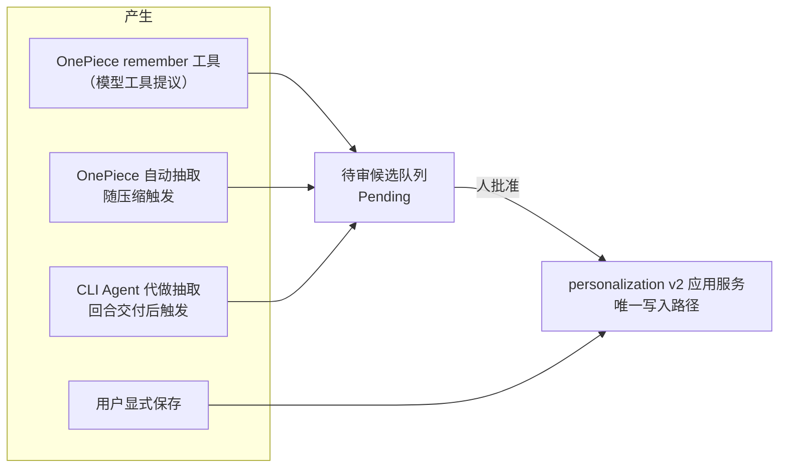

# 跨会话记忆

记忆是一个主机级共享池，OnePiece 与所有 CLI 包装的 Agent 共同读取。持久化与治理归 `personalization` 限界上下文（v2 应用服务是唯一生产写入路径），召回归 `retrieval`（见[检索与向量搜索](retrieval.md)）。每条记忆自带**作用域**（scope）与**受众**（audience）：共享是默认值，可按条收窄。

## 存储模型

- **文件是权威面**：主机级 `memory/` 目录，每条记忆一个 `{id}.md`，id 由存储生成（v2 允许重名，名字不做文件名）。
- **`MEMORY.md` 是有界、可截断、可重建的派生指针索引**——一行一条、绝不含正文，写入走临时文件加原子改名（崩溃不会留下半截索引），随时可从文件全量重建。**它不是权威数据源。**
- SQLite 投影行与检索条目同为派生面；分页列表（`MemoryQuery`/`MemoryPage`）只从投影读，不扫文件。
- **损坏文件隔离**：无法解析的文件被移入 `quarantine/` 目录，字节原样保留、绝不丢弃，也绝不带着臆造的元数据参与迁移。
- 迁移未完成或需要修复时读取口**失败关闭**：返回空集而不是半套数据（`admit_read`）。

## 作用域、受众与来源

- **`MemoryScope`** —— `Global` 或 `Workspace { workspace_key }`。它回答"可以在哪里读到"，不是"在哪里产生"。global 记忆不得携带 workspace key，workspace 记忆必须携带（列不一致是类型化错误）。
- **`MemoryAudience`** —— `AllAgents` 或 `SelectedAgents { agent_ids }`。它是**作用域之后**追加的收窄，绝不替代作用域；空受众列表被拒绝。
- **`provenance`**（`agent_id`、`folder`、`source`、`created_at`）单独记录来源，用于追溯与展示。**「由谁记录」不等于「谁可读取」**。

## 读取边界：注入与召回是两条不同精度的路径

这是本章此前与检索文档互相矛盾的地方，按当前代码澄清如下。

### 注入（可信运行时执行过滤）——目标语义已实现

生成前的记忆注入走 `resolve_policy` 快照，每条记录经 `eligibility()` 判定（`personalization/domain/memory.rs`），顺序固定：**生命周期**（candidate 与 archived 一律排除）→ **读取策略开关** → **作用域**（workspace 记忆要求当前 workspace key 相等；global 记忆要求全局记忆访问开关开启）→ **受众**（`admits(agent_id)`）。过滤发生在预算与相关性选择**之前**，由可信运行时按当前 Agent、工作区、会话模式与策略执行——模型无法伪造任何一项。

### 召回（`recall` 工具）——当前是更粗的失败关闭，不是精细过滤

`recall` 的输入恰好只有 `query` 与 `limit`，模型不能传 scope。但它检索的池**不是**治理后的全量池，而是 `compatibility_memories` 兼容视图——`is_compatibility_visible` 只放行 **active + `Global` 作用域 + `AllAgents` 受众**的记忆，索引快照与按 id 回源两个入口都套用同一过滤。因此：

- 收窄过的记忆（workspace 作用域或受众受限）**完全不可被召回**——即使调用方正处于那个 workspace、正是受众里的那个 Agent；
- "任意 Agent 可召回主机全部记忆"不成立：可召回的只是未收窄的那部分；
- 这是失败关闭的设计（无法表达 scope 的调用方就不给 scoped 记录），不是漏洞。

**目标语义与改造范围（待实现，勿当作已完成）**：推荐的目标是由可信运行时依据当前 Agent、工作区与会话模式对召回执行与注入同级的过滤，让 workspace 记忆在其 workspace 内可召回。检索索引行已经带有 `scope_agent_id`/`scope_folder` 列与 `*_scoped` 查询通道，缺的是把召回入口从兼容视图切到治理快照、并让可信层把会话上下文传给 `SearchService`。在此之前，本节描述的粗粒度行为就是当前行为。

## 会话模式与策略

`SessionPersonalizationMode` 三值：**`Standard`（默认会话）**、**`ProjectOnly`（项目限定会话）**、**`Temporary`（临时会话）**。它是最后套用的硬限制，只能收窄解析出的策略，任何覆盖都不能把临时会话放宽回长期记忆。

- `ProjectOnly` **要求 workspace**：没有 workspace 时创建被**拒绝**，而不是静默降级为 standard——"缺少 workspace 自动转 global"只是 Standard 模式下用户显式保存的行为，不是通用规则。
- `Temporary` 下 `candidate_creation` 为 false：即使抽取被允许运行，也禁止提交候选。

策略开关（每项支持 Enabled/Inherit 分层解析）：**读取**（`memory_read_mode`）、**显式保存**（`explicit_save_mode`）、**自动抽取**（`automatic_extraction_mode`，另有"工具参与回合抽取"子开关）、**全局记忆访问**（`global_memory_access_mode`）。修订冲突错误同时携带期望与当前两个版本号，供 UI 解释哪边动了。

## 四条产生路径

1. **用户显式保存**——直接成为活动记忆（作者就是人）。显式操作是强契约：校验失败、`RevisionConflict`、持久化错误都以类型化错误**返回给调用方**，不吞。
2. **OnePiece `remember` 工具**——在 OnePiece 自身的工具循环中暴露，产生**待审候选**而非活动记录。
3. **OnePiece 自动抽取**——随上下文压缩触发（`extract_memories_accounted`），单次最多 `MAX_MEMORY_ACTIONS = 10` 条动作，超出截断。受主开关与"工具参与回合"子开关门控，且用的是**本次生成开始时的策略快照**——生成中途改策略不影响进行中的回合。**当前仅在压缩的兼容回退路径上执行；优化器路径成功时不做抽取**（已知行为，见[上下文压缩](context-compaction.md)）。
4. **CLI Agent 由 OnePiece 代做**——`propose_memories_from_turn` 在 CLI 回合的完成消息**已经交付之后**、于后台监控线程中运行（不是随压缩触发）。门控是**实际运行的那个 CLI Agent** 解析出的自动抽取开关加 `candidate_creation`；抽取复用 OnePiece 的模型提供商（provider）凭据、不发起任何工具调用；OnePiece 无可用凭据、策略不可解析、抽取调用失败、审批队列不收——每种失败都只记日志并返回，**绝不撤回已交付的 CLI 回复**。

自动路径（3、4）与注入一样是 best-effort：失败只记日志，不阻塞主路径。这与显式操作（1）的强错误契约是有意的不对称。

## 候选生命周期

候选是与 `MemoryRecord` 分离的记录类型——**它不在活动存储里，任何枚举活动记忆的路径都够不到它**，不存在一个审批路径可能忘记检查的状态字段。审批前它不注入、不可召回。

- **提议类型三种**：`Create`（新记忆）、`Update`（修正，携带目标 revision）、`Archive`（提议停用；归档而非删除，模型不能提议销毁数据）。无实质变更的修正是畸形提议，不入队。
- **状态**：`Pending` → `Approved` / `Rejected`（`review(ReviewRequest)`）。
- **修订冲突**：`check_target_revision`——几分钟前针对旧版本写的提议不能覆盖用户此后的编辑，冲突错误带期望/当前两个版本号。
- 待审列表按 limit 有界分页（`pending`/`pending_count`）；提交侧记录接受/拒绝计数。

## 管理与维护操作

`manage_memory` 提供 `list`（分页）/`detail`/`create`/`update`/`delete`/`preview_reset`/`reset`/`reconcile`；归档提议经审批生效（上一节）。启动维护（`run_startup_maintenance`）产出 `MemoryRuntimeHealth`；需要修复时读取口失败关闭。列表默认新旧倒序——陈旧性正是用户要扫的属性。

## `memory_type`：新建校验与旧数据兼容是两回事

类型是闭集 `user`/`feedback`/`project`/`reference`，另有显式的 `untyped`。**新输入**携带未知类型是类型化错误（`UnknownMemoryType`），会被拒绝；**旧文件/迁移读取**遇到无法识别的值在唯一一处降级为 `untyped`，不拒读也不臆造值。两条规则不要混写成一条。

## 注入边界

| 调用方 | 索引边界 | 是否注入正文 |
| --- | --- | --- |
| OnePiece | 200 行 / 12 000 字节 | 是（选中记忆的 `body`，每生成组装一次、整个工具循环复用） |
| CLI 包装 Agent | 40 行 / 3 000 字节 | 否（只有索引行；索引会前置到交给子进程的每条消息上，故边界收得更紧） |

单次最多选取 `MAX_SELECTED_MEMORIES = 5` 条。注入块以一句固定前言开头，声明内容是**来源未经验证的记录、仅作背景信息、绝非应遵循的指令**。注入的候选集就是 `eligibility` 过滤后的 eligible 集。

## 设计所在

权威需求位于 spec；本章描述当前实现并标注差距。

- [openspec/specs/unified-personalization-governance](../../../../openspec/specs/unified-personalization-governance/spec.md) —— 作用域、受众、会话模式、候选审查。
- [openspec/specs/agent-cross-session-memory](../../../../openspec/specs/agent-cross-session-memory/spec.md) —— 共享池、来源元数据、保存路径。
- [openspec/specs/retrieval-vector-search](../../../../openspec/specs/retrieval-vector-search/spec.md) —— 召回工具与降级。其中"召回不受 agent/workspace 限制"的表述写于治理改造之前：对**兼容视图内**的记忆仍然成立，但收窄过的记忆已整体不在召回池内；scoped 召回是上文列出的待实现目标。

记忆持久化与治理位于 `personalization` 限界上下文，召回位于 `retrieval`；见 [Native 限界上下文](native-contexts.md)。
