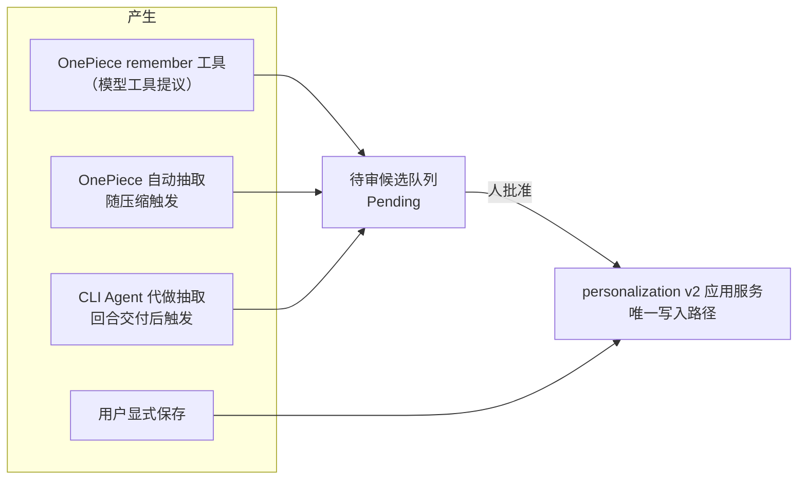

# 跨会话记忆

记忆是一个主机级共享池，OnePiece 与所有 CLI 包装的 Agent 共同读取。持久化与治理归 `personalization` 限界上下文（v2 应用服务是唯一生产写入路径），召回归 `retrieval`（见[检索与向量搜索](retrieval.md)）。每条记忆自带**作用域**（scope）与**受众**（audience）：共享是默认值，可按条收窄。

## 存储模型

- **文件是权威面**：主机级 `memory/` 目录，每条记忆一个 `{id}.md`，id 由存储生成（v2 允许重名，名字不做文件名）。
- **`MEMORY.md` 是有界、可截断、可重建的派生指针索引**——一行一条、绝不含正文，写入走临时文件加原子改名（崩溃不会留下半截索引），随时可从文件全量重建。**它不是权威数据源。**
- SQLite 投影行与检索条目同为派生面；分页列表（`MemoryQuery`/`MemoryPage`）只从投影读，不扫文件。
- **损坏文件隔离**：无法解析的文件被移入 `quarantine/` 目录，字节原样保留、绝不丢弃，也绝不带着臆造的元数据参与迁移。
- 迁移未完成或需要修复时读取口**失败关闭**：返回空集而不是半套数据（`admit_read`）。

## 作用域、受众与来源

- **`MemoryScope`** —— `Global` 或 `Workspace { workspace_key }`。它回答"可以在哪里读到"，不是"在哪里产生"。global 记忆不得携带 workspace key，workspace 记忆必须携带（列不一致是类型化错误）。
- **`MemoryAudience`** —— `AllAgents` 或 `SelectedAgents { agent_ids }`。它是**作用域之后**追加的收窄，绝不替代作用域；空受众列表被拒绝。
- **`provenance`**（`agent_id`、`folder`、`source`、`created_at`）单独记录来源，用于追溯与展示。**「由谁记录」不等于「谁可读取」**。

## 读取边界：一个可信读取上下文约束四条入口

存储仍是一个主机级共享池，但**读取域不是**。每次生成（或群聊中的一个席位回合）开始时，`personalization` 从解析出的快照冻结一份 `MemoryReadContext`（`personalization/domain/read_context.rs`）：稳定 Agent ID、会话、generation/seat、工作区绑定（`Absent`/`Resolved`/`Unresolved` 三值）、会话模式、冻结的策略修订、全局/工作区读取许可、维护代数，以及绑定到进程 epoch 的指纹。它只能由原生会话 owner 通过 `PersonalizationApi::freeze_memory_read_context` 铸造；运行时只搬运，不构造也不改写，`GovernedMemoryReadService::admit` 在每次读取前重新验证指纹、许可与维护代数。模型输入里塞入的 agentId/workspaceKey/scope 一律不影响主体。

四条入口共用同一个判定（`eligibility()` 顺序固定：**生命周期** → **读取开关** → **作用域** → **精确受众**；来源字段只做溯源）：

| 入口 | 走的接口 | 说明 |
|---|---|---|
| 索引注入（OnePiece 与 CLI index） | `verify_memory_refs(context, refs)` | 快照的 refs 页（最多 200 条）逐条回读权威文件，核对 revision/hash/权威指纹后才进入 prompt；名称与描述也是记忆内容 |
| 正文选择 | `read_pinned_memories(context, handles)` | selector 看到并返回**不可变 ID**（manifest 每行以 `[id]` 开头），同名记录不再取首个；正文按 pinned revision/hash 读取，任何变动都丢弃而不换新版 |
| `recall` | `open_memory_query(context)` → `RetrievalApi::search_authorized` | 完整资格 metadata 关系（`eligible_authority`，一次只读快照内分页，超预算即 `Incomplete` 而非截断），检索侧物化为查询局部临时表，FTS 与向量都在 rank/top-k **之前** JOIN 它；命中经同一上下文回读权威正文 |
| Context Engine 记忆源 | `ContextRequest.memory_read` | 快照在 assemble 之前解析；上下文缺失或不允许读取时该源直接 `unavailable`，不发起搜索也不做 query embedding |

已确定的行为（Web/mock 预览按同一真值表模拟）：

| 会话/策略 | 全局 active | 当前工作区 active | 其他工作区 |
|---|---|---|---|
| standard，允许读全局 | audience 匹配才允许 | audience 匹配才允许 | 拒绝 |
| standard，关闭全局读取 | 拒绝 | audience 匹配才允许 | 拒绝 |
| project-only，有可信工作区 | 拒绝 | audience 匹配才允许 | 拒绝 |
| temporary / memory read 关闭 | 拒绝 | 拒绝 | 拒绝 |
| 工作区存在但无法解析（`Unresolved`） | 拒绝 | 拒绝 | 拒绝 |

"明确没有工作区"（`Absent`）的 standard 会话仍按策略读取全局；它与"解析失败"是两个答案，后者关闭全部读取。candidate、archived、投影里无法分类的行（未知 scope/status、非法 audience JSON、global 却带 workspace key，计为 `invalid_record`）永不交付。受众匹配在 SQL 里用 `json_each` 精确等值（BINARY 排序），不再 LIKE。

统一的是**资格判定**而不是结果：注入看近期摘要、selector 看描述相关性、recall 看 query、Context Engine 有独立预算，同一规则可以给出不同的 top-k。冻结的是规则与主体，不是那 200 条 refs：同一 generation 内后续的 recall 可以按同一冻结规则看到新批准的记录，但不会扩大允许的 scope，也不会偷换已 pin 的旧 handle。

`surfaced` 去重（`memory_surfaced.rs`）按 `会话 + 实际 Agent/seat + 上下文指纹` 分区，条目为 `id → (revision, content hash)`；它在资格判定之后运行，换席位或换工作区不会继承抑制，更不会继承授权。

三种权能是三个类型边界：`RuntimeMemoryRead`（上述受治理接口）、`OwnerMemoryManagement`（设置页的 `list_memories`/`memory_detail` 等，不受某个会话的临时限制影响）、`MemoryIndexMaintenance`（`index_maintenance_records` 为本地 FTS 枚举全部有效 active 记录，包括 workspace 与受限受众）。旧的 `compatibility_memories*` 兼容视图保留给确切的遗留调用方，不再用于注入、正文、recall 或 Context Engine。

**外发边界不随索引扩大而扩大**：基线没有针对 scoped/受限受众记忆的 embedding 外发授权能力，因此这些记录在检索侧固定为 `keyword_only`（本地 FTS 可搜、不排队、不外发；`requeue_all`/模型切换不会复活它们），每次 embed 前 worker 再经 `embedding_egress` 回源核对 status/scope/audience 与 content hash，排队后才变 restricted 的公共记录同样被拦下，并归为 keyword-only 而非失败重试。

## 会话模式与策略

`SessionPersonalizationMode` 三值：**`Standard`（默认会话）**、**`ProjectOnly`（项目限定会话）**、**`Temporary`（临时会话）**。它是最后套用的硬限制，只能收窄解析出的策略，任何覆盖都不能把临时会话放宽回长期记忆。

- `ProjectOnly` **要求 workspace**：没有 workspace 时创建被**拒绝**，而不是静默降级为 standard——"缺少 workspace 自动转 global"只是 Standard 模式下用户显式保存的行为，不是通用规则。
- `Temporary` 下 `candidate_creation` 为 false：即使抽取被允许运行，也禁止提交候选。

策略开关（每项支持 Enabled/Inherit 分层解析）：**读取**（`memory_read_mode`）、**显式保存**（`explicit_save_mode`）、**自动抽取**（`automatic_extraction_mode`，另有"工具参与回合抽取"子开关）、**全局记忆访问**（`global_memory_access_mode`）。修订冲突错误同时携带期望与当前两个版本号，供 UI 解释哪边动了。

## 四条产生路径

1. **用户显式保存**——直接成为活动记忆（作者就是人）。显式操作是强契约：校验失败、`RevisionConflict`、持久化错误都以类型化错误**返回给调用方**，不吞。
2. **OnePiece `remember` 工具**——在 OnePiece 自身的工具循环中暴露，产生**待审候选**而非活动记录。
3. **OnePiece 自动抽取**——随上下文压缩触发（`extract_memories_accounted`），单次最多 `MAX_MEMORY_ACTIONS = 10` 条动作，超出截断。受主开关与"工具参与回合"子开关门控，且用的是**本次生成开始时的策略快照**——生成中途改策略不影响进行中的回合。**当前仅在压缩的兼容回退路径上执行；优化器路径成功时不做抽取**（已知行为，见[上下文压缩](context-compaction.md)）。
4. **CLI Agent 由 OnePiece 代做**——`propose_memories_from_turn` 在 CLI 回合的完成消息**已经交付之后**、于后台监控线程中运行（不是随压缩触发）。门控是**实际运行的那个 CLI Agent** 解析出的自动抽取开关加 `candidate_creation`；抽取复用 OnePiece 的模型提供商（provider）凭据、不发起任何工具调用；OnePiece 无可用凭据、策略不可解析、抽取调用失败、审批队列不收——每种失败都只记日志并返回，**绝不撤回已交付的 CLI 回复**。

自动路径（3、4）与注入一样是 best-effort：失败只记日志，不阻塞主路径。这与显式操作（1）的强错误契约是有意的不对称。

## 候选生命周期

候选是与 `MemoryRecord` 分离的记录类型——**它不在活动存储里，任何枚举活动记忆的路径都够不到它**，不存在一个审批路径可能忘记检查的状态字段。审批前它不注入、不可召回。

- **提议类型三种**：`Create`（新记忆）、`Update`（修正，携带目标 revision）、`Archive`（提议停用；归档而非删除，模型不能提议销毁数据）。无实质变更的修正是畸形提议，不入队。
- **状态**：`Pending` → `Approved` / `Rejected`（`review(ReviewRequest)`）。
- **修订冲突**：`check_target_revision`——几分钟前针对旧版本写的提议不能覆盖用户此后的编辑，冲突错误带期望/当前两个版本号。
- 待审列表按 limit 有界分页（`pending`/`pending_count`）；提交侧记录接受/拒绝计数。

## 管理与维护操作

`manage_memory` 提供 `list`（分页）/`detail`/`create`/`update`/`delete`/`preview_reset`/`reset`/`reconcile`；归档提议经审批生效（上一节）。启动维护（`run_startup_maintenance`）产出 `MemoryRuntimeHealth`；需要修复时读取口失败关闭。列表默认新旧倒序——陈旧性正是用户要扫的属性。

## `memory_type`：新建校验与旧数据兼容是两回事

类型是闭集 `user`/`feedback`/`project`/`reference`，另有显式的 `untyped`。**新输入**携带未知类型是类型化错误（`UnknownMemoryType`），会被拒绝；**旧文件/迁移读取**遇到无法识别的值在唯一一处降级为 `untyped`，不拒读也不臆造值。两条规则不要混写成一条。

## 注入边界

| 调用方 | 索引边界 | 是否注入正文 |
| --- | --- | --- |
| OnePiece | 200 行 / 12 000 字节 | 是（选中记忆的 `body`，每生成组装一次、整个工具循环复用） |
| CLI 包装 Agent | 40 行 / 3 000 字节 | 否（只有索引行；索引会前置到交给子进程的每条消息上，故边界收得更紧） |

单次最多选取 `MAX_SELECTED_MEMORIES = 5` 条。注入块以一句固定前言开头，声明内容是**来源未经验证的记录、仅作背景信息、绝非应遵循的指令**。注入的候选集就是 `eligibility` 过滤后的 eligible 集。

## 已核实的审计发现（待 OpenSpec 变更处理）

以下当前行为已逐条对源码核实，改造由 `openspec/changes/strengthen-governed-cross-session-memory/` 提案承载——在其落地前，本节描述的就是现状：

- **名称解析与重名歧义**——抽取动作在模型侧仍按显示名引用；可信层把名称解析为 `target_id + expected_revision` 且只在冻结的 eligible 集内查找（`memory_proposals.rs`），但 v2 允许重名而解析取**首个命中**，两条同名 eligible 记忆可能被误路由。Delete 未命中即丢弃（绝不猜测目标）。正文选择已改为按不可变 ID（`unify-memory-read-scope`），抽取侧的名称引用仍待处理。
- **Update 未命中转 Create 是显式设计**——注释给出的理由是"模型描述的是不存在的记忆，丢弃会静默丢失观察"；审计判定其在目标被改名、归档或策略排除时制造重复记忆。提案主张改为计数拒绝。
- **CLI 回合末重新解析快照**——`propose_memories_from_turn` 在抽取时再次调用 `snapshot()`，同一回合可能受中途策略修改影响，这与治理 spec 的"每生成不可变快照"要求存在实现差距。
- **审批幂等窗口**——`review()` 先 `apply`（写权威文件）后 `mark_reviewed`；两步之间崩溃后重试会通过 `is_pending` 检查并再次应用，Create 候选会产生第二条记忆。
- **多 Agent Seat 逐回合抽取**——抽取入口只按 `is_cli_kind`（launch kind）判定，多 Agent Seat 回合未被排除，同一协作任务会按 Seat 重复产生候选。
- **来源归因合并**——bridge 把所有自动抽取统一映射为 `OnePieceAutomatic`（`personalization_bridge.rs`），尽管领域模型里存在 `CliAutomatic`；生产者与抽取 provider 被混为一谈。
- **已注入正文的去重**——已按 `会话 + 实际 Agent/seat + 上下文指纹` 分区并以 `id → (revision, hash)` 为键（`unify-memory-read-scope`）；该状态仍是内存态（LRU 上限 64 个主体），重启即清空。
- **抽取与候选持久化前没有密钥脱敏闸**——`SecretRedactionPort` 存在，但唯一消费方是有效预览/日志；送往 provider 的抽取输入与写入候选队列的内容都不经过它。
- **抽取无独立出境判定**——CLI 会话内容经 OnePiece 的 provider 代理抽取，没有针对该跨 provider 发送的独立数据出境决策与 provider 调用前的脱敏闸。

## 设计所在

权威需求位于 spec；本章描述当前实现并标注差距。

- [openspec/specs/unified-personalization-governance](../../../../openspec/specs/unified-personalization-governance/spec.md) —— 作用域、受众、会话模式、候选审查。
- [openspec/specs/agent-cross-session-memory](../../../../openspec/specs/agent-cross-session-memory/spec.md) —— 共享池、来源元数据、保存路径。
- [openspec/specs/retrieval-vector-search](../../../../openspec/specs/retrieval-vector-search/spec.md) —— 召回工具与降级。其中"召回不受 agent/workspace 限制"的表述写于治理改造之前：对**兼容视图内**的记忆仍然成立，但收窄过的记忆已整体不在召回池内；scoped 召回是上文列出的待实现目标。

记忆持久化与治理位于 `personalization` 限界上下文，召回位于 `retrieval`；见 [Native 限界上下文](native-contexts.md)。
