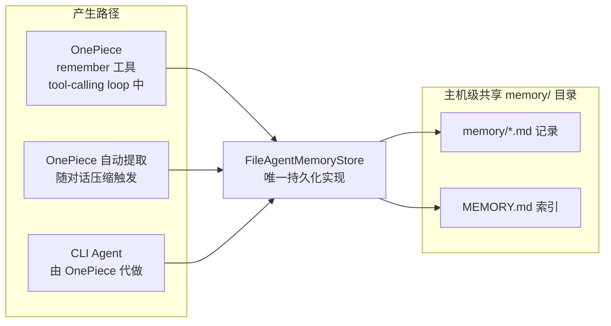
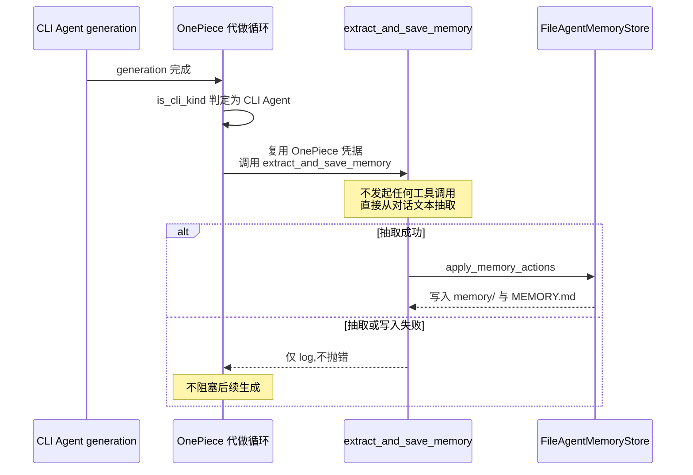

# 跨会话记忆

存储的记忆是一个主机级共享池，OnePiece 和所有 CLI 包装的 Agent（`claude-code`、`codex-cli`、`gemini-cli`、`opencode`、`antigravity-cli`）都从中读取——但共享现在是**默认值，不是规则**：每条记忆自带作用域与受众。两者的治理见[个性化治理](personalization-governance.md)，本章讲持久化这一半；检索/搜索路径见 [Retrieval and vector search](retrieval.md)。

## 默认共享，可按条收窄

每条记忆都记录了产生它的 Agent 与 workspace。其中两项现在是有效约束，而不只是备注：

- **作用域** —— `global` 或某一个 workspace。workspace 作用域的记忆，对没有指明 workspace 的调用方不会被解析出来。
- **受众** —— 默认全部 Agent，也可以只给记录上列出的那几个 Agent id。

来源元数据仍与这两者分开记录：**「由谁记录」不等于「谁可读取」**。一个 Agent 产生的记忆可以只让另一个读到，两个字段都不会作为检索工具的输入暴露。

在没有 workspace 文件夹的会话中保存的记忆按 `global` 存入而不是被拒绝，可从任何 workspace 或无 workspace 的情况下读取。

## 保存记忆

- **OnePiece** 在其自身的 API tool-calling loop 中暴露一个记忆工具。该工具产生的是**待审候选**，不是活动记录——自动路径只提议，由人来决定。
- **CLI 包装的 Agent** 不暴露该工具，因为 VaneHub 不控制 CLI 包装 Agent 自身的内部工具系统。它们通过单独的自动抽取机制产生候选，该机制依附于上下文压缩。
- **用户自己写下的记忆**直接生效：作者就是人本身，没有第二个人需要复核。

## 记忆存储与产生机制

记忆以文件形式落盘到一个主机级共享的 `memory/` 目录,并由一个 `MEMORY.md` 索引文件汇总条目。**文件是权威面**,SQLite 投影行、`MEMORY.md` 索引与检索条目都是派生的、可重建的。

生产写入路径现在只有一条:`personalization` 上下文的 v2 应用服务。旧的 `FileAgentMemoryStore` 不再挂在写入端口上——`LegacyMemoryPortBridge` 把旧端口变成了新存储的一个投影,这样目录只有一个主人。通用文件工具**不得**直接写这个目录:绕过应用服务就等于让投影、索引与检索三面各自漂移。

下面的流程图展示了三条产生路径如何汇入同一个共享池。

CLI 包装的 Agent(`claude-code`、`codex-cli`、`gemini-cli`、`opencode`、`antigravity-cli`)本身不暴露保存记忆的工具,VaneHub 不控制它们内部的工具系统。它们的记忆由 OnePiece 在 generation 结束时代为提取,复用 OnePiece 已有的 provider 凭据与抽取逻辑,整个过程对 CLI Agent 透明。下面的时序图展示了这条路径,关键约束是**所有失败只记录日志,绝不阻塞生成**。

每条记忆记录上的 `provenance` 字段(`agent_id`、`folder`、`source`、`created_at`)承载的是**来源**:这条记忆由哪个 Agent、在哪个 workspace 文件夹、经由哪条路径、何时产生。它用于追溯与筛选展示,**不决定谁能读到它**——那由记录上单独的作用域与受众决定。把"谁记的"当成"谁能读"是这次治理改造要终结的那个等价关系:同一个 Agent 记下的两条记忆完全可以有不同的受众。

## 关键类型与常量

### 存储模型

记忆存储是主机级共享的 `memory/` 目录(常量 `MEMORY_DIRECTORY_NAME`),不是数据库行;文件即身份,每条记忆对应一个 `{name}.md` 文件,索引由 `MEMORY.md` 汇总。所有产生路径最终都落到 `FileAgentMemoryStore` 这一份文件存储上。

### MemoryMetadata frontmatter

每条记忆文件的 frontmatter 解析为 `MemoryMetadata`,字段包括 `name`(记忆身份,与文件名 `{name}.md` 对应)、`description`(概述)、`memory_type`(闭集四值 `user`/`feedback`/`project`/`reference`;缺失或未知值降级为 `untyped`,不拒绝写入也不拒绝读取),以及 `provenance` 来源元数据(`agent_id`、`folder`、`source`、`created_at`,迁移场景下另带 `migrated_from`)。frontmatter 只读前 `MAX_FRONTMATTER_LINES=30` 行的窗口,避免把整份正文当 frontmatter 解析。

### 扫描与产生路径

全目录扫描受 `MAX_SCANNED_FILES=200` 上限保护,超过即停止扫描,避免长尾记忆文件拖慢启动。三条产生路径:

- **OnePiece remember 工具** —— 工具名常量 `REMEMBER_TOOL_NAME="remember"`,在 OnePiece 自身的 API tool-calling loop 中暴露,记忆启用开关打开时自动批准、无需用户确认。
- **OnePiece 自动提取** —— 随对话压缩触发(`extract_memories_accounted`),单次压缩最多产生 `MAX_MEMORY_ACTIONS=10` 条记忆动作,超过即截断。
- **CLI Agent 由 OnePiece 代做** —— `extract_and_save_memory` 复用 `ONEPIECE_AGENT_ID="onepiece"` 的凭据与抽取逻辑,不发起任何工具调用,直接从对话文本抽取,对 CLI Agent 透明。

### 注入边界

记忆注入按调用方分两套预算。`ONEPIECE_MEMORY_INDEX_BOUNDS` 为 `lines: 200, bytes: 12000`,OnePiece 调用方还会注入记忆 `body` 正文;`CLI_MEMORY_INDEX_BOUNDS` 为 `lines: 40, bytes: 3000`,CLI 调用方只注入索引行,不注入 `body`。注入时单次最多选取 `MAX_SELECTED_MEMORIES=5` 条记忆。所有失败只 `log`,不阻塞已交付的生成结果——记忆是增强而非必需,抽取或注入失败都不应影响主路径。

## 设计所在之处

本章用于引导贡献者。权威需求位于 spec 中。

- [openspec/specs/agent-cross-session-memory](../../../../openspec/specs/agent-cross-session-memory/spec.md) —— 共享池、来源元数据和保存路径。
- [openspec/specs/retrieval-vector-search](../../../../openspec/specs/retrieval-vector-search/spec.md) —— 检索工具与降级。

记忆持久化与检索位于 `retrieval` 限界上下文中；见 [Native bounded contexts](native-contexts.md)。
