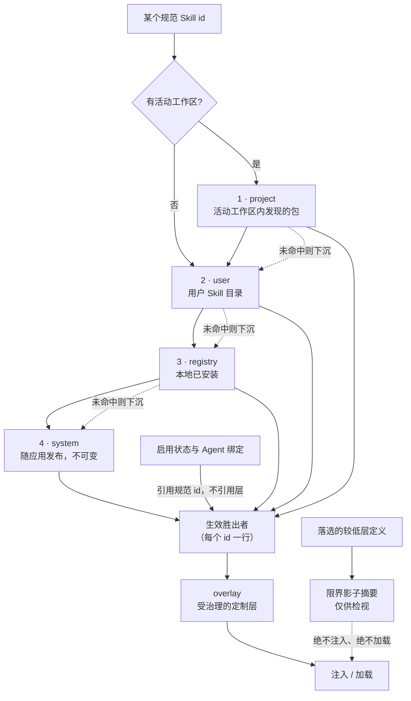

# 生效 Skill 运行时

Skill 运行时把管理状态与提供指令的包分离开来。这一区分让既有的启用状态和 Agent 绑定保持稳定,同时允许 VaneHub AI 从多个存储层中选出一个生效定义。

## 管理作用域与运行时层

管理作用域回答的是启用状态、绑定、漂移和删除意图之类的状态在何处被管理:

| 作用域 | 含义 |
| --- | --- |
| `global` | 跨工作区共享的状态 |
| `workspace` | 隔离到单个规范工作区的状态 |

运行时层回答的是哪个包提供内容。它们按以下顺序解析:

| 优先级 | 层 | 内容来源 |
| --- | --- | --- |
| 1 | `project` | 在活动工作区内发现的包 |
| 2 | `user` | 在用户的 VaneHub AI Skill 目录下管理的包 |
| 3 | `registry` | 本地已安装的包;provider 已就绪,但尚无安装或网络流程 |
| 4 | `system` | 随应用一起发布的不可变包 |

**图里两条虚线是重点**：影子摘要只用于检视，**永远不会跟着胜出者一起被注入或加载**；绑定挂在规范 id 上而不是某一层，所以高层定义替换掉低层胜出者时，既有的启用状态和 Agent 分配会**跟着生效定义走**，不需要重新绑定。

目录为每个规范 Skill id 返回一行生效记录。较低优先级的定义会作为限界影子摘要被保留,用于检视,但它们绝不会与胜出者一起被注入或加载。当没有活动工作区时,Project 定义会被省略。

绑定继续引用规范 Skill id,而不是某个层。如果一个 Project 或 User 定义替换了较低层的胜出者,既有的启用状态和 Agent 分配状态会跟随该生效定义。

## 分类与兼容性

`type` 和 `delivery` 是相互独立的元数据字段:

- `role` Skill 提供模型可读的指令。
- `utility` Skill 声明的是委派工作,但在当前运行时版本中不可执行。
- `eager` Role Skill 在被启用、可用、已绑定,且在既有的提示词预算之内时,可以被包含进 API Agent 的系统提示词。
- `on-demand` Role Skill 通过固定的 Skill 工具被发现和加载。

省略其中任一字段的遗留 `SKILL.md` 文档,会通过显式的 `role` 加 `eager` 兼容默认值保留其原有行为。新建或编辑的可变定义会显式写入这两个值。未知值会使定义变为不可用,而不是静默地选择某种行为。

## 固定的只读工具

原生 API Agent 会收到三个与 provider 无关的工具定义:

| 工具 | 权限 |
| --- | --- |
| `list_skills` | 列出限界的生效元数据,不含指令正文 |
| `load_skill` | 按规范 id 或无歧义别名加载一个已启用、可用的 Role Skill |
| `read_skill_resource` | 使用 URI 和由 `load_skill` 返回的修订读取一个限界、已索引的文本资源 |

工具 schema 不会随清单变化而改变。这三个工具在普通模式和 Plan 模式下都保持只读;即便 provider 请求了一个未被提供的操作,分发仍会重新校验授权。

资源使用逻辑标识符,例如 `skill://code-review/references/checklist.md`。模型永远不会收到宿主路径。一次读取会解析当前的生效定义,校验修订与资源索引,并拒绝绝对路径、父级穿越、隐藏分量、包逃逸、二进制数据,以及超尺寸内容。胜出者变化会使上一个修订过期,并要求再次调用 `load_skill`。

`load_skill` 最多返回 12,000 个 Unicode 字符,外加一个限界的资源索引。它用逻辑包 URI 替换 `{skill_base_dir}`。成功的加载会以尽力而为的方式更新使用 sidecar,而不改变包内容。

## 运行时与 UI 边界

原生 `tooling::skills` 应用服务拥有解析、包读取、迁移和使用跟踪。Agent Runtime 消费其对外发布的 API,不直接访问 Skill 仓库。React 组件消费 `agent-service.ts`;只有 Tauri 适配器调用命令,而 Web 适配器通过相同的 TypeScript 契约提供具有代表性的结果。

System 包可以被预览、启用和分配,但其内容不能被编辑或删除。可变的较高层定义是显式的定制路径。恢复一个随附 Skill 会清除已保留的删除意图,并显示当前的生效胜出者;它不会创建一个可变副本。

[Overlay](skill-overlay-governance.md) 是在生效基础包被选定之后施加的一个独立的、受治理的定制层。它不改变包层,也不会让不可变包变得可编辑。

## 暂缓的能力

当前契约有意不授予以下权限:

- 委派 Utility 执行或子 Agent 创建;
- 执行或动态注册捆绑脚本;
- 远程 registry 下载、安装或更新;

这些能力需要单独的 OpenSpec 变更和安全边界。它们的元数据或扩展点不得被解读为已实现的执行路径。
