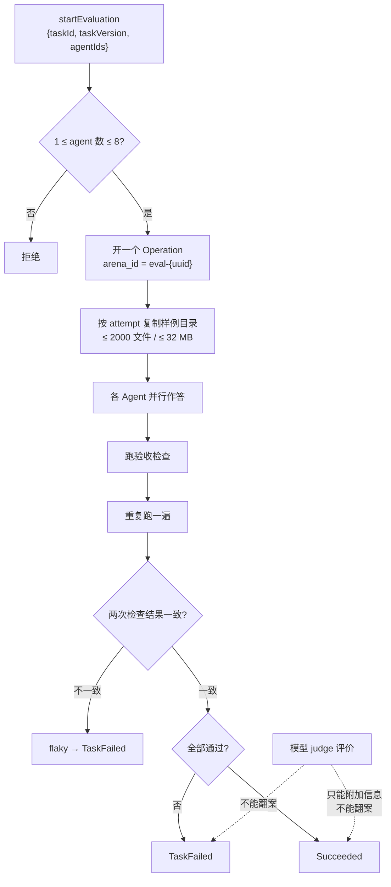

# 评测运行时

Agent 评测竞技场：同一道题跑多个 Agent，比通过率、token 与耗时。它开的是一个 Operation，因此与执行链路共用生命周期，但评分、样本与结果留存是它自己的问题域。

链路本身见[执行可观测性](execution-observability.md)。

评测与链路共享同一条原则：**只记录能证实的东西，并如实声明自己知道多少**。

## Agent 评测竞技场

评测跑在同一个上下文里，因为它本质上是**一次受控的执行 + 一套确定性验收**。



### 两条不可动摇的判定规则

`aggregate_verification` 的实现把两件事钉死：

```text
deterministic_passed = 所有检查通过 && !flaky
outcome = if deterministic_passed { Succeeded } else { TaskFailed }
```

- **重复验证不一致即 flaky，直接判失败**。`flaky` 由「重跑一遍的检查结果 != 第一遍」得出。一次侥幸通过不算通过。
- **judge 永远不能翻案**。judge 的结论走 `bound_judge` 被限界（`confidence` 夹到 `0.0..=1.0`、`notes` 截到 1000 字符、`evidence_ids` 截到 32 条）后附在结果上，但 `outcome` 只由上面那个确定性表达式决定。仓库里有一条专门的测试叫 `judge_never_overrides_deterministic_failure_or_flaky_result`。

### 内置基准与禁则

三份 manifest 编译进二进制（`include_str!`），位于 `src-tauri/evaluation-fixtures/`：

| 任务 | 类别 | 超时 | 验收 profile | 禁则 |
| --- | --- | --- | --- | --- |
| `fix-null-auth-token` | bugfix | 120s | `npm-test`、`static-files`、`diff-rules` | `eval(` |
| `add-parser-test` | tests | 120s | `npm-test`、`diff-rules` | `.only(` |
| `refactor-search` | refactor | 180s | `cargo-test`、`diff-rules` | `unsafe {` |

**三条禁则针对同一类作弊**：满足字面要求但绕开题目意图。`.only(` 最典型——用它跳过其余测试就能让测试"全绿"。

`diff-rules` 这个 profile 自己也在防同一件事：`verify_diff_rules` 要求改动路径**非空、不超过 256 条、每条 ≤ 240 字节且不逃逸工作区**。空 diff 不算通过——什么都没改却声称做完了，是另一种作弊。

### 隔离

每个 attempt 从样例目录复制出一份独立副本，复制预算 **2000 文件 / 32 MB**，超限即失败而非截断。评测**不碰你的真实工作区**，也不产生提交。

## 与其他上下文的关系

- 每次评测运行都是一个 Operation，生命周期由 `operations` 拥有。
- 运行过程的链路与日志见[执行可观测性](execution-observability.md)与[统一日志](unified-logging.md)。
- 用户侧界面见用户指南的 Agent 评测一章。

## 设计所在

本章用于为贡献者定向，权威需求位于 `openspec/specs` 下对应能力的主规范中。
