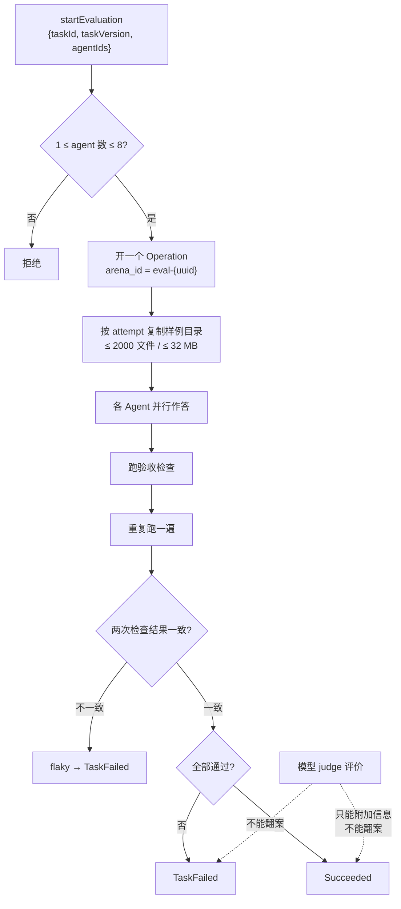

# 执行可观测性与 Agent 评测

`execution_observability` 上下文拥有两件看起来无关、实则同源的东西：**执行链路**（run / span / 时间线 / OTLP 导出）与 **Agent 评测竞技场**。

它们共享同一条原则：**只记录能证实的东西，并如实声明自己知道多少**。

## 执行链路

### 四个核心类型

| 类型 | 是什么 |
| --- | --- |
| `ExecutionRun` | 一次可观测的执行，持有 trace id 与状态 |
| `ExecutionSpan` | run 内的一段，名称上限 128 字符 |
| `ExecutionEvent` | span 上的时点事件 |
| `ExecutionTimeline` | 供界面展开的时间线视图 |

`ExecutionStatus` 六态：`Accepted`、`Running`，以及四个终态 `Succeeded`、`Failed`、`Cancelled`、`Incomplete`——`is_terminal()` 判定的就是后四个。

**`Incomplete` 是一个终态，不是中间态**。它表示这次执行结束了但链路没记全，与「失败」区分开：失败是执行的结论，不完整是观测的结论。

### 保真度：链路自己声明知道多少

`ExecutionFidelity` 四档，是这个上下文最重要的设计：

| 保真度 | 含义 |
| --- | --- |
| `Native` | 运行时自己产生的一手记录 |
| `Proxied` | 经由中继观察到的 |
| `Inferred` | 从可得信号推断出来的 |
| `Opaque` | 这一段发生了什么无从得知 |

**为什么必须有 `Opaque`**：外部 CLI Agent 是黑盒，VaneHub 启动进程、采集输出，但看不到它内部的工具调用。如果把这种情况画成一个看似完整的 span 树，读者会以为自己看到了全部。声明 `Opaque` 是在说「这里确实有一段，但我不知道里面是什么」——这比补一个编造的节点诚实，也比干脆不画有用。

OnePiece 走 native API，其工具调用是 `Native` 保真度、可逐层展开；这正是[原生 Agent](onepiece-native-agent.md)相对外部 CLI 的可观测性优势。

### 采集策略与脱敏

`CapturePolicy` 只有两档：`MetadataOnly` 与 `RedactedContent`。**没有「原始内容」这一档**——即使切到最详细的采集，内容也是脱敏后的。

属性有硬上限，超限即拒绝而非截断：

| 限额 | 值 |
| --- | --- |
| 每组属性数量 | **32** |
| 属性键长度 | **128** 字符 |
| 属性值长度 | **256** 字符 |

类型是 `SafeAttributes` / `SafeAttributeValue`——**「安全」写进了类型名里**，构造时就校验，而不是落盘前再过一遍脱敏。想往链路里塞一段任意长的文本，编译期就过不去。

### 执行来源

`ExecutionSource` 区分三种发起方：`Desktop`、`InstantMessage { connector_id }`、`Scheduled { task_id }`。IM 与定时任务带上各自的标识，所以「这次执行是谁触发的」在链路里是一等信息，而不是靠时间戳猜。

## Agent 评测竞技场

评测跑在同一个上下文里，因为它本质上是**一次受控的执行 + 一套确定性验收**。



### 两条不可动摇的判定规则

`aggregate_verification` 的实现把两件事钉死：

```text
deterministic_passed = 所有检查通过 && !flaky
outcome = if deterministic_passed { Succeeded } else { TaskFailed }
```

- **重复验证不一致即 flaky，直接判失败**。`flaky` 由「重跑一遍的检查结果 != 第一遍」得出。一次侥幸通过不算通过。
- **judge 永远不能翻案**。judge 的结论走 `bound_judge` 被限界（`confidence` 夹到 `0.0..=1.0`、`notes` 截到 1000 字符、`evidence_ids` 截到 32 条）后附在结果上，但 `outcome` 只由上面那个确定性表达式决定。仓库里有一条专门的测试叫 `judge_never_overrides_deterministic_failure_or_flaky_result`。

### 内置基准与禁则

三份 manifest 编译进二进制（`include_str!`），位于 `src-tauri/evaluation-fixtures/`：

| 任务 | 类别 | 超时 | 验收 profile | 禁则 |
| --- | --- | --- | --- | --- |
| `fix-null-auth-token` | bugfix | 120s | `npm-test`、`static-files`、`diff-rules` | `eval(` |
| `add-parser-test` | tests | 120s | `npm-test`、`diff-rules` | `.only(` |
| `refactor-search` | refactor | 180s | `cargo-test`、`diff-rules` | `unsafe {` |

**三条禁则针对同一类作弊**：满足字面要求但绕开题目意图。`.only(` 最典型——用它跳过其余测试就能让测试"全绿"。

`diff-rules` 这个 profile 自己也在防同一件事：`verify_diff_rules` 要求改动路径**非空、不超过 256 条、每条 ≤ 240 字节且不逃逸工作区**。空 diff 不算通过——什么都没改却声称做完了，是另一种作弊。

### 隔离

每个 attempt 从样例目录复制出一份独立副本，复制预算 **2000 文件 / 32 MB**，超限即失败而非截断。评测**不碰你的真实工作区**，也不产生提交。

## 与其他上下文的关系

- 统一日志与脱敏规则见[持久化与统一日志](persistence-and-logging.md)；**链路里刻意不含日志标识符**，两者要用时间对上。
- Operation 生命周期由 `operations` 拥有，评测竞技场开的就是一个 Operation。
- 用户侧界面见用户指南的可观测性与 Agent 评测两章。

## 设计所在

本章用于为贡献者定向，权威需求位于 `openspec/specs` 下对应能力的主规范中。
