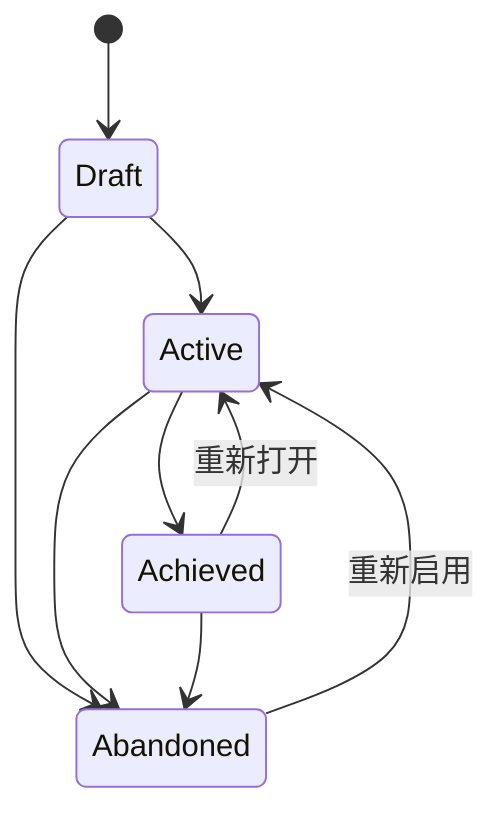
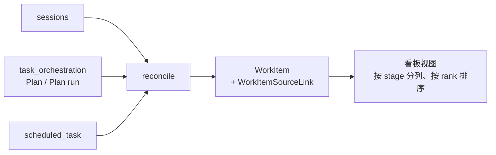

# 目标与任务看板

`goals` 与 `work_board` 是两个独立上下文，但解决的是同一个问题的两面：**分散在各处的执行体，怎么归到一处被追踪**。

- **目标（`goals`）** —— 自上而下：你先声明一个目标，再把 Plan、Loop、工作项、会话挂上去，由它们的完成度**派生**出这个目标能不能验收。
- **任务看板（`work_board`）** —— 自下而上：把已经存在的会话、Plan、定时任务**对账**成看板卡片，让你在一个视图里排优先级。

## 目标

### 四态与允许的迁移

`GoalStatus`：`Draft`、`Active`、`Achieved`、`Abandoned`。`can_transition_to` 明确列出允许的边：

**图里没有的边就是被拒绝的**，`transition` 会返回 `InvalidTransition { from, to }`。值得注意两点：

- **`Draft` 不能直接到 `Achieved`**。没进入过 Active 的目标谈不上达成。
- **`Achieved` 和 `Abandoned` 都能回到 `Active`**。目标不是一次性的——达成后发现还有尾巴、或放弃后又捡起来，都是正常的。

### 验收需要外部算出的就绪度

`accept()` 的签名是 `accept(self, awaiting_acceptance: bool)`，注释写得很直接：

> Acceptance needs the derived readiness the caller computed from the goal's children; the aggregate cannot see them itself.

**聚合根看不见自己的子项**。就绪度由调用方遍历关联对象算出来再传进来，`awaiting_acceptance` 为假时直接 `AcceptanceNotReady`。这样聚合根不需要持有对 Plan、Loop 的引用，派生逻辑也不会散进领域对象里。

### 五种关联，只有三种参与派生

`GoalLinkTarget`：`Plan`、`Loop`、`WorkItem`、`Session`、`Run`。

但 `participates_in_derivation()` 把 `Session` 和 `Run` **排除在派生之外**，源码注释解释了原因：

> Sessions are linked for navigation only. They have no completion semantics, so counting them would leave every goal permanently short of acceptance.

**会话没有「完成」这个概念**。你可以随时回到一个会话继续聊，它永远不会变成「做完了」。把会话计入派生，等于让每个目标永远差一点点无法验收——所以会话只作为导航入口挂在目标上，不影响验收判定。

`Run` 同理：一次执行是过程记录，不是可交付项。

## 任务看板

### 五阶段、五优先级、四种来源

| 维度 | 取值 |
| --- | --- |
| 阶段 `stage` | `inbox`、`planned`、`in_progress`、`review`、`done` |
| 优先级 `priority` | `none`、`low`、`medium`、`high`、`urgent` |
| 来源 `source_kind` | `session`、`plan`、`plan_run`、`scheduled_task` |

这三组都是**白名单校验**，不在集合内的值直接被拒绝，而不是存进去等以后爆炸。

### 幂等对账

`work_board` 不自己产生工作——它把别的上下文里已经存在的东西对账成卡片。每次列表加载前先跑一次 `reconcile`。

**对账必须幂等**：同一个会话反复出现在多次对账里，不能变成多张卡片。数据库层用 `work_item_links` 上的唯一约束兜底——重复关联会被拒绝，错误信息是 `Source is already linked to a work item.`。

### `available` 字段承认源可能消失

`WorkItemSourceLink` 带一个 `available: bool`。源对象被删掉之后，**卡片不跟着消失**，而是把这条关联标记为不可用。

这和目标那边的取舍一致：**用户手工排过的优先级和阶段，不该因为底层某个会话被删就一起蒸发**。

## 两者的分工

| | 目标 | 任务看板 |
| --- | --- | --- |
| 方向 | 自上而下声明 | 自下而上对账 |
| 谁产生条目 | 你显式创建并关联 | 从既有执行体自动对账 |
| 完成语义 | 由子项派生，人工验收 | 手工拖动阶段 |
| 会话的角色 | 仅导航，不参与派生 | 是一种合法来源 |

它们可以叠加：一个工作项既可以出现在看板上，也可以被挂到某个目标下参与派生（`WorkItem` 是参与派生的三种关联之一）。

## 与其他上下文的关系

- Plan 与 Plan run 由 `task_orchestration` 拥有，见 [Loop 与 Plan 运行时](loop-and-plan-runtime.md)。
- 定时任务与会话由 `sessions` 拥有。
- 用户侧界面见用户指南的目标管理与任务看板两章。

## 设计所在

本章用于为贡献者定向，权威需求位于 `openspec/specs` 下对应能力的主规范中。
