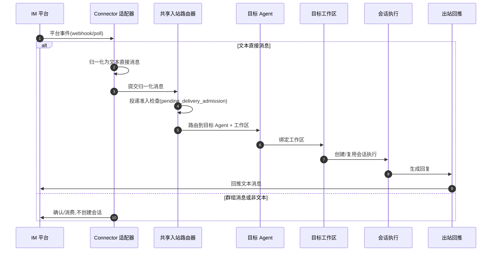

# IM connector

native 侧负责 IM connector 的配置、凭证、路由与入站投递。远程工作空间与 IM 工作流在用户指南中介绍;本章介绍 native 侧设计。

## 五个内置 connector

五个可独立配置的内置 connector,具有稳定 id:`feishu`、`telegram`、`dingtalk`、`wecom` 与 `weixin`。connector 描述符列表返回全部五个 connector,并附带本地化的展示元数据、配置字段、能力以及实验性标志。个人微信(`weixin`)被标记为实验性;其余四个不是。

## 第一版本的直接消息范围

每个 connector 仅接受文本**直接消息(direct message)**。群组消息与非文本内容在第一版本中被排除在 Agent 执行之外:一条群组消息会被确认或消费,但不会创建 VaneHub 消息或 Agent 生成。一条有效的文本直接消息会从其平台事件中归一化,并提交至共享入站路由器。

## 消息流转与路由

入站消息从平台事件到 Agent 执行的完整链路如下。首版本仅处理文本直接消息；群组消息与非文本内容只确认回执，不创建会话。

**入站投递准入**：路由器在创建会话前会检查 `pending_delivery_admission`。每个会话(chat)的挂起投递上限为 `MAX_PENDING_PER_CHAT=8`，超过后返回 Busy 但**不阻塞**平台事件确认。运行时还维护两个全局水位：总 pending work 上限 64，active Agent generation 上限 8。空闲 lane 会被回收，以让新的路由请求可以重用执行槽位。

**微信授权流程**：`weixin` connector 被标记为实验性，凭据获取走 QR 授权流程。authorization 状态在 `pending` → `confirmed` / `expired` 之间迁移；凭据写入平台钥匙串(keychain)，读取走 zeroizing reads，使用后立即清零内存副本。

**出站策略**：首版本仅支持把 Agent 生成的文本结果直发回原会话。入站路由依赖预先保存的默认路由配置——启用 connector 前必须先配置默认路由(目标 Agent + 工作区)，否则归一化后的消息无法落地执行。

## 设计所在

本章用于为贡献者定向。权威需求位于 spec 中。

- [openspec/specs/im-connector-management](../../../../openspec/specs/im-connector-management/spec.md)

IM connector 位于 `communications` 限界上下文;参见 [Native bounded contexts](native-contexts.md)。
