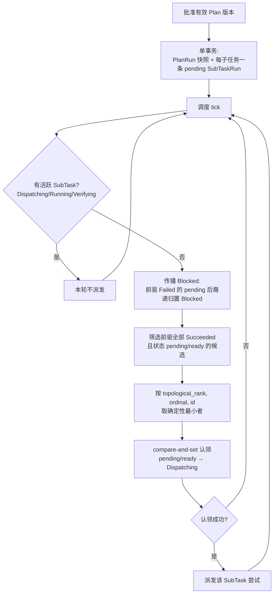

# Loop 与 Plan 运行时

VaneHub 为自主工作运行了两个持久化的 native 执行运行时:**Loop** 运行时(基于目标 + 验收准则对一个 Git 项目反复迭代)与 **Plan** 运行时(感知拓扑的子任务调度)。两者都把状态持久化到 SQLite,并把持久化状态视为权威,而非内存中的调度器状态。面向用户的 Loop/Plan 工作流在用户指南中;本章覆盖 native 设计。

## Loop 运行时

一个 Loop 定义在持久化时附带稳定的 id、名称、启用状态、本地 Git 项目路径、基线分支、目标、验收准则、允许与受保护的路径、稳定的 Worker 与 Verifier Agent id、结构化验证命令、停止限制、版本与时间戳。Loop 定义保留**稳定的 Agent id**,而不是匹配显示名称。

第一阶段的范围是有约束的:针对非 Git 项目、远程工作区、缺失 Agent、不安全的路径范围或无效限制的定义,会被拒绝,且不会启动 Agent 或创建 worktree。Worker 与 Verifier 角色既接受 CLI 启动的 Agent,也接受启用了 tool-use 信任的 API Agent;未启用 tool-use 信任的 API Agent 会被拒绝。

## Plan 运行时

一个专用的任务编排边界持久化 `PlanRun`、`SubTaskRun`、`SubTaskAttempt`、验证证据、控制请求与关联记录。在批准一个有效的 Plan 版本时,运行时会在单个一致操作中创建一个 `PlanRun` 快照,并为每个快照中的 SubTask 创建一个 pending 的 `SubTaskRun`。试图认领同一个就绪 SubTask 的重叠调度器 tick,会被一个事务性的 compare-and-set 转换串行化——最多只创建一次调度尝试。

### 确定性的、感知拓扑的串行调度

调度器只派发其依赖已成功的 SubTask,按拓扑秩、Plan 序号与稳定的 SubTask ID 对合格工作进行排序,并在本基础版本中每个 `PlanRun` 同时最多只运行一个 SubTask 尝试。前驱尚未达到已验证成功的 pending SubTask 不会被派发。当多个独立的 SubTask 同时合格时,只派发确定性的第一个。一个失败的必需 SubTask 只会阻塞其传递性后裔,不会阻塞独立分支。

## Loop 迭代状态机

一次 Loop 运行(`LoopRun`)在若干阶段(`LoopRunPhase`)间推进。`Preparing` 完成后进入 `Acting` → `Verifying` → `Deciding` 的迭代循环,`Deciding` 的结果决定是再迭代、终止失败,还是停在待人工验收。`Finalizing` 是终态收尾阶段。下图聚焦迭代循环本身及其在 `decide_loop_iteration()` 下的转移条件。

```mermaid
stateDiagram-v2
    [*] --> Preparing
    Preparing --> Acting : 初始化完成
    Acting --> Verifying : Worker 产出
    Verifying --> Deciding : 证据采集完成
    Deciding --> Acting : NextIteration
    Deciding --> "待人工验收" : AwaitingAcceptance
    Deciding --> "失败" : Failed
    Deciding --> "取消" : Cancelled
    "待人工验收" --> [*]
    "失败" --> [*]
    "取消" --> [*]
```

`Deciding` 的判定输入是 `LoopDecisionInput`,包含三组事实:**必过检查是否通过**、**Verifier 推荐**(`VerifierRecommendation` = `Pass` / `Revise` / `Blocked`)、以及可选的硬终止理由与用户反馈。判定顺序固定。

1. **硬终止理由优先** —— `GoalMet` → `AwaitingAcceptance`;`UserRejected`/`UserStopped` → `Cancelled`;其余硬终止理由 → `Failed`。
2. **`Blocked` 即失败** —— Verifier 推荐 `Blocked` 时,直接 `Failed`(`VerifierBlocked`),不再看检查结果。
3. **必过检查未过 → 下一轮** —— `required_checks_passed = false` 时强制 `NextIteration`,即使用户在反馈里要求"就这样接受"也不生效。
4. **Verifier `Revise` → 下一轮** —— 即使必过检查全过,只要 Verifier 要求修订,仍走 `NextIteration`。
5. **检查全过 + Verifier `Pass` → 待人工验收** —— 这是唯一到达 `AwaitingAcceptance` 的路径。**Loop 永不自己宣布成功**,始终停在等待人工验收。

### 无进展检测、迭代上限与信任契约

Loop 不会陷入无意义循环。每轮迭代记录目标状态指纹(`LoopObjectiveFingerprints`),包含三项指纹:**diff 哈希**、**必过检查失败集哈希**、**已通过的必过检查集合**。

- **无进展条件** —— 连续两轮迭代的三项指纹同时没有变化(即 `repeated_diff && repeated_required_check_failures && !has_new_passing_required_evidence`)时,判定本轮无进展。
- **无进展上限** —— 连续无进展轮数达到 `LoopLimits.max_consecutive_no_progress` 时,以 `NoProgress` 终止失败。
- **迭代上限** —— 迭代次数达到 `max_iterations` 时以 `MaxIterations` 终止;时间预算超限以 `TimeBudget` 终止。
- **Worker / Verifier 信任契约** —— Worker 与 Verifier 角色接受两种 Agent:CLI 启动的 Agent,以及**启用了 tool-use 信任**的 API Agent。未启用 tool-use 信任的 API Agent 在定义时即被拒绝,不会启动 Agent 或创建 worktree。

## Plan 调度

Plan 运行时在批准一个有效 Plan 版本时,以**单事务**完成快照创建:校验图与执行策略后,在同一事务内把 `plan_versions.approved_at` 置位、插入一个 `PlanRun`(状态 `Queued`),并为快照中的每个 SubTask 各插入一条 pending 的 `SubTaskRun`(携带拓扑秩 `topological_rank` 与序号 `ordinal`)。事务提交后,所有 SubTask 的初始状态一致且原子可见。

### 确定性的拓扑串行调度

调度器(`decide_serial_schedule`)在每个 tick 计算下一个应派发的 SubTask,规则如下。



要点说明如下。

- **只派发依赖已成功的 SubTask** —— 候选必须是 pending/ready 状态,且其全部前驱都已达到 `Succeeded`;前驱尚在 pending 或未达 `Succeeded` 的 SubTask 不会被派发。
- **拓扑秩 / Plan 序号 / 稳定 ID 排序** —— 多个候选同时合格时,按 `topological_rank`、`ordinal`、稳定 SubTask ID 的字典序取最小者派发,结果可复现。
- **每个 PlanRun 同时最多一个 SubTask 尝试** —— 只要存在活跃 SubTask(`Dispatching`/`Running`/`Verifying`),本轮不再派发。本基础版本串行执行。
- **事务性 compare-and-set 串行化** —— 重叠 tick 试图认领同一个就绪 SubTask 时,通过 `UPDATE ... WHERE id = ? AND status = ?` 的条件更新认领(`claim_subtask`),只有一行受影响,即只有一次认领成功,绝不会产生两次调度尝试。
- **失败只阻塞传递性后裔** —— 一个失败的必需 SubTask 会把其传递性后裔递归置为 `Blocked`,但独立分支中前驱已成功的 SubTask 照常派发,不会被连带阻塞。
- **终止投影** —— 全部 `Succeeded` → `AwaitingAcceptance`;无可派发且无未完成项 → `Failed`;否则 `Continue`。

## 设计所在

本章用于为贡献者定向。权威的需求位于规范中。

- [openspec/specs/loop-engineering-runtime](../../../../openspec/specs/loop-engineering-runtime/spec.md) — 持久化的 Loop 定义与 Worker/Verifier 信任契约。
- [openspec/specs/plan-execution-runtime](../../../../openspec/specs/plan-execution-runtime/spec.md) — 持久化执行聚合与串行调度器。
- [openspec/specs/plan-management](../../../../openspec/specs/plan-management/spec.md) — Plan 定义生命周期。

Loop 与 Plan 执行位于 `agent_runtime` bounded context 中;见 [Native bounded context](native-contexts.md)。
