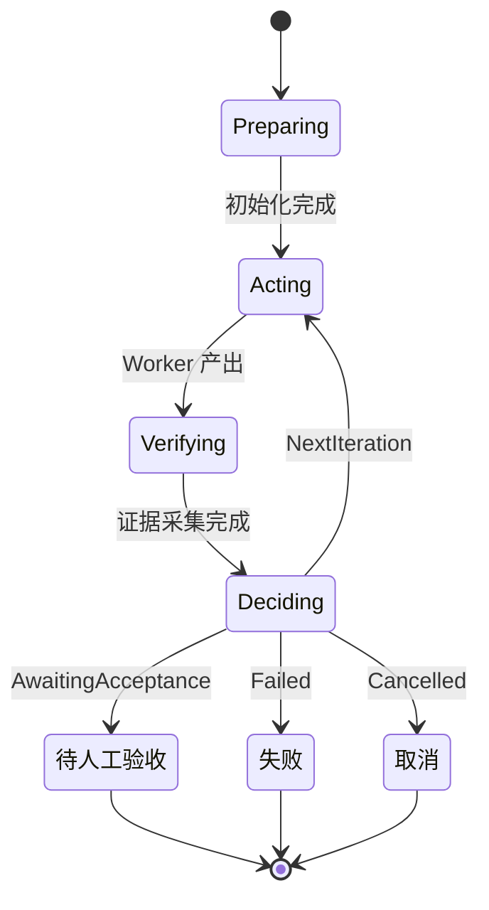

# Loop 运行时与会话 Plan 模式

VaneHub 为自主迭代工作提供一个持久化 native 执行运行时:**Loop**。**Plan** 是合格 OnePiece 会话内的只读执行模式,不是第二套持久化任务编排运行时。面向用户的工作流在用户指南中;本章覆盖 native 设计与归属边界。

## Loop Engineering 范式背景

Loop Engineering 的核心主张是:**不再给编程 Agent 逐句写提示词,而是设计一套能让 Agent 自主迭代的循环系统**——把"负责下指令的人"从开发者自己换成一套设计好的系统。开发者定义目标,系统自动"执行 → 观察 → 评估 → 修正 → 再执行",直到达成目标。

这不是全新发明。Anthropic《Building Effective Agents》(2024)的 Evaluator-Optimizer(一个模型产出、另一个批判修正)与 Orchestrator-Workers(主代理分派任务给子代理)架构本质都是 Agent 循环系统;Loop Engineering 的不同在于工具链已成熟到可以把这套思路产品化、标准化。

**重点不是自动,是闭环**:定时跑任务的脚本不算 Loop Engineering;能感知自身产出质量、判断是否达标、决定下一步行动的系统才算。它处理的是工程基础设施问题(验证、隔离、记忆、成本、停止条件),而非文笔问题。

### 六大组件

一个能无人值守运行的循环由六个部分组成,本项目的对应实现如下:

| 组件 | 作用 | 本项目对应 |
| --- | --- | --- |
| **Automations(自动化)** | 循环的心跳,决定何时运行(定时/事件触发+分诊) | 定时任务(见[定时任务与通知](../../../user-guide/zh-CN/src/scheduled-tasks.md))、IM 入站触发 |
| **Worktrees(隔离工作区)** | 独立工作空间,防止并行 Agent 互相冲突 | Loop 在独立 Git worktree 作业(远程工作区不支持 worktree,故 Loop 不适用) |
| **Skills(技能)** | 把项目知识/编码规范固化一次写好,循环不必每轮重新摸索 | Skill 体系(见[Skill 管理](skill-management.md)) |
| **Plugins / Connectors** | 基于 MCP 把循环接入真实系统(打开 PR、更新工单) | MCP 工具(见[MCP 工具与客户端](mcp-tools.md)) |
| **Sub-agents(子代理)** | 把"做事的人"和"检查的人"分开(出题与阅卷不能同一人) | Loop 的 Worker 与 Verifier 角色,Verifier 用 `VerifierRecommendation`(Pass/Revise/Blocked)独立判定 |
| **Memory / External State** | 外部状态让进度在多次运行间留存,循环"有记性" | 跨会话记忆(见[跨会话记忆](cross-session-memory.md))、持久化到 SQLite 的 Loop 定义与迭代状态 |

### 与 Prompt / Context / Harness Engineering 的关系

AI 工程方法论四次范式跃迁是层叠关系,非替代:

| 层次 | 关注点 | 类比 |
| --- | --- | --- |
| **Prompt Engineering** | 单次对话里怎么措辞、给示例、引导推理 | 你怎么问 |
| **Context Engineering** | 上下文窗口里塞什么信息(检索、记忆、工具描述) | 你让它看见什么 |
| **Harness Engineering** | Agent 运行的环境、权限、沙箱、工具集 | 你把它放在什么环境里 |
| **Loop Engineering** | 循环本身如何自主运转、何时停止、怎么验证结果 | 系统怎么自己转起来 |

Prompt Engineering 并未消亡——一个 Loop 由多个 Prompt 组成,写得差的 Prompt 放进 Loop 只会让糟糕的工作更快产出。Loop Engineering 是在 Prompt/Context/Harness 之上的一层。**适用边界**:目标稳定、可自动判定的重复性任务适合上循环;需求一直变化、风险高的事情仍需人类抓方向。

## Loop 运行时

一个 Loop 定义在持久化时附带稳定的 id、名称、启用状态、本地 Git 项目路径、基线分支、目标、验收准则、允许与受保护的路径、稳定的 Worker 与 Verifier Agent id、结构化验证命令、停止限制、版本与时间戳。Loop 定义保留**稳定的 Agent id**,而不是匹配显示名称。

第一阶段的范围是有约束的:针对非 Git 项目、远程工作区、缺失 Agent、不安全的路径范围或无效限制的定义,会被拒绝,且不会启动 Agent 或创建 worktree。Worker 与 Verifier 角色既接受 CLI 启动的 Agent,也接受启用了 tool-use 信任的 API Agent;未启用 tool-use 信任的 API Agent 会被拒绝。

## OnePiece 会话 Plan 模式

合格的 OnePiece 会话可在输入栏切换 Plan 与 Agent 模式。Plan 模式以 `executionMode: "plan"` 持久化到会话聊天配置,并解析为只读有效策略。它保留只读探索工具,排除 shell 执行、文件写入、有副作用的 MCP 工具与委派工作。

交互式 `exit_plan_mode` 请求会先征求用户确认,只有后续轮次才能使用 Agent 模式。拒绝后会话仍停留在 Plan 模式;批准只改变会话执行模式,不会创建 Plan 定义、PlanRun、任务图或 worktree。

历史 Plan 与 PlanRun 数据库记录仅为迁移兼容和审计而保留。向前迁移会终止仍活跃的历史记录,移除由 Plan 派生的看板链接,但不会删除已记录的历史或文件系统 worktree。

## Loop 迭代状态机

一次 Loop 运行(`LoopRun`)在若干阶段(`LoopRunPhase`)间推进。`Preparing` 完成后进入 `Acting` → `Verifying` → `Deciding` 的迭代循环,`Deciding` 的结果决定是再迭代、终止失败,还是停在待人工验收。`Finalizing` 是终态收尾阶段。下图聚焦迭代循环本身及其在 `decide_loop_iteration()` 下的转移条件。

`Deciding` 的判定输入是 `LoopDecisionInput`,包含三组事实:**必过检查是否通过**、**Verifier 推荐**(`VerifierRecommendation` = `Pass` / `Revise` / `Blocked`)、以及可选的硬终止理由与用户反馈。判定顺序固定。

1. **硬终止理由优先** —— `GoalMet` → `AwaitingAcceptance`;`UserRejected`/`UserStopped` → `Cancelled`;其余硬终止理由 → `Failed`。
2. **`Blocked` 即失败** —— Verifier 推荐 `Blocked` 时,直接 `Failed`(`VerifierBlocked`),不再看检查结果。
3. **必过检查未过 → 下一轮** —— `required_checks_passed = false` 时强制 `NextIteration`,即使用户在反馈里要求"就这样接受"也不生效。
4. **Verifier `Revise` → 下一轮** —— 即使必过检查全过,只要 Verifier 要求修订,仍走 `NextIteration`。
5. **检查全过 + Verifier `Pass` → 待人工验收** —— 这是唯一到达 `AwaitingAcceptance` 的路径。**Loop 永不自己宣布成功**,始终停在等待人工验收。

### 无进展检测、迭代上限与信任契约

Loop 不会陷入无意义循环。每轮迭代记录目标状态指纹(`LoopObjectiveFingerprints`),包含三项指纹:**diff 哈希**、**必过检查失败集哈希**、**已通过的必过检查集合**。

- **无进展条件** —— 连续两轮迭代的三项指纹同时没有变化(即 `repeated_diff && repeated_required_check_failures && !has_new_passing_required_evidence`)时,判定本轮无进展。
- **无进展上限** —— 连续无进展轮数达到 `LoopLimits.max_consecutive_no_progress` 时,以 `NoProgress` 终止失败。
- **迭代上限** —— 迭代次数达到 `max_iterations` 时以 `MaxIterations` 终止;时间预算超限以 `TimeBudget` 终止。
- **Worker / Verifier 信任契约** —— Worker 与 Verifier 角色接受两种 Agent:CLI 启动的 Agent,以及**启用了 tool-use 信任**的 API Agent。未启用 tool-use 信任的 API Agent 在定义时即被拒绝,不会启动 Agent 或创建 worktree。

## 关键类型与常量

下表汇总 Loop 运行时的核心类型与判定函数,供实现时快速查阅。权威语义仍以本节前文与规范为准。

### Loop 迭代阶段与结果

`LoopRunPhase` 枚举(来自 `loop_engineering.rs`)定义一次 `LoopRun` 的阶段推进:

- `LoopRunPhase::Preparing` —— 初始化
- `LoopRunPhase::Acting` —— Worker 执行
- `LoopRunPhase::Verifying` —— 证据采集
- `LoopRunPhase::Deciding` —— 证据采集之后的判定
- `LoopRunPhase::Finalizing` —— 终态收尾

`Deciding` 阶段的判定结果由 `LoopDecisionOutcome` 枚举表示:

- `LoopDecisionOutcome::Failed` —— 终止失败
- `LoopDecisionOutcome::Cancelled` —— 取消
- `LoopDecisionOutcome::NextIteration` —— 进入下一轮迭代
- `LoopDecisionOutcome::AwaitingAcceptance` —— 停在待人工验收

### Verifier 推荐与迭代判定

`LoopVerifierRecommendation` 枚举三值:`Pass` / `Revise` / `Blocked`。

`decide_loop_iteration()` 按下列固定顺序判定,顺序不可调换:

1. **硬终止理由** —— `GoalMet` → `AwaitingAcceptance`;`UserRejected`/`UserStopped` → `Cancelled`;其余硬终止理由 → `Failed`
2. **`Blocked` 即失败** —— Verifier 推荐 `Blocked` 时直接 `Failed`,不再看检查结果
3. **必过检查未过 → `NextIteration`** —— `required_checks_passed = false` 时强制下一轮,用户"就这样接受"的反馈不生效
4. **Verifier `Revise` → `NextIteration`** —— 即使必过检查全过,仍走下一轮
5. **检查全过 + Verifier `Pass` → `AwaitingAcceptance`** —— 唯一到达待人工验收的路径,Loop 永不自宣布成功

### 无进展指纹

`LoopObjectiveFingerprints` 在每轮迭代记录三项指纹:

- **diff 哈希** —— 本轮 diff 的哈希
- **必过检查失败集哈希** —— 本轮未过必过检查的集合哈希
- **已通过必过检查集合** —— 累计已通过的必过检查

无进展判定为 `repeated_diff && repeated_required_check_failures && !has_new_passing_required_evidence`(连续两轮三项指纹同时无变化)。

### 迭代限制

`LoopLimits` 共五个字段,在构造时校验:

| 字段 | 类型 | 含义 |
| --- | --- | --- |
| `max_iterations` | `u16` | 迭代次数上限,仅接受 `1..=20` 区间;达到即以 `MaxIterations` 终止 |
| `step_timeout_seconds` | `u64` | 单步时间预算 |
| `total_timeout_seconds` | `u64` | 整轮时间预算,超限以 `TimeBudget` 终止 |
| `max_consecutive_runtime_errors` | `u16` | 连续运行时错误上限 |
| `max_consecutive_no_progress` | `u16` | 连续无进展轮数上限,达到即以 `NoProgress` 终止失败 |

### Worker/Verifier 信任契约

Worker 与 Verifier 角色接受两种 Agent:CLI 启动的 Agent,以及**启用了 tool-use 信任**的 API Agent。未启用 tool-use 信任的 API Agent 在定义时即被拒绝,不会启动 Agent 或创建 worktree。

## 设计所在

本章用于为贡献者定向。权威的需求位于规范中。

- [openspec/specs/loop-engineering-runtime](../../../../openspec/specs/loop-engineering-runtime/spec.md) — 持久化的 Loop 定义与 Worker/Verifier 信任契约。
- [openspec/specs/session-chat-configuration](../../../../openspec/specs/session-chat-configuration/spec.md) — 持久化的 OnePiece 会话 Plan 模式。
- [openspec/specs/agent-plan-exit-request](../../../../openspec/specs/agent-plan-exit-request/spec.md) — 交互式退出 Plan 模式的行为。

Loop 执行位于 `agent_runtime` bounded context 中。OnePiece Plan 模式由 `sessions` 与 `agent_runtime` 边界共同负责;见 [Native bounded context](native-contexts.md)。
