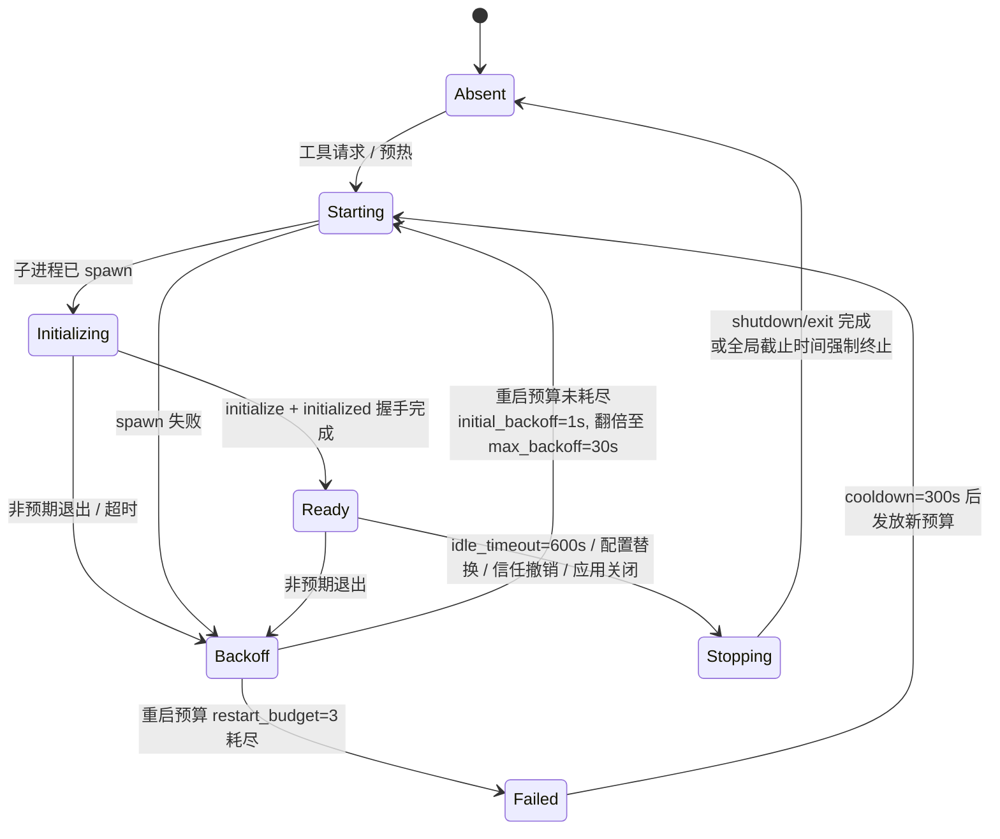
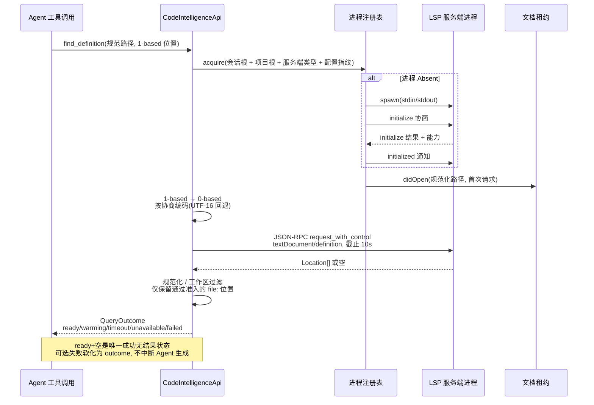

# LSP 代码智能

原生 LSP 基础是一个独立归属、仅桌面端的限界上下文。它向原生 API Agent 提供实时的语义代码智能,同时不让持久化的 Tree-sitter 代码索引成为进程或配置依赖。

## 运行基线

首版实现仅支持以下服务端族:

| 语言族 | 可执行文件 | 固定启动行为 | 根标记 |
| --- | --- | --- | --- |
| Rust | `rust-analyzer` | stdio LSP | 最近的 `Cargo.toml` |
| TypeScript/JavaScript | `typescript-language-server` | VaneHub 追加 `--stdio` | 最近的 `tsconfig.json`、`jsconfig.json` 或 `package.json` |

用标准 rustup 管理的 Rust 服务端安装:

```bash
rustup component add rust-analyzer
rustup component add rust-src
```

安装 TypeScript 服务端及其 TypeScript 运行时:

```bash
npm install -g typescript-language-server typescript
```

当平台打包或前置依赖存在差异时,参考上游的 [rust-analyzer binary guide](https://rust-analyzer.github.io/book/rust_analyzer_binary.html) 与 [TypeScript Language Server 仓库](https://github.com/typescript-language-server/typescript-language-server#installing)。

在 **Settings > Agent Configurations** 中,启用主开关与某门语言,确认发现情况或提供一个绝对路径的可执行文件覆盖项,保存一个有界的初始化选项对象,运行隔离的服务端测试,并显式信任规范的本地工作区。每个开关与信任记录默认都为禁用。代码索引的启用不等同于 LSP 信任。

## 归属与边界

原生侧的主要归属位于 `src-tauri/src/contexts/code_intelligence/`:

| 层 | 职责 |
| --- | --- |
| `domain/` | 语言/服务端标识、信任、配置、进程状态、能力、版本、规范化位置、诊断与软失败结果 |
| `application/` | 仓库与原生环境端口 |
| `infrastructure/` | 发现、项目根、进程注册表、JSON-RPC、分帧、initialize 协商、文档租约、诊断、规范化、服务端测试、关闭与统一诊断 |
| `api.rs` | 唯一的跨上下文代码智能门面 |

`agent_runtime` 拥有消费侧的 `AgentCodeIntelligencePort` 与 `AgentWorkspaceMutationPort` 契约。Bootstrap 将这些端口适配到 `CodeIntelligenceApi`;Agent 代码不得导入代码智能基础设施。检索通过其公共 `CodeIndexApi` 独立触达,用于针对性的变更协调。

前端遵循与其它部分相同的服务边界:

```text
React settings components
  -> AgentService
    -> tauri-agent-client.ts -> registered Tauri commands -> CodeIntelligenceApi
    -> web-agent-client.ts   -> deterministic in-memory Web/mock adapter
```

React 组件不得直接调用 `invoke()`。Web/mock 代码不得导入原生的文件系统或进程适配器,也不得声称启动了真实服务端。

## 进程与协议生命周期

进程以规范会话根、检测到的项目根、服务端类型与配置指纹为键。因此嵌套项目可以使用同一服务端的独立实例。

```text
absent -> starting -> initializing -> ready -> stopping -> absent
                    \-> backoff -> starting
                    \-> failed
```

- 工具请求按需启动一个合格的服务端;有界的语言清单可预热它。
- `ready` 表示 `initialize`/`initialized` 握手完成,不代表后台服务端索引已结束。
- 非预期退出会使挂起请求失败,清空文档与诊断状态,并进入有界的指数退避。
- 重启预算耗尽后进入 `failed`,直到冷却路径允许一份新预算。
- 一个 `ready` 进程若无活动请求或文档租约,在十分钟后关闭。
- 配置替换与信任撤销使用同一条排空式停止路径。
- 应用关闭并发地停止各服务端,依次尝试 `shutdown` 与 `exit`,并在全局截止时间下强制终止剩余进程树。

传输层是建立在子进程 stdin/stdout 之上的有界 JSON-RPC 2.0。`Content-Length` 头、分帧、stderr 捕获、队列、挂起请求、并发请求、服务端通知与规范化输出都有硬上限。服务端到客户端的工作区编辑被这个只读基础所拒绝。

## 文档、位置与诊断

磁盘内容是权威的。在语义请求之前,文档准入会规范化一个相对路径,并拒绝绝对、穿越、隐藏、非文件、二进制、非法 UTF-8、过大以及符号链接逃逸的目标。VaneHub 不维护未保存的编辑器缓冲区。

首次请求发送 `didOpen`。变更后的磁盘快照会递增其版本并发送协商好的全量或单段连续增量 `didChange`;空闲或停止的租约发送 `didClose`。Agent 的精确写入会立即使匹配的租约失效。Shell、Git 与外部编辑器的变更在下一次被请求的磁盘读取时检测,而非依赖文件系统监听器。

Agent 坐标与规范化的结果范围是 1 起始的。协议坐标是 0 起始的,并使用协商的编码,以 UTF-16 为回退。诊断通知替换按文档分版本的快照;当前的空、陈旧、预热中、超时、不可用与失败状态始终保持区分。

## Agent 工具与硬上限

provider 中立的目录在普通与 Plan Mode 生成中按条件暴露四个只读工具:

| 工具 | 协议方法或来源 | 约束 |
| --- | --- | --- |
| `find_definition` | `textDocument/definition` | 20 个接受的位置 |
| `find_references` | `textDocument/references` | 50 个接受的位置,确定性顺序 |
| `get_hover` | `textDocument/hover` | 有界的签名、文档与序列化输出 |
| `get_diagnostics` | `textDocument/publishDiagnostics` 缓存 | 有界的数量与消息内容 |

工作区作用域始终来自当前会话。模型不能选择工作区、根、服务端路径或 URI scheme。只有规范工作区内通过准入的 `file:` 位置能在规范化后留存。

每个结果使用 `ready`、`warming`、`timeout`、`unavailable` 或 `failed`,而不是把可选的智能失败变成 Agent 生成失败。`ready` 加空结果是唯一的成功无结果状态。带计数的结果保留接受总数、返回计数、过滤、陈旧与截断元数据。

## Tree-sitter 检索与 LSP

这些能力解决不同的问题,并保持独立归属:

| 关注点 | Tree-sitter `search_code` | 实时 LSP |
| --- | --- | --- |
| 归属 | `retrieval` | `code_intelligence` |
| 状态 | 持久化的清单、块、符号、FTS 与可选向量 | 临时进程、文档、能力与诊断 |
| 查询形态 | 在工作区索引上的文本或语义检索 | 精确文档位置或诊断文档 |
| 语义深度 | 语法结构与可选的嵌入相似度 | 编译器/语言服务端的定义、引用、类型与诊断 |
| 激活 | 按工作区的索引配置 | 主开关、语言开关、可执行文件、本地会话与显式信任 |
| 可用性 | 无语言服务端即可工作 | 无持久化代码索引即可工作 |

成功的 Agent 文件写入会发布一个尽力而为的变更信号。Bootstrap 使 LSP 租约失效,并把规范化路径交给那个有界的、合并式的代码索引队列。任一下游失败都不改变一次成功的文件工具结果。

## 持久化与日志

SQLite 持有默认禁用的主机配置与规范工作区信任记录。可执行文件、固定参数、初始化选项与信任修订共同构成配置指纹,因此陈旧进程无法服务新请求。

生命周期与协议诊断使用统一日志。安全的元数据包括服务端/语言标识、生命周期跃迁、方法类别、时长、计数、重启尝试、超时/取消类别、退出码与安全的工作区标识。绝不持久化原始协议载荷、源码或 hover 内容、诊断消息、stderr、环境变量、可执行文件参数、凭据或私有的绝对路径。

## 扩展限制

本基础有意排除 Python、Go、Java、C/C++、远程工作区、下载的服务端、格式化、补全、重命名、code action、工作区编辑、调用/类型层级、文件系统监听、未保存缓冲区与持久化的 LSP 增强。不要仅仅通过把一个变更方法加进目录就暴露它;它需要一份单独的 OpenSpec 变更、权限分析、Plan Mode 处理、协议限制与工作区隔离测试。

LSP 不标准化可移植的服务端内存或已索引文件数,因此状态契约必须将这些指标保持为不支持,而不是捏造它们。

## 故障排查与验证

- **发现失败**:把桌面进程可见的可执行文件与交互式 shell 比较,再测试一个绝对覆盖项。配置的覆盖项非法时绝不静默回退。
- **启动失败**:在不记录环境或参数的前提下检查运行时依赖与可执行文件权限。
- **initialize 失败或超时**:检查隔离测试阶段与安全原因;畸形的能力必须失败关闭,且清理仍须运行。
- **退避或重启耗尽**:检查进程注册表快照与限速的安全诊断。在重置信任或配置之前先修复原因。
- **陈旧诊断**:核实本地文档版本,并仅在有界的查询截止时间内等待替换发布。
- **工具缺失**:核实桌面运行时、本地工作区、主/语言开关、可执行文件发现、显式信任、所支持的文件语言与目录资格。
- **返回的位置消失**:在怀疑传输丢失之前,检查 URI scheme、规范包含关系、文档准入、位置转换与结果上限。

有用的聚焦原生检查包括:

```bash
cargo test --manifest-path src-tauri/Cargo.toml --lib contexts::code_intelligence
cargo test --manifest-path src-tauri/Cargo.toml --test architecture
cargo clippy --manifest-path src-tauri/Cargo.toml --all-targets -- -D warnings
```

前端适配器、组件与 Web/mock 行为由 Vitest 覆盖;文档化的设置流程由 LSP Playwright 场景覆盖。提交前请运行 `AGENTS.md` 中的仓库级验证命令。

## 进程状态机与请求时序

`ProcessState` 是单个服务端进程的有限状态机。`absent` 是初始与终态；`starting` 表示已 spawn 但尚未完成 `initialize` 握手；`ready` 表示握手完成（不代表后台索引已结束）；`stopping` 是排空式停止路径；`backoff` 与 `failed` 是非预期退出后的有界恢复路径。状态机参数由 `LifecyclePolicy` 默认值承载。



- `restart_budget = 3`、`initial_backoff = 1s`、`max_backoff = 30s`、`cooldown = 300s`、`idle_timeout = 600s`。
- `ready` 的进程若无活动请求或文档租约，在十分钟后被关闭。
- 重启预算耗尽后进入 `failed`，直到 `cooldown` 路径允许一份新预算才可再 `starting`。
- 配置替换与信任撤销使用同一条排空式 `stopping` 路径。

一次 `find_definition` 的端到端时序如下。文档租约、协议坐标转换与有界请求截止时间是三个值得关注的环节。



- **坐标转换**：Agent 坐标与结果范围是 1 起始的，协议坐标是 0 起始的；编码按 initialize 协商结果，回退为 UTF-16。
- **请求截止**：`request_with_control` 对单次 JSON-RPC 请求设 10s 截止；超时归为 `timeout` 软失败，不抛给 Agent。
- **工作区过滤**：返回的位置在规范化后按当前会话工作区过滤，模型不能选择工作区、根、服务端路径或 URI scheme。

## 安全根因

LSP 是只读基础，安全性由四道闸门共同保证，而不是依赖单一检查：

1. **只读工具目录**：`find_definition`/`find_references`/`get_hover`/`get_diagnostics` 全部只读；服务端到客户端的工作区编辑（`workspace/applyEdit` 等）被这个只读基础直接拒绝。
2. **会话工作区作用域**：工作区始终来自当前会话；只有规范工作区内通过准入的 `file:` 位置能在规范化后留存。
3. **磁盘为准**：VaneHub 不维护未保存编辑器缓冲区；磁盘内容是权威，Agent 的精确写入会立即使匹配的租约失效。
4. **隔离测试四阶段**：服务端测试走 `Discovery → Spawn → Initialize → Cleanup` 四阶段，畸形的能力必须失败关闭，且清理仍须运行。

进程、协议与权限边界的权威定义见 `openspec/specs/` 下相关 spec，归属层位于 `src-tauri/src/contexts/code_intelligence/`。

## 关键类型与常量

LSP 运行时的进程管理位于 `code_intelligence/infrastructure/process_registry.rs`,协议层在 `initialize_negotiation.rs` / `json_rpc_actor.rs` / `lsp_framing.rs`:

- **`ProcessState`** —— `Absent`/`Starting`/`Initializing`/`Ready`/`Stopping`/`Backoff`/`Failed`;`is_warming()`(Starting|Initializing)、`is_terminal()`(Failed)。
- **`LifecyclePolicy` 默认值** —— `restart_budget=3`、`initial_backoff=1s`、`max_backoff=30s`(指数退避翻倍)、`cooldown=300s`、`idle_timeout=600s`(10 分钟无请求且无租约的 Ready 进程被关闭)。
- **能力协商** `initialize_negotiation.rs` —— `initialize_and_notify()` 先 `initialize` 再 `initialized`;`build_initialize_params()` 声明 position encoding(缺省 UTF-16)、workDoneProgress、configuration 与 definition/references/hover/publishDiagnostics;`negotiate_initialize_result()` 选 encoding、normalize 同步模式(None/Full/Incremental);服务器不支持某方法时**不发送**请求,返回 unavailable。
- **位置转换** `PositionConverter.agent_to_lsp` —— Agent 坐标 1-based → LSP 0-based,按协商编码;越界 → `invalid_position` 不发请求。
- **请求控制** `JsonRpcRequestControl::standard` —— 单次请求 10s 截止 + 250ms 清理保留;超时/取消区分,`ActorCommand::Cancel` 发 `$/cancelRequest`;乱序响应按 id 匹配。
- **诊断缓存** `DiagnosticsCache` —— 按文档版本缓存,`get_diagnostics` 等 `diagnostics.wait_for_current(uri, version, Ready, 9s)`;区分 ready/stale/timeout/unavailable;外部 URI related location 被过滤。
- **帧边界** `lsp_framing.rs` —— Content-Length 硬上限,超限杀进程。
- **服务器→客户端请求** `lsp_server_requests.rs` —— 处理 `workspace/configuration`、`register/unregister_capabilities`;**`workspace/applyEdit` 被拒**(只读基础)。
- **诊断日志** `lsp_diagnostics.rs` —— `LspDiagnosticKind`(Lifecycle/Timeout/Cancellation/Crash/Restart/DiagnosticsCount/ProtocolLimit/Shutdown),`record()` 带限频,只记安全元数据(不落 payload/源码/hover/诊断文本/stderr/环境/绝对路径)。
- **隔离测试** `server_test.rs` —— `ServerTestPhase`(Discovery → Spawn → Initialize → Cleanup),用 `tempfile::TempDir` 跑完整 initialize/initialized/shutdown/exit,64KB stderr 上限、min 100ms 超时。
