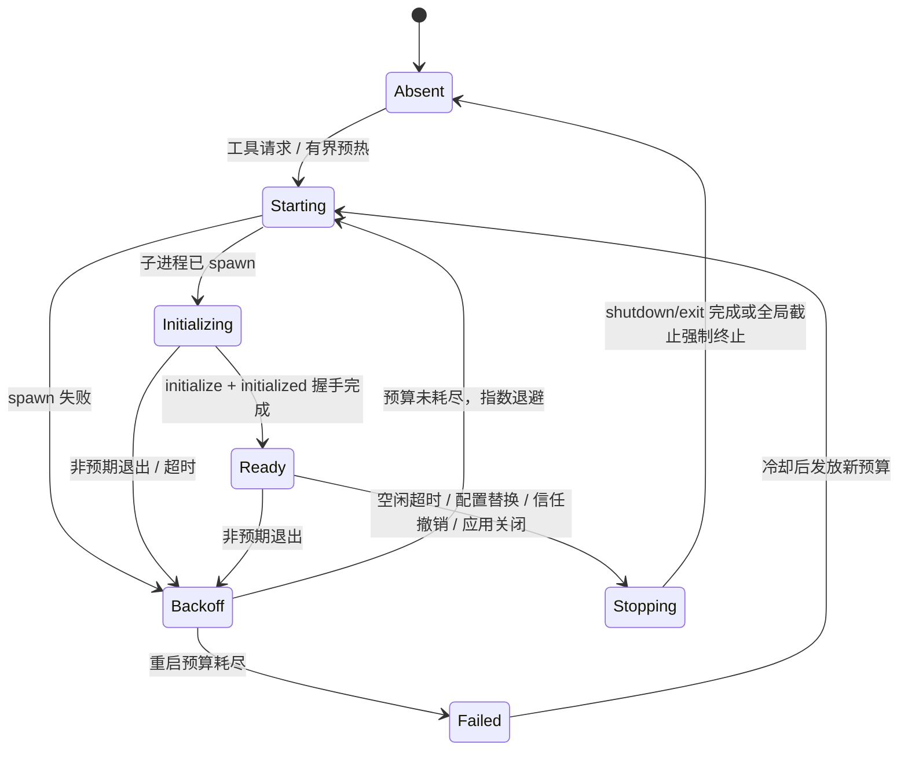

# LSP 代码智能

原生 LSP 基础是一个独立归属、**仅桌面端**的限界上下文（`code_intelligence`）：语言服务器的发现、安装、启动与 JSON-RPC 全部只在桌面运行时发生；Web/mock 只承担契约、状态展示与测试模拟。它向原生 API Agent 提供实时语义代码智能，且不把持久化的 Tree-sitter 代码索引当作进程或配置依赖。

## 支持矩阵

唯一权威定义是 `domain/registry.rs` 的 `LANGUAGE_DEFINITIONS`。下表由它整理而来——修改语言支持时以注册表为准，不要在其他文档另抄一份：

| 语言族（id） | 服务器 | 启动形态 | 扩展名 → languageId | 项目根标记 | 平台 | 语言特有约束 |
| --- | --- | --- | --- | --- | --- | --- |
| Rust（`rust`） | `rust-analyzer` | Executable，无默认参数 | `rs → rust` | `Cargo.toml` | 全平台 | 建议经 rustup 组件安装 |
| TypeScript/JavaScript（`typescript_javascript`） | `typescript-language-server` | Executable，追加 `--stdio` | `ts/tsx/js/mjs/cjs/jsx →` 各自 languageId | `tsconfig.json`、`jsconfig.json`、`package.json` | 全平台 | 需要 TypeScript 运行时（npm 包） |
| Go（`go`） | `gopls` | Executable，无默认参数 | `go → go` | `go.mod` | 全平台 | — |
| Python（`python`） | `pyright` | Executable，追加 `--stdio` | `py/pyi → python` | `pyproject.toml`、`setup.py`、`setup.cfg`、`requirements.txt` | 全平台 | 可执行候选按偏好排序：`basedpyright-langserver` 优先于 `pyright-langserver` |
| C/C++（`cpp`） | `clangd` | Executable，无默认参数 | `c/h → c`；`cpp/cc/cxx/hpp/hh/hxx → cpp`（`h` 无法从扩展名判定方言，取保守的 `c`，clangd 会按编译数据库推断） | `compile_commands.json`、`build/compile_commands.json`（标记可以是候选目录**内部**的相对路径） | 全平台 | **`requires_root_marker = true`**：没有编译数据库时探测**拒绝**而非回退到会话根——clangd 会用默认编译参数给出貌似确定实则错误的答案，比"不可用"更糟。发现仍报告 clangd 可用，服务不了的是这个工作区 |
| Java（`java`） | `jdtls` | **Interpreter**：`executables` 命名的是 `java` 解释器，服务器住在参数模板里；手动覆盖填的是安装**目录**而非可执行文件 | `java → java` | `pom.xml`、`build.gradle`、`build.gradle.kts`、`settings.gradle` | 全平台 | 无项目元数据时降级为单文件分析（与 clangd 不同，值得继续服务，故 `requires_root_marker = false`）；唯一声明了托管安装（distribution）的语言 |

运行时的实际可用能力还要经过 initialize 协商（见下），矩阵只回答"本构建注册了什么"。

在 **Settings → Agent Configurations** 中：启用主开关与某门语言、确认发现结果或提供绝对路径覆盖、保存有界的初始化选项、运行隔离服务器测试、显式信任规范化的本地工作区。每个开关与信任记录默认禁用；代码索引的启用不等同于 LSP 信任。

## 安全边界

只读性由多道闸门共同保证：

1. **只读工具目录**——九个工具全部只读；服务器到客户端的工作区编辑（`workspace/applyEdit` 等）被客户端直接拒绝。
2. **会话工作区作用域**——工作区始终来自当前会话；只有规范工作区内通过准入的 `file:` 位置能在规范化后留存。模型不能选择工作区、根、服务器路径或 URI scheme。
3. **磁盘为准**——不维护未保存编辑器缓冲区；Agent 的精确写入立即使匹配的文档租约失效。
4. **隔离服务器测试**——Discovery → Spawn → Initialize → Cleanup 四阶段；畸形能力必须失败关闭，清理仍须运行。

**但必须明确：以上不等于语言服务器进程被沙箱化。** Agent 只拿到只读工具、客户端拒绝写编辑，而语言服务器本身仍是运行在用户机器上的**第三方进程**——普通子进程，无 seccomp、无权限降级。它可以读取工作区文件、依赖、编译数据库、配置与工具链信息，也可以做它的作者让它做的任何事。因此 **workspace trust 控制的是"是否允许对这个工作区运行第三方语言工具"这一决定本身**，而不只是防止写操作。

### 托管安装的供应链限制（醒目记录）

注册表条目可声明一份发行信息（distribution）；当前只有 Java 声明了。其下载约束是：主机精确允许列表（`download.eclipse.org`）、HTTPS 且每一跳重定向都复查允许列表、下载字节上限与截止时间、有界解压（总字节与条目数上限、拒绝链接类条目）。**但字节本身未经完整性校验**：

- `ArtifactIntegrity::Unverified` 是显式声明的状态——Eclipse 发布的是 `latest` 快照包，不存在跨版本稳定的摘要；
- **没有固定不可变版本**（取 `latest`，任何地方都不记录装到的是哪个版本）、**没有 SHA-256 或签名校验、没有来源身份验证、没有安装清单、不展示当前版本、没有升级与回滚策略**；
- HTTPS 加主机允许列表**不等同于制品完整性验证**——UI 在用户点击安装之前如实说明这一点。

发现优先级固定为：**手动覆盖 → 托管安装 → 不可用**。安装不得改写已指定目录的用户选择；卸载只移除应用数据下的安装目录。安装采用"隔离解压 → 拷贝到活安装旁的 `install.incoming` → 原子改名换入"，第二次改名失败会把原安装换回。Web/mock 对安装动作**直接拒绝**（抛错说明需要桌面运行时），而不是伪装成功。

## 归属与边界

| 层 | 职责 |
| --- | --- |
| `domain/` | 语言注册表、校验过的语言 id、信任、配置、进程状态、能力、版本、规范化位置、诊断与软失败结果 |
| `application/` | 仓储与原生环境端口 |
| `infrastructure/` | 发现、项目根、进程注册表、JSON-RPC、分帧、initialize 协商、文档租约、诊断、规范化、服务器测试、托管安装、关闭与统一诊断 |
| `api.rs` | 唯一的跨上下文代码智能门面 |

注册表是**编译期**的：每条目需要 fixture 工程与根探测规则，只有代码能提供。不存在 `LanguageFamily` 或 `ServerKind` 枚举——一种语言就是 `Language = &'static LanguageDefinition`；`LspLanguageId` 是跨存储/线协议时的持有式校验形态（`[a-z0-9_]{1,64}`），当前构建未注册的 id 解析为 `None`，是普通分支而非错误。发现、根探测、文档准入、服务器测试、配置默认值、命令 DTO 与设置页全部由注册表派生，没有第二处枚举该集合。

`agent_runtime` 拥有消费侧端口契约，bootstrap 把它们适配到 `CodeIntelligenceApi`；Agent 代码不得导入代码智能基础设施。前端遵循统一服务边界（组件 → `AgentService` → Tauri/Web 适配器），React 组件不得直接 `invoke()`。

**React 展示层不维护语言业务分支**：`get_lsp_configuration` 携带描述符列表，设置页按描述符逐条渲染（"覆盖"的含义、安装动作都从描述符字段学，绝不从语言 id 判断）。契约校验器不持有"已知语言集合"，只校验 id 形状并交叉检查每个已配置语言都有描述符。**Web/mock 没有后端注册表可问，自带一份有界镜像表**（当前含 Executable 形态与 Interpreter/安装目录形态的代表性条目），加语言是改数据不改代码；前后端漂移由适配器契约测试（conformance）检测。

## 进程与协议生命周期

进程以**规范会话根 + 检测到的项目根 + 服务器类型 + 配置指纹**为键：

- **monorepo / 多项目根**：同一会话工作区里的嵌套项目各自命中最近的祖先根标记，得到同一服务器的**独立实例**；
- **根或配置变化**：新请求按新键启动新进程，旧进程走排空式停止或空闲关停——配置替换与信任撤销共用同一条排空路径；
- 标记顺序没有意义：任一标记都能单独标识一个根，最近祖先胜出。



`LifecyclePolicy` 默认值：`restart_budget = 3`、`initial_backoff = 1s` 翻倍至 `max_backoff = 30s`、`cooldown = 300s`、`idle_timeout = 600s`（无活动请求且无文档租约的 Ready 进程十分钟后关闭）。非预期退出使挂起请求失败并清空文档与诊断状态。应用关闭并发停止各服务器，在全局截止时间下强制终止剩余进程树。

**`ready` 仅表示进程启动且 `initialize`/`initialized` 握手完成，不表示服务器完成了工作区索引**——刚 ready 的服务器仍可能对查询返回暖机中的空结果，结果状态里的 `warming` 正为此存在。

传输层是子进程 stdin/stdout 上的有界 JSON-RPC 2.0：`Content-Length` 分帧有硬上限（超限判为帧错误，传输随之终止并进入非预期退出的恢复路径）、stderr 捕获、队列、挂起与并发请求、服务器通知与规范化输出全部有界。

## 文档、位置与诊断

磁盘内容是权威。语义请求前的文档准入规范化相对路径，拒绝绝对、穿越、隐藏、非文件、二进制、非法 UTF-8、过大与符号链接逃逸的目标。首次请求发送 `didOpen`；变更后的磁盘快照递增版本并按协商结果发送全量或增量 `didChange`；空闲或停止的租约发送 `didClose`。Shell、Git 与外部编辑器的变更在下一次被请求的磁盘读取时检测，不依赖文件系统监听器。

**坐标与 URI**：Agent 侧坐标与规范化结果范围是 1 起始；协议坐标 0 起始，按 initialize 协商的编码转换，**回退 UTF-16**；越界位置不发请求，直接返回 `invalid_position`。所有返回位置经 URI 归一化后按当前会话工作区过滤，只保留通过准入的 `file:` 位置。

诊断通知替换按文档分版本的快照；空、陈旧、暖机中、超时、不可用与失败状态始终区分；外部 URI 的关联位置被过滤。

## Agent 工具与硬上限

九个只读工具在普通与 Plan 模式生成中按条件暴露：

| 工具 | 协议方法或来源 | 约束 |
| --- | --- | --- |
| `find_definition` | `textDocument/definition` | 20 个接受的位置 |
| `find_references` | `textDocument/references` | 50 个接受的位置，确定性顺序 |
| `get_hover` | `textDocument/hover` | 有界的签名、文档与序列化输出 |
| `get_diagnostics` | `textDocument/publishDiagnostics` 缓存 | 有界的数量与消息内容 |
| `find_type_definition` | `textDocument/typeDefinition` | 20 个接受的位置 |
| `find_implementations` | `textDocument/implementation` | 20 个接受的位置 |
| `find_workspace_symbols` | `workspace/symbol` | 50 个接受的符号，拒绝空查询 |
| `get_document_symbols` | `textDocument/documentSymbol` | 200 个接受的符号，深度 8 |
| `find_call_hierarchy` | `textDocument/prepareCallHierarchy` + incoming/outgoing | 50 条关系、每条 20 个调用点，整个交换共用**一个** 10 秒预算 |

- **工具目录只追加，绝不在前面插入**——provider 缓存工具定义前缀，重排会让符合条件的会话白白丢掉 prompt cache；有架构测试钉住声明顺序。
- **调用层级整体一个截止时间**而不是每步单请求预算；准备阶段解析出多个条目时只跟进第一个并在元数据里报告。
- **`find_workspace_symbols`**：指定的文档只用来选服务器（即选项目根——LSP 没有"仓库"概念，一个仓库可装多个项目），它是唯一不走文档租约与准入的方法，可以在不打开任何文件的情况下运行、也不报告文档版本。**但结果不豁免**：所有返回 URI 与位置仍经规范化、限制在可信工作区内（工作区外的匹配被丢弃并计入过滤计数）并套用结果上限。
- **能力协商**：hover、definition、references、workspace symbol 等每个方法是否可调，依据 initialize 返回的服务器 capabilities——服务器不支持的方法**不发送请求**，直接返回 `unavailable`。协商能力以 `SemanticMethod::ALL` 列表承载，"客户端未实现（缺席）"与 `supported: false`（换服务器可解决）是两件事；该列表同样只追加，顺序即设置卡片渲染顺序。
- 每个结果用 `ready`/`warming`/`timeout`/`unavailable`/`failed` 表达，可选智能的失败绝不变成 Agent 生成失败；`ready` 加空结果是唯一的"成功且无结果"。带计数的结果保留接受总数、返回计数、过滤、陈旧与截断元数据。
- 单次 JSON-RPC 请求 10 秒截止；超时归为 `timeout` 软失败；取消发送 `$/cancelRequest`；乱序响应按 id 匹配。

## 持久化与日志

SQLite 持有默认禁用的主机配置与规范工作区信任记录。可执行文件、**解析后的启动参数（含参数边界）**、初始化选项与信任修订共同构成配置指纹——直接拼接会让 `["ab"]` 与 `["a","b"]` 哈希相同。

两条容易做反的存储语义：

- 语言配置表**不约束**语言 id 集合（历史上的 `CHECK` 约束已在迁移中拆除），"存储里有一行指向当前构建未注册的语言"是可达状态（降级即可产生）。加载时**跳过该行且原样保留**：拒绝会让应用因一种服务不了的语言无法启动，删除会让"降级再升级"丢掉用户设置。
- `startup_arguments_json` 可空且区分有意义：`NULL` 表示"用注册表默认值"，JSON 数组（含空数组）是用户的显式选择。合并两者会导致用户一清空输入框，`--stdio` 就从 TypeScript 服务器上消失。
- **Interpreter 形态的启动参数追加在模板之后而非替换**：模板不是默认值，一个能被替换的模板就是一个能被替换成起不来服务器的模板。模板占位符是枚举变体，launcher 按声明目录内的前后缀匹配延迟解析（匹配到多个是拒绝而非挑选、不递归），配置目录按平台**与宿主架构**解析（架构目录缺失时回退平台目录），每工作区 data 目录从规范根哈希**推导**而非记录——信任撤销且进程停止后删除，空闲关停不删（那份索引正是下次启动变快的原因）。

生命周期与协议诊断走统一日志，只记安全元数据：服务器/语言标识、生命周期跃迁、方法类别、时长、计数、重启尝试、超时/取消类别、退出码与安全的工作区标识。**绝不持久化**原始协议载荷、源码或 hover 内容、诊断消息、stderr、环境变量、可执行文件参数、凭据或私有绝对路径。

## Tree-sitter 检索与 LSP

两种能力解决不同问题、独立归属：

| 关注点 | Tree-sitter `search_code` | 实时 LSP |
| --- | --- | --- |
| 归属 | `retrieval` | `code_intelligence` |
| 状态 | 持久化的清单、代码块、符号、FTS 与可选向量 | 临时进程、文档、能力与诊断 |
| 查询形态 | 工作区索引上的文本或语义检索 | 精确文档位置或诊断文档 |
| 语义深度 | 语法结构与可选嵌入相似度 | 编译器/语言服务器级的定义、引用、类型与诊断 |
| 激活 | 按工作区的索引配置 | 主开关、语言开关、可执行文件、本地会话与显式信任 |
| 可用性 | 无语言服务器即可工作 | 无持久化代码索引即可工作 |

成功的 Agent 文件写入发布尽力而为的变更信号：bootstrap 使 LSP 租约失效，并把规范化路径交给有界合并的代码索引队列；任一下游失败都不改变文件工具的成功结果。

## 范围排除

本基础有意排除：远程工作区；托管服务器的版本选择与升级；格式化、补全、重命名、code action、工作区编辑；文件系统监听；未保存缓冲区；类型**层级**（`typeHierarchy/supertypes`）。暴露任何变更类方法都需要单独的 OpenSpec 变更、权限分析、Plan 模式处理、协议限制与工作区隔离测试。LSP 不标准化可移植的服务器内存或已索引文件数指标，状态契约将其保持为不支持而不是捏造。

## 故障排查

- **发现失败**：比较桌面进程可见的可执行文件与交互式 shell，再测试绝对路径覆盖；非法覆盖绝不静默回退。
- **启动失败**：在不记录环境或参数的前提下检查运行时依赖与可执行权限。
- **initialize 失败或超时**：检查隔离测试阶段与安全原因；畸形能力必须失败关闭。
- **退避或重启耗尽**：检查进程注册表快照与限速诊断；先修复原因再重置信任或配置。
- **陈旧诊断**：核实本地文档版本，只在有界截止时间内等待替换发布。
- **工具缺失**：核实桌面运行时、本地工作区、主/语言开关、可执行发现、显式信任、文件语言与目录资格。
- **返回位置消失**：先检查 URI scheme、规范包含关系、文档准入、位置转换与结果上限。

聚焦的原生检查：

```bash
cargo test --manifest-path src-tauri/Cargo.toml --lib contexts::code_intelligence
cargo clippy --workspace --all-targets -- -D warnings
```

前端适配器与 Web/mock 行为由 Vitest 覆盖，设置流程由 LSP Playwright 场景覆盖；提交前运行 `AGENTS.md` 的仓库级校验。

## 设计所在

- [openspec/specs/lsp-code-intelligence](../../../../openspec/specs/lsp-code-intelligence/spec.md) —— 只读工具、有界结果、软失败语义。
- [openspec/specs/lsp-server-management](../../../../openspec/specs/lsp-server-management/spec.md) —— 发现、信任、进程、协议、文档与关闭。

归属层位于 `src-tauri/src/contexts/code_intelligence/`。
