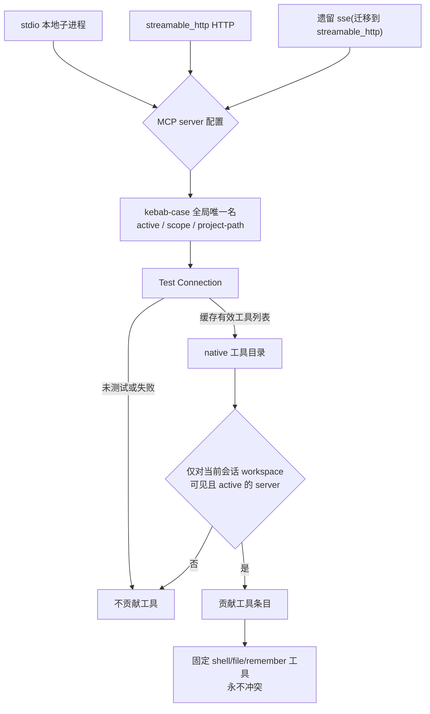

# MCP 工具与客户端

VaneHub 在两个层次上集成 Model Context Protocol（MCP）server：客户端配置/管理，以及将某个 server 的工具暴露到 native Agent 工具目录中。

## Server 配置模型

一个 MCP server 配置具有：全局唯一的 kebab-case 名称；显式的 transport 类型（`stdio`、遗留的 `sse` 或 `streamable_http`）；transport 特定字段；描述；active 标志；作用域；以及 project-path 元数据。未知的 transport 取值会被拒绝——绝不会被静默地重新解释为 `stdio`。历史的 `sse` 行会被事务性地迁移到 `streamable_http`，以保留其此前生效的协议行为。

## native 目录中的工具

除了固定的 `shell`/`file`/`remember` 工具外，native 工具目录还包含由**对当前会话的 workspace 文件夹可见且 active**的 MCP server 暴露的限界条目。该目录使用每个 server 最近一次「Test Connection」结果中缓存的有效工具列表——而不是在目录构建时新建一个实时连接。其后果：

- 一个未测试或测试失败的 server 不贡献任何工具。
- 一个 inactive 或超出作用域的 server 不贡献任何工具。
- MCP 目录名永远不会与固定的 `shell`/`file`/`remember` 工具冲突或遮蔽它们。
- 目录查询失败时会优雅降级：生成过程只使用固定目录继续进行，而不是直接失败。

## 传输与中继

MCP server 从配置到进入 native 工具目录的完整路径如下。三种 transport 在入口归一为同一套配置模型，最终只有通过「Test Connection」缓存的工具会进入目录。

**中继(relay)**：VaneHub 可在 CLI 与 MCP server 之间充当代理，标记位为 `RELAY_FLAG=` `--vanehub-mcp-relay`。仅 Claude Code 与 Codex CLI 走中继路径；Gemini CLI、OpenCode、Antigravity CLI 各自独立配置 MCP，其 MCP 调用不进入 VaneHub 的执行链路。中继文件系统由 `PrivateRelayDirectory` 隔离，防止跨会话或跨 Agent 串扰。

**目录降级**：未测试或测试失败的 server 不贡献工具；inactive 或超出当前会话作用域的 server 不贡献工具。MCP 目录名永不与固定的 `shell`/`file`/`remember` 工具冲突或遮蔽。当目录查询本身失败时优雅降级：生成过程只使用固定目录继续进行，而不是直接失败整个请求。

## 设计所在之处

本章用于引导贡献者。权威需求位于 spec 中。

- [openspec/specs/mcp-client-management](../../../../openspec/specs/mcp-client-management/spec.md) —— 配置模型、transport、迁移。
- [openspec/specs/agent-mcp-tools](../../../../openspec/specs/agent-mcp-tools/spec.md) —— native 目录中来自 MCP 的工具。

MCP 配置位于 `tooling` 限界上下文中；见 [Native bounded contexts](native-contexts.md)。
