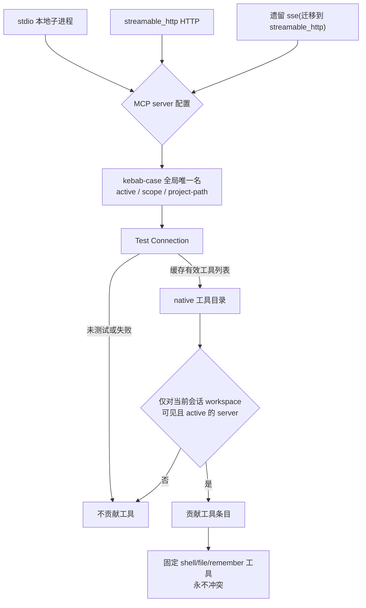

# MCP 工具与客户端

VaneHub 在两个层次上集成 Model Context Protocol（MCP）server：客户端配置/管理，以及将某个 server 的工具暴露到 native Agent 工具目录中。

## MCP 协议背景

MCP(Model Context Protocol)是 Anthropic 推出的标准化协议,解决"AI 模型如何连接外部数据源和工具"。可类比为 AI 领域的 USB-C 接口:在 MCP 之前,每个 AI 应用接入 Slack、GitHub、数据库等外部系统都得写一套定制胶水代码(M×N 问题);MCP 把它变成 M+N——工具方实现一次 MCP Server,任何支持 MCP 的客户端都能接入。

### 核心架构:Host - Client - Server

- **Host(宿主)**:运行 LLM 的应用(本项目里是 VaneHub),负责管理交互与权限、创建维护 Client 实例、把多个 Server 的能力聚合后交给 LLM。
- **Client(客户端)**:Host 内部的连接管理器,与某个 Server 保持**一对一**会话,负责协议握手、能力协商、消息收发。
- **Server(服务端)**:暴露能力的一方,通常是独立进程,通过标准化原语向外提供功能。消息格式基于 JSON-RPC 2.0。

### Server 暴露的三类原语

| 原语 | 控制方 | 类比 | 例子 |
| --- | --- | --- | --- |
| **Tools** | 模型控制(模型决定何时调用) | function calling 里的函数 | `create_issue`、`query_database` |
| **Resources** | 应用控制(客户端决定何时读取、注入上下文) | 只读数据源 | 文件内容、schema、API 结构化数据 |
| **Prompts** | 用户控制(用户显式触发) | 预置提示词模板/斜杠命令 | `/summarize-pr` |

"谁来控制调用时机"是 MCP spec 明确定义的设计原则:Tools 由模型自主判断,Resources 由应用层决定注入哪些上下文,Prompts 由用户主动触发。

### 传输类型

- **stdio** —— Server 作为本地子进程启动,Host 经 stdin/stdout 通信(本项目 `relay_stdio`/`bounded_stdio`)。延迟低、无需网络,只能跑本机,适合文件系统、本地 Git、本地数据库。
- **Streamable HTTP** —— Server 独立部署为 HTTP 服务,支持 SSE 流式推送;较新 spec 对早期 "HTTP+SSE" 的整合升级。适合远程/云端服务,需处理认证。

### MCP 与 Function Calling、Skill 的关系

三者分层协作,不互斥(详见[Skill 管理](skill-management.md)的三层关系表):

- **Function Calling** 是协议层——模型输出结构化的函数调用意图。
- **MCP** 是连接层——标准化"调用谁、怎么发现、怎么连接",Server 暴露的 Tools 传给模型时底层转换成 function-calling 的 tool schema。
- **Skill** 是知识层——教模型"怎么想、怎么做",Skill 可以指导模型如何正确使用某个 MCP Server 暴露的 Tools。

一句话:**Function Calling 是模型吐出调用意图的机制,MCP 是把意图路由到实际工具并标准化工具接入方式的协议层,Skill 教模型何时该调用、调用时遵循什么规范**。

## Server 配置模型

一个 MCP server 配置具有：全局唯一的 kebab-case 名称；显式的 transport 类型（`stdio`、遗留的 `sse` 或 `streamable_http`）；transport 特定字段；描述；active 标志；作用域；以及 project-path 元数据。未知的 transport 取值会被拒绝——绝不会被静默地重新解释为 `stdio`。历史的 `sse` 行会被事务性地迁移到 `streamable_http`，以保留其此前生效的协议行为。

## native 目录中的工具

除了固定的 `shell`/`file`/`remember` 工具外，native 工具目录还包含由**对当前会话的 workspace 文件夹可见且 active**的 MCP server 暴露的限界条目。该目录使用每个 server 最近一次「Test Connection」结果中缓存的有效工具列表——而不是在目录构建时新建一个实时连接。其后果：

- 一个未测试或测试失败的 server 不贡献任何工具。
- 一个 inactive 或超出作用域的 server 不贡献任何工具。
- MCP 目录名永远不会与固定的 `shell`/`file`/`remember` 工具冲突或遮蔽它们。
- 目录查询失败时会优雅降级：生成过程只使用固定目录继续进行，而不是直接失败。

## 传输与中继

MCP server 从配置到进入 native 工具目录的完整路径如下。三种 transport 在入口归一为同一套配置模型，最终只有通过「Test Connection」缓存的工具会进入目录。

**中继(relay)**：VaneHub 可在 CLI 与 MCP server 之间充当代理，标记位为 `RELAY_FLAG=` `--vanehub-mcp-relay`。仅 Claude Code 与 Codex CLI 走中继路径；Gemini CLI、OpenCode、Antigravity CLI 各自独立配置 MCP，其 MCP 调用不进入 VaneHub 的执行链路。中继文件系统由 `PrivateRelayDirectory` 隔离，防止跨会话或跨 Agent 串扰。

**目录降级**：未测试或测试失败的 server 不贡献工具；inactive 或超出当前会话作用域的 server 不贡献工具。MCP 目录名永不与固定的 `shell`/`file`/`remember` 工具冲突或遮蔽。当目录查询本身失败时优雅降级：生成过程只使用固定目录继续进行，而不是直接失败整个请求。

## 关键常量与传输

MCP 基础设施位于 `tooling/mcp/infrastructure/`,实现见各 `relay_*.rs` 模块:

- **三种 transport** —— `stdio`(本地子进程,经 `bounded_stdio` 有界读写)、`streamable_http`(HTTP,经 `relay_streamable_http_protocol`)、遗留 `sse`(经 `relay_legacy_sse*` 事务性迁移到 `streamable_http`,保留此前生效的协议行为)。未知 transport 取值被拒绝,绝不静默重新解释为 `stdio`。
- **中继标记** `RELAY_FLAG = "--vanehub-mcp-relay"` —— 仅 Claude Code 与 Codex CLI 走中继路径,VaneHub 在 CLI 与 MCP server 间代理 JSON-RPC;Gemini CLI、OpenCode、Antigravity CLI 各自独立配置 MCP,其 MCP 调用不进入 VaneHub 执行链路。
- **`PrivateRelayDirectory`** —— 中继文件系统隔离目录,防止跨会话或跨 Agent 串扰。
- **JSON-RPC 帧解析** `relay_jsonrpc` —— `parse_json_rpc_frame` 解析帧、`JsonRpcFrame`/`JsonRpcId` 处理请求-响应配对。
- **失败观察** `relay_failure` / `relay_observer` —— 中继失败按 `RelayFailure` 分类,`RelayObserver` 记录 `mcp_relay_enabled` 与 `mcp_relay_terminated` 等诊断事件(只含安全元数据)。
- **配置模型** —— MCP server 配置有全局唯一 kebab-case 名、显式 transport 类型、transport 特定字段、active 标志、作用域与 project-path 元数据。目录构建使用每个 server 最近一次「Test Connection」结果中缓存的有效工具列表,**而非在目录构建时新建实时连接**。

## 统一架构:CLI Agent 与 OnePiece

MCP 的配置与目录是**统一管理**的——同一套 MCP server 配置模型(kebab-case 名、transport、active、scope、project-path)对所有 Agent 生效。统一体现在:

- **同一份 MCP server 配置** —— 不区分消费方;一个 server 配置一次,对当前会话 workspace 可见且 active 的 server 都贡献工具。
- **同一套 Test Connection 缓存** —— 目录构建使用每个 server 最近一次「Test Connection」结果中缓存的有效工具列表,而非实时新建连接。
- **同一套目录降级** —— 未测试/失败/inactive/越界的 server 不贡献工具;查询失败时所有消费方都优雅降级为只用固定工具。

差异在**传输路径**(因为 CLI 进程与 OnePiece 的运行时形态不同):

| 维度 | Claude Code / Codex CLI | Gemini CLI / OpenCode / Antigravity CLI | OnePiece 原生 Agent |
| --- | --- | --- | --- |
| 是否走中继 | **走中继**(RELAY_FLAG=`--vanehub-mcp-relay`)——VaneHub 在 CLI 与 MCP server 间代理 JSON-RPC | 不走中继,各自独立配置 MCP | 经 native 工具目录直接纳入 |
| 是否进执行链路 | 中继调用进 VaneHub 执行链路 | **不进执行链路**(黑盒) | 原生保真度,可在链路逐层展开 |
| 文件系统隔离 | `PrivateRelayDirectory` 隔离中继文件 | 各 CLI 自行管理 | 与固定工具同一目录空间 |

**统计管理 MCP** 的能力对中继路径有效:中继的失败按 `RelayFailure` 分类、`RelayObserver` 记录 `mcp_relay_enabled`/`mcp_relay_terminated` 等诊断事件。非中继的 CLI 与 OnePiece 的 MCP 工具都遵循"目录名永不与固定 `shell`/`file`/`remember` 工具冲突"的统一约束。

## 设计所在之处

本章用于引导贡献者。权威需求位于 spec 中。

- [openspec/specs/mcp-client-management](../../../../openspec/specs/mcp-client-management/spec.md) —— 配置模型、transport、迁移。
- [openspec/specs/agent-mcp-tools](../../../../openspec/specs/agent-mcp-tools/spec.md) —— native 目录中来自 MCP 的工具。

MCP 配置位于 `tooling` 限界上下文中；见 [Native bounded contexts](native-contexts.md)。
