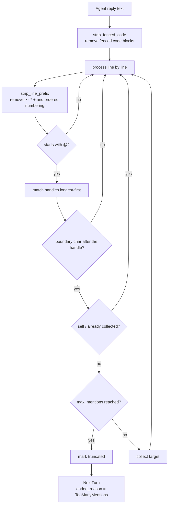

# 多 Agent 群组聊天

一个多 Agent 会话将若干 Agent 组合进同一条共享线程。该设计用一个基于席位的群组聊天模型取代了早期的"多 agent 协调"模型(已归档于 `2026-08-06-remove-multi-agent-coordination`)。

权威需求——席位分配、会话中途的席位变更、轮次路由与会席状态——位于 [openspec/specs/multi-agent-group-chat](../../../../openspec/specs/multi-agent-group-chat/spec.md)。本章说明这些需求如何被满足,以及在何处实现。面向用户的工作流请参见用户指南。

## 是席位,而非位置

一个多 Agent 会话由若干**席位**(seat)组成。每个席位将一个专家角色与一个 Agent 配对,因此角色可跨会话复用,一个 Agent 也可在不同会话中扮演不同角色。席位标识是稳定的,不派生自数组下标,因此在运行中的会话里增删席位时,能保留每一位已加入参与者的标识与历史。新加入的席位从下一轮次起可被路由,并在此前的上下文预算内收到既有线程。

数据模型是一个结构体(`src-tauri/src/contexts/sessions/domain/session_seat.rs:19-27`):

```rust,ignore
pub(crate) struct SessionSeat {
    pub(crate) seat_id: String,
    pub(crate) agent_id: String,
    /// `None` for a plain single-Agent session, which has no role assigned.
    pub(crate) role_id: Option<String>,
    pub(crate) role_snapshot: Option<SessionSeatRoleSnapshot>,
    pub(crate) joined_at: String,
    pub(crate) left_at: Option<String>,
}
```

**席位存放在 JSON 列中而非联接表里**,原因写在文件顶部(`session_seat.rs:1-5`):`SESSION_SELECT` 是列表、搜索和读取的热路径,在那里为大多数会话根本用不到的功能加一个 join,会让每一次读取都为之买单。

**损坏的数据会降级为单个席位,而不是报错**(`session_seat.rs:60-65` 的 `decode_seats`):席位是加到一张已有数据的表上的,因此早于席位功能的会话——或该列被写坏的会话——仍必须能打开。一个外观上的问题不应变成一次会话丢失。

单 Agent 会话的席位 `role_id` 为 `None`(`session_seat.rs:22-23`),不派生 handle,也不参与交接。群组聊天是单 Agent 会话的超集。

## Handle 派生

Handle 从角色名生成(`src-tauri/src/contexts/agent_runtime/domain/seat_roster.rs:69-88` 的 `derive_mentions`),遵循三条规则:

| 规则 | 处理方式 | 原因 |
|---|---|---|
| 空白折叠为 `-` | `代码 审查` → `代码-审查` | handle 在 `@` 之后被输入,空白会截断 token |
| 空名回退 | 第 n 个席位 → `席位n` | 角色名缺失时仍须保持可寻址 |
| 冲突加后缀 | 第二个 `评审` → `评审-2` | 一个会话里有两个评审是合理的编排;冲突应被区分,而非被拒绝 |

## 交接解析

`parse_handoff_mentions`(`src-tauri/src/contexts/agent_runtime/domain/seat_turn.rs:139-183`)是本设计中构建得最审慎的部分,每一条规则都在防范某种真实会出错的情况:



**1. 被围栏代码块包裹的 `@` 不计**(`seat_turn.rs:120-133` 的 `strip_fenced_code`)。Agent 粘贴含有 `@reviewer` 的示例代码不应触发交接。

**2. 引用和列表标记不影响识别**(`seat_turn.rs:46-67` 的 `strip_line_prefix`):`>`、`-`、`*`、`+` 以及有序列表编号都被剥离——Agent 写一个清单时,仍在向某人喊话。

**3. 更长的 handle 优先匹配**(`seat_turn.rs:145-147`):如果 `opus` 和 `opus-45` 同时存在,较短者会先匹配并吞掉较长者。按降序排序消除歧义;测试用 handle 集合 `["架构师", "代码审查", "实现者", "opus", "opus-45"]` 验证了这一点(`seat_turn.rs:258`)。

**4. handle 之后必须是边界字符**(`seat_turn.rs:80-117` 的 `is_boundary`):`@opus45` 不应匹配 `opus`。边界字符覆盖拉丁与 CJK 标点。

**5. 自提及和重复被跳过**(`seat_turn.rs:169-170`):Agent 不能把轮次交给自己,对同一目标提名两次只算一次。

### 链式深度限制

`next_turn_targets` 在解析前检查深度(`seat_turn.rs:190-205`)。该限制存在,是因为 Agent 会自主地相互 @ 提及;没有它,两个 Agent 可能无限来回。触发时,原因被显式上抛,而不是让链条悄然停止。

常量位于 `src-tauri/src/contexts/agent_runtime/application/seat_turn.rs:29-30`:

| 常量 | 值 | 管辖内容 |
|---|---|---|
| `MAX_CHAIN_DEPTH` | 15 | 一条交接链可跳转多少次 |
| `MAX_MENTIONS_PER_REPLY` | 2 | 一次回复可提及多少个席位 |

两个强制终止原因(`seat_turn.rs:11-14` 的 `ChainEndReason`):`TooManyMentions` 和 `MaxDepth`。**正常结束不是失败**(`seat_turn.rs:18-23` 的 `NextTurn`):`ended_reason` 为 `None` 表示链条用尽了提及。把两者混为一谈会让每一次正常结束看起来都像错误。

## 交回给人类

handle 是 `seat_turn.rs:42` 的 `USER_MENTION` 常量。三种意图(`seat_turn.rs:28-32` 的 `HumanHandoffIntent`)由其后的单词决定(`seat_turn.rs:212-229` 的 `parse_human_handoff`,大小写不敏感),每一种产生不同的轮次效果(`seat_turn.rs:36-40` 的 `HumanHandoffEffect`):

| 意图 | `turn_holder_is_human` | `round_complete` | `starts_waiting` |
|---|---|---|---|
| `Fyi` | `false` | `false` | `false` |
| `Handoff` | `true` | `false` | `true` |
| `Done` | `true` | `true` | `false` |

**纯提及默认为 `Fyi`**,注释说明了原因(`seat_turn.rs:208-211`):无意图的提及是信息性的,不阻塞。默认阻塞会惩罚 Agent 提及人类的行为,它将学会不再提及。**只有 `handoff` 会打断**(`seat_turn.rs:233-251` 的 `apply_human_handoff`)。

```rust,ignore
const USER_MENTION: &str = "@用户";
```

**该常量不做本地化**,前端携带同一字面量(`src/services/human-handoff.ts:10`)。把轮次交回人类要求在每种界面语言下出现这一精确字符串,而意图关键词是英文。这是一种镜像实现,没有共享真源:两份副本必须一起修改。

## 席位简报

每个席位在发言前都会收到一份花名册(`seat_roster.rs:32-40` 的 `SeatBriefingEntry`),携带 `mention`、`role_name`、`agent_name`、`model_family`、`responsibility` 和 `instruction`。

**这份简报是 Agent 获知协作规则的唯一渠道**(`seat_roster.rs:146-199` 的 `build_seat_briefing`),因此它以行为而非文档的口吻表述:一个不知道行首规则的 Agent 会把 @ 提及写在句子中间,而句子中间的提及不会被路由。`responsibility` 来自专家角色且是必需的——它是其他 Agent 判断把轮次交给谁的依据。

## 模型族判定

四个族(`seat_roster.rs:12-17` 的 `ModelFamily`):`anthropic`、`openai`、`google`、`unknown`。该枚举与前端 `src/services/model-family.ts` 对应。

稳定的 id 优先(`seat_roster.rs:91-104` 的 `family_by_agent_id`),因为它们不像显示文本那样会漂移:

| Agent id | 模型族 |
|---|---|
| `claude-code` | `Anthropic` |
| `codex-cli` | `OpenAi` |
| `gemini-cli` | `Google` |
| `antigravity-cli` | `Google` |
| `opencode` | `Unknown` |

**`opencode` 显式为 `Unknown` 而非猜测**(`seat_roster.rs:99-101`):它驱动的是用户配置的任意模型,因此没有固定族,声称有族会在错误前提上构建跨族评审检查。专家角色的 `require_different_family` 依赖于此。`normalize_model_family`(`seat_roster.rs:107-134`)先按稳定 id 解析,再按 provider 显示文本,最后按端点类型。

## 上下文投递

两种模式(`seat_roster.rs:51-55` 的 `SeatContextMode`)。`Resume` 不注入任何内容,因为该 Agent 自己的会话已持有历史;`Inject` 提供此前的共享线程。

`build_seat_context`(`seat_roster.rs:210-240`)在**字符**预算而非字节预算内保留最近的若干轮次,因为这些线程以中文为主。最新一次交流才是席位被要求处理的内容;最旧的通常可从项目本身恢复。

## 镜像实现

路由同时存在于原生层(`agent_runtime/domain/seat_turn.rs`)和前端(`src/services/mention-routing.ts`、`human-handoff.ts`)。原生副本存在,是因为会话可以无 UI 运行——IM 连接器和定时任务以无头方式启动会话,构建在前端的路由永远到不了它们(文件头注释见 `seat_turn.rs:1-5`)。当某条路由规则变化时,两者必须一起更新。

## 验证对本设计的改动

群组聊天有一套专用的端到端套件,位于 `tests/e2e/multi-agent-session.spec.ts`:

| 用例 | 覆盖内容 |
|---|---|
| `the multi-Agent mode is offered and composes a line-up` | 多 Agent 模式与默认席位 |
| `a seat can be added and removed before the session is created` | 创建前增删成员 |
| `a multi-seat session shows its seats and switches a seat-scoped tab` | 席位展示与席位作用域视图 |
| `a running shared session exposes roster presence...` | 成员条、运行时增删与 `@` 补全 |
| `a single-Agent session offers no seat switcher` | 单 Agent 回归保护 |

运行单个用例、观看浏览器,或在失败后打开 trace:

```powershell
npx playwright test tests/e2e/multi-agent-session.spec.ts --grep "running shared session"
npx playwright test tests/e2e/multi-agent-session.spec.ts --headed
npx playwright show-trace test-results\<failing-spec-directory>\trace.zip
```

用户指南中的[群组聊天协作案例](../../../user-guide/en/src/multi-agent-testing-tutorial.md)以手工方式走查同样的内容,其检查点与本套件的用例对应。除此之外,此处的改动需运行仓库的完整验证集合——见 [测试、打包与发布](testing-and-release.md)。

**Web/mock 验证接口、席位变更和 `@` 补全,但不启动 CLI**。真实的 Agent 回复和自动交接需要 Tauri 桌面运行时。

## 主要代码位置索引

| 关注点 | 位置 |
|---|---|
| 席位数据模型 | `src-tauri/src/contexts/sessions/domain/session_seat.rs:19-27` |
| 席位 JSON 编解码,含降级 | `session_seat.rs:35`(`encode_seats`)、`:65`(`decode_seats`) |
| Handle 派生 | `src-tauri/src/contexts/agent_runtime/domain/seat_roster.rs:69-88` |
| 交接解析(五道防线) | `src-tauri/src/contexts/agent_runtime/domain/seat_turn.rs:139-183` |
| 链式深度限制 | `seat_turn.rs:190-205`(`next_turn_targets`) |
| 链式限制常量 | `src-tauri/src/contexts/agent_runtime/application/seat_turn.rs:29-30` |
| 交回人类 | `seat_turn.rs:212-229`(解析)、`:233-251`(效果) |
| 用户提及字面量 | 原生 `seat_turn.rs:42`;前端 `src/services/human-handoff.ts:10` |
| 席位简报生成 | `seat_roster.rs:146-199`(`build_seat_briefing`) |
| 模型族判定 | `seat_roster.rs:91-104`、`:107-134` |
| 上下文投递 | `seat_roster.rs:210-240`(`build_seat_context`) |
| 前端席位分配 | `src/main-layout/session-seat-assignment.tsx` |
| 前端 `@` 补全 | `src/components/chat/SeatMentionCompletion.tsx` |
| 前端轮次状态栏 | `src/components/chat/TurnStatusBar.tsx` |

原生执行路径位于 [原生限界上下文](native-contexts.md) 所述的 `agent_runtime` 限界上下文中。
