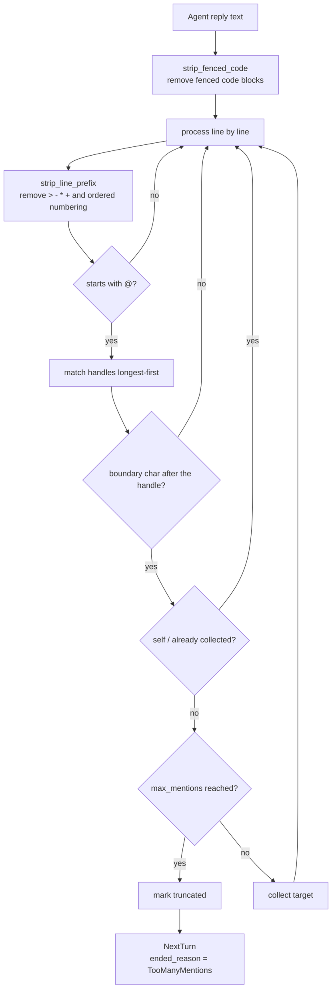

# 多 Agent 群组聊天

一个多 Agent 会话将若干 Agent 组合进同一条共享线程。该设计用一个基于席位的群组聊天模型取代了早期的"多 agent 协调"模型(已归档于 `2026-08-06-remove-multi-agent-coordination`)。

权威需求——席位分配、会话中途的席位变更、轮次路由与会席状态——位于 [openspec/specs/multi-agent-group-chat](../../../../openspec/specs/multi-agent-group-chat/spec.md)。本章说明这些需求如何被满足,以及在何处实现。面向用户的工作流请参见用户指南。

## 为什么需要多 Agent

单 Agent 在复杂任务上容易遇到瓶颈:**上下文过载**(一个 Agent 既规划又执行又校验,Prompt 臃肿、注意力稀释)、**能力耦合**(通用型 Agent 难以在所有子任务上达专家水平)、**缺乏容错隔离**(单点故障导致整条链路失败)。多 Agent 系统通过**角色专业化**和**故障隔离**解决这些问题。

### 单 Agent vs 多 Agent

| 维度 | 单 Agent | 多 Agent |
| --- | --- | --- |
| 上下文管理 | 单一 Prompt 承载全部职责,易臃肿 | 各 Agent 上下文独立,职责边界清晰 |
| 能力专业度 | 通用型 | 可针对子任务定制 Prompt/模型/工具集 |
| 并行能力 | 天然串行 | Fan-out 可并行,缩短整体延迟 |
| 容错隔离 | 单点故障影响全局 | 故障隔离在单个 Agent/分支 |
| 可调试性 | 逻辑集中,较简单 | 需额外可观测性(trace/日志) |
| 成本 | 单次调用成本低 | 多次调用/多轮通信,Token 与延迟上升 |
| 失败恢复 | 通常整体重试 | 可针对失败子环节局部重试/降级 |

### 常见误区

- **多 Agent 一定比单 Agent 好**——协调开销和一致性问题可能抵消专业化收益,简单任务上单 Agent 往往更快更省。
- **Agent 越多越好**——每增加一个 Agent,通信路径和潜在故障点呈非线性增长。
- **多 Agent 能替代好的 Prompt 设计**——单 Agent Prompt 设计得足够好时,很多"看似需要多 Agent"的任务单 Agent 也能胜任。

### 选型决策

| 场景 | 建议 |
| --- | --- |
| 任务简单、低延迟要求 | 单 Agent |
| 任务复杂但步骤固定 | 单 Agent + 结构化 Prompt(分步骤指令) |
| 任务可拆解为独立子任务 | 多 Agent(Parallel) |
| 需要迭代提升质量 | 多 Agent(Reviewer) |
| 需要多视角论证 | 多 Agent(Debate) |
| 系统会持续扩展新能力 | 多 Agent(Hierarchical / Supervisor) |

VaneHub 的多 Agent 群聊采用 **Swarm(对等交接)** 模型——无中心调度器,席位间通过 `@` 交接自主路由,详见下文[是席位,而非位置](#是席位而非位置)与[交接解析](#交接解析)。

## 是席位,而非位置

一个多 Agent 会话由若干**席位**(seat)组成。每个席位将一个专家角色与一个 Agent 配对,因此角色可跨会话复用,一个 Agent 也可在不同会话中扮演不同角色。席位标识是稳定的,不派生自数组下标,因此在运行中的会话里增删席位时,能保留每一位已加入参与者的标识与历史。新加入的席位从下一轮次起可被路由,并在此前的上下文预算内收到既有线程。

数据模型是一个结构体(`src-tauri/src/contexts/sessions/domain/session_seat.rs:19-27`):

```rust,ignore
pub(crate) struct SessionSeat {
    pub(crate) seat_id: String,
    pub(crate) agent_id: String,
    /// `None` for a plain single-Agent session, which has no role assigned.
    pub(crate) role_id: Option<String>,
    pub(crate) role_snapshot: Option<SessionSeatRoleSnapshot>,
    pub(crate) joined_at: String,
    pub(crate) left_at: Option<String>,
}
```

**席位存放在 JSON 列中而非联接表里**,原因写在文件顶部(`session_seat.rs:1-5`):`SESSION_SELECT` 是列表、搜索和读取的热路径,在那里为大多数会话根本用不到的功能加一个 join,会让每一次读取都为之买单。

**损坏的数据会降级为单个席位,而不是报错**(`session_seat.rs:60-65` 的 `decode_seats`):席位是加到一张已有数据的表上的,因此早于席位功能的会话——或该列被写坏的会话——仍必须能打开。一个外观上的问题不应变成一次会话丢失。

单 Agent 会话的席位 `role_id` 为 `None`(`session_seat.rs:22-23`),不派生 handle,也不参与交接。群组聊天是单 Agent 会话的超集。

## Handle 派生

Handle 从角色名生成(`src-tauri/src/contexts/agent_runtime/domain/seat_roster.rs:69-88` 的 `derive_mentions`),遵循三条规则:

| 规则 | 处理方式 | 原因 |
|---|---|---|
| 空白折叠为 `-` | `代码 审查` → `代码-审查` | handle 在 `@` 之后被输入,空白会截断 token |
| 空名回退 | 第 n 个席位 → `席位n` | 角色名缺失时仍须保持可寻址 |
| 冲突加后缀 | 第二个 `评审` → `评审-2` | 一个会话里有两个评审是合理的编排;冲突应被区分,而非被拒绝 |

## 交接解析

`parse_handoff_mentions`(`src-tauri/src/contexts/agent_runtime/domain/seat_turn.rs:139-183`)是本设计中构建得最审慎的部分,每一条规则都在防范某种真实会出错的情况:



**1. 被围栏代码块包裹的 `@` 不计**(`seat_turn.rs:120-133` 的 `strip_fenced_code`)。Agent 粘贴含有 `@reviewer` 的示例代码不应触发交接。

**2. 引用和列表标记不影响识别**(`seat_turn.rs:46-67` 的 `strip_line_prefix`):`>`、`-`、`*`、`+` 以及有序列表编号都被剥离——Agent 写一个清单时,仍在向某人喊话。

**3. 更长的 handle 优先匹配**(`seat_turn.rs:145-147`):如果 `opus` 和 `opus-45` 同时存在,较短者会先匹配并吞掉较长者。按降序排序消除歧义;测试用 handle 集合 `["架构师", "代码审查", "实现者", "opus", "opus-45"]` 验证了这一点(`seat_turn.rs:258`)。

**4. handle 之后必须是边界字符**(`seat_turn.rs:80-117` 的 `is_boundary`):`@opus45` 不应匹配 `opus`。边界字符覆盖拉丁与 CJK 标点。

**5. 自提及和重复被跳过**(`seat_turn.rs:169-170`):Agent 不能把轮次交给自己,对同一目标提名两次只算一次。

### 链式深度限制

`next_turn_targets` 在解析前检查深度(`seat_turn.rs:190-205`)。该限制存在,是因为 Agent 会自主地相互 @ 提及;没有它,两个 Agent 可能无限来回。触发时,原因被显式上抛,而不是让链条悄然停止。

常量位于 `src-tauri/src/contexts/agent_runtime/application/seat_turn.rs:29-30`:

| 常量 | 值 | 管辖内容 |
|---|---|---|
| `MAX_CHAIN_DEPTH` | 15 | 一条交接链可跳转多少次 |
| `MAX_MENTIONS_PER_REPLY` | 2 | 一次回复可提及多少个席位 |

两个强制终止原因(`seat_turn.rs:11-14` 的 `ChainEndReason`):`TooManyMentions` 和 `MaxDepth`。**正常结束不是失败**(`seat_turn.rs:18-23` 的 `NextTurn`):`ended_reason` 为 `None` 表示链条用尽了提及。把两者混为一谈会让每一次正常结束看起来都像错误。

### 用户消息去往何处

人类寻址席位的方式,与 Agent 之间互相寻址完全一致。`route_user_message`(在 `seat_turn.rs` 中,紧邻 `next_turn_targets`)按三步解析一轮的首个回合:行首 `@handle` 派发给该席位;未寻址的消息交给上一轮持有回合的那个席位;还没有人发过言的线程交给第一个席位。**目标只有一个**——一个人同时点名两个席位,等于要求两轮,而第二轮会针对一条第一轮已经推进过的线程启动。解析规则与 Agent 交接完全相同,所以人类写在行中或代码块里的 `@` 同样不寻址任何人。

**被寻址的席位用它自己的 Agent 作答,而不是会话的 Agent**。会话的 `agent_id` 镜像第一个席位,因此 `send_message_internal` 会围绕被路由席位的 Agent 构建本回合配置(`seat_chat_configuration`);调用被镜像的那个 Agent,等于让一个参与者顶着另一个参与者的名字发言。在 2026-08 之前,`initial_seat_turn_context` 无条件取 `roster.first()`——每一条用户消息都由一号席位作答,而前端的 `routeUserMessage` 根本没有调用方。这个缺陷正是被下文的桌面套件抓到的。

### 消息归属按稳定席位 id

`start_generation` 给每一条 assistant 行打上 `speaker_seat_id`,并**刻意**把数字型的 `seat_index` 留空;该索引只作为读侧兼容保留,用于迁移 59 之前写入的行。任何解析活跃线程发言人的代码都必须走 `seat_speaker`(`application/seat_turn.rs`),它优先用稳定 id,再回退到索引。只按 `seat_index` 取值的读取方会把每一条活跃消息都看成未归属——正是这个故障曾让 `seat_turn_prompt` 在下一个席位的上下文里把每个队友的回合都标成人类的发言,而它之所以能躲过单元测试,是因为 fixture 把两个字段都填了,生产只填一个。

## 交回给人类

handle 是 `seat_turn.rs:42` 的 `USER_MENTION` 常量。三种意图(`seat_turn.rs:28-32` 的 `HumanHandoffIntent`)由其后的单词决定(`seat_turn.rs:212-229` 的 `parse_human_handoff`,大小写不敏感),每一种产生不同的轮次效果(`seat_turn.rs:36-40` 的 `HumanHandoffEffect`):

| 意图 | `turn_holder_is_human` | `round_complete` | `starts_waiting` |
|---|---|---|---|
| `Fyi` | `false` | `false` | `false` |
| `Handoff` | `true` | `false` | `true` |
| `Done` | `true` | `true` | `false` |

**纯提及默认为 `Fyi`**,注释说明了原因(`seat_turn.rs:208-211`):无意图的提及是信息性的,不阻塞。默认阻塞会惩罚 Agent 提及人类的行为,它将学会不再提及。**只有 `handoff` 会打断**(`seat_turn.rs:233-251` 的 `apply_human_handoff`)。

```rust,ignore
const USER_MENTION: &str = "@用户";
```

**该常量不做本地化**,前端携带同一字面量(`src/services/human-handoff.ts:10`)。把轮次交回人类要求在每种界面语言下出现这一精确字符串,而意图关键词是英文。这是一种镜像实现,没有共享真源:两份副本必须一起修改。

## 席位简报

每个席位在发言前都会收到一份花名册(`seat_roster.rs:32-40` 的 `SeatBriefingEntry`),携带 `mention`、`role_name`、`agent_name`、`model_family`、`responsibility` 和 `instruction`。

**这份简报是 Agent 获知协作规则的唯一渠道**(`seat_roster.rs:146-199` 的 `build_seat_briefing`),因此它以行为而非文档的口吻表述:一个不知道行首规则的 Agent 会把 @ 提及写在句子中间,而句子中间的提及不会被路由。`responsibility` 来自专家角色且是必需的——它是其他 Agent 判断把轮次交给谁的依据。

## 模型族判定

四个族(`seat_roster.rs:12-17` 的 `ModelFamily`):`anthropic`、`openai`、`google`、`unknown`。该枚举与前端 `src/services/model-family.ts` 对应。

稳定的 id 优先(`seat_roster.rs:91-104` 的 `family_by_agent_id`),因为它们不像显示文本那样会漂移:

| Agent id | 模型族 |
|---|---|
| `claude-code` | `Anthropic` |
| `codex-cli` | `OpenAi` |
| `gemini-cli` | `Google` |
| `antigravity-cli` | `Google` |
| `opencode` | `Unknown` |

**`opencode` 显式为 `Unknown` 而非猜测**(`seat_roster.rs:99-101`):它驱动的是用户配置的任意模型,因此没有固定族,声称有族会在错误前提上构建跨族评审检查。专家角色的 `require_different_family` 依赖于此。`normalize_model_family`(`seat_roster.rs:107-134`)先按稳定 id 解析,再按 provider 显示文本,最后按端点类型。

## 上下文投递

两种模式(`seat_roster.rs:51-55` 的 `SeatContextMode`)。`Resume` 不注入任何内容,因为该 Agent 自己的会话已持有历史;`Inject` 提供此前的共享线程。

`build_seat_context`(`seat_roster.rs:210-240`)在**字符**预算而非字节预算内保留最近的若干轮次,因为这些线程以中文为主。最新一次交流才是席位被要求处理的内容;最旧的通常可从项目本身恢复。

## 镜像实现

路由同时存在于原生层(`agent_runtime/domain/seat_turn.rs`)和前端(`src/services/mention-routing.ts`、`human-handoff.ts`)。原生副本存在,是因为会话可以无 UI 运行——IM 连接器和定时任务以无头方式启动会话,构建在前端的路由永远到不了它们(文件头注释见 `seat_turn.rs:1-5`)。当某条路由规则变化时,两者必须一起更新。

## 验证对本设计的改动

群组聊天有一套专用的端到端套件,位于 `tests/e2e/multi-agent-session.spec.ts`:

| 用例 | 覆盖内容 |
|---|---|
| `the multi-Agent mode is offered and composes a line-up` | 多 Agent 模式与默认席位 |
| `a seat can be added and removed before the session is created` | 创建前增删成员 |
| `a multi-seat session shows its seats and switches a seat-scoped tab` | 席位展示与席位作用域视图 |
| `a running shared session exposes roster presence...` | 成员条、运行时增删与 `@` 补全 |
| `a single-Agent session offers no seat switcher` | 单 Agent 回归保护 |

运行单个用例、观看浏览器,或在失败后打开 trace:

```powershell
npx playwright test tests/e2e/multi-agent-session.spec.ts --grep "running shared session"
npx playwright test tests/e2e/multi-agent-session.spec.ts --headed
npx playwright show-trace test-results\<failing-spec-directory>\trace.zip
```

[多 Agent 群聊验收](multi-agent-acceptance.md)以手工方式走查同样的内容,其检查点与本套件的用例对应。除此之外,此处的改动需运行仓库的完整验证集合——见 [测试](testing.md)。

**Web/mock 验证接口、席位变更和 `@` 补全,但不启动 CLI**。真实的 Agent 回复和自动交接需要 Tauri 桌面运行时。

## 真实桌面端验证(WebdriverIO)

`tests/desktop/specs/` 下的桌面套件用真实安装的 CLI(本机:claude-code、codex-cli、opencode)驱动真实 Tauri 客户端,上文那些路由与归属缺陷就是在这里被发现并被证明修复的。六个 spec 按深度递进覆盖群聊:

| Spec | 它在真实环境中证明了什么 |
|---|---|
| `domain-multi-agent.e2e.mjs` | 被安排的角色产出可寻址的句柄;一个 Agent 的回复把回合接力给另一个 |
| `domain-multi-agent-routing.e2e.mjs` | 人类按提及路由、上一持有者回退、三席位链路(人 → 席位 → 席位)、claude+codex+opencode 三方各自回应自己被提及的那条,以及席位离场后的回退 |
| `domain-multi-agent-business.e2e.mjs` | 一个真实编码任务穿过架构师 → 实现者 → 代码审查三个异构 CLI:实现者的文件落进会话仓库,审查者读到它,`@用户 done` 收束该轮 |
| `domain-multi-agent-project.e2e.mjs` | 一个三文件项目走完**两轮**接力:审查把工作退回,实现者在同一线程上第二次发言(链深 3,已发言席位被再次派发)。正确性由 harness 跑 `python3 -m unittest` 判定,而非 Agent 自称 |
| `domain-multi-agent-human-decision.e2e.mjs` | 阻塞式 `@用户 handoff` 让该轮真的停下——包括压制**同一条回复里**点名的队友——且一条未寻址的人类答复会用提问的那个席位恢复该轮 |
| `ui-multi-agent.e2e.mjs` | 同一套运行时经 DOM 驱动:成员面板把名单增加一个席位(后端已核实,含角色),输入 `@` 会列出每个席位,用指针选中其一即路由本次发送,回复气泡绘制该席位的角色标签与颜色点 |

这些 spec 从失败运行中沉淀下来的约定:

- **断言派发,而不是断言回复文本**。assistant 行在调用 provider **之前**就带着 `speakerSeatId` 写入,因此那一行就是路由判决;等模型输出等于在测量 provider 的心情。
- **一旦任何席位可能发言两次,就按序数寻址回合**——在多轮线程里,「该席位的那一行」不再能唯一标识一个回合。
- **被指定的接力断言为线程的前缀,而非全部**。尾巴归 Agent 所有:一次诚实的运行里,实现者主动把返工交回去做第二次审查,那正是协作在起作用。
- **provider 拒绝执行指令报 `BLOCKED`,绝不报失败**——套件无法强制模型遵守指令,只能观察。
- **暂停是一种「不存在」,所以要在一个时间窗上断言,而不是在某个瞬间断言**。协调器每 200ms 轮询一次终端,因此一轮没停下来的话一两秒内就会派发;human-decision spec 观察三十秒的静默,这才让「不存在」成为证据而不是运气。
- **失败时保留证据**:失败的流程把它的会话留在本次运行的隔离数据库里,而不是在 `after` 中删掉。`VANEHUB_DESKTOP_KEEP_SESSIONS=1` 连成功的会话也一并保留,这样人可以用测试客户端打开该次运行的 `VANEHUB_APP_DATA_DIR`(外加 `VANEHUB_CLI_CONFIG_HOME`)用肉眼检查线程。

再写 UI 用例之前值得知道两个 WebKitGTK 驱动的怪癖:`selectByVisibleText` 会点击选项但不触发 `change`,于是 React 状态还是旧值而 DOM 已显示新值(改为经原型的 value setter 派发一个真实 `change`);以及 `list_agents` 在启动后数秒内会与 CLI 检测竞争,所以要对可用性做门控,而不是只问一次。

## 真实验证揭示的环境约束

以下是宿主与权限模板的性质,不是路由的缺陷——但一个被期望**动手做事**的群聊会全部撞上:

- **席位回合是无人值守的,所以 `standard` 模板走不通**。`standard` 意味着动手前先问,而此刻没有人在提示符前:claude-code 在 `permissionMode=default` 下直接拒绝写入。要动手的席位需要 `trusted`。
- **claude-code 的 `trusted` 与 `yolo` 都投影为 `acceptEdits`**——文件编辑自动批准,shell 命令不会。一个被要求自己跑测试的 claude 席位会(正确地)用行首 `@用户 handoff` 中止该轮;命令批准属于 permission-hook 中继,而隔离的测试运行刻意不安装它。请把任务设计成由 harness 来跑验证命令。
- **codex-cli 的 `workspace-write` 沙箱在受限非特权用户命名空间的机器上起不来**(`kernel.apparmor_restrict_unprivileged_userns=1`,Ubuntu 24.04+ 的默认值):bwrap 报 `loopback: Failed RTM_NEWADDR: Operation not permitted`,而 `standard` 与 `trusted` 都把 codex 映射到 `workspace-write`,因此在这类宿主上没有任何可分配的模板能让 codex 席位写文件——而且是静默的。在这个缺口有诊断之前,把 codex 安排在只需说话的位置。
- **CLI 全局配置属于正常的用户状态,绝不能从测试里泄漏出去**。给 claude-code 分配模板会把 permission hook 装进 `~/.claude/settings.json`;曾有一次 e2e 运行写进了用户的真实文件,那个 hook 活得比测试应用还久,导致之后每一次工具调用都被一个已死的审批服务器挡住。现在 `VANEHUB_CLI_CONFIG_HOME`(由 `NativeCliGlobalConfigAdapter` 支持,桌面运行上下文提供)像 `VANEHUB_APP_DATA_DIR` 隔离数据库那样隔离这些写入。

## 为什么没有 orchestrator

群聊是刻意去中心化的:规范中「不提供派发控制」这条需求把路由交给 Agent 与提及,协调由协议承载——行首 `@` 交接、两次提及与深度 15 的上界,以及三种 `@用户` 意图。`seat_turn_coordinator` 是基础设施(串行驱动回合的那个线程),`loop_orchestrator` 属于 Loop 运行时——两者都不是 orchestrator 席位。

业界的多 Agent 模式与本设计的对应关系:

| 模式 | 代表 | 机制 | 与 VaneHub 的距离 |
|---|---|---|---|
| 去中心化交接 | OpenAI Swarm / Agents SDK handoffs | 一个 Agent 结束回合时显式把控制权交给下一个 | **VaneHub 就是这一种**——`@` 就是 handoff |
| 中心化 supervisor | LangGraph supervisor 模式、CrewAI hierarchical(manager agent) | 一个 manager 节点接收每份产出,每轮挑选下一个执行者,并收敛结果 | 会破坏当前「不提供派发控制」的需求 |
| 发言人选择 | AutoGen GroupChat(manager 用 LLM 或轮转挑下一个发言人) | 弱编排:只选谁说话,不下指令 | 介于两者之间 |
| Orchestrator–worker | Anthropic 的多 Agent 研究系统、Claude Code 的 subagent 派发 | orchestrator 拆解任务,把 worker **并行**扇出,再汇合结果;worker 之间不对话 | 距离最远:VaneHub 的席位刻意串行,因为后面的席位必须读到前面席位产出的东西 |
| SOP 流水线 | MetaGPT | 固定角色按固定阶段顺序传递工件 | 架构师 → 实现者 → 代码审查这个约定本身已经是一条软 SOP |

业界的粗略经验是:中心化编排在**并行研究与检索**这类形态上收益明显(Anthropic 的研究系统是典型案例),而**顺序协作**——比如写代码,每一手都依赖上一手的工件——更适合 handoff:更简单、token 消耗线性、线程对人保持可读。中心化 orchestrator 反复出现的代价是:它成为单点故障(一次糊涂的回合就能带偏整轮),每一跳都多一次模型往返(延迟与成本大致翻倍),而且长任务里 orchestrator 自身的上下文会膨胀。

本章记录的建议是继续用 handoff,并按顺序走三步:

1. **零改动、今天就能用:把「orchestrator」做成一个自定义专家角色**。它的职责与指令写明:拆解 → 每次 `@` 一个地派发 → 校验工件 → `@用户 done`。它不持有任何运行时特权——同样的提及规则、深度上界与两次提及截断都适用——而真实的项目流 spec 已经展示了一个普通的架构师角色正在承担这种轻量编排,轮次自然收敛,甚至还多出一次自愿的额外审查。对顺序性工作而言,这已经覆盖了 orchestrator 的大部分用途。
2. **值得做的小协议补充**。`MAX_MENTIONS_PER_REPLY=2` 是串行执行的,但没有 join 语义——没有「两个都做完了再回到我这里」。一条轻量的回传规则(被派发的席位若没有点名任何人,就把回合交回给派发它的那一方)是一处一行的路由扩展,且保持去中心化。`@用户 handoff` 路径中「暂停 → 人做决定 → 该轮恢复」的那一半原本也是缺口,已由 `domain-multi-agent-human-decision.e2e.mjs` 补上;join 语义仍然开放。
3. **只在有真实证据时才考虑 supervisor**。触发条件应该是观察到的协议失效——链路反复撞上深度上限、人类不断手动救场,或者出现真正并行的任务形态(跨多仓库的研究)。那是架构变更而非新增角色:它要从一份修订「不提供派发控制」需求的 OpenSpec proposal 开始,并且必须回答 orchestrator 自身失败时这一轮该怎么办。

## 席位 Agent 的运行时形态

群聊里的席位可以绑定内置 CLI Agent 或 OnePiece 原生 Agent,两者的运行时形态不同,但都纳入同一套席位/交接/简报机制:

| 维度 | 内置 CLI Agent 席位 | OnePiece 原生 Agent 席位 |
| --- | --- | --- |
| 启动方式 | 走 Agent Terminal(PTY 子进程),VaneHub 启动并管理 CLI 进程 | 直接在应用内通过 HTTP 调用 provider,不启动外部进程 |
| 上下文投递 | 按 `Resume`(续接)/`Inject`(注入)模式,在字符预算内保留最近轮次 | 同样的 `Resume`/`Inject` 机制,经 `AgentSkillPort`/上下文引擎组装 system prompt |
| 可观测性 | CLI 内部是黑盒,链路只到边界(不可见保真度) | 原生保真度,工具调用可在链路逐层展开 |
| 模型族判定 | `claude-code`→Anthropic、`codex-cli`→OpenAI、`gemini-cli`/`antigravity-cli`→Google、`opencode`→Unknown | 按其 active Profile 的 provider 判定 |

席位简报(`build_seat_briefing`)对两种形态一视同仁:每个席位发言前收到同场名单(句柄、角色名、Agent 名、模型族、职责、指令);职责字段必填。`@` 交接解析(`parse_handoff_mentions`)也统一基于回复文本中的行首 `@` 提及,不因 Agent 形态不同而分支。**Web/mock 只验证接口、席位变更与 `@` 补全,不启动 CLI**——真实的 Agent 回复与自动交接需要 Tauri 桌面运行时。

## 主要代码位置索引

| 关注点 | 位置 |
|---|---|
| 席位数据模型 | `src-tauri/src/contexts/sessions/domain/session_seat.rs:19-27` |
| 席位 JSON 编解码,含降级 | `session_seat.rs:35`(`encode_seats`)、`:65`(`decode_seats`) |
| Handle 派生 | `src-tauri/src/contexts/agent_runtime/domain/seat_roster.rs:69-88` |
| 交接解析(五道防线) | `src-tauri/src/contexts/agent_runtime/domain/seat_turn.rs:139-183` |
| 链式深度限制 | `seat_turn.rs:190-205`(`next_turn_targets`) |
| 链式限制常量 | `src-tauri/src/contexts/agent_runtime/application/seat_turn.rs:29-30` |
| 交回人类 | `seat_turn.rs:212-229`(解析)、`:233-251`(效果) |
| 用户提及字面量 | 原生 `seat_turn.rs:42`;前端 `src/services/human-handoff.ts:10` |
| 席位简报生成 | `seat_roster.rs:146-199`(`build_seat_briefing`) |
| 模型族判定 | `seat_roster.rs:91-104`、`:107-134` |
| 上下文投递 | `seat_roster.rs:210-240`(`build_seat_context`) |
| 前端席位分配 | `src/main-layout/session-seat-assignment.tsx` |
| 前端 `@` 补全 | `src/components/chat/SeatMentionCompletion.tsx` |
| 前端轮次状态栏 | `src/components/chat/TurnStatusBar.tsx` |

原生执行路径位于 [原生限界上下文](native-contexts.md) 所述的 `agent_runtime` 限界上下文中。
