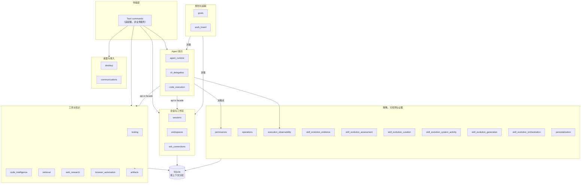

# Native 限界上下文

native 代码按**所有权**组织，而非按 UI 页面组织。一个功能出现在哪个页面上，和它的代码归谁管，是两回事。

`src-tauri/src/contexts/` 下当前有 **27 个上下文**。下表是完整地图——**目录与表格必须一一对应**，`npm run docs:links:check` 会比对两者，新增一个上下文却不在这里加一行，校验直接失败。

上图只画上下文之间的**调用方向**，不画具体命令。要点是：所有跨上下文的箭头都落在对方的 `api.rs` facade 上，没有一条箭头能直接指向别人的 repository。

## 完整地图

### Agent 执行

| Context | 拥有 | 专章 |
| --- | --- | --- |
| `agent_runtime` | Agent 注册表、交互模式、provider 调用、工作流状态与生成生命周期 | [Agent 生命周期](agent-lifecycle.md) |
| `cli_delegation` | Claude Code 与 Codex 的委派式 CLI 调用：协议处理、就绪、调度、熔断、重启恢复，以及 changeset 的捕获/评审/封存/应用管线 | [CLI 委派](cli-delegation.md) |
| `code_execution` | 沙箱化代码运行时、运行时目录、执行工作区与就绪状态 | [扩展工具上下文](extended-tool-contexts.md) |

### 会话与工作区

| Context | 拥有 | 专章 |
| --- | --- | --- |
| `sessions` | 会话、消息、分类、聊天配置、导出、维护、定时任务，以及用量记录与读模型 | [会话恢复](session-recovery.md) |
| `workspaces` | 本地/远程项目、worktree、有边界的文件与 Git 查询、会话 shell 生命周期 | [终端与 PTY 运行时](terminal-runtime.md) |
| `ssh_connections` | SSH 连接档案、主机密钥信任、凭据加载与池化的远程运行时 | [SSH 连接与远程运行时](ssh-connections.md) |

### 工具与知识

| Context | 拥有 | 专章 |
| --- | --- | --- |
| `tooling` | CLI 生命周期，以及 MCP、SDK、扩展、插件集成、Skill、Skill 工具与 Prompt Hook 各子域 | [CLI 生命周期](cli-lifecycle.md)、[Skill 管理](skill-management.md)、[MCP 工具](mcp-tools.md) |
| `code_intelligence` | LSP 服务器配置、发现、工作区信任、协商后的能力，以及归一化的诊断/悬停/位置信息 | [LSP 代码智能](lsp-code-intelligence.md) |
| `retrieval` | 检索配置、embedding 模型、代码与文档索引、索引状态与搜索 | [检索与向量搜索](retrieval.md) |
| `web_research` | 受控的 URL 准入、公网 URL 解析、抓取、抽取、二进制产物处理与搜索 | [扩展工具上下文](extended-tool-contexts.md) |
| `browser_automation` | 浏览器 sidecar 协议、会话与动作策略、操作生命周期与产物移交 | [扩展工具上下文](extended-tool-contexts.md) |
| `artifacts` | 内容寻址的产物 blob：媒体类型与体积校验、去重、存储容量策略 | [扩展工具上下文](extended-tool-contexts.md) |
| `local_media` | 本地 OCR、麦克风采集与整句转写、语音合成与播放、引擎档案与就绪状态、Python worker 监督，以及临时媒体生命周期 | [本地媒体运行时](local-media-runtime.md) |

### 策略、可观测与证据

| Context | 拥有 | 专章 |
| --- | --- | --- |
| `permissions` | 权限策略评估、审批代理、风险分级，以及 Claude Code 钩子等待注册表 | [权限模型](permission-model.md) |
| `operations` | 可观测的任务生命周期，以及统一的诊断/操作日志契约 | [统一日志](unified-logging.md) |
| `execution_observability` | 执行 run、span、时间线、采集策略与 OTLP 导出设置 | [执行可观测性与 Agent 评测](execution-observability.md) |
| `skill_evolution_evidence` | 证据信封、抽取、脱敏、归因、反馈状态与证据存储（写入前脱敏，依赖操作系统与磁盘保护，无应用层加密） | [Skill 演进证据](skill-evolution-evidence.md) |
| `skill_evolution_assessment` | 不可变评估见证、有效 Skill 目标投影、确定性排序与质量门禁、评估器溯源，以及不执行变更的路由建议 | [Skill 演进证据](skill-evolution-evidence.md) |
| `skill_evolution_curation` | 人工治理的 Skill 改进候选、草稿评审、审批决策、应用回执、审计链与通知投递 | [Skill 演进证据](skill-evolution-evidence.md) |
| `skill_evolution_system_activity` | 只读 Skill 演进活动会话、规范结果投影、已读状态、偏好、重建、保留与导出 | [Skill 演进证据](skill-evolution-evidence.md) |
| `skill_evolution_generation` | 隐私安全的证据档案、受约束的结构化生成、本地渲染与验证、隔离提案及 Curator 交接 | [Skill 演进证据](skill-evolution-evidence.md) |
| `skill_evolution_orchestration` | 持久化 Skill 演进触发器、空闲门禁、受治理运行、自动应用策略、恢复、速率限制、观察期、断路器与安全通知 | [Skill 演进证据](skill-evolution-evidence.md) |
| `personalization` | 分层指令策略、受治理的记忆记录与候选、有效个性化解析,以及记忆维护 | [跨会话记忆](cross-session-memory.md) |

### 规划与追踪

| Context | 拥有 | 专章 |
| --- | --- | --- |
| `goals` | 目标聚合、到 Loop/工作项/会话的关联、历史 Plan 关联展示、派生的验收就绪度与人工验收状态迁移 | [目标与任务看板](goals-and-work-board.md) |
| `work_board` | 工作项及其阶段与优先级，以及把会话和定时任务幂等地对账成卡片 | [目标与任务看板](goals-and-work-board.md) |

### 桌面与接入

| Context | 拥有 | 专章 |
| --- | --- | --- |
| `desktop` | 应用设置、启动、数据/日志目录操作、浮动助手，以及窗口与托盘生命周期 | [运行时与服务边界](runtime-boundaries.md) |
| `communications` | IM 连接器配置、凭据、协议适配器、路由与投递生命周期 | [IM connector](im-connectors.md) |

## 上下文之间怎么说话

每个 context 对进程内消费方发布一个 `api.rs` facade。三条规则：

- **跨 context 调用默认走同步的应用 API**。只有当一个已完成的动作需要独立处理下游反应时，才用显式事件。
- **任何 context 都不得直接伸手到另一 context 的存储或基础设施**。`agent_runtime` 消费 `sessions` 时只走它 `api.rs` 发布的 facade，不读它的 repository。
- **Bootstrap 模块在应用边界处组装具体依赖**，context 自身不知道别人的实现类型。

`retrieval` 是这条规则的一个典型例子：它拥有持久化的代码索引工作区标识，在组装边界处消费工作区根目录，但**不导入 `workspaces` 的 repository**。

Tauri command 是**传输适配器，不是业务服务**。跨 command 边界的错误值会被映射成安全的字符串或显式的传输错误 DTO。

## 主要 facade 与自有表

这张表只覆盖建立最早、表结构最稳定的八个上下文；其余上下文的 facade 以生成的 [native API 参考](native-api-reference.md)为准。

| Context | `api.rs` 发布的主要能力 | 拥有的关键 SQLite 表（由迁移分区） |
| --- | --- | --- |
| `agent_runtime` | Agent 查询、工作流、就绪、启动、消息、停止；Loop 运行时与会话 Plan 安全策略；席位交接；代码智能端口 | `expert_roles`、`onepiece_provider_profiles`、`hybrid_model_routing_rules` |
| `sessions` | 创建/查询/搜索/切换/重命名/置顶/归档/删除、分类、聊天配置、消息持久化与组合、导出、用量、维护 | 会话/消息/分类/配置/用量表 |
| `workspaces` | 项目/历史/worktree、有界查询、shell 生命周期 | 既有表投影 |
| `tooling` | CLI 参数、MCP 管理、SDK、扩展、插件、Skill、Prompt Hook | 各子域自有表 |
| `communications` | 连接器管理、运行时、路由、绑定、去重、微信授权 | 连接器/路由/绑定/去重/检查点表 |
| `desktop` | 设置/环境、浮动助手、生命周期 | 设置/浮动仓储表 |
| `operations` | 可观测任务、统一诊断/操作日志契约 | 操作/日志关联表 |
| `retrieval` | 记忆检索、代码搜索、索引协调、嵌入确认 | 记忆文件、代码 manifest/chunk/symbol/向量 |

## 检索与工作区代码

`retrieval` 拥有持久化的代码索引工作区标识、配置、文件清单、chunk、symbol、向量与有边界的本地审计记录。`agent_runtime` 只消费带类型的代码检索端口并提供当前会话文件夹；**模型无法向 `search_code` 提供工作区 id 或文件夹**。

native worker 执行元数据优先的核对，只读取或解析新增与变更的文件。Tree-sitter grammar、chunk 拆分查询与脱敏策略共享一个版本标记（`CODE_INDEX_VERSION`）。工作区代码 embedding 受一个显式确认的网关控制，该确认与工作区 id、generation、provider profile 和模型绑定。FTS 保持以工作区为作用域，并在确认之前就可用；**来自另一个工作区或模型的向量永远不会成为候选**。

native 诊断走统一日志端口，只含安全的 id、阶段、计数、时长、模型 id 与原因类别。归一化的相对路径只留在有边界的 SQLite 审计表里。原始代码、搜索查询、凭据、检测到的密钥值、绝对路径与 provider body 都被排除在代码索引诊断与遥测之外。

## 权威来源

本表的所有权描述与 [`openspec/project.md`](../../../../openspec/project.md) 的 Bounded contexts 表同源，后者被 CI 强制与 `src-tauri/src/contexts/` 对齐。要看完整的 context 与 command 清单，把 [`src-tauri/ARCHITECTURE.md`](../../reference/native-architecture.md) 和生成的 [native API 参考](native-api-reference.md)一起读。
