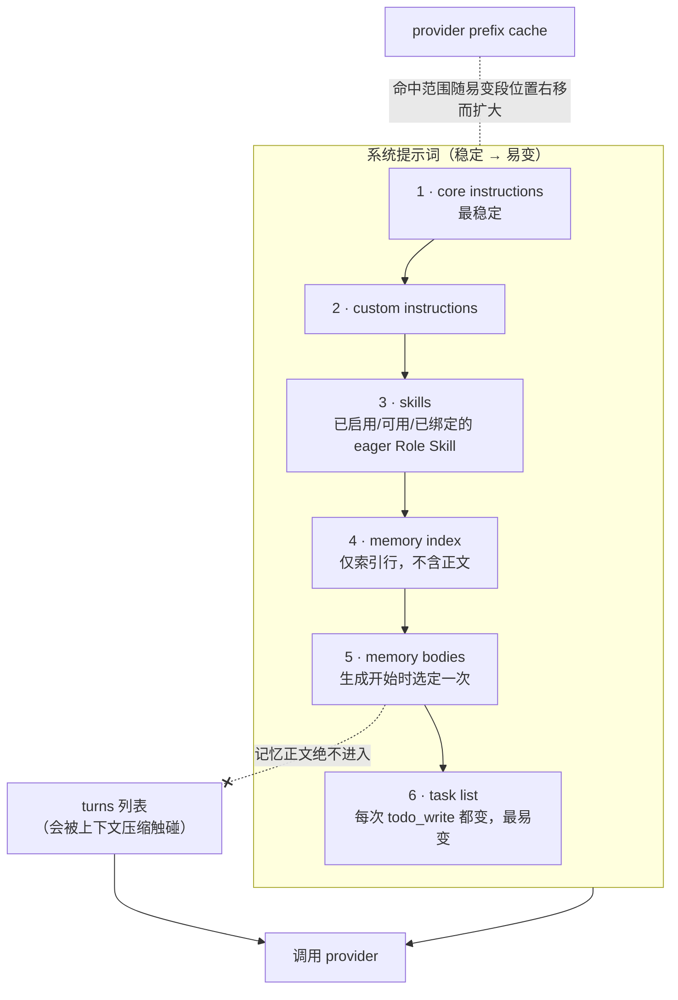
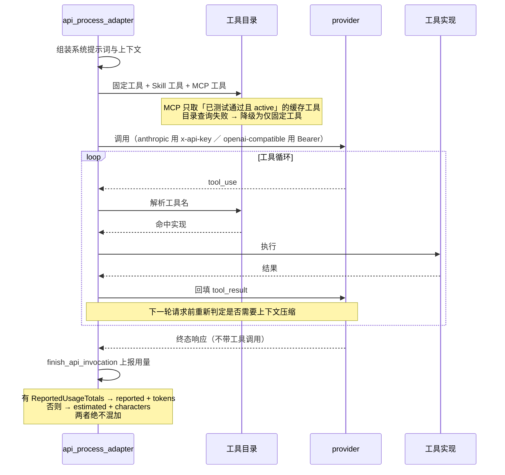

# OnePiece native Agent

OnePiece 是 VaneHub 内置的第一方 Agent。与基于 CLI 的 Agent 不同,它完全通过 native API 运行时运行:`launch_kind = api`、`agent_origin = builtin`,预留稳定 id 为 `onepiece`。它在首次启动时被植入注册表,即便尚未存在任何 provider 配置或凭证时也保持可见。

## 身份与生命周期

OnePiece 身份由注册表拥有,而非由 provider 配置拥有。它与多个命名、由 catalog 支撑的上游 provider **Profile** 相分离,每个 Profile 独立保管自己的凭证。同一时刻至多有一个 Profile 被显式激活用于运行时生成。创建 Profile 时必须选择一个由所选 provider 拥有且经过评审的 endpoint 类型——不接受用户随意提供 provider 身份、接口格式或 Base URL。

## Provider 目录与 Profile 生命周期

OnePiece 的 provider 目录是单一真源——前端 JSON `src/config/onepiece-provider-catalog.json` 由 Rust 侧 `include_str!` 直接嵌入二进制(`onepiece_provider_catalog.rs`),解析失败即 panic。

- **目录结构** —— `catalogVersion: 3`,25 家 provider。`category` 仅 `anthropic` 与 `openai` 为 `official`,其余 23 家(含 openrouter、deepseek、zhipu-glm、kimi、siliconflow 等)为 `common`。每条 provider 含 `id`/`displayName`/`defaultModelId`/`fallbackModels`/`apiKeyUrl`/`docsUrl`/`defaultEndpointType`/`endpoints`。
- **endpoint 字段** —— `baseUrl`/`interfaceFormat`(`anthropic` | `openai-compatible`)/`authStrategy`(`x-api-key` | `bearer`)/`source`/`modelDiscovery`。
- **模型发现策略** `modelDiscovery.strategy` 四值:`anthropic`、`openai`(绝大多数)、`openai-array`(仅 Together AI)、`catalog`(运行时保留)。发现时先注入 catalog 静态模型(`fallbackModels` + profile model),再按策略拉取实时模型,过滤非聊天模型(`is_chat_model`,排除 embedding/embed-/rerank/tts/audio/image 等关键词),上限 1000 个;实时拉取的响应体上限 2MB(`MAX_RESPONSE_BYTES`),实时发现失败则回落 catalog 并带 `warning: "live-unavailable"`。

### Profile 数据结构

`OnePieceProviderProfile` 字段:`id`/`name`/`sourceProviderId`/`sourceEndpointType`/`sourcePresetVersion`/`provider`/`modelId`/`interfaceFormat`/`baseUrl`/`active`/`credentialPresent`。Profile 的 scoped 凭据键为 `onepiece-profile:{profile_id}`。`onepiece_provider_profiles` 表硬性绑定 `agent_id = 'onepiece'`(CHECK 约束),并用**部分唯一索引** `UNIQUE(agent_id) WHERE active=1` 从数据库层保证同一时刻最多一个 active profile。

### 生命周期与凭据回滚

Profile 的创建/激活/删除都带凭据双向回滚:

- **保存 catalog profile** —— 新 id 形如 `onepiece-profile-{uuid}`;已存在 profile 不可改 source provider/endpoint;首个 profile 自动激活(`previous.active || existing.is_empty()`);凭据有效值优先级为瞬态 key > scoped 旧凭据 > active 时 runtime 凭据;DB 写失败时回滚 scoped 凭据。
- **激活** —— 目标 profile 必须存在;`authentication_mode != "required"` 直接激活,required 且无 key 拒绝;先把当前 active profile 的 runtime 凭据落回其 scoped key(防丢失),再把目标 scoped 凭据写入 `onepiece`,失败回滚 runtime 凭据。
- **删除** —— 删 scoped 凭据;若为 active 还删 `onepiece` 凭据;DB 删除失败时恢复两处凭据。
- **重置** —— 清空 `agents.onepiece` 行,删除 `onepiece` 凭据**及所有 profile 的 scoped 凭据**。

### 凭据校验(保存前实际调用一次)

`validate_onepiece_provider_credential` 在保存前发起一次最小成本探测:`max_tokens=1` / `max_output_tokens=1`、body 仅 "Reply OK."、超时 15s、禁重定向;probe 只读取 HTTP 状态码,不读取响应体。HTTP 状态分类:2xx→Valid;401/403→InvalidCredential;400/404/405/409/415/422→ConfigurationRejected;429→RateLimited;5xx→ProviderUnavailable;其余→Inconclusive。`discover` 与 `validate` 命令用 `spawn_blocking` 包裹(底层是阻塞式 HTTP 客户端)。

### 自定义 Profile 校验

`EndpointProfileSnapshot::new()` 校验:base_url 归一化(去尾斜杠,禁 `@`/空白/控制字符);**只允许 `openai-compatible`**;timeout 范围 `100..=120_000`ms;Local 端点必须 loopback(`localhost|127.0.0.1|[::1]`);runtime kind 与 privacy 必须匹配;Required 必须有凭据、None 不得有凭据;context 容量 `1_024..=10_000_000`。错误枚举 `ProviderProfileError`。

## OnePiece 运行时调用流程

OnePiece 是唯一不经外部 CLI、直接在应用内通过 HTTP 调用 provider 的 Agent。一次完整生成在 `api_process_adapter.rs` 中按以下阶段进行:组装系统提示词与上下文 → 调用 provider → 处理流式输出 → 工具循环(tool-use loop) → 完成。

### 上下文组装与系统提示词

系统提示词按**稳定在前、易变在后**的顺序拼装,以利用 provider 的 prefix cache——后置的易变段不会让稳定前缀失效。

**两条设计约束都藏在顺序里**：任务列表放最后，是因为它每次 `todo_write` 都变，放前面会让整个前缀失效；记忆正文只在生成开始时选一次而非每轮工具往返都重选，同样是为了不让 system prompt 每轮变化。而记忆正文**只进系统提示词、绝不进 turns**，则是为了让上下文压缩碰不到它。

`resolve_system_prompt_with_settings` 依次组装:

1. **core instructions** —— 核心指令(最稳定)。
2. **custom instructions** —— 用户个性化指令。
3. **skills** —— 已启用、可用且绑定的 eager Role Skill 指令(见下文)。
4. **memory index** —— 跨会话记忆的索引行(每行形如 `- [type] [name] - description`,name 是记忆指针),不含正文。
5. **memory bodies** —— 经相关性选择后注入的正文(见下文);失败时降级为仅索引。
6. **task list** —— 当前会话的任务列表(最易变,每次 `todo_write` 都变,故置末尾)。

记忆注入的边界由 `ONEPIECE_MEMORY_INDEX_BOUNDS`(lines:200,bytes:12000)与 `CLI_MEMORY_INDEX_BOUNDS`(lines:40,bytes:3000)控制。**记忆正文只进系统提示词,绝不进入 turns 列表**——否则压缩会触碰记忆内容;同时正文只在生成开始时选择一次(而非每次 tool 往返),避免每轮都让 system prompt 变化而击穿 prefix cache。

`ContextBudget`(`context_engine.rs`)为上下文分配预算:`total` 减去 `reserved_system`/`reserved_task`/`reserved_recent_turns`/`reserve` 得 `evidence_budget`;不同来源按比例限流(Memory = 1/4,WorkspaceChange = 1/5)。

### goal / 任务列表

OnePiece 通过**任务列表**(task list)承载轻量的目标跟踪。任务列表是会话级的,随每次 `todo_write` 更新,作为系统提示词的最后一段注入(最易变)。任务列表与 [Loop 工程](loop-and-plan-runtime.md)是两套机制:任务列表是会话内的轻量待办,Loop 是跨多轮的目标驱动迭代。

### 使用 Skill

OnePiece 通过 `AgentSkillPort` 消费 Skill 体系——这套体系与 CLI Agent **统一管理**(见[Skill 管理](skill-management.md)与[生效 Skill 运行时](effective-skill-runtime.md))。Skill 对 OnePiece 的作用方式:

- **eager Role Skill** —— 在被启用、可用、已绑定且在提示词预算内时,直接注入 OnePiece 的系统提示词(上文组装顺序的第 3 段)。
- **on-demand Role Skill** —— 通过三个固定的只读工具被发现和加载:`list_skills`、`load_skill`(按规范 id 或别名加载,最多返回 12000 字符 + 资源索引)、`read_skill_resource`(按逻辑 URI 读取,如 `skill://code-review/references/checklist.md`)。
- **资源用逻辑标识符寻址**,模型永不收到宿主路径;胜出者变化会使上一次 `load_skill` 修订过期。
- **生效视图来自覆盖层治理**——基础包选定后,Overlay(System/User/Project)按顺序重放,产出最终生效指令;OnePiece 消费的总是这个治理后的快照。

### 使用 MCP

OnePiece 的工具目录在固定原生工具之上叠加 MCP 工具——这与 CLI Agent 共用同一套 MCP 配置与中继架构(见[MCP 工具与客户端](mcp-tools.md))。对当前会话 workspace 可见且 active 的 MCP server,其最近一次「Test Connection」缓存的有效工具会作为限界条目进入 OnePiece 的工具目录。未测试、测试失败、inactive 或超出作用域的 server 不贡献工具;目录查询失败时优雅降级为只用固定工具。MCP 工具名永不与固定 `shell`/`file`/`remember` 工具冲突。

### 调用 LLM 与工具循环

OnePiece 按 active Profile 解析的 `interface_format` 调用 provider:

- **`anthropic`** —— 走 Anthropic Messages API,认证用 `x-api-key` + `anthropic-version`。
- **`openai-compatible`** —— 走 OpenAI Chat Completions 或 Responses API,认证用 `Bearer`。

工具循环是多轮的:模型返回 `tool_use` → 运行时解析工具名、查目录(固定工具 / Skill 工具 / MCP 工具)→ 执行 → 回填 `tool_result` → 模型继续,直到模型返回不带工具调用的终态响应。`finish_api_invocation` 在完成时上报用量(有 `ReportedUsageTotals` 写 `reported`+`tokens`,否则写 `estimated`+`characters`,两者绝不混加)。OnePiece 的工具调用是原生保真度,可在执行链路中逐层展开——这是它相对外部 CLI(黑盒)的可观测性优势。

## 设计所在

本章用于为贡献者定向。权威需求——稳定身份、注册表植入、预留 id 冲突处理、Profile 生命周期以及 provider-directory 契约——位于 spec 中。

- [openspec/specs/onepiece-native-agent](../../../../openspec/specs/onepiece-native-agent/spec.md)

与 CLI Agent 配置共享的 provider 目录以及 native API 运行时,在 [Runtime and service boundaries](runtime-boundaries.md) 与 [Native bounded contexts](native-contexts.md) 中介绍。
