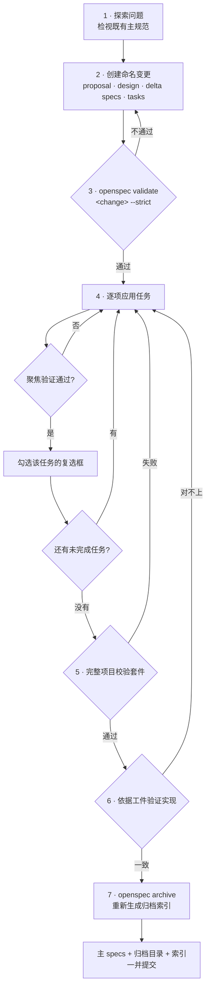

# OpenSpec 工作流

新功能与架构变更在实现之前先从 OpenSpec proposal 起步。

**第 4 步那个回路是这套流程的重点**：复选框不是「我打算做」的清单，而是「这一项已实现且已通过聚焦验证」的记录——先勾再做，整条链的证据就失效了。

1. 探索问题并检视既有的主规范。
2. 创建一个命名变更,包含 proposal、design、delta specs 与 tasks。
3. 运行严格的变更校验(strict change validation)。
4. 应用各项任务,只有在某项任务实现完成并通过聚焦验证后,才勾选其对应的复选框。
5. 运行完整的项目校验套件。
6. 依据工件(artifacts)验证实现。
7. 归档变更,重新生成归档索引,并将主 specs、归档目录与索引一并提交。

`openspec/specs` 下的主规范是行为的唯一真源。已归档的 Markdown 工件仍以在线形式保留在 Git 中;压缩归档不能替代它。

在打开单个工件之前,先用 `openspec/changes/archive/archive-index.json` 定位历史变更。
