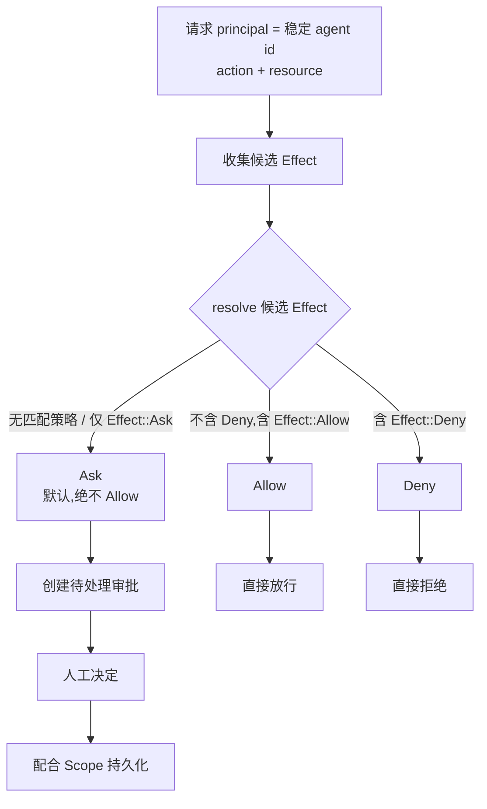
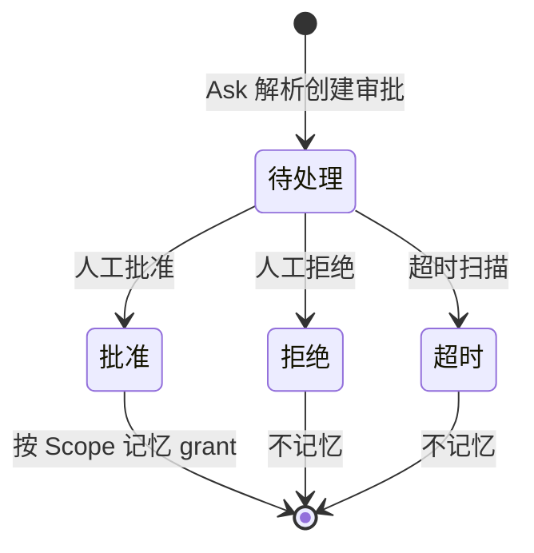

# 权限模型

每个受控操作——无论是来自 native API Agent 的 tool-use 循环的请求,还是经由 Claude Code permission-hook 桥接转发——都通过单一决策点进行评估。CLI 发起的调用没有独立的决策引擎。

## 统一决策模型

评估将一个 `(principal, action, resource)` 三元组解析为 `Allow`、`Deny` 或 `Ask` 三者之一。一个 principal 仅由**稳定的 agent id** 唯一标识——每个 Agent 一个持久的 principal,在该 Agent 参与的每一个会话中都保持不变。会话 id 与 generation id 是每次评估的上下文,不属于 principal 身份的一部分。因此,Agent 以与其其他会话相同的 principal 与策略分配参与新会话,而非使用会话作用域的分配。

未匹配的操作(没有策略匹配 principal/action/resource)解析为 `Ask`,绝不解析为 `Allow`。

## 解析顺序:显式 Deny 优先

相互冲突的策略匹配按显式 `Deny` 优先于显式 `Allow`、显式 `Allow` 优先于默认 `Ask` 的方式解析。

## 记忆授权:规范身份与优先级

一条被记住的决定是某个**规范键的值**,不是追加到列表里的一行。键 = `principal + action + resource + scope + 该 scope 的归属者`,归属者是 session id、project key 或全局哨兵。再次记住同一个决定是更新:effect 被替换,revision 递增。三个 scope 分区唯一索引把这一点做成物理约束,后来的写入方无法再为同一个键造出第二行。

选择由数据库在一条带排序的查询里决定,而不是由调用方决定:

| 优先级 | 匹配 |
| --- | --- |
| 3 | session 等于当前评估 session 的 Session 行 |
| 2 | project 等于当前评估 project 的 Project 行 |
| 1 | Global 行 |

更具体的 scope 会**刻意**覆盖更宽的 scope,**包括更宽的 `Deny`** —— 更窄的那一行是针对更窄情境的、更晚也更知情的表态。精确度先于 effect 参与判定;把"deny 恒胜"折进排序,正是顺序依赖会重新长回来的方式。

`Once` 与 `Ask` 不是"被检查后拒绝",而是**无法被表达**:`RememberedScope::parse` 拒绝前者,`PersistedEffect::parse` 拒绝后者,因此新增的持久化路径没有机会忘记这条规则。不存在通配、前缀或路径归一化匹配。

## 审批代理

待处理的审批请求以 native 运行时为唯一真源持有,与是否收到关于它们的任何前端事件无关。遗漏的前端事件不会让一次生成静默等待:前端通过事件推送新的待处理审批,**并**在挂载/重连时拉取完整待处理列表进行对账。一个待处理审批以一个批准/拒绝决定连同 `Once`、`Session`、`Project` 或 `Global` 之一的内存作用域一并解决。

每个待处理条目带有相位:`Pending`、`Resolving`、`Committed`。认领是原子且单赢家的,所以两个调用方同时提交相反决定时不可能都往下走:一个拿到请求,另一个拿到赢家的 resolution id 并报告那个结果。认领只能由持有者撤销,且只能在任何持久化写入之前。提交之后永不退回 `Pending` —— 把已有答案的请求重新摆出来,等于邀请第二个决定。

## 先提交,后交付

决定与效果发生在两个不同的地方 —— SQLite 里的一行,和被唤醒的 native Agent 或 HTTP 等待方 —— 二者之间无法做成原子。于是改为把顺序写死:

```text
claim → reserve → commit → deliver → acknowledge → activate
```

每一步都是为了让某件事不可能发生:

- **reserve** 在**不唤醒**的前提下证明原始等待方与 generation 仍然有效,因此过期 generation 在任何持久化产物出现之前就被发现。`agent_runtime` 为此只发布一个布尔值,从不交出 generation 句柄。
- **commit** 是一个事务,同时写入不可变 resolution、其决策审计行,以及可选的记忆授权意图。因此 `Allow` 不可能早于它的证据抵达任何人。
- **acknowledge** 才是激活记忆授权的那一步。提交写下的授权处于 `pending_delivery`,在等待方确认已应用该决定之前对评估不可见 —— 于是一条从未真正送达的批准,无法为**下一次**尝试授权。

重试携带同一个不可变 `resolution_id`,接收方对一个 resolution 至多应用一次。交付结果是类型化的而非布尔:`delivered`、`stale`、`delivery_failed`、`resolving`、`already_resolved`、`not_found`。只有第一个意味着工具真的运行了;`delivery_failed` 意味着决定已持久化但没送到任何人手上,UI 不得为它提供第二次决定。

超时扫描只报告哪些请求过期,并把这些 id 交回人工决定所用的同一个用例。它自己没有交付捷径,所以恰好在有人点击时到来的超时会输掉认领,而不是写下一个竞争的 resolution。

## 重启与存储故障语义

启动时,仍处于 `committed` 或 `delivery_failed` 的 resolution,其等待方所在的进程已经不存在。它们被标记为 `aborted_by_restart`,只作为持久证据存在:不重建待处理请求、不向新 generation 投递效果、授权保持 inactive。等待方已应用效果但确认尚未记录就崩溃的情况也落在这里 —— 宁可最小权限,也不去猜"应该送到了"。

评估依然 fail closed,并且现在会留下可归因的证据:存储故障以 `evaluation_error` decider 记入审计,带稳定原因码。若审计存储同样不可用,则通过统一日志输出一行脱敏记录,只携带 action token、原因码,以及 session 与 generation id。资源、工具输入和底层错误文本都刻意缺席 —— 前两者是用户内容,最后一个可能原样引用一条查询语句。

## CLI 启动参数投影

策略模板(`readonly`、`standard`、`trusted`、`yolo`)是一条**宿主侧**声明:它决定上文统一决策模型里 `shell.exec` 与 `file.write` 的效果(`readonly` → Deny,`standard` → Ask,`trusted` 与 `yolo` → Allow;`file.read` 与 `memory.write` 恒为 Allow)。CLI 进程*以什么参数启动*是这条模板的另一层投影,而投影方式随传输方式不同。受治理集合是 `POLICY_TEMPLATE_GOVERNED_AGENT_IDS`(`agent_runtime/infrastructure/providers/invocation.rs`)中的 12 个 id;逐 Agent 的表见下文[按传输方式的 CLI 启动参数投影](#按传输方式的-cli-启动参数投影),生成的 [Agent 能力矩阵](../../../reference/agents/capability-matrix.md)也携带同样的行。

- **headless / 终端类 CLI**(`claude-code`、`codex-cli`、`gemini-cli`、`opencode`、`antigravity-cli`)通过**目录中的 `policy-governed` 参数**投影模板(`policy_override_selections`);这些参数永远不可由用户编辑。
- **七个扩展提供商**(六个 ACP Agent `qwen-code`、`kimi-cli`、`qoder-cli`、`codebuddy-code`、`copilot-cli`、`cursor-agent-cli`,加上历史兼容的 `iflow-cli`)通过**运行时渲染的旗标**投影模板(`direct_policy_arguments`),因为正确的旗标取决于传输方式。在 PTY 上旗标是宿主唯一能施加的策略,所以每个模板都会投影;在 ACP 下 Agent 通过 `session/request_permission` 逐次向宿主询问,所以只传入限制性的只读姿态,`standard`/`trusted`/`yolo` **不带任何**启动旗标——宽松旗标会让 Agent 跳过询问。
- **Claude Code** 叠加两层:启动旗标只设置 `permissionMode`,动作级边界是下文的 `PreToolUse` hook 桥接。
- **只使用目录合法、不可绕过的值**;目录校验会拒绝任何包含 `dangerously` 的旗标。
- **`trusted` 与 `yolo` 只在分配时不同**(`yolo` 需要确认才能分配)。在宿主侧两者产生相同的 Allow 规则;启动时有效策略先归约为 Readonly/Ask/Allow 再投影,Allow 映射到 `trusted` 的投影——因此在多数 CLI 上两者的命令行完全一致。例外是 Qwen Code、Kimi Code CLI 与 iFlow CLI:它们的终端会为 `yolo` 收到不同的旗标。
- **可强制性是有类型的,不是假定的**。`terminal_policy_enforceability` 返回 `HostProjected`、`ProviderDelegated` 或 `NotEnforceable { reason_code }`。`NotEnforceable` 的交互式启动会以 `PolicyDenied { action: "terminal-launch:<reason_code>" }` 拒绝,而不是以更弱的姿态启动。已知情况:Qoder CLI 没有 plan/只读模式,其终端上的 `readonly` 为 `terminal-readonly-unsupported`;GitHub Copilot CLI 与 Cursor Agent CLI 在 `standard` 下不传旗标,依赖 CLI 自己的先询问默认(`ProviderDelegated`——VaneHub 未传入限制,也未验证)。UI 把这些标为 provider-delegated 或 unverified,绝不标为 host-enforced;ACP 支持也绝不被表述为操作系统沙箱。
- **Plan 模式**与 `readonly` 都会把有效策略归约为 Readonly(无论模板为何);模板查找失败会让启动失败,而不是猜一个默认值。

## Claude Code permission-hook 桥接

来自 hook 包装器的 `PreToolUse` 请求被转换为一个 `Action`/`Resource` 对,并通过与 native API Agent 相同的 `evaluate()`/`ApprovalBroker` 管线解析。该 hook 仅匹配 `Bash`、`Edit`、`Write`、`Read`、`Glob`、`Grep` 以及 MCP 工具名(`mcp__*`),将它们映射到 `shell.exec`/`file.write`/`file.read`/`mcp.tool`;任何其他工具(例如 `WebFetch`)都不会被拦截,Claude Code 的 native 行为不受影响。`Ask` 解析会在既有的 `ApprovalCard` UI 中创建一个待处理审批,并挂起 HTTP 响应,直到人工决定或超时扫描。

## 决策流程与状态

统一决策点把一次受控操作收敛到 `Allow`、`Deny`、`Ask` 三者之一。下图展示从请求到最终解析结果的主干路径。



### 解析顺序

候选 `Effect` 集合按固定优先级收敛,顺序不可调换。该规则来自 `permissions/domain/effect.rs` 的 `resolve()`。

1. **显式 `Deny` 优先** —— 候选集只要包含 `Effect::Deny`,无论 `Effect::Allow` 数量多少,整体解析为 `Deny`。
2. **显式 `Allow` 次之** —— 候选集不含 `Deny` 但含 `Effect::Allow` 时,整体解析为 `Allow`。
3. **默认 `Ask` 兜底** —— 候选集为空(没有任何策略匹配该 principal/action/resource)或仅含 `Effect::Ask` 时,整体解析为 `Ask`,绝不静默放行。

### 审批状态机

待处理审批在 native 运行时中是唯一真源。前端既通过事件接收新增审批,也在挂载/重连时拉取完整列表对账,因此遗漏的前端事件不会让一次生成无限挂起。审批被解决时携带一个内存作用域 `Scope`,决定该决定被记住多久。



`Scope` 的记忆语义来自 `permissions/domain/scope.rs` 的 `is_remembered()`。

- **`Once`** —— 仅本次有效,不持久化 grant,下一次相同请求重新走解析。
- **`Session`** —— 当前会话内复用 grant,会话结束失效。
- **`Project`** —— 项目作用域持久化 grant,跨会话复用。
- **`Global`** —— 全局持久化 grant,跨项目跨会话复用。

只有 `Session`/`Project`/`Global` 会持久化 grant;`Once` 永不持久化。

### 按传输方式的 CLI 启动参数投影

下表是模板在命令行上的实际形态(`invocation.rs`;目录槽位来自 `cli_parameters/catalog/catalog.v2.json`)。`Trusted` 与 `Yolo` 投影相同时合并为一列。"ACP"是六个 ACP Agent 的受管会话传输;"PTY"是 Agent Terminal。

| Agent | 传输 | Readonly | Standard | Trusted | Yolo | 可强制性说明 |
| --- | --- | --- | --- | --- | --- | --- |
| Claude Code | headless / PTY + hook | `--permission-mode plan` | CLI 默认(inherit) | `--permission-mode acceptEdits` | 同 Trusted | 宿主投影;`PreToolUse` hook 是动作边界 |
| Codex CLI | headless / PTY | `--sandbox read-only --ask-for-approval never` | `--sandbox workspace-write --ask-for-approval on-request` | `--sandbox workspace-write --ask-for-approval never` | 同 | 宿主投影 |
| Gemini CLI | headless / PTY | `--approval-mode plan` | `--approval-mode default`(显式发出) | `--approval-mode yolo` | 同 | 宿主投影 |
| OpenCode | headless / PTY | `--agent plan` | 环境变量 `OPENCODE_PERMISSION={"edit":"ask","bash":"ask"}` | `--auto` | 同 | 宿主投影 |
| Antigravity CLI | headless / PTY | `--mode plan --sandbox` | CLI 默认(`request-review`) | `--mode accept-edits` | 同 | 宿主投影;绝不使用 `--dangerously-skip-permissions` |
| Qwen Code | ACP / PTY | `--approval-mode plan` | PTY:`--approval-mode default`;ACP:无旗标 | PTY:`--approval-mode auto-edit`;ACP:无旗标 | PTY:`--approval-mode yolo`;ACP:无旗标 | 宿主投影;ACP 逐次询问 |
| Kimi Code CLI | ACP / PTY | `--plan` | PTY:CLI 询问默认;ACP:无旗标 | PTY:`--yolo`;ACP:无旗标 | PTY:`--auto`;ACP:无旗标 | 宿主投影;ACP 逐次询问 |
| Qoder CLI | ACP / PTY | **无**——PTY 启动被拒绝(`terminal-readonly-unsupported`) | PTY:`--permission-mode default`;ACP:无旗标 | PTY:`--permission-mode accept_edits`;ACP:无旗标 | 同 Trusted | 上游没有 plan 模式 |
| CodeBuddy Code | ACP / PTY | `--permission-mode plan` | PTY:`--permission-mode default`;ACP:无旗标 | PTY:`--permission-mode acceptEdits`;ACP:无旗标 | 同 | 宿主投影;ACP 逐次询问 |
| GitHub Copilot CLI | ACP / PTY | `--mode plan` | PTY:无旗标(CLI 询问默认)——**provider-delegated**;ACP:无旗标 | PTY:`--allow-all-tools`;ACP:无旗标 | 同 | Standard 依赖 CLI 自身提示 |
| Cursor Agent CLI | ACP / PTY | `--mode plan` | PTY:无旗标(CLI 询问默认)——**provider-delegated**;ACP:无旗标 | PTY:`--force`;ACP:无旗标 | 同 | Standard 依赖 CLI 自身提示 |
| iFlow CLI(历史兼容) | 仅 PTY | `--plan` | `--default` | `--autoEdit` | `--yolo` | 宿主投影;无受管会话 |

在 ACP 下,Agent 想发起的每次工具调用都会映射为宿主动作(`read`/`search`/`think` → `file.read`;`edit`/`delete`/`move` → `file.write`;`execute`/`fetch`/未知 → `shell.exec`)并由同一个决策点评估;`Ask` 在交互式会话中交给审批 UI,无人值守时**直接拒绝**并记为 needs-intervention。取消、关闭与超时永远不构成批准。

### Claude Code hook 桥接

Claude Code 的 `PreToolUse` hook 请求被转换为一个 `(Action, Resource)` 对,走与 native API Agent 完全相同的 `evaluate()` / `ApprovalBroker` 管线,不存在并行的决策引擎。

- **仅匹配的工具被拦截** —— `Bash`、`Edit`、`Write`、`Read`、`Glob`、`Grep` 以及 MCP 工具名(`mcp__*`)。
- **工具映射** —— `Bash` → `shell.exec`;`Edit`/`Write` → `file.write`;`Read`/`Glob`/`Grep` → `file.read`;`mcp__*` → `mcp.tool`。
- **不拦截的工具** —— `WebFetch` 等未列出的工具不会被拦截,Claude Code 的 native 行为不受影响。
- **`Ask` 解析** —— 在既有的 `ApprovalCard` UI 中创建待处理审批,并挂起 HTTP 响应,直到人工决定或超时扫描。

## 关键类型与常量

下表汇总权限域的核心类型、函数签名与常量,供实现时快速查阅。权威语义仍以本节前文与规范为准。

### Effect 与解析

`Effect` 枚举(来自 `permissions/domain/effect.rs`)定义三档决策值:

- `Effect::Allow` —— 显式放行
- `Effect::Deny` —— 显式拒绝
- `Effect::Ask` —— 默认兜底,转人工审批

解析函数 `resolve(candidates: &[Effect]) -> Effect` 按固定优先级收敛候选集,顺序不可调换:

1. 候选集含 `Effect::Deny` → 返回 `Deny`
2. 候选集不含 `Deny` 但含 `Effect::Allow` → 返回 `Allow`
3. 候选集为空或仅含 `Effect::Ask` → 返回 `Ask`

未匹配的 `(principal, action, resource)` 三元组(候选集为空)永远解析为 `Ask`,绝不静默 `Allow`。

### Scope 与记忆语义

`Scope` 枚举(来自 `permissions/domain/scope.rs`)定义 grant 的持久化作用域,`is_remembered()` 决定该决定是否落库:

- `Scope::Once` —— `is_remembered() = false`,不持久化,下一次相同请求重新走解析
- `Scope::Session` —— `is_remembered() = true`,当前会话内复用,会话结束失效
- `Scope::Project` —— `is_remembered() = true`,项目作用域持久化,跨会话复用
- `Scope::Global` —— `is_remembered() = true`,全局持久化,跨项目跨会话复用

只有 `Session`/`Project`/`Global` 会持久化 grant;`Once` 永不持久化。

### principal 身份

principal 等于**稳定的 agent id**,在该 Agent 参与的所有会话中保持不变。会话 id 与 generation id 是每次评估的上下文,不属于 principal 身份的一部分;因此新会话沿用 Agent 既有的策略分配,而非会话作用域的分配。

### ApprovalRequest

`ApprovalRequest` 携带一个 correlation id,把待处理审批关联回 tool-use loop 中挂起的 pending-call 记账。该 correlation id 对权限域是 opaque 的——权限域不解析其内部结构,只用于把人工决策结果回写到发起方。

### 策略模板

`PolicyTemplateName`(来自 `permissions/domain/template.rs`)定义四档模板:

- `Readonly` —— 只读
- `Standard` —— 标准
- `Trusted` —— 受信
- `Yolo` —— 无审批

`Trusted` 与 `Yolo` 产生相同的宿主侧规则;`Yolo` 额外要求分配时确认。两者的启动投影在所有 CLI 上一致,例外是 Qwen Code、Kimi Code CLI 与 iFlow CLI 的终端(见上表)。

### hook 工具映射表

Claude Code `PreToolUse` hook 仅对下列工具名拦截,其余工具(如 `WebFetch`)不拦截,Claude Code 的 native 行为不受影响:

| Claude Code 工具 | 映射到 Action |
| --- | --- |
| `Bash` | `shell.exec` |
| `Edit`、`Write` | `file.write` |
| `Read`、`Glob`、`Grep` | `file.read` |
| `mcp__*` | `mcp.tool` |

## 设计所在之处

本章用于为贡献者定位。权威需求位于规范之中。

- [openspec/specs/permissions-core](../../../../openspec/specs/permissions-core/spec.md) —— 统一决策模型与解析顺序。
- [openspec/specs/permissions-approval](../../../../openspec/specs/permissions-approval/spec.md) —— 审批代理、待处理状态与内存作用域。
- [openspec/specs/cli-agent-permission-launch-flags](../../../../openspec/specs/cli-agent-permission-launch-flags/spec.md) —— CLI 启动参数投影。
- [openspec/specs/claude-code-permission-hook](../../../../openspec/specs/claude-code-permission-hook/spec.md) —— Claude Code `PreToolUse` 桥接。

权限评估位于 `agent_runtime` 限界上下文中;参见 [Native 限界上下文](native-contexts.md)。
