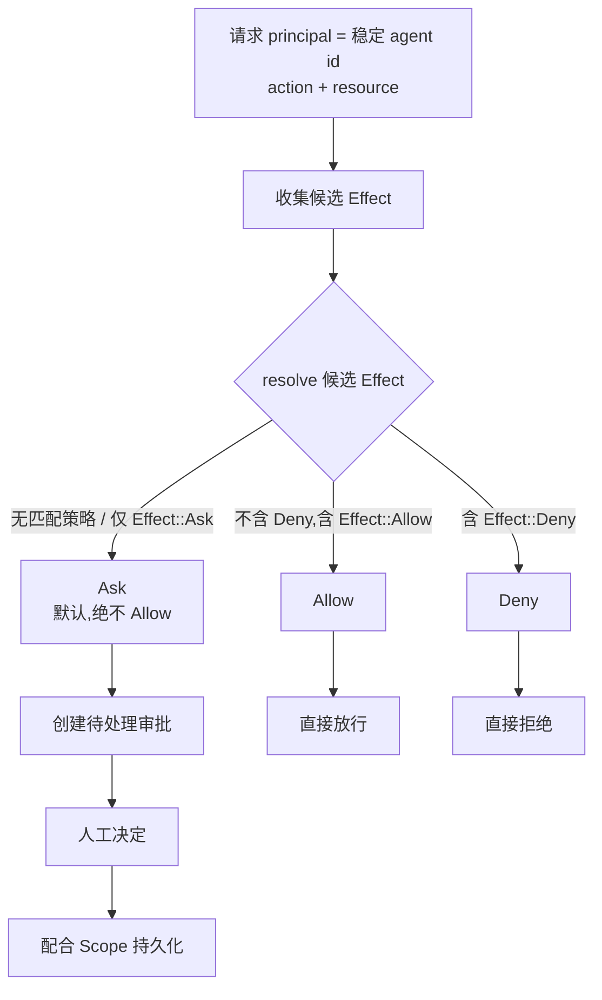

# 权限模型

每个受控操作——无论是来自 native API Agent 的 tool-use 循环的请求,还是经由 Claude Code permission-hook 桥接转发——都通过单一决策点进行评估。CLI 发起的调用没有独立的决策引擎。

## 统一决策模型

评估将一个 `(principal, action, resource)` 三元组解析为 `Allow`、`Deny` 或 `Ask` 三者之一。一个 principal 仅由**稳定的 agent id** 唯一标识——每个 Agent 一个持久的 principal,在该 Agent 参与的每一个会话中都保持不变。会话 id 与 generation id 是每次评估的上下文,不属于 principal 身份的一部分。因此,Agent 以与其其他会话相同的 principal 与策略分配参与新会话,而非使用会话作用域的分配。

未匹配的操作(没有策略匹配 principal/action/resource)解析为 `Ask`,绝不解析为 `Allow`。

## 解析顺序:显式 Deny 优先

相互冲突的策略匹配按显式 `Deny` 优先于显式 `Allow`、显式 `Allow` 优先于默认 `Ask` 的方式解析。

## 审批代理

待处理的审批请求以 native 运行时为唯一真源持有,与是否收到关于它们的任何前端事件无关。遗漏的前端事件不会让一次生成静默等待:前端通过事件推送新的待处理审批,**并**在挂载/重连时拉取完整待处理列表进行对账。一个待处理审批以一个批准/拒绝决定连同 `Once`、`Session`、`Project` 或 `Global` 之一的内存作用域一并解决。

## CLI 启动参数投影

对于 `gemini-cli`、`codex-cli` 和 `opencode`,只要 Agent 的 Agent Terminal 以交互方式启动,Agent principal 所分配的策略模板(`readonly`、`standard`、`trusted` 或 `yolo`)就会被投影为该工具自身的 native 审批/沙箱启动参数。仅使用目录合法、不可绕过的参数值——不会引入任何原始的绕过 flag(例如名称中包含 "dangerously" 的 flag)来达成某个模板的行为。`trusted` 和 `yolo` 投影为相同的启动参数。

## Claude Code permission-hook 桥接

来自 hook 包装器的 `PreToolUse` 请求被转换为一个 `Action`/`Resource` 对,并通过与 native API Agent 相同的 `evaluate()`/`ApprovalBroker` 管线解析。该 hook 仅匹配 `Bash`、`Edit`、`Write`、`Read`、`Glob`、`Grep` 以及 MCP 工具名(`mcp__*`),将它们映射到 `shell.exec`/`file.write`/`file.read`/`mcp.tool`;任何其他工具(例如 `WebFetch`)都不会被拦截,Claude Code 的 native 行为不受影响。`Ask` 解析会在既有的 `ApprovalCard` UI 中创建一个待处理审批,并挂起 HTTP 响应,直到人工决定或超时扫描。

## 决策流程与状态

统一决策点把一次受控操作收敛到 `Allow`、`Deny`、`Ask` 三者之一。下图展示从请求到最终解析结果的主干路径。



### 解析顺序

候选 `Effect` 集合按固定优先级收敛,顺序不可调换。该规则来自 `permissions/domain/effect.rs` 的 `resolve()`。

1. **显式 `Deny` 优先** —— 候选集只要包含 `Effect::Deny`,无论 `Effect::Allow` 数量多少,整体解析为 `Deny`。
2. **显式 `Allow` 次之** —— 候选集不含 `Deny` 但含 `Effect::Allow` 时,整体解析为 `Allow`。
3. **默认 `Ask` 兜底** —— 候选集为空(没有任何策略匹配该 principal/action/resource)或仅含 `Effect::Ask` 时,整体解析为 `Ask`,绝不静默放行。

### 审批状态机

待处理审批在 native 运行时中是唯一真源。前端既通过事件接收新增审批,也在挂载/重连时拉取完整列表对账,因此遗漏的前端事件不会让一次生成无限挂起。审批被解决时携带一个内存作用域 `Scope`,决定该决定被记住多久。

```mermaid
stateDiagram-v2
    [*] --> "待处理" : Ask 解析创建审批
    "待处理" --> "批准" : 人工批准
    "待处理" --> "拒绝" : 人工拒绝
    "待处理" --> "超时" : 超时扫描
    "批准" --> [*] : 按 Scope 记忆 grant
    "拒绝" --> [*] : 不记忆
    "超时" --> [*] : 不记忆
```

`Scope` 的记忆语义来自 `permissions/domain/scope.rs` 的 `is_remembered()`。

- **`Once`** —— 仅本次有效,不持久化 grant,下一次相同请求重新走解析。
- **`Session`** —— 当前会话内复用 grant,会话结束失效。
- **`Project`** —— 项目作用域持久化 grant,跨会话复用。
- **`Global`** —— 全局持久化 grant,跨项目跨会话复用。

只有 `Session`/`Project`/`Global` 会持久化 grant;`Once` 永不持久化。

### CLI 启动参数投影

对 `gemini-cli`、`codex-cli` 与 `opencode`,当 Agent Terminal 以交互方式启动时,Agent principal 所分配的策略模板(`readonly`、`standard`、`trusted`、`yolo`)被投影为该 CLI 自身的 native 审批/沙箱启动参数。

- **`readonly` / `standard` / `trusted` / `yolo`** 各自映射到一组目录合法、不可绕过的 native 参数,而非通过显示名称匹配行为。
- **`trusted` 与 `yolo` 投影为相同参数** —— 两者在本基础版本中不产生差异化启动参数。
- **绝不引入绕过 flag** —— 不会使用任何名称含 `dangerously` 之类的绕过 flag 来达成某个模板的行为。

### Claude Code hook 桥接

Claude Code 的 `PreToolUse` hook 请求被转换为一个 `(Action, Resource)` 对,走与 native API Agent 完全相同的 `evaluate()` / `ApprovalBroker` 管线,不存在并行的决策引擎。

- **仅匹配的工具被拦截** —— `Bash`、`Edit`、`Write`、`Read`、`Glob`、`Grep` 以及 MCP 工具名(`mcp__*`)。
- **工具映射** —— `Bash` → `shell.exec`;`Edit`/`Write` → `file.write`;`Read`/`Glob`/`Grep` → `file.read`;`mcp__*` → `mcp.tool`。
- **不拦截的工具** —— `WebFetch` 等未列出的工具不会被拦截,Claude Code 的 native 行为不受影响。
- **`Ask` 解析** —— 在既有的 `ApprovalCard` UI 中创建待处理审批,并挂起 HTTP 响应,直到人工决定或超时扫描。

## 设计所在之处

本章用于为贡献者定位。权威需求位于规范之中。

- [openspec/specs/permissions-core](../../../../openspec/specs/permissions-core/spec.md) —— 统一决策模型与解析顺序。
- [openspec/specs/permissions-approval](../../../../openspec/specs/permissions-approval/spec.md) —— 审批代理、待处理状态与内存作用域。
- [openspec/specs/cli-agent-permission-launch-flags](../../../../openspec/specs/cli-agent-permission-launch-flags/spec.md) —— CLI 启动参数投影。
- [openspec/specs/claude-code-permission-hook](../../../../openspec/specs/claude-code-permission-hook/spec.md) —— Claude Code `PreToolUse` 桥接。

权限评估位于 `agent_runtime` 限界上下文中;参见 [Native 限界上下文](native-contexts.md)。
