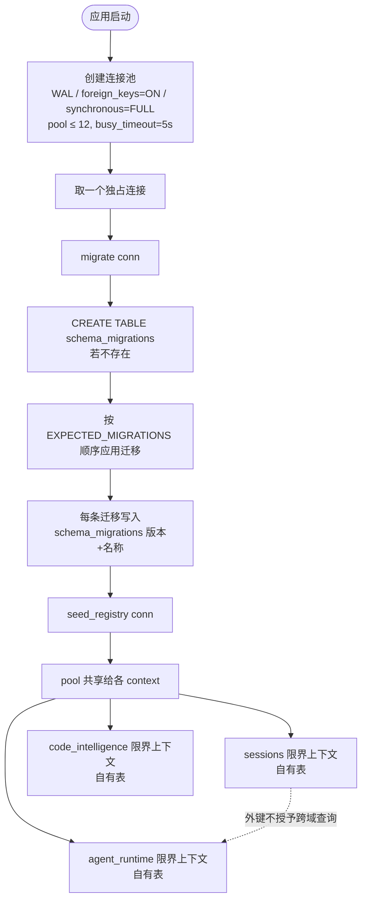
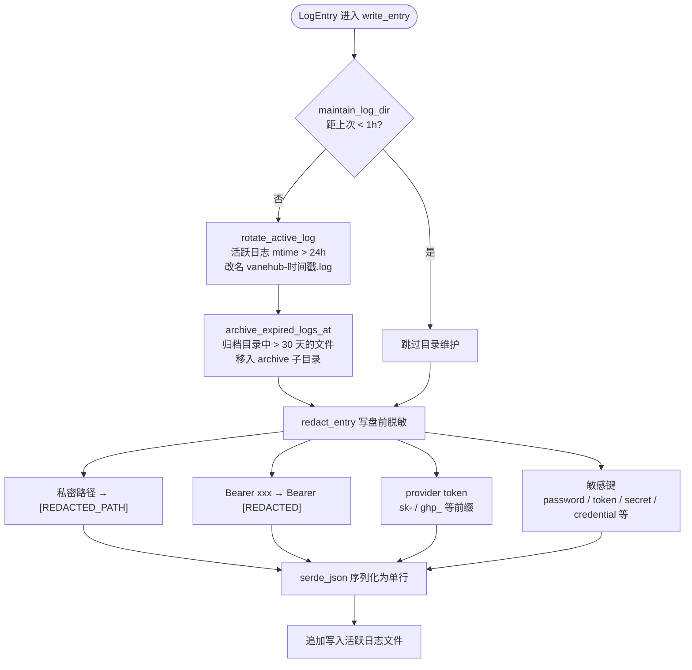

# 持久化与统一日志

## SQLite 所有权

SQLite 只能从 Rust 基础设施访问。迁移有一个全局顺序,但每个 schema 与 repository 都归属于某个 bounded context。外键引用并不授予一个 context 直接查询另一个 context 表的权限。

迁移变更要求:

- 一个带版本的迁移;
- clean-database 与升级路径的覆盖;
- 显式的行到领域映射;
- 与当前 fixture 兼容;
- 在生产 command 边界上不得使用 `unwrap()` 或 `expect()`。

## 日志

native 诊断与操作输出都流经统一日志服务。禁止 feature 专用的日志文件。

持久化的事件必须:

- 带有 `error`、`warn`、`info` 或 `debug` 语义;
- 在落盘前对凭据、token、用户内容、路径与命令敏感值进行脱敏;
- 关联长时间运行的操作,但不把原始 prompt 或 Agent 输出放进诊断通道;
- 在其所属的结果存储中保留页面可见的操作输出。

React 不能写本地日志文件。需要持久化的前端错误会越过服务边界上报到 native 日志 command。Web/mock 行为可以暴露页面可见的模拟日志,但不能声称具备 native 持久化。

执行可观测性关联规则由 `openspec/specs/agent-execution-observability/spec.md` 与 `openspec/specs/unified-log-management/spec.md` 约束;语义/日志存储的拆分作为 ADR-002 记录在 `src-tauri/ARCHITECTURE.md` 中。

## SQLite 所有权与迁移

数据库是应用拥有的单一 SQLite 文件。连接、迁移编排与种子注册都集中在 `src-tauri/src/platform/database/mod.rs`，任何 context 都不得绕过 pool 自建连接或自管 schema。

- **单一数据库文件** `vanehub.sqlite`，启用 `journal_mode=WAL`（多读一写）、`foreign_keys=ON`、`synchronous=FULL`（在每个恢复关键提交点同步 WAL）。
- **连接池** 上限 `MAX_POOL_SIZE = 12`，`busy_timeout = 5s`，`CONNECTION_TIMEOUT = 5s`；池大小接近 Tauri command worker 线程数，WAL 让多读者不被写者阻塞。
- **顺序迁移** 在 pool 共享前于一个独占连接上跑一次，`schema_migrations` 表为每条迁移记账（版本号 + 名称）。
- **`EXPECTED_MIGRATIONS` 是迁移序列的真源**，启动后密度检查与 `migration_sequence_matches_expected` 测试都会比照它。新增迁移必须追加在序列尾部，禁止插入或重排——版本号是跨分支分配的，重排会让已应用旧号的检出全部失效。
- **种子注册** `seed_registry` 在迁移完成后于同一独占连接上执行一次。
- **限界上下文分区** 各 context 拥有各自的表（靠迁移分区写入），外键引用不授予一个 context 直接查询另一个 context 表的权限。

## 统一日志架构

native 诊断与操作输出都流经 `src-tauri/src/platform/logging.rs` 的统一写入流水线。一条 `LogEntry` 进入 `write_entry` 后，先做目录维护（限频 1 小时一次），再脱敏，最后才落盘。日志与执行可观测性链路在职责上分离——原始 prompt 与 Agent 输出不进入诊断通道；但 run/trace/span id 会作为关联字段写入日志条目的 `context` 映射(`AgentRuntimeLoggingAdapter::record` 把 `runId`/`traceId`/`spanId` 插入 context,经 `UnifiedLoggingAdapter` 落盘)。

脱敏与隔离说明：

- **私密路径** 在落盘前替换为 `[REDACTED_PATH]`；用户私有绝对路径不外泄。
- **Bearer token** 形如 `Authorization: Bearer xxx` 被规整为 `Bearer [REDACTED]`，只保留 scheme。
- **provider token** 按 `sk-`、`ghp_` 等前缀识别并整体抹除。
- **敏感键** 匹配 `password`/`token`/`secret`/`credential` 等键名时清空其值。
- **链路与日志关联**：执行可观测性的 run/trace/span id 会写入日志条目的 `context` 字段（`AgentRuntimeLoggingAdapter::record` 把 `runId`/`traceId`/`spanId` 插入 context，经 `UnifiedLoggingAdapter` 落盘到日志文件）；日志只保留安全的元数据（服务端/语言标识、生命周期跃迁、方法类别、时长、计数、重启尝试、超时/取消类别、退出码、安全的工作区标识）。绝不持久化原始协议载荷、源码、hover 内容、诊断消息、stderr、环境变量、可执行文件参数、凭据或私有绝对路径。
- **限频与轮转**：目录维护限频 1 小时一次；活跃日志超过 24 小时改名归档；归档目录中超过 30 天的文件进一步移入 `archive` 子目录做冷保留。
- **React 不写本地日志**：需要持久化的前端错误越过服务边界上报到 native 日志 command；Web/mock 行为可暴露页面可见的模拟日志，但不能声称具备 native 持久化。

## 关键常量与脱敏规则

### 数据库常量

- `DATABASE_FILE_NAME="vanehub.sqlite"` —— 单一数据库文件;
- `MAX_POOL_SIZE=12` —— 连接池上限,接近 Tauri command worker 线程数;
- `busy_timeout=5s` —— 写者阻塞时读者等待上限;
- `CONNECTION_TIMEOUT=5s` —— 取连接的超时;
- `journal_mode=WAL` —— 多读一写;
- `foreign_keys=ON` —— 外键约束启用;
- `synchronous=FULL` —— 在每个恢复关键提交点同步 WAL。

### 迁移

`EXPECTED_MIGRATIONS`(`src-tauri/src/platform/database/migrations/mod.rs`)是迁移序列的真源;启动后密度检查与 `migration_sequence_matches_expected` 测试都会比照它。新增迁移必须追加在序列尾部,禁止插入或重排。本章刻意不写迁移条数——版本号跨并行分支分配,任何写死的数字在第二个分支合入时就已过时。`schema_migrations(version, name, applied_at)` 表为每条迁移记账。`seed_registry` 在迁移完成后于同一独占连接上执行一次。

### 日志常量

- `LOG_FILE_NAME="vanehub.log"` —— 活跃日志文件名;
- `ARCHIVE_DIR_NAME="archive"` —— 冷保留子目录名;
- `RETENTION_DAYS=30` —— 归档目录中超过 30 天的文件进一步移入 `archive` 子目录;
- `ROTATION_AGE_HOURS=24` —— 活跃日志 mtime 超过 24 小时即改名归档;
- `MAINTENANCE_INTERVAL_HOURS=1` —— 目录维护限频 1 小时一次。

### 日志类型

`LogLevel` 枚举四值:`error`/`warn`/`info`/`debug`。`LogEntry` 字段为 `timestamp`/`level`/`category`/`message`/`context`。`ClientLogEvent` 承载前端越过服务边界上报的事件,如 `ErrorBoundary`、`CriticalOperationFailure`。

### 脱敏

`redact_text`/`redact_entry` 在写盘前与 JSON 序列化前各做一次脱敏,覆盖四类:私密路径 → `[REDACTED_PATH]`(匹配 `C:\`、`/home/`、`/Users/`、`file:///` 等绝对路径前缀);Bearer → `Bearer [REDACTED]`(只保留 scheme);provider token 按 `sk-`、`ghp_`、`github_pat_`、`ssh-connection` 等前缀识别并整体抹除;敏感键匹配 `password`/`token`/`secret`/`credential`/`authorization`/`key_path`/`private_key` 等键名时清空其值。

### 链路关联

执行可观测性由 `contexts/operations/domain/operation.rs` 承载:每条操作带 `trace_id`,`correlate_execution(run_id, trace_id)` 把 run 与 trace 关联起来。run/trace/span id 会写入日志文件的 `context` 字段(由 `AgentRuntimeLoggingAdapter::record` 注入),原始 prompt 与 Agent 输出则不进入诊断通道。

统一日志规范的真源是 `openspec/specs/unified-log-management/spec.md`；执行可观测性关联规则见 `openspec/specs/agent-execution-observability/spec.md`。
