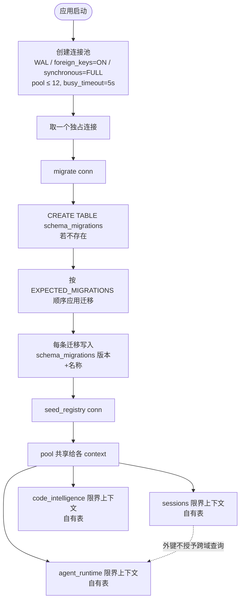

# 持久化所有权

哪个上下文拥有哪张表、迁移怎么编号与执行，以及数据库层的关键常量。

日志落盘、脱敏与链路关联见[统一日志](unified-logging.md)。

## SQLite 所有权

SQLite 只能从 Rust 基础设施访问。迁移有一个全局顺序,但每个 schema 与 repository 都归属于某个 bounded context。外键引用并不授予一个 context 直接查询另一个 context 表的权限。

迁移变更要求:

- 一个带版本的迁移;
- clean-database 与升级路径的覆盖;
- 显式的行到领域映射;
- 与当前 fixture 兼容;
- 在生产 command 边界上不得使用 `unwrap()` 或 `expect()`。

## SQLite 所有权与迁移

数据库是应用拥有的单一 SQLite 文件。连接、迁移编排与种子注册都集中在 `src-tauri/src/platform/database/mod.rs`，任何 context 都不得绕过 pool 自建连接或自管 schema。

- **单一数据库文件** `vanehub.sqlite`，启用 `journal_mode=WAL`（多读一写）、`foreign_keys=ON`、`synchronous=FULL`（在每个恢复关键提交点同步 WAL）。
- **连接池** 上限 `MAX_POOL_SIZE = 12`，`busy_timeout = 5s`，`CONNECTION_TIMEOUT = 5s`；池大小接近 Tauri command worker 线程数，WAL 让多读者不被写者阻塞。
- **顺序迁移** 在 pool 共享前于一个独占连接上跑一次，`schema_migrations` 表为每条迁移记账（版本号 + 名称）。
- **`EXPECTED_MIGRATIONS` 是迁移序列的真源**，启动后密度检查与 `migration_sequence_matches_expected` 测试都会比照它。新增迁移必须追加在序列尾部，禁止插入或重排——版本号是跨分支分配的，重排会让已应用旧号的检出全部失效。
- **种子注册** `seed_registry` 在迁移完成后于同一独占连接上执行一次。
- **限界上下文分区** 各 context 拥有各自的表（靠迁移分区写入），外键引用不授予一个 context 直接查询另一个 context 表的权限。

## 数据库常量与迁移

### 数据库常量

- `DATABASE_FILE_NAME="vanehub.sqlite"` —— 单一数据库文件;
- `MAX_POOL_SIZE=12` —— 连接池上限,接近 Tauri command worker 线程数;
- `busy_timeout=5s` —— 写者阻塞时读者等待上限;
- `CONNECTION_TIMEOUT=5s` —— 取连接的超时;
- `journal_mode=WAL` —— 多读一写;
- `foreign_keys=ON` —— 外键约束启用;
- `synchronous=FULL` —— 在每个恢复关键提交点同步 WAL。

### 迁移

`EXPECTED_MIGRATIONS`(`src-tauri/src/platform/database/migrations/mod.rs`)是迁移序列的真源;启动后密度检查与 `migration_sequence_matches_expected` 测试都会比照它。新增迁移必须追加在序列尾部,禁止插入或重排。本章刻意不写迁移条数——版本号跨并行分支分配,任何写死的数字在第二个分支合入时就已过时。`schema_migrations(version, name, applied_at)` 表为每条迁移记账。`seed_registry` 在迁移完成后于同一独占连接上执行一次。
