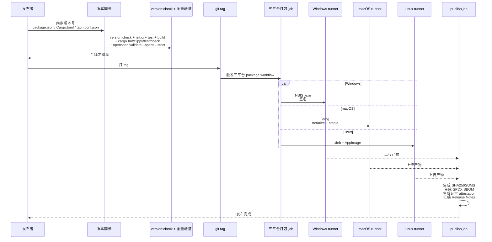

# 发布

打包目标、签名凭据、版本同步与 updater 产物。

测试分层见[测试](testing.md)。

## 发布流程

发布是一次跨三平台的同步打包与签发。版本号在 `package.json`、`src-tauri/Cargo.toml`、`src-tauri/tauri.conf.json` 三处必须一致,由 `version:check` 守护。

发布要点：

- **版本同步**：`package.json`、`src-tauri/Cargo.toml`、`src-tauri/tauri.conf.json` 三处版本号必须一致；`scripts/check-version-sync.mjs` 做交叉校验,`version:unit:test` 是其单元测试。
- **全量验证先行**：打 tag 前必须跑通 `AGENTS.md` 末尾的全部校验命令,外加 `version:check`。
- **三平台产物**：Windows 产出 NSIS `.exe`；macOS 产出 `.dmg` 并走 notarize + staple；Linux 产出 `.deb` 与 `AppImage`。
- **publish 产物清单**：`SHA256SUMS`（逐文件 sha256，并校验无重复哈希）、SPDX SBOM、证言（attestation）、Release Notes。
- **更新器签名**：自动更新器使用 `TAURI_SIGNING_PRIVATE_KEY`（与密码）签名,签名密钥属于受保护发布环境,绝不放入仓库配置或截图。空密钥走 rehearsal-only 路径,不产生可分发的更新签名。
- **签名凭据隔离**：签名凭据只在 CI 受保护环境注入,正常本地打包命令不含 `desktop-e2e` feature,也不接触签名密钥。

打包与签名细节见 `src-tauri/ARCHITECTURE.md` 与 `../../reference/release-signing.md`;CI 编排见 `.github/workflows/ci.yml` 与 `.github/workflows/package.yml`。

## 发布相关脚本

- **打包目标** `package.json`:6 个目标 `package:windows:{x64,arm64}`、`package:macos:{x64,arm64}`、`package:linux:{x64,arm64}`,每个先 `sidecar:prepare -- --release --target=...`。
- **版本同步** `scripts/check-version-sync.mjs`:三处(package.json/Cargo.toml/tauri.conf.json)版本必须一致,`version:unit:test` 是其单元测试。
- **签名凭据**:受保护 `release` environment 存凭据(APPLE_CERTIFICATE/APPLE_SIGNING_IDENTITY/TAURI_SIGNING_PRIVATE_KEY/WINDOWS_CERTIFICATE 等);`environment` 由 `github.ref_type=='tag'?'release':'build-preview'` 决定;updater 用 `TAURI_SIGNING_PRIVATE_KEY` 生成 `createUpdaterArtifacts`,公钥内嵌 tauri.conf.json。
